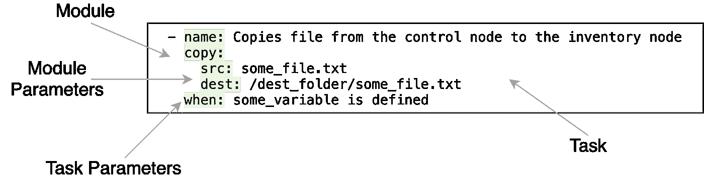
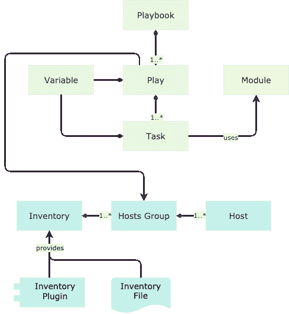
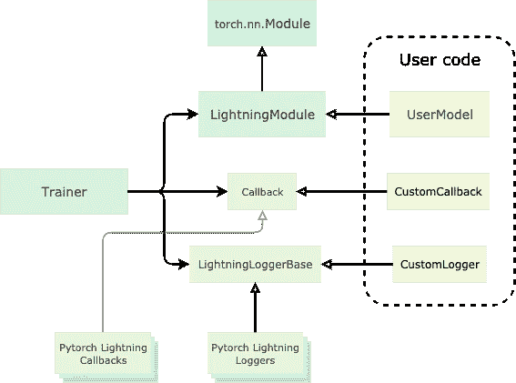

# 利用 Ansible、AWS 和 Pytorch Lightning 进行分布式深度学习。第一部分

> 原文：<https://towardsdatascience.com/distributed-deep-learning-with-ansible-aws-and-pytorch-lightning-part-1-91d500e1039f?source=collection_archive---------40----------------------->


维多利亚博物馆在 [Unsplash](https://unsplash.com?utm_source=medium&utm_medium=referral) 拍摄的照片

## 如何使用 Ansible、AWS 云基础设施和 Pytorch Lightning 库来自动化和扩展您的深度学习实验。

假设你是一名深度学习实践者，但你没有内部的 GPU 集群或机器学习平台可供你使用。近十年来，没有人在 CPU 上训练他们的模型。更糟糕的是，随着模型和数据集变得越来越大，你必须处理分布式深度学习，并在模型并行和/或数据并行机制中扩展你的训练。我们能做些什么呢？

我们可以遵循现代云范式，利用一些 GPU 即服务。它将允许您按需动态分配必要的基础设施，并在完成后释放它。它工作得很好，但这是主要的复杂性所在。像 PyTorch Lightning 或 Horovod 这样的现代深度学习框架使数据并行分布式学习变得很容易。最烦人和耗时的事情是创建一个合适的环境，因为我们经常必须手动完成。即使对于那些对你隐藏了大量基础设施复杂性的服务——比如[谷歌协作](https://colab.research.google.com/)或[paper scape](https://www.paperspace.com/)——一些手工工作仍然需要完成。

我坚信重复性的日常工作是你的敌人。为什么？以下是我个人关注的问题:

1.  **结果的再现性**。你听说过所谓的人为因素吗？我们是非常容易出错的生物，我们不擅长记忆非常详细的东西。一些过程涉及的人力工作越多，将来就越难复制。
2.  **精神涣散**。深度学习是一种经验主义的努力，你在这方面的进步深深依赖于你快速迭代和尽可能多地测试假设的能力。由于这个事实，任何分散你注意力的事情，比如训练和评估你的模型或者分析数据，都会对整个过程的成功产生负面影响。
3.  **效力。计算机做许多事情都比我们人类快得多。当你不得不一遍又一遍地重复同样缓慢的过程时，这一切就累积起来了。**

> 常规是你的敌人

在这篇文章中，我将描述如何自动化进行深度学习实验的方式。

# 自动化您的深度学习实验

以下是这篇文章的三个主要观点:

1.  利用基于云的基础设施为您的培训目的动态分配资源；
2.  使用 DevOps 自动化工具集管理实验环境设置的所有手动工作；
3.  在现代深度学习框架中编写您的训练程序，使其能够毫不费力地进行数据并行分布式学习。


AWS EC2、Ansible 和 Pytorch Lightning。作者图片

为了实际实现这些想法，我们将利用 AWS 云基础设施、Ansible 自动化工具和 PyTorch Lightning 深度学习库。

我们的工作将分为两部分。在本文中，我们将提供一个最小的工作示例，它:

*   为我们的深度学习集群自动创建和销毁 EC2 实例；
*   建立 Pytorch 和 Pytorch Lightning 分布式培训所需的连接；
*   创建本地 ssh 配置文件以启用到群集的连接；
*   创建一个 Python 虚拟环境，并为实验安装所有库依赖项；
*   提供提交脚本，以便在创建的集群上运行分布式数据并行工作负载。

在下一篇文章中，我们将添加额外的特性，并为分布式学习实验构建一个完全自动化的环境。

现在，让我们简要概述一下所选的技术体系。

## 什么是 AWS EC2？


来源:https://github.com/gilbarbara/logos/tree/master/logos

[AWS 弹性计算云(EC2)](https://docs.aws.amazon.com/AWSEC2/latest/UserGuide/concepts.html) 是一项核心的 AWS 服务，允许您管理亚马逊数据中心的虚拟机。使用此服务，您可以通过 AWS 控制台或 AWS SDK 提供的 API 手动动态创建和销毁您的机器。

截至今天，AWS 为我们的目的提供了一系列支持 GPU 的实例，每个实例有一个或多个 GPU，以及不同的 NVIDIA GPUs 选择:Tesla GRID K520、M60、K80、T4、V100。完整名单见[官方网站](https://docs.aws.amazon.com/AWSEC2/latest/UserGuide/accelerated-computing-instances.html)。

## 什么是 Ansible？


来源:[https://github.com/gilbarbara/logos/tree/master/logos](https://github.com/gilbarbara/logos/tree/master/logos)

Ansible 是一款软件和基础设施供应和配置管理工具。使用 Ansible，您可以远程供应整个远程服务器集群，在其上供应软件，并监控它们。

这是一个用 Python 编写的开源项目。它使用声明式方法:您定义一个期望的系统状态，Ansible 执行必要的动作。要做到这一点，你可以使用普通的 YAML 文件。Ansible 的声明性也意味着你为它定义的大多数指令都是幂等的:如果你不止一次运行它，它不会引起任何不良的副作用。

Ansible 的一个显著特征是它是无代理的，即它不需要在可管理的节点上安装任何代理软件。它仅通过 SSH 协议运行。因此，您唯一需要确保的是运行 Ansible 命令的控制主机和您想要管理的清单主机之间的 SSH 连接。

## 可行的核心概念

让我们深入探讨一下 Ansible 的核心概念。这些工具并不多，所以您可以很快了解它们，并开始使用这个出色的工具。

*   **库存**

清单只是您希望使用 Ansible 管理的主机列表。它们被组织成命名的组。如果您有一个静态的预定义基础结构，您可以在 INI 格式的文件中定义清单。另一种方法——使用清单插件，如果您的基础设施事先不知道或者可能动态变化(就像我们这里的情况),它会告诉 Ansible 在哪些主机上运行。

*   **模块**

模块是可以在 Ansible 中执行的工作单元。Ansible 中有大量的模块可供您使用。并且它构成了一个非常可扩展的架构。参见[模块索引](https://docs.ansible.com/ansible/latest/modules/modules_by_category.html)。

*   **变量**

这里没什么特别的。您可以像在任何编程语言中一样定义变量，以便将逻辑与数据分离，或者在系统的不同部分之间传递信息。Ansible 收集了大量的系统信息，并将它们存储在预定义的变量中——事实。你可以在官方文档中阅读更多关于变量的内容。

*   **任务**

任务是带有一些参数的模块调用。您还可以为任务定义名称、存储结果的变量、条件表达式和循环表达式。下面是一个任务示例，当定义了`some_variable`变量时，该任务将一些本地文件复制到远程计算机的文件系统中:



复制任务示例

*   **播放**

Ansible 中的行动是一种将任务列表应用于清单中的一组主机的方式。在 YAML，你把戏剧定义为字典。`hosts`参数指定一个库存组，`tasks`参数包含一个任务列表。

*   **剧本**

行动手册只是一个 YAML 文件，其中包含要运行的行动列表。运行行动手册的方法是将它传递给 ansible 安装附带的 **ansible-playbook** CLI。

下面的图表说明了这些概念是如何相互影响的:



可行的核心概念

Ansible 中还有更高级的概念，允许您为复杂的场景编写更模块化的代码。我们将在文章的第 2 部分使用其中的一些。

## Pytorch 闪电是什么？


来源:[维基百科](https://en.wikipedia.org/wiki/PyTorch_Lightning)

Pytorch Lightning 是 Pytorch 之上的一个高级库。你可以把它想成 PyTorch 的 Keras。有几个特性使它从其他基于 PyTorch 的深度学习库中脱颖而出:

*   **是透明的**。正如作者在文档中所写的，编写 Pytorch 代码更像是一种约定，而不是一个单独的框架。您不需要学习另一个库，也不需要付出巨大的努力来转换您的普通 PyTorch 代码，以便与 Pytorch-Lightning 一起使用。你的 PyTorch 闪电代码实际上就是你的 PyTorch 代码。
*   **它隐藏了很多样板工程代码**。Pytorch 是一个出色的框架，但是当使用它进行全功能实验时，您很快就会得到许多与您正在进行的实际研究没有特别关系的代码。而且每次都要重复这个工作。Pytorch 照明为您提供了这一功能。具体来说，它将分布式数据并行学习能力添加到您的模型中，而不需要您对代码进行任何修改！
*   **很简单**。所有 PyTorch Lightning 代码库都围绕着一些抽象概念:

1.  `LightningModule`是一个组织 PyTorch 代码的类。使用 PyTorch Lightning 的方法是创建一个从`LightningModule`继承的自定义类，并实现它的虚拟方法。`LightningModule`本身是从 PyTorch 模块继承来的。
2.  `Trainer`自动化您的训练程序。一旦您将 PyTorch 代码组织到 LightningModule 中，您就将它的实例传递给一个`Trainer`,它会完成实际的繁重训练。
3.  `Callbacks`、`Loggers`、`Hooks`是定制`Trainer`行为的手段。



PyTorch 闪电建筑

欲了解更多信息，请阅读[官方文档](https://pytorch-lightning.readthedocs.io/en/latest)。

好了，说够了，让我们开始建设。


# 构建实验工具集

在本文的其余部分，我将带您一步步地构建我们的实验环境。如果你对最终结果感兴趣，这里有一个 GitHub 回购的链接。另外，请看第 2 部分，我们将向我们的工具集添加额外的特性。

## 设置 AWS 帐户和 Ansible

让我们安装 Ansible 并将其配置为与 AWS 一起工作。

**设置 AWS 账户并配置 AWS SDK**

如果你没有 AWS 账户，你首先要做的就是建立一个。为此，请访问官方文档中的[创建新账户](https://aws.amazon.com/resources/create-account/)链接，并按照说明进行操作。

接下来，让我们安装 AWS SDK 来获得 Ansible 所需的对 AWS 的 API 访问:

```
pip install boto
```

我们需要 AWS API 的凭据。要获取它们，请登录您的 AWS 控制台，并按照[中的说明](https://docs.aws.amazon.com/IAM/latest/UserGuide/id_users_create.html#id_users_create_console)进行操作。选择一个编程访问选项，并应用 [AdministratorAccess](https://console.aws.amazon.com/iam/home?region=eu-central-1#/policies/arn%3Aaws%3Aiam%3A%3Aaws%3Apolicy%2FAdministratorAccess) 策略为您的 API 提供管理访问权限。是的，一般来说这不是一个好的做法，所以您应该在将来将它改为更具限制性的特权。

将您新创建的用户凭证放到您的`.bashrc`文件中:

```
echo "export AWS_ACCESS_KEY_ID=<your key id>" >> ~/.bashrc
echo "export AWS_SECRET_ACCESS_KEY=<your secret key>" >> ~/.bashrc
source ~/.bashrc
```

**设置 SSH 密钥并获取默认 VPC ID**

我们将使用默认的 SSH 密钥对(`~/.ssh/id_rsa`和`~/.ssh/id_rsa.pub`)来连接 EC2 实例。如果你的系统上还没有，你应该用`ssh-keygen`工具生成它。一旦生成，就在 AWS EC2 服务中注册它。您可以在 AWS 控制台的 EC2 服务中的**键对**菜单选项下进行操作。请注意，这些键是特定于地区的，所以您需要在您计划创建 EC2 实例的同一地区下注册它们。

接下来，我们需要复制默认 VPC 的 ID。VPC(虚拟专用网)是 AWS 云中的一个虚拟网络，在这里您可以连接 EC2 实例和其他 AWS 服务。我们将在实验中使用默认的 VPC。转到 AWS 控制台中的 VPC 服务，打开一个区域中所有 VPC 的列表。找到**默认 VPC** 列值设置为**是**的那个。

最后，创建一个`config.yaml`文件，并将注册的 SSH 对名称和 VPC ID 写入其中:

```
aws_ssh_key: <your registered ssh key pair name here>
vpc_id: <ID of your default VPC>
```

我们将在以后的行动手册中导入该文件。

**设置责任**

Ansible 是用 Python 编写的，因此可以用一个命令轻松安装:

```
pip install ansible==2.9.9
```

你可以安装最新的版本或者我写这篇文章时使用的版本。

**禁用易受攻击的主机密钥检查**

因为我们没有预定义的静态基础设施，所以通过 Ansible 禁用主机键检查更方便。您可以在`/etc/ansible/ansible.cfg`中为所有用户进行全局设置，在`~/.ansible.cfg`中为特定用户进行全局设置，或者在`./ansible.cfg`中为给定项目进行本地设置。无论使用哪种方法，都可以创建包含以下内容的文件:

**配置 Ansible AWS EC2 动态清单插件**

还记得 Ansible 库存插件吗？因为我们动态地创建 EC2 实例，并且没有给它们分配任何预定义的 DNS 名称，所以我们事先不知道它们的地址。AWS EC2 库存插件将在这里帮助我们，并为我们的行动手册提供它们。我们需要为它创建以下配置文件:

aws_ec2.yaml

您可以在这里定义插件在哪里以及如何寻找实例。`regions`字段包含 AWS 地区列表。`filters`字段定义元数据属性，通过该属性过滤感兴趣的实例。我们使用一个`managed_by`标签来识别它们。稍后，我们将把这个标签分配给我们用工具集创建的实例。

**为提交脚本安装附加依赖项**

我们的提交脚本需要在本地工作站上安装几个额外的 Python 包:

```
pip install Click==7.0 fabric==2.5.0 patchwork==1.0.1
```

## 我们解决方案的总体描述

我们将使用以下 Ansible 模块和插件来完成这项工作:

*   `[ec2](https://docs.ansible.com/ansible/latest/modules/ec2_module.html)`创建 EC2 实例的模块；
*   `[ec2_group](https://docs.ansible.com/ansible/latest/modules/ec2_group_module.html)`为我们的 EC2 实例创建安全组的模块；
*   用于为 EC2 实例创建集群放置组的模块；
*   `[aws_ec2](https://docs.ansible.com/ansible/latest/plugins/inventory/aws_ec2.html)`库存插件，用于发现创建的 EC2 实例，并将它们添加到库存中；
*   `[ec2_instance](https://docs.ansible.com/ansible/latest/modules/ec2_instance_module.html)`模块终止我们的实例。

为了向集群提交我们的训练脚本，我们将使用 [fabric](http://www.fabfile.org/) python 包。

**代码将被分成以下文件:**

*   `setup-play.yml`:为实验创建 EC2 基础设施的剧本。此外，它还引入了环境行动手册；
*   `environment-play.yml`:剧本规定了在 EC2 实例上进行实验所需的环境；
*   `cleanup-play.yml`:破坏 EC2 实例释放资源的剧本；
*   `config.yml`:包含实验环境所有配置的变量文件；
*   `aws_ec2.yml`:AWS EC2 动态清单插件的配置文件；
*   `submit.py` : CLI 提交要在集群上运行的培训脚本。

**设置基础设施行动手册**

setup-play.yml

本剧本包含两个剧本。第一个在控制节点上执行(即在我们的本地工作站上)，它的工作是为我们的集群创建 EC2 基础设施。让我们看一下它的任务:

*   创建群集放置组。我们稍后将把它提供给我们的 EC2 实例，以建议 AWS 将它们放置得彼此靠近，并减少网络通信的延迟；
*   创建安全组来配置实例的防火墙规则。我们允许实例之间的所有流量和来自互联网的 SSH 流量。注意，我们传递 config.yml 中定义的变量；
*   用`ec2`模块创建 EC2 实例。我们标记它们，以便`aws_ec2`动态清单插件能够在以后找到它们。我们将这个任务的结果注册到`ec2`变量中；
*   存储第一个创建的实例的本地 IP 地址，使其成为我们深度学习集群中的主节点；
*   创建一个 SSH 配置文件，以便能够连接到 Ansible 外部的实例；
*   将创建的实例添加到主机清单中的新主机组，以便第二个 play 能够对它们进行操作；
*   等到创建的实例准备好接受 SSH 流量

第二个剧本包含一个任务，其目标是定义 PyTorch Lightning 所需的环境变量。

最后，我们导入了环境行动手册。

**提供环境剧本**

环境-游戏. yml

通过这个行动手册，我们将环境(以及对它的更改)部署到实例中。它相对简单，只包含 3 个步骤:

*   为实验创建 Python virtualenv
*   复制包含所有第三方依赖项的 requirements.txt 文件
*   安装它们

**清理剧本**

cleanup-play.yml

本行动手册允许您终止 EC2 实例并删除 SSH 配置文件。

最后，让我们看看您应该为每个实验的需求定制的配置文件。

**配置文件**

我们已经在准备部分创建了这个文件。这是添加了一些附加参数的最终版本:

好吧，那我们现在有什么？

我们可以在配置文件中提供我们想要创建的实例的种类和数量，并在 requirements.txt 文件中指定我们想要在其上安装的库，然后运行一个命令:

`ansible-playbook setup-play.yml`

几分钟后，一个随时可用的集群将由我们支配。我们可以通过以下方式 SSH 到它的实例:

`ssh -i ssh_config worker[x]`

当我们完成后，我们可以用以下方法销毁它:

`ansible-playbook -i aws_ec2.yaml cleanup-play.yml`

现在，让我们在新的闪亮深度学习集群上简化代码部署和培训过程的实际运行。

## 将培训程序部署到集群

首先，让我们创建一个示例模型和一个培训过程。

**培训程序示例**

为了使事情变得简单并专注于文章的主题，我选择了深度学习“你好，世界！”举例。让我们采用一个简单的 3 层全连接网络，并在 MNIST 数据集上对其进行训练。代码非常简单明了，由一个简单的 lightning 模型和用一个`Trainer`适合这个模型的`main`过程组成。

ddp _ 火车 _ 示例. py

它使用 awesome [hydra](https://hydra.cc/) 库进行参数化。下面是一个带有参数的 YAML 文件:

ddp_train_example.yaml

文件中的默认参数允许我们在本地笔记本电脑上以单节点模式运行脚本，而无需任何 GPU。让我们在本地运行该脚本，并确保它正常工作:

```
python ddp_train_example.py max_epochs=5
```

现在，正如我前面所说的，PyTorch Lightning 的伟大特性是，您实际上不需要修改任何代码就可以在集群上以数据并行分布式模式运行它。我们唯一需要改变的是传递给我们在 hydra 配置中定义的`Trainer`实例的几个参数。要在各有一个 GPU 的两个节点上运行我们的脚本，我们应该以如下方式调用它:

```
python ddp_train_example.py gpus=1 num_nodes=2 \ distributed_backend=ddp
```

剩下唯一要做的事情就是实现一个可重用的 CLI 来将我们的训练脚本提交给集群。

**提交脚本**

提交 CLI 将任何 Python 脚本及其参数作为参数。它将同步当前工作目录中的所有文件，并在所有集群节点上运行给定的脚本。有了 [fabric](http://www.fabfile.org/) Python 库，我们只用几行代码就能做到:

提交. py

实际的提交逻辑驻留在`run`函数中。`main`函数在所有集群节点上调用它:在工作节点上异步调用，在主节点上同步调用。主节点上运行的脚本的所有标准输出都会自动打印到工作站上的 stdout。

最后，让我们向集群提交我们的培训脚本:

```
./submit.py -- ddp_train_example.py \
   gpus=<number of GPUs per instance> \
   num_nodes=<number of nodes in our cluster> \
   distributed_backend=ddp
```

仅此而已。我们的模型就像在本地机器上一样被训练，但是使用 Pytorch 和 PyTorch Lighting 分布式学习功能。

# 结论

那么我们最后得到了什么？只需三个命令，您就可以在 AWS 中动态创建深度学习集群，在其上提交训练作业，并在完成实验后删除它:

```
# create our deep learning cluster
ansible-playbook setup-play.yml# submit training job to it
./submit.py -- ddp_train_example.py \
   gpus=<number of GPUs per instance> \
   num_nodes=<number of nodes in our cluster> \
   distributed_backend=ddp# terminate the cluster
ansible-playbook -i aws_ec2.yaml cleanup-play.yml
```

您可以使这个功能可重用，或者只是将它复制到您的所有实验目录中。

现在，您可以将您的实验提升到一个新的水平，更加敏捷，并且不害怕分布式深度学习的可怕野兽。

但这并不是这个故事的结尾。在第 2 部分**，**中，我们将为我们的工具集添加额外的功能，使我们能够使用 Jupyter Notebook 在集群上进行交互式工作，使用 Tensorboard 监控训练过程，并将实验结果存储到永久存储器中。

敬请期待！