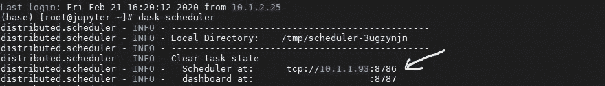
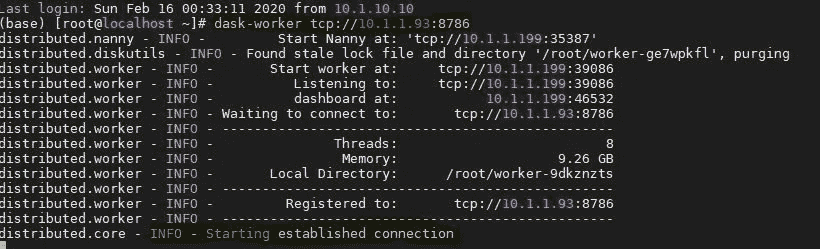
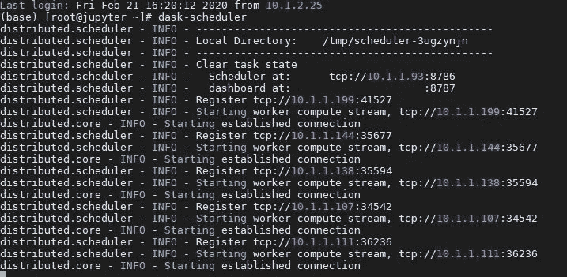
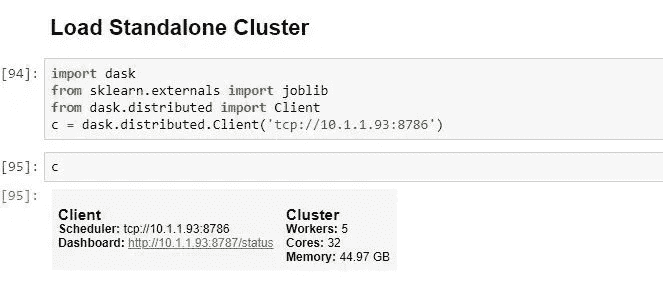
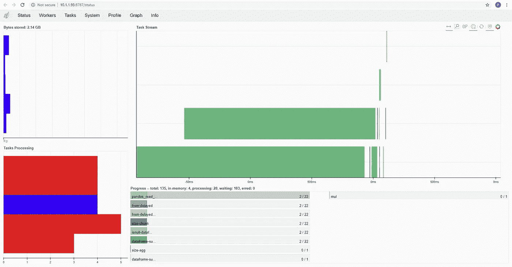
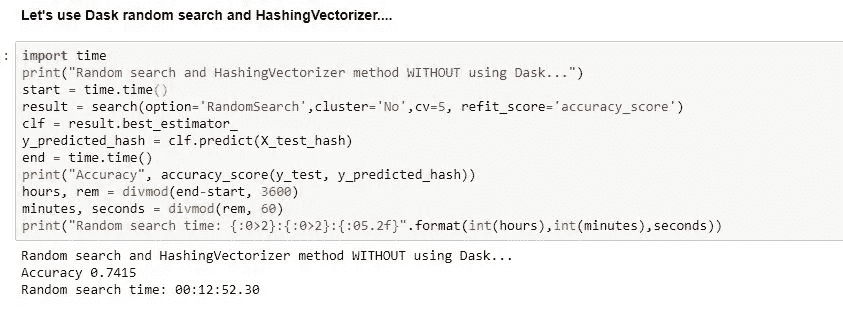
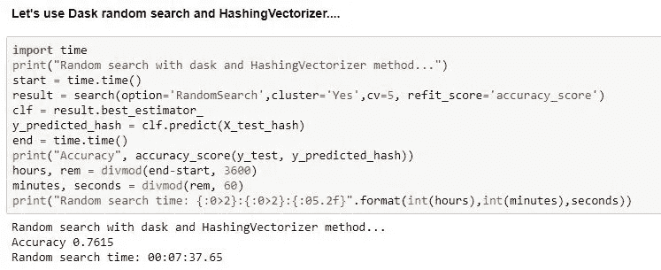

# 用 Python 和 Dask 实现分布式机器学习。

> 原文：<https://towardsdatascience.com/distributed-machine-learning-with-python-and-dask-2d6bae91a726?source=collection_archive---------28----------------------->

## [使用 Python 和 Dask 的分布式机器学习](https://medium.com/tag/daskdistributedml/latest)

## 使用 Dask 的多节点分布式训练


照片由[奥列格马尼 发自](https://www.pexels.com/@oleg-magni?utm_content=attributionCopyText&utm_medium=referral&utm_source=pexels)[Pexels](https://www.pexels.com/photo/gray-metal-cubes-decorative-1005644/?utm_content=attributionCopyText&utm_medium=referral&utm_source=pexels)

> 资料**科学**是一门实验科学。我们可以知道哪种算法在验证或测试集上表现得“好”,但是在我们尝试之前，我们怎么知道呢？有多少次你听到一个同事说:“哪种算法效果最好取决于数据？我们需要实验。”然后，我们继续同意训练和评估通过优化参数权重将监督学习算法转化为模型，我们找到最符合数据基本事实的一组值。
> 
> 考虑到这一点，我将演示 Dask 如何让您减少算法训练时间。事实上，Dask 让您可以选择减少那些痛苦的长时间运行，并允许您尝试更多的算法或参数组合。我们将回答这些问题—我为什么要利用分布式计算？为什么是达斯克？
> 
> 之前我们已经了解了 Dask 是如何工作的，[*使用 Dask*](/set-up-a-dask-cluster-for-distributed-machine-learning-31f587b1b553) *组装一个独立的集群* 和[预处理文本。](/distributed-text-preprocessing-with-python-and-dask-5312a4d26ae)

*如果你正在寻找运行 Dask 的快捷方式，你可以试试* [***土星云***](https://www.saturncloud.io/s/freehosted/?utm_source=Pablo%20salvador%20lopez&utm_medium=Distributed%20Machine%20Learning%20with%20Python%20and%20Dask) *，它提供了一个免费的计划。*

我们试图预测什么？

我想根据文本将亚马逊产品的评论分为正面或负面。显然，在将数据输入到 ML 训练管道之前，我需要对数据进行一些转换。

**数据呢？**

我使用的是亚马逊提供的公开数据集，有 300 万条评论和评级。这是一个 1.5 GB 的中型数据集，但是本文的目的是展示如何以及为什么使用 **Dask** 来处理更大的数据集。

## 加载集群

在进入我们的笔记本之前，我们需要几个快速命令来准备好我们的独立集群。如果您遇到问题，本文将指导您创建一个好的独立集群。

首先，与您的每台机器建立一个 SSH 连接。让我们从您想要选择作为调度程序的机器开始。您只需要输入以下命令:

```
dask-scheduler
```

我的独立 Dask 集群有五个工人(机器)。如果要将这些节点与调度程序连接，需要在“Worker node”终端运行以下命令:



调度程序节点

现在，您需要连接其他机器作为工作节点。为此，您需要在调度程序终端输入以下命令。在下面的示例中，调度程序节点的 IP 是 10.1.1.93，Dask 应该连接的端口是 8786。

```
# You should specify the IP and port of the scheduler node as below. dask-worker tcp://10.1.1.93:8786
```



将第一个工作线程连接到调度程序节点

我将再连接四台机器作为工作节点，这使得我的最终集群有一个调度器节点和五个工作节点。连接每个节点后，您应该会在调度程序终端中看到类似这样的内容:



连接五个工作节点后调度虚拟机

恭喜你。现在，您可以开始使用 Jupyter 笔记本了。

Dask 提供了一个漂亮的仪表板，您可以在其中看到正在运行的进程的所有指标。您可以使用以下命令让它运行:

```
# load the cluster
import dask 
from sklearn.externals import joblib
from dask.distributed import Client# IP of the scheduler node.c = dask.distributed.Client('tcp://10.1.1.93:8786')# call the cluster c
```



单击 dashboard 链接，它应该会在您的浏览器中打开一个新选项卡。Dask 的仪表板可以让你实时看到每个工人正在做的所有计算。太棒了，对吧？



Dask 仪表板

## 加载数据

接下来，我将向你展示一种将数据加载到 dask 数据帧中的方法，它不同于我们在之前使用的[。我将把数据加载到 pandas 数据帧中，然后转换成 Dask 数据帧。](/distributed-text-preprocessing-with-python-and-dask-5312a4d26ae)

此外，您可以使用参数`npartitions = 5`指定分区的数量。事实上，Dask 工作负载是由*任务*组成的，我建议您构建更小的图(DAG)。你可以通过**增加你的块大小来做到这一点。**

为了使用更易于管理的数据集来演示这个问题，我从之前的[文章](/distributed-text-preprocessing-with-python-and-dask-5312a4d26ae)中描述的清理过的数据集中选择了 10，000，000 条评论来填充我们的模型。我认为这一数量的案例很好地允许你在你的本地环境中复制这个实验。您可以在以后对更大的数据负载使用相同的方法。在这一点上，您应该检查您的集群是否有足够的容量，因为一旦您对您的文本进行矢量化，您将为您的模型提供一个巨大但稀疏的矩阵。

## 4.3 拆分数据

使用 dask_ml 包拆分数据

## 4.4 数据矢量化

这篇文章的主要目的不是传达 NLP 的概念，但是我们确实需要传达一些核心的 NLP 概念，以引起这个例子的共鸣。首先要考虑的是，我们使用的是字符串。因此，需要将单词编码为整数或浮点值，以用作机器学习算法的输入。这被称为特征提取或矢量化。

*Scikit-learn* 库提供了易于使用的工具来执行文本数据的标记化和特征提取。我们将使用 tfidf 矢量器和哈希矢量器。

*   **tfidf 矢量器**

在[变形金刚](https://github.com/huggingface/transformers)出现在 NLP 场景之前，我的最佳表现模型是按照使用 [TF-IDF](https://scikit-learn.org/stable/modules/generated/sklearn.feature_extraction.text.TfidfVectorizer.html) 对单词的相对重要性评分的策略建立的。

Dask 不支持本地分布式 **TF-IDF** 矢量化。事实上，这是一个复杂的问题，因为对于大多数计算环境，TF IDF 需要内存中的整个术语文档矩阵。这就是为什么我们将在后面回顾 *HashingVectorizer* 的原因，它本来就包含在 dask_ml 库中。我还想提到这个方法，因为如果整个数据集都在内存中，可能会获得更好的性能。

TF-DIF

*   **哈希矢量器**

如前所述， **HashingVectorizer** 是另一个文本矢量器实现，它使用散列技巧来查找标记字符串名称，以实现整数索引映射。它将一组文本文档转换成一个 scipy.sparse 矩阵，保持令牌出现计数(或二进制出现信息)较低。最重要的是，它受到 dask_ml 的支持。

`[dask_ml.feature_extraction.text](https://ml.dask.org/modules/generated/dask_ml.feature_extraction.text.HashingVectorizer.html)`T1。哈希矢量器

这种策略有几个优点:

*   它的内存非常低，可扩展到大型数据集，因为不需要在内存中存储词汇词典
*   pickle 和 un pickle 的速度很快，因为除了构造函数参数之外，它不保存任何状态
*   它可以用于流(部分 fit)或并行管道，因为在 fit 期间没有计算状态。

哈希矢量器

提示:*如果您有一个巨大的数据集(100GB 或更多的数据),请按照本文* [*应用这个方法。*](https://examples.dask.org/machine-learning/text-vectorization.html)

**可扩展多节点训练**

现在我将向你展示 Dask 如何加速我的算法。我们将使用 Xgboost 模型并从 Dask 库中随机搜索超参数优化。如果你想深入研究训练算法和管道，请参考我的 github 中的[。我将重点介绍这一部分，向您展示结果和输出。](https://github.com/PabloSalvadorLopez10/Dask)

我们已经创建了一个自定义函数来帮助我们理解使用 sklearn 库训练单节点模型与使用 dask 在集群中训练**多节点模型**之间的区别。

我已经决定应用**哈希矢量器**作为这个例子的文本矢量器实现，但是如果你想在产品中实现你的模型，我也会尝试 **TfidfVectorizer** 和其他方法。记住这一点**，**为您的模型评估选择正确的指标至关重要。在我们的例子中，我为您打印准确性，因为它已经成为“全球”评估指标。然而，我使用 [**ROC**](https://scikit-learn.org/stable/auto_examples/model_selection/plot_roc.html) 作为我培训管道中的主要评估者。事实上，我的经验告诉我,**精度**对于二元分类来说不是一个好的模型评估器，因为您可能会有不平衡的数据。

> 提醒一下，这篇文章的主要目的是演示 Dask 如何让你减少训练算法的时间。事实上，它给了你减少那些痛苦的长时间运行的选择，这反过来允许你尝试更多的算法或参数组合。

那么，让我们看看我用 Scikit-Learn 库用单个节点训练模型花了多少时间:



没有 DASK 的训练

模型的训练时间是 **12 分 52 秒**，我们得到了 **0.7415 的准确度**。我只使用一个 8 核节点来训练模型。作为一个友好的提醒，Scikit-Learn 允许您使用参数`njobs =-1`在这 8 个内核上训练算法。

但是，让我们看看使用多节点集群和 Dask 的模型训练的**结果。**



与 DASK 一起训练

哇！！训练时间是 **7 分 37 秒**，我们得到了**精度**的 **0.7615** 。因此，使用 **DASK** 的模型训练比仅使用 Scikit-Learn 库的单个节点快 **1.69 倍**。

# 结论

我们已经证明了 dask 可以让你加快训练进度。我知道您可能没有访问集群的权限，或者您在自己构建集群时面临一些困难。然而，云计算正变得越来越好，它提供了您可能需要的灵活性，而无需复杂的学习曲线。总之，您可以在 AWS 或 Azure 中轻松实现 Dask。请继续关注，因为我们会告诉你怎么做。

非常感谢你的阅读。

```
[https://github.com/dask/dask-ml/issues/5](https://github.com/dask/dask-ml/issues/5)[https://ml.dask.org/modules/generated/dask_ml.feature_extraction.text.HashingVectorizer.html](https://ml.dask.org/modules/generated/dask_ml.feature_extraction.text.HashingVectorizer.html)[https://examples.dask.org/machine-learning/text-vectorization.html](https://examples.dask.org/machine-learning/text-vectorization.html)[https://dask.org/](https://dask.org/)
```