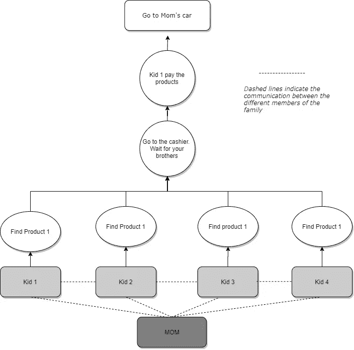

# 使用 Dask 的分布式机器学习介绍

> 原文：<https://towardsdatascience.com/distributed-machine-learning-with-python-and-dask-introduction-328a86571049?source=collection_archive---------34----------------------->

## [使用 Python 和 Dask 的分布式机器学习](https://medium.com/tag/daskdistributedml/latest)

## Dask 是 Python 的一个包，它将**【扩展】**你的数据科学技能。

由 [Pablo Salvador Lopez](https://medium.com/u/360640c0a123?source=post_page-----328a86571049--------------------------------) 和 [Aadarsh Vadakattu](https://medium.com/u/bb4e30a633db?source=post_page-----328a86571049--------------------------------) 合作撰写

照片来自 [**Pexels**](https://www.pexels.com/photo/man-standing-infront-of-white-board-1181345/?utm_content=attributionCopyText&utm_medium=referral&utm_source=pexels)

*Dask 将帮助您使用 Python 扩展您的数据科学技能。您将能够处理大数据并扩展您的代码，从而提高您的工作效率。*

## **Dask 简介**

欢迎数据科学爱好者！您之所以对本文感兴趣，是因为要么您一直在痛苦地挣扎着长时间运行，要么您的数据集适合您的 RAM。如果我没猜错的话，你是一个 Python 用户，能够自如地使用最常见的数据科学库，如 **Pandas** 、 **Scikit-Learn** 或 **Numpy。**读完这组文章后，你将学会如何使用 Dask，它能提高你的工作效率，让你在没有痛苦的学习曲线的情况下处理大数据。

我们将使用 Dask Python 包来扩展 NLP 文本分类问题。我们还将回顾支持可伸缩 ML 训练管道的数据转换。

如果您已经了解了 Dask 和分布式计算的基础知识，请继续阅读第二篇文章，回顾如何使用 SSH 构建 Dask 集群。

## **Dask 概念**

如果您曾经使用过 Apache Spark，那么这一部分对您来说会非常熟悉。下面这个外行的例子演示了 Dask 如何使用两个关键概念扩展任务:*有向无环图*(‘**DAG’**)和*惰性计算。*

想象一下这个场景。这是一个星期天，一个家庭决定做一个蛋糕。他们没有任何配料，所以妈妈开车带着四个孩子去超市。她讨厌购物，商店的停车条件也很差，所以今天她决定让孩子们去工作:

*   她把孩子们放在门口，绕着街区转了一圈。每个孩子都去商店寻找不同的原料:黄油、鸡蛋、面粉、糖等。
*   在每个孩子拿了单子上的所有食材后，他们在收银台和他们的兄弟姐妹见面。他们会在那里等到四个兄弟姐妹都到了。
*   他们通过群聊与妈妈交流，妈妈指导他们在一次交易中为产品付款。
*   然后妈妈绕回商店门口。孩子们回到车里，开车回家。

妈妈相信这个新计划将使家庭购买所有产品的速度比一起完成所有步骤快四倍。下图是妈妈的策略:

家庭之犬

现在，让我们用计算机科学术语来编写这个例子，以展示 **DASK 如何允许数据科学家创建可扩展的工作负载**。将家庭中的每个成员想象成一台虚拟机(VM)，或者更一般地说，一个**节点**。母亲是调度器节点，她正在与她的孩子通信，在这种情况下，孩子是其他计算节点，就像工作人员一样扩展任务集。此外，工作人员相互沟通，以确保他们根据计划完成并行任务(在计算机科学术语中称为 **DAG** )，并且不超过他们的最大内存或 **CPU** / **GPU** 使用率。

请记住，每个孩子可能有不同的特点，孩子 1 可能比孩子 2 更年轻、更快。类似地，每个工作节点可能具有不同数量的**CPU**，并且可能具有更大或更小的磁盘和 ram。这就是调度器在 Dask 架构中的作用——它协调工作负载，并以平衡的方式将工作分配给每个工作节点。

用外行人的话来说，这就是 Dask 的工作方式。我们现在清楚地知道 Dask 的调度程序如何使用 DAG(有向无环图)的概念在所有可用的节点上分配计算。

那么另一个计算机科学概念“懒惰计算”呢？

Dask 允许您为想要执行的计算构造一个处方(由数据科学家生成的 DAG)。Dask 是一个图形执行引擎，你写的所有不同的任务都被**延迟**。这意味着在您执行。compute()函数。

该函数将阻止执行，直到任务(或)构造的 DAG 完成。在 DAG 完成之后，整个计算直接从惰性 Dask 集合到本地内存中的具体值。这看起来可能很复杂，但是由于所有这些都是抽象的，您将在下面的文章中通过一个使用 NLP 的实际例子看到实现所有这些是多么容易。

希望你对接下来的[部分](/distributed-text-preprocessing-with-python-and-dask-5312a4d26ae)感到兴奋！我保证不再有理论，只有可扩展的数据科学。

# 链接:

【https://distributed.dask.org/en/latest/memory.html 号

[https://stack overflow . com/questions/41806850/dask-difference-between-client-persist-and-client-compute](https://stackoverflow.com/questions/41806850/dask-difference-between-client-persist-and-client-compute)

[https://distributed . dask . org/en/latest/manage-computation . html](https://distributed.dask.org/en/latest/manage-computation.html)

[https://tutorial.dask.org/01x_lazy.html](https://tutorial.dask.org/01x_lazy.html)

 [## PabloSalvadorLopez10 —概述

### 在 GitHub 上注册你自己的个人资料，这是托管代码、管理项目和构建软件的最佳地方…

github.com](https://github.com/PabloSalvadorLopez10)