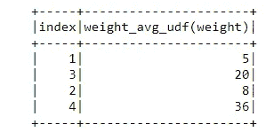

# PySpark 3.0 中基于 PyArrow 的新熊猫 UDF 的分布式处理

> 原文：<https://towardsdatascience.com/distributed-processing-with-pyarrow-powered-new-pandas-udfs-in-pyspark-3-0-8f1fe4c15208?source=collection_archive---------13----------------------->

## 如何使用 Spark 3.0.0 支持的 PySpark 实现高性能的类似熊猫的用户定义函数(UDF)


[**来源**](https://pixabay.com/illustrations/block-chain-data-records-concept-4115197/)

数据处理时间非常宝贵，因为用户花费的每一分钟都要付出经济代价。本文主要面向希望使用 Apache Spark 最新增强功能的数据科学家和数据工程师，因为在很短的时间内，Apache Spark 已经成为下一代大数据处理引擎，并以前所未有的速度在整个行业得到广泛应用。

Spark 的整合结构支持兼容和可构建的 [API](https://spark.apache.org/docs/latest/api/python/index.html) s，这些 API 通过优化程序中构建的各种库和函数来实现高性能，使用户能够构建超越现有库的应用程序。它也为用户提供了在上面编写自己的分析库的机会。

数据迁移成本很高，因此 Spark 专注于对数据进行计算，而不管数据位于何处。在用户交互 API 中，Spark 努力管理这些看似广泛相关的存储系统，以防应用程序不需要关心它们的数据在哪里。

当数据太大而无法在一台机器上运行时，在一台机器上执行计算需要很长时间，这就促使 it 将数据放在多台服务器或计算机上。这种逻辑要求以分布式方式处理数据。 [Spark DataFrame](https://spark.apache.org/docs/latest/sql-programming-guide.html) 是一个终极的结构化 API，提供一个包含行和列的数据表。通过其列和列类型的模式，它可以跨越大量的数据源。

本文的目的是介绍 Spark 3.0 当前发布的一个特性的好处，该特性与 pandas 和 Apache Arrow 使用 PySpark 相关，以便能够以并行方式执行类似 Pandas 的 UDF。在下面的标题中，PyArrow 对 PySpark 会话配置的重要使用，PySpark 启用的 Pandas UDFs 将通过提供相应主题的代码片段来详细解释。在文章的结尾，为进一步的研究添加了参考文献和附加资源。

# 1.PyArrow 和 PySpark

在以前版本的 Spark 中，在 PySpark 中将 DataFrame 转换为 Pandas 的步骤效率很低，需要将所有行收集到 Spark 驱动程序，将每一行序列化为 Python 的 pickle 格式*(逐行)、*，然后将它们发送到 Python 工作进程。在这个转换过程的最后，它将每一行拆成一个庞大的元组列表。为了能够克服这些无效操作，可以使用与 [Apache Spark](https://spark.apache.org/) 集成的 [Apache Arrow](https://arrow.apache.org/) 来实现更快的列数据传输和转换。

## 1.1.为什么使用 PyArrow 和 PySpark

[Apache Arrow](https://arrow.apache.org/) 有助于加速从传统列内存到 pandas 对象的转换，提供高性能的内存列数据结构。

以前，Spark 揭示了一个基于行的接口，用于解释和运行用户定义函数(UDF)。这在序列化和反序列化中引入了很高的开销，并且使得很难使用 Python 库，例如 [*NumPy*](http://www.numpy.org/) 、 [*Pandas*](https://pandas.pydata.org/docs/) ，这些库是用本地 Python 编码的，这使得它们能够更快地编译成机器代码。

在新提出的 UDF 中，它主张引入新的 API 来支持 Python 中的矢量化 UDF，其中通过逐块序列化[](http://arrow.apache.org/overview/)****而不是逐行序列化**，将数据块以某种列格式转移到 Python 中执行。******

******[Pandas](https://pandas.pydata.org/docs/) 包得到了机器学习和数据科学专家的认可，因为它与大量 Python 库和包进行了一致的集成，包括[*scikit-learn*](http://scikit-learn.org/stable/)*、*[*matplotlib*](https://matplotlib.org/)和 [*NumPy*](http://www.numpy.org/) 。******

******此外，Pandas UDFs 支持用户在 Apache Spark 中分发数据负载和使用 Pandas APIs。******

******用户自定义功能可参考[官方网站](https://spark.apache.org/docs/3.0.2/sql-pyspark-pandas-with-arrow.html)执行:******

*   ******[Apache Arrow](http://arrow.apache.org/) 通过利用 Arrow 列式内存布局加快字符串数据的处理，实现了数据在 [Java 虚拟机](https://en.wikipedia.org/wiki/Java_virtual_machine)和 Python 执行器之间的精确传输，且序列化成本为零。******
*   ******[Pandas](https://pandas.pydata.org/docs/) 库使用它的实例和 API。******

## ******1.2.火花会话配置******

******为了获得更好的性能，在执行作业时，应设置如下配置。******

******为了能够从 PyArrow 优化中获益，可以通过将此配置设置为默认禁用的`**true**` 来启用以下配置:`spark.sql.execution.arrow.pyspark.enabled`******

****在出现错误的情况下，上面启用的优化可以退回到非箭头优化实现情况。为了应对 Spark 中实际计算出现的这个问题，`fallback.enabled`将被设置为`**true**` **:** `spark.sql.execution.arrow.pyspark.fallback.enabled`****

****由于以下原因，parquet-summary-metadata**无法**有效地启用以下配置:****

1.  *******merge schema*=*false:***假设所有拼花局部文件的模式都是相同的，因此，可以从任何局部文件中读取页脚。****
2.  *******merge schema*=*true****:*所有文件都需要读取页脚来实现合并过程。****

```
**spark.sql.parquet.mergeSchema **false**
spark.hadoop.parquet.enable.summary-metadata **false****
```

****综上所述，Arrow 优化配置的最终推荐列表如下:****

```
**"spark.sql.execution.arrow.pyspark.enabled", "**true**""spark.sql.execution.arrow.pyspark.fallback.enabled", "**true**"
"spark.sql.parquet.mergeSchema", "**false**"
"spark.hadoop.parquet.enable.summary-metadata", "**false**"**
```

## ****1.3.要升级的包****

****正确使用 **PyArrow** 和 **PandasUDF** 需要在 PySpark 开发平台中升级一些包。****

****需要更新以下软件包列表，以便能够正确使用 Spark 3.0 的 PandasUDF 最新版本。****

```
****# Install with Conda**
conda install -c conda-forge pyarrow**# Install PyArrow with Python**
pip install pyarrow==0.15.0**# Install Py4j with Python**
pip install py4j==0.10.9**# Install pyspark with Python**
pip install pyspark==3.0.0**
```

****此外，您可能需要分配一个新的环境变量，以便在运行 Pandas UDFs 时不会面临 py arrow 0 . 15 . 1 升级的任何问题。****

```
****# Environment Variable Setting for PyArrow Version Upgrade**
import os
os.environ["ARROW_PRE_0_15_IPC_FORMAT"] = "1"**
```

# ****2.Python 的 PyArrow****

## ****2.1.更快地处理拼花格式的文件****

****[**py arrow**](https://arrow.apache.org/docs/python/install.html)**在读取拼花文件而非其他文件格式时，性能差距较大。在这个博客中，你可以找到关于不同文件格式读取的基准研究。******

******它可用于 Python 中处理时间不同的不同种类的包:******

*   ********拼花箭头:** `pyarrow.parquet`******

```
****# Importing PyArrow** 
import pyarrow.parquet as pqpath = "dataset/[**dimension**](https://www.kaggle.com/yassinealouini/m5-sales-hierarchy-dataset)"data_frame **=** pq**.**read_table(path)**.**to_pandas()**
```

*   ******拼花到带熊猫的箭头数据框:** `pyarrow.parquet`然后转换成`pandas.DataFrame`****

```
**import pandas as pd
import pyarrow as pa
import pyarrow.parquet as pqpandas_df = pd.DataFrame(data={'column_1': [1, 2], 'column_2': [3, 4], 'column_3': [5, 6]})table = pa.Table.from_pandas(pandas_df, preserve_index=True)pq.write_table(table, 'pandas_dataframe.parquet')**
```

## ****2.2.计算脚本处理时间****

****只要我们关心编写的脚本的性能和处理速度，了解如何度量它们的处理时间是有益的。****

****执行 Python 脚本时，存在两种类型的时间流逝处理计算。****

> ******处理器时间**:测量特定进程在 CPU 上活动执行的时间。睡眠、等待 web 请求或时间不包括在内。`*time.process_time()*`****
> 
> ******挂钟时间**:它计算“挂在墙上的钟”已经过了多少时间，即外面的实时时间。`*time.perf_counter()*`****

****还有其他方法可以计算运行脚本所花费的时间。****

> ****`*time.time()*`功能也是 quantifes time-passed 作为挂钟时间；然而，它可以被校准。为此，需要回到过去重置它。****
> 
> ****`*time.monotonic()*`函数单调，简单向前；然而，与`*time.perf_counter()*`相比，其精度性能有所下降****

# ****3.PySpark 与熊猫 UDF****

****[**Pandas 用户定义的函数**](https://docs.databricks.com/spark/latest/spark-sql/udf-python-pandas.html) 可以被识别为由 Apache Arrow 提供支持的矢量化 UDF，与一次一行[Python UDF](https://docs.microsoft.com/en-us/azure/databricks/spark/latest/spark-sql/udf-python)相比，它允许提供更高性能的矢量化操作。通过对定制功能的分布式处理，它们可以被视为 [Apache Spark](https://spark.apache.org/) 中最具影响力的改进。它们带来了无数的好处，包括让用户能够使用熊猫 API 和提高性能。****

****在 Python 中摄取 [Spark 定制函数结构](https://www.slideshare.net/ueshin/apache-arrow-and-pandas-udf-on-apache-spark)向 SQL 用户展示了它的高级功能，允许他们调用函数，而无需生成额外的脚本来连接他们的功能。****

****功能可以通过 [*行*](https://spark.apache.org/docs/latest/api/python/pyspark.sql.html#pyspark.sql.Row)*[*组*](https://spark.apache.org/docs/latest/api/python/pyspark.sql.html#pyspark.sql.GroupedData)**窗口* 来执行，数据格式对于列可以使用*，对于表结构可以使用***data frame****。********

## *******3.1.标量熊猫 UDF*******

********标量型熊猫 UDF* 可以描述为将一个或多个**熊猫系列**转化为一个**熊猫系列**。最终返回的数据序列大小应该与输入数据序列的大小相同。*******

```
****import pandas as pdfrom pyspark.sql.functions import pandas_udf
from pyspark.sql import Windowdataframe = spark.createDataFrame(
 [(1, 5), (2, 7), (2, 8), (2, 10), (3, 18), (3, 22), (4, 36)],
 (“index”, “weight”))**# The function definition and the UDF creation**
@pandas_udf(“int”)
def weight_avg_udf(weight: pd.Series) -> float:
 return weight.mean()dataframe.select(weight_avg_udf(dataframe[‘weight’])).show()****
```

************

******(图片由作者提供)******

## ******3.2.熊猫 UDF******

*******熊猫 UDF* 的分组 Agg 可以定义为一个或多个**熊猫系列**转化为一个**标量**。最终返回的数据值类型要求是原语 *(boolean、byte、char、short、int、long、float、double)* 数据类型。******

```
******# Aggregation Process on Pandas UDF**dataframe.groupby("index").agg(weight_avg_udf(dataframe['weight'])).show()w = Window \
    .partitionBy('index') \
    .rowsBetween(Window.unboundedPreceding, Window.unboundedFollowing)****
```

************

******(图片由作者提供)******

```
****[**# Print the windowed results**](https://github.com/pinarersoy/PyArrow-Powered-New-Pandas-UDFs-in-Spark-3/blob/master/PySpark_PandasUDFs_in_one_file.ipynb?short_path=808df3f)dataframe.withColumn('avg_weight', weight_avg_udf(dataframe['weight']).over(w)).show()****
```

************

******(图片由作者提供)******

## ******3.2.熊猫 UDF 组图******

*******熊猫 UDF 分组图*可以被识别为一个或多个**熊猫数据帧**到一个**熊猫数据帧**的转换。最终返回的数据大小可以是任意的。******

```
****import numpy as np**# Pandas DataFrame generation**
pandas_dataframe = pd.DataFrame(np.random.rand(200, 4))def weight_map_udf(pandas_dataframe):
    weight = pandas_dataframe.weight
    return pandas_dataframe.assign(weight=weight - weight.mean())dataframe.groupby("index").applyInPandas(weight_map_udf, schema="index int, weight int").show()****
```

************

******(图片由作者提供)******

******根据输入和输出数据的规格，您可以通过向这些矢量化 UDF 添加更复杂的函数来在它们之间进行切换。******

******完整的实现代码和 Jupyter 笔记本都在我的 [**GitHub**](https://github.com/pinarersoy/PyArrow-Powered-New-Pandas-UDFs-in-Spark-3/blob/master/PySpark_PandasUDFs_in_one_file.ipynb?short_path=cba9063) **上。********

******非常感谢您的提问和评论！******

# ******4.参考******

1.  ******[Python 用户定义函数](https://docs.microsoft.com/en-us/azure/databricks/spark/latest/spark-sql/udf-python)******
2.  ******[熊猫 API](https://pandas.pydata.org/pandas-docs/stable/reference/index.html)******
3.  ******[阿帕奇火花](https://spark.apache.org/)******
4.  ******[阿帕奇箭头](https://arrow.apache.org/)******

# ******5.额外资源******

1.  ******[矢量化 UDF:使用 Python 和 PySpark 进行可扩展分析](https://databricks.com/session/vectorized-udf-scalable-analysis-with-python-and-pyspark)******
2.  ******[Apache Arrow Tokyo Meetup 2018 演示](https://databricks-prod-cloudfront.cloud.databricks.com/public/4027ec902e239c93eaaa8714f173bcfc/142158605138935/3546232059139201/7497868276316206/latest.html)******
3.  ******[星火:权威指南](https://www.oreilly.com/library/view/spark-the-definitive/9781491912201/)******