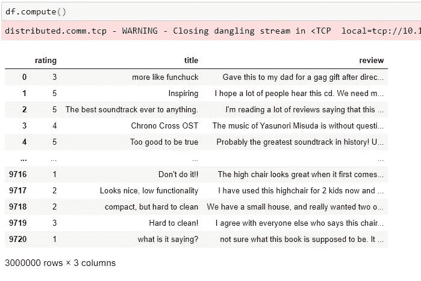

# 基于 Python 和 Dask 的分布式文本预处理

> 原文：<https://towardsdatascience.com/distributed-text-preprocessing-with-python-and-dask-5312a4d26ae?source=collection_archive---------30----------------------->

## [用 Python 和 Dask 进行分布式机器学习](https://medium.com/tag/daskdistributedml/latest)

## *一种扩展您的数据争论任务的方法*


照片由 [Jelleke Vanooteghem](https://unsplash.com/@ilumire?utm_source=unsplash&utm_medium=referral&utm_content=creditCopyText) 在 [Unsplash](https://unsplash.com/s/photos/words?utm_source=unsplash&utm_medium=referral&utm_content=creditCopyText) 上拍摄

如果你已经[组装了一个独立的集群](/set-up-a-dask-cluster-for-distributed-machine-learning-31f587b1b553)，并且对[Dask 如何在后台*工作*](/distributed-machine-learning-with-python-and-dask-introduction-328a86571049)有了足够的了解，那么是时候学习一些实用的数据科学了。对了，你可以在我的 [GitHub 账号](https://github.com/PabloSalvadorLopez10)里找到我所有的源代码和数据。

## 我们试图预测什么？

我想根据文本将亚马逊产品的评论分为正面或负面。显然，在将数据输入到 ML 训练管道之前，我需要对数据进行一些转换。

## **数据呢？**

我使用的是亚马逊提供的公开数据集，有 300 万条评论和评级。这是一个 1.5 GB 的中型数据集，但是本文的目的是展示如何以及为什么使用 **Dask** 来处理更大的数据集。

## *加载集群*

在进入我们的笔记本之前，我们需要几个快速命令来准备好我们的独立集群。如果您遇到问题，这篇文章将指导您创建一个好的独立集群。

首先，与您的每台机器建立一个 SSH 连接。让我们从您想要选择作为调度程序的机器开始。您只需要输入以下命令:

```
dask-scheduler
```

我的独立 Dask 集群有两个工人(机器)。如果要将这些节点与调度程序连接，需要在“Worker node”终端运行以下命令:


调度程序节点

现在，您必须将其他机器作为工作节点连接起来。为此，您需要在调度程序终端输入以下命令。在下面的例子中，调度器节点的 IP 是`10.1.1.93`，Dask 应该连接的端口是`8786`。

```
# You should specify the IP and port of the scheduler node as below. dask-worker tcp://10.1.1.93:8786
```


将第一个工作线程连接到调度程序节点

我将再连接四台机器作为工作节点，这使得我的最终集群有一个调度器节点和五个工作节点。连接每个节点后，您应该会在调度程序终端中看到类似这样的内容:


连接五个工作节点后调度虚拟机

恭喜你。现在，您可以开始使用 Jupyter 笔记本了。

Dask 提供了一个漂亮的仪表板，您可以在其中看到正在运行的进程的所有指标。您可以使用以下命令让它运行:

```
# load the cluster
import dask 
from sklearn.externals import joblib
from dask.distributed import Client# IP of the scheduler node.c = dask.distributed.Client('tcp://10.1.1.93:8786')# call the cluster c 
```


单击 dashboard 链接，它应该会在您的浏览器中打开一个新选项卡。Dask 的仪表板可以让你实时看到每个工人正在做的所有计算。太棒了，对吧？


Dask 仪表板

## Dask 数据帧

按照以下示例将数据加载到 Dask 数据帧中。


让我们看看 Dask 生成的数据帧:


Dask 数据帧

哇！它看起来和熊猫的数据帧很不一样，对吗？这是因为两个主要原因:

*   Dask 的`read_csv`函数将数据分成小熊猫分区，让我们可以处理大数据集。在我们的例子中，Dask 将 1.5 GB 的数据集分成 22 个分区，使我们有 68.18 MB 的分区。作为一般建议，当您处理较大的数据集时，您的数据块应该足够小，以便它们中的大部分可以一次放入一个工作者的可用内存中。当您选择 Dask 数据帧中的分区大小或 Dask 数组中的块大小时，您可以控制这一点。
*   Dask 使用[惰性计算](/distributed-machine-learning-with-python-and-dask-introduction-328a86571049)比如 Spark。Dask 是一个图形执行引擎，所以所有不同的任务都被延迟，这意味着在您点击函数`.compute()`之前，没有任何函数被实际执行。在上面的例子中，我们有 66 个延迟的任务。

让我们点击`.compute()`，看看会发生什么。



`.compute`函数将 22 个小分区组装成一个包含 300 万条评论的 pandas DataFrame。如果您的数据集很大，不要这样做，因为这样做会使您将数据集放入单台机器的本地内存中，这是 Dask 试图避免的。

## 缺少值

检查缺失值类似于在熊猫数据帧上执行`.isnull()` 功能。但是记住，如果你想看到结果，你必须点击`.compute()`。


缺少值

好消息是，在我们的示例数据集中没有需要处理的缺失值。

## 描述统计学

让我们简要地看一下 table 中的前五行数据，这样我们就可以看到我们正在处理哪种类型的值。Dask dataframes 允许您使用 pandas 功能，如`.head()`、`.groupby()`、`.loc()`、`.merge()`等。


数据帧

我们有三个栏目:*标题、评论和评分*。我想知道我们是否正在处理数据中的不平衡，因此我将计算我的目标变量(评级)的值。


这看起来是一个非常好的“训练”数据集，因为这些类被平等地表示。我们不需要担心应用技术来解决不平衡的数据。

您肯定可以使用更复杂的 EDA 进行文本分析，如查找最常用的术语、LDA 主题检测、基于产品的聚类评论等，从而为您的训练数据集添加新功能。然而，这些主题超出了本文的范围。

到目前为止，我认为您已经明白了这一点——Dask 是 Python 用户的友好库，允许您使用**大数据**。

## 数据争论

例如，如果我们要建立一个二元分类问题，我们需要将评论分为“正面”或“负面”。亚马逊用户将这些评论评为 1-5 星。为了转换这一点，我假设将从 1 到 3 颗星的评级分类为负面，并用值 0 标记它们，反之亦然。

请记住——Dask 以这样一种方式转换您的场景，即使您的数据很大，您也可以处理小块的 pandas 数据帧，因此这是迭代所有分区的最优雅和有效的方式。

让我们来看看数据帧“df2”:


df2

我们创建了一个包含 177 个任务的 DAG。记住，我们不会做任何计算，直到我们点击`.compute()`。

让我们看看转换的输出。


新目标变量

我们已经成功地将这个问题转化为二进制文本分类。

在清除文本中的干扰之前，我还将“标题”和“评论”功能结合起来。根据这种情况，很明显，最重要的数据点存在于评论中，但有时，重要的数据点也存在于标题中。我想确保我两者都考虑到了。

## 管理内存

在继续之前，了解如何使用 Dask 管理 RAM 的使用是很重要的。

`dask.distributed`将任务的结果存储在工作节点的分布式内存中。中央调度程序节点跟踪集群上的所有数据，并确定何时应该释放数据。完成的结果通常会尽快从内存中清除，以便为更多的计算腾出空间。但是，如果您想将数据帧存储在 RAM 中，您应该使用函数`persist`。

**`**compute**`**和** `**persist**` **有什么区别？****

**`compute`返回每个输入的单个输出，而`persist`返回每个块(或分区)的集合的副本，由单个输出代替。简而言之，使用 persist 在集群上保存一个完整的集合，当您想要一个小的结果作为离散输出时，使用 compute。**

****但是你可能会奇怪为什么我要用** `**persist**` **？****

**从 RAM 访问数据通常比从磁盘访问数据快得多。一旦您的数据集处于干净的状态，并且:**

1.  **适合内存，而且**
2.  **足够干净，你会想尝试许多不同的分析，**

**那么这就是把你的数据保存在内存中的好时机。**

**让我们看一个例子:**

****

**前一部分生成的 df3**

**让我们坚持 df3...**

****

**持续 df**

**所以基本上`persist()`为每个 Dask 任务返回一个副本，包括它们以前的懒惰计算，现在提交到集群上运行。否则，您可以选择将数据帧保存到本地(不推荐)或以拼花格式保存到集群。**

**将 df3 保存到拼花地板:**

## **用于机器学习的干净文本**

**当我们对文本进行矢量化时，我们会将我们的语料库(评论)转换为所谓的“**稀疏矩阵”。稀疏矩阵是主要由零值组成的矩阵。矩阵的稀疏性可以用分数来量化，分数是矩阵中零值的个数除以矩阵中元素的总数。这可能导致空间和时间复杂性方面的问题。因此，清除评论中的噪声对于提高训练和结果模型的性能变得至关重要。我附上了我的清理算法的一部分，但你会在我的 GitHub 上找到更多的部分。****

**清理数据**

**但是我们还需要一个步骤——我们需要对所有的分区应用 clean 函数。为此，使用 Dask 提供的`map_partitons()`函数，而不是 pandas 的`map()`。**

**当你叫`map_partitions`(就像你在熊猫上叫`.apply()`一样。DataFrame)，您尝试映射(或应用)的函数会将 dataframe 作为第一个参数。**

**在`dask.dataframe.map_partitions`的情况下，第一个参数将是**一个分区**，在`pandas.DataFrame.apply`的情况下，它将是一个完整的数据帧。这意味着您的函数必须接受 dataframe 分区作为第一个参数，您的代码可能如下所示:**

****

**地图 _ 分区**

**让我们检查结果！**

****

**清洁 df**

**不错！！我们已经用 Dask 清理了我们的文本！下一部分将展示如何用 Dask 加速你的[算法。](/distributed-machine-learning-with-python-and-dask-2d6bae91a726)**

**感谢大量阅读。**

**[](https://github.com/PabloSalvadorLopez10) [## PabloSalvadorLopez10 -概述

### 在 GitHub 上注册你自己的个人资料，这是托管代码、管理项目和构建软件的最佳地方…

github.com](https://github.com/PabloSalvadorLopez10) 

## 链接

[https://docs.dask.org/en/latest/best-practices.html](https://docs.dask.org/en/latest/best-practices.html)

[https://docs.dask.org/en/latest/dataframe.html](https://docs.dask.org/en/latest/dataframe.html)**