# tf.keras 中带权重和偏差的分布式培训

> 原文：<https://towardsdatascience.com/distributed-training-in-tf-keras-with-w-b-ccf021f9322e?source=collection_archive---------44----------------------->

## [生产中的机器学习](https://towardsdatascience.com/tagged/production-ml)

## 探索以最少的代码更改来分配您的培训工作量的方法，并使用权重和偏差(W&B)来分析系统指标。

查看[关于体重和偏见的交互式仪表盘](https://app.wandb.ai/sayakpaul/tensorflow-multi-gpu-dist/)。

# 介绍

在这份报告中，我将向您展示如何无缝集成`[tf.distribute.MirroredStrategy](https://www.tensorflow.org/api_docs/python/tf/distribute/MirroredStrategy)`，以便针对`tf.keras`型号在多个 GPU 之间分配您的培训工作负载。当您拥有非常大的数据集，并且需要调整培训成本时，分布式培训会非常有用。仅在单个硬件加速器(在这种情况下是 GPU)上执行训练变得不现实，因此需要执行分布式训练。

> 查看 [GitHub 库](https://github.com/sayakpaul/tf.keras-Distributed-Training)上的代码。

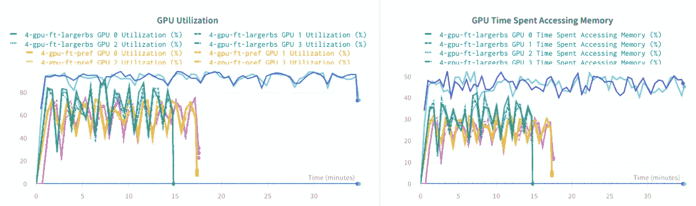

查看[关于重量和偏差的交互式仪表盘](https://app.wandb.ai/sayakpaul/tensorflow-multi-gpu-dist/)

在报告的结尾，我们将看到两种方法可以使分布式训练非常有效——a .**预取**数据，以便模型在完成一个时期后就可以使用这些数据，b .调整批量大小。

非常感谢 Google 的 Martin Gorner(ka ggle 团队的 ML 产品经理)为我准备这份报告提供了指导。

TensorFlow 的[分布式策略](https://www.tensorflow.org/api_docs/python/tf/distribute)使我们能够极其轻松地在多个硬件加速器之间无缝扩展我们繁重的训练工作量，无论是 GPU 还是 TPU。也就是说，分布式训练长期以来一直是一个挑战，尤其是在神经网络训练方面。分布式培训程序带来的主要挑战如下:

*   我们如何在不同的设备上分配模型参数？
*   我们如何在反向传播过程中累积梯度？
*   模型参数将如何更新？

如果您从头到尾考虑培训过程，所有这些听起来可能非常令人生畏。幸运的是，像 TensorFlow 这样的库给了我们非常容易地合并分布式训练的自由——无论是经典的`fit`和`compile`范式的`tf.keras`模型，还是定制的训练循环。然而，本报告只涉及前者。如果您有兴趣了解更多关于定制培训循环的分布式培训，请务必查看本教程。

在本报告的前半部分，当我在 GCP 虚拟机上进行实验时，我们将讨论在谷歌云平台(用于分布式培训)上选择虚拟机时需要记住的一些要点。但是这些指针也应该适用于您选择的任何平台。然后，我们将看到在单个机器中的多个 GPU 之间分配`tf.keras`型号*的培训工作负载所需的步骤。最后，我们将通过分析这个`[wandb](https://app.wandb.ai/sayakpaul/tensorflow-multi-gpu-dist/)` [运行概要](https://app.wandb.ai/sayakpaul/tensorflow-multi-gpu-dist/)中的系统指标来得出结论。*

# 系统设置、成本等

我们主要有两个选择来执行 GCP 的分布式训练-

*   计算引擎
*   人工智能平台笔记本

[计算引擎](https://console.cloud.google.com/compute/)允许您创建具有许多不同软件和硬件配置的虚拟机，这些虚拟机可能适用于各种任务，而不仅仅是训练深度学习模型。另一方面， [AI 平台笔记本](https://console.cloud.google.com/ai-platform/notebooks)为我们提供了预配置的 Jupyter Lab 笔记本实例，具有定制的灵活性。

根据我的经验，我发现建立一个计算引擎实例的过程比构建一个人工智能平台笔记本实例更复杂。让我们从成本的角度来看看它们有什么不同。

以下是我的系统配置:

*   n1-标准-4 个 vcpu-15 GB
*   4 辆特斯拉 K80s
*   100 GB 标准永久磁盘
*   预配置映像: **TensorFlow 2.1** (采用英特尔 MKL-DNN/MKL 和 CUDA 10.1)

计算引擎，为了以上，将花费我-

在 GCE 上计算我们虚拟机的成本

而且，人工智能平台笔记本电脑会让我付出以下代价-

人工智能平台笔记本电脑上虚拟机的成本计算

正如你所看到的，两者的成本是不同的，但后者(人工智能平台笔记本)只是一个点击就走的东西。作为一名从业者，我希望我的时间花在与我的专业知识相关的事情上，我不想在不需要的时候重新发明轮子。因此，我选择了人工智能平台笔记本电脑。关于设置和使用人工智能平台笔记本的更全面的报道，请参考[本指南](http://bit.ly/399Fd60)。

为了能够在一个 AI 平台笔记本实例中使用多个 GPU，您首先需要申请配额增加。你可以看看[这个帖子](https://stackoverflow.com/questions/45227064/how-to-request-gpu-quota-increase-in-google-cloud)来了解更多。

# 给我看看代码

默认情况下，使用 all-reduce 算法在同步模式下进行参数更新。但是，TensorFlow 2.x 也支持异步模式下的参数更新。解释它们的细节超出了本报告的范围。如果您有兴趣了解更多，这里有一些非常好的资源:

*   [内部 tensor flow:TF . distribute . strategy](https://www.youtube.com/watch?v=jKV53r9-H14&feature=youtu.be)
*   [使用 TensorFlow 进行分布式训练](https://www.tensorflow.org/guide/distributed_training)
*   [将 TensorFlow 2 模型扩展到多工作者 GPU(TF Dev Summit’20)](https://www.youtube.com/watch?v=6ovfZW8pepo)

好了，回到代码！

作为起点，我们先在单个 K80 GPU 上训练一个区分猫和狗的图像分类器。我们将使用 MobileNetV2 网络(在 ImageNet 上进行了预培训)作为我们的基础架构，在它的顶部，我们将添加分类头。所以，在代码中，它看起来像这样-

训练这家伙 10 个纪元给了我们一个好结果-

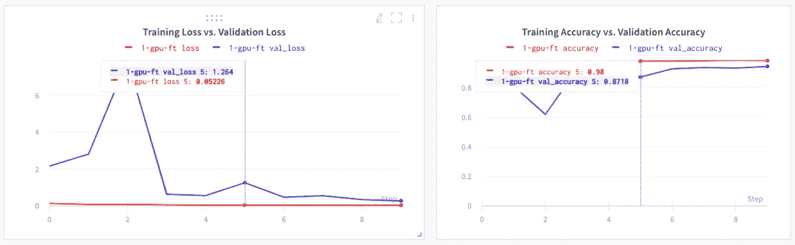

训练进度图 I(在此处与图[互动)](https://bit.ly/2SceZsH)

请注意，我们正在对这个网络进行微调，而不仅仅是预先计算瓶颈，然后将其提供给分类顶部。因此，`EXTRACTOR.trainable = True`就是这样设定的。当`trainable`参数设置为`False`时，它只是一个带有不可训练特征提取器的浅层网络。在这种情况下，我们不太可能看到分布式培训的任何优势，因为它会变成一个非常肤浅的网络。

我们已经在验证集上获得了大约 94%的准确率。但这不是我们关心的问题。我们希望能够通过使用分布式训练来加速模型训练。

训练大约需要***2090 秒*** 。关于这个特定实验的所有重要统计数据都可以在一个格式良好的表格中找到(你可以在这里看到[和](https://bit.ly/2SceZsH))

不同 W&B 运行的集合一起称为**运行集**

当微调网络时，使用一个带有加速的学习速率表是一个很好的实践。这里的想法是从一个低的学习率开始，这样基础网络的预训练权重就不会被破坏。然后我们提高学习率，再降低学习率。时间表应该是这样的-

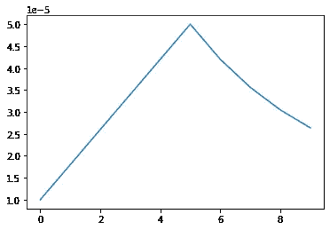

带有**斜坡的学习率(LR)时间表**

# 使用 LR 调度进行微调(单个 GPU)

现在让我们看看学习计划对培训是否有任何影响。

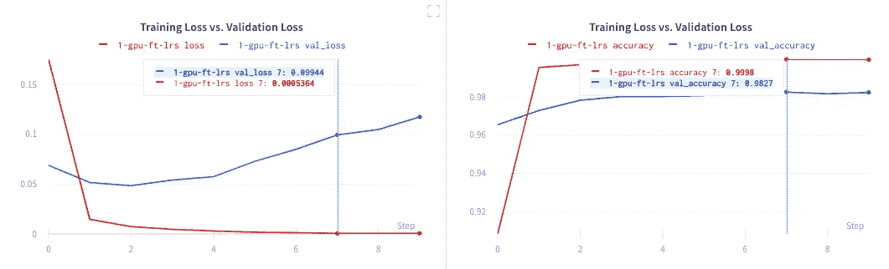

训练进度图 II(在此处与图[互动)](https://bit.ly/2SceZsH)

虽然这次网络中有一点过度拟合的行为，但你也可以看到性能的改善( **~98%的验证准确率**)。模型训练时间也不受此影响( **~ 2080 秒**)。通过在开始时使用较低的学习速率，同时使用学习速率时间表，可以进一步减轻过拟合。

# 将模型移植到多个 GPU

现在，为了在四个 GPU 之间分配这种训练，我们首先需要定义`MirroredStrategy`范围，并在范围上下文中编译我们的模型

`get_training_model`包括如上所示的模型定义*以及编译步骤*。所以，我们正在做的是在`MirroredStrategy`的范围内创建和编译模型。这之后绝对一样——你叫`model.fit`。我们的学习率计划也将有所改变，因为我们现在将在四个 GPU 上分配模型参数(注意 Y 值)。

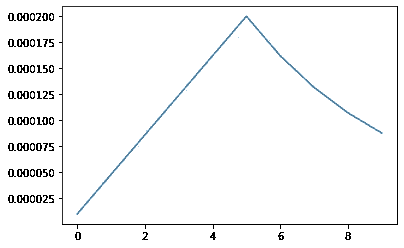

多 GPU 的 LR 调度

从下图中可以看出，性能变化不大(至少在准确性和损失方面)

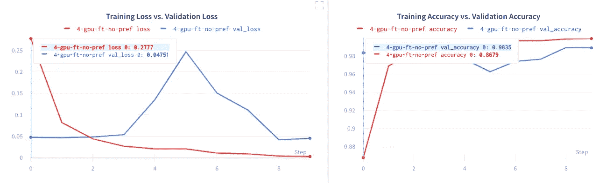

训练进度图三(在此处与图[互动)](https://bit.ly/2SceZsH)

正如你所看到的精度(在这种情况下，我们有 **~98%** )和损耗仍然与上面的图有些相同。如果我们从较低的学习率开始，左边图中的尖峰可以变平。

不过，模型训练时间减少了——1046 秒。哇哦。惊人的 2 倍加速。这还可以进一步改进，我们稍后会看到如何改进。但首先，让我们对 GPU 指标做一些分析。

# 分析 GPU 指标

相对而言，GPU 不如其他商用硬件便宜。因此，确保 GPU 利用率尽可能高非常重要。让我们快速看看我们在那里做得怎么样。下面是 GPU 利用率和 GPU 访问内存以获取数据所用时间的图表(单个 GPU)。正如我们所见，大多数时候 GPU 利用率都很高，这很好。

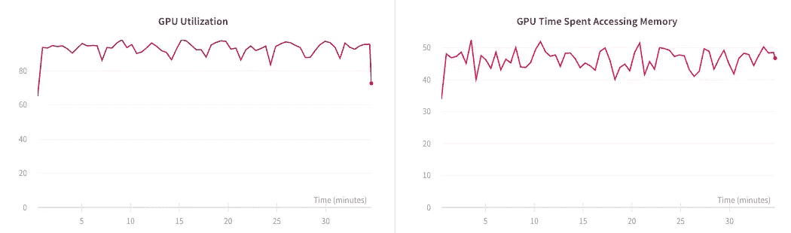

单 GPU 指标

作为一名深度学习实践者，你的目标应该是**最大化**GPU 利用率，同时**减少**GPU 访问内存以获取数据所花费的时间。因此，*减少 GPU 获取数据所花费时间的一个显而易见的解决方案是在一个时期完成时预取数据*。

## 当我们使用多个 GPU 时，我们会得到-

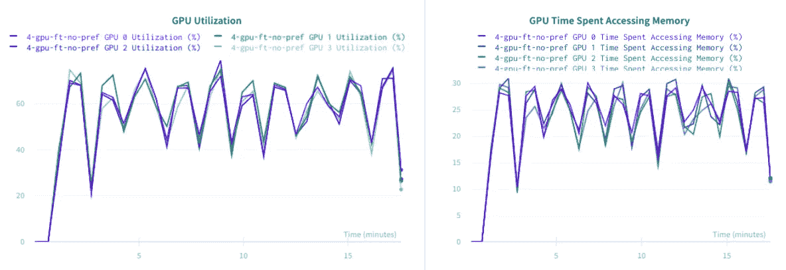

多 GPU 指标 I

> **(您会看到多行，因为这里有四个计算指标的 GPU)**

正如我们所看到的，四个 GPU 的平均 GPU 利用率远远低于预期，但内存访问时间已经大大减少，因为它现在分布在多个 GPU 上。至于利用率，这是因为数据集的容量相对较低。有了更大的数据集，我们可以期待看到 GPU 性能的更多提高。在下一节中，我们将讨论两种常用技术来进一步提高利用率。

我们还可以看到上面两个图的线条有些平滑，这表明所有的 GPU 都在相同的负载下运行。可以肯定地说，在多 GPU 环境下运行时，这种平滑度是意料之中的。如果您看到奇怪的峰值，这可能是一个迹象，表明 GPU 没有在相同的负载下运行，您可能希望使之均匀。

# 进一步提高性能的两种方法

**方法#1**

TensorFlow 的[数据 API](https://www.tensorflow.org/api_docs/python/tf/data/) 提供了许多东西来进一步改善输入数据流成为瓶颈的模型训练。例如，理想情况下，当模型正在训练时，下一个时期的数据应该已经准备好，因此模型不需要等待。如果它需要等待，那么它会在总训练时间方面引入一些瓶颈。

`[prefetch](https://www.tensorflow.org/api_docs/python/tf/data/Dataset)`允许我们指示 TensorFlow 在模型完成当前时期后立即准备好下一批数据。它甚至允许我们预先指定系统应该获取的样本数量。但是，如果我们希望系统根据系统进程和硬件的带宽为我们做出决定，那该怎么办呢？我们可以用`tf.data.experimental.AUTOTUNE`来指定

**方法二**

我们可以做的第二件事是调整批量大小。由于我们使用同步参数更新方案的多个 GPU，每个 GPU 将接收一部分数据，并在此基础上进行训练。因此，如果我们使用过高的批处理大小，GPU 可能很难在彼此之间正确分配。另一方面，如果我们使用的批量太小，GPU 可能会利用不足。所以，我们需要找到最佳点。这里有一些一般性的建议(这些来自马丁·戈纳的笔记本)

*   从 16 开始，作为每个 GPU 的本地批量大小。
*   然后，全局批量大小变为— `local_batch_size * number_of_GPUs`。

请注意，我们现在使用的批量更大，在之前的实验中，我们使用的批量为 16。

Martin 的上述笔记本包含许多使用分布式培训时优化模型性能的提示和技巧，其中包括:

*   [使用混合精度训练和支持 XLA 的编译](https://www.wandb.com/articles/mixed-precision-training-with-tf-keras)(它将只在**V100**GPU 上工作)。
*   关于`tf.data.Dataset`分布行为的说明。

本指南中也提供了许多建议。

好了，说够了！现在是时候把上面讨论的方法结合起来看看结果了

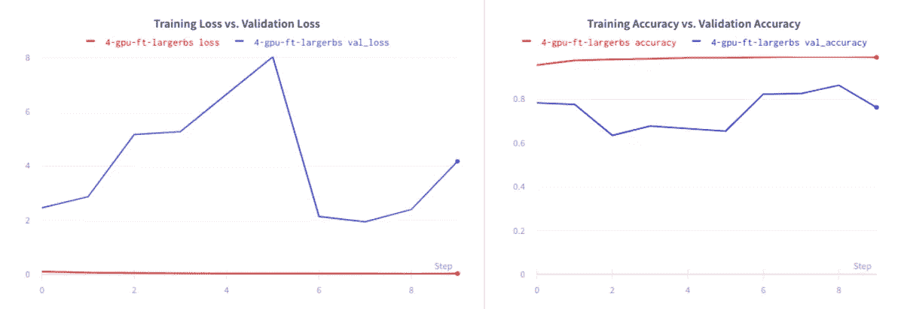

训练进度图四(在这里与图[互动)](https://bit.ly/2SceZsH)

批量越大，性能受到的影响越大，但另一方面，训练时间进一步减少到了 887 秒。

在同样的批量 32 的情况下，我们得到-

多 GPU 指标 II

虽然 GPU 利用率和内存访问时间的提高非常微小，但它仍然存在。

## **LR 调度+批量 16 +预取**

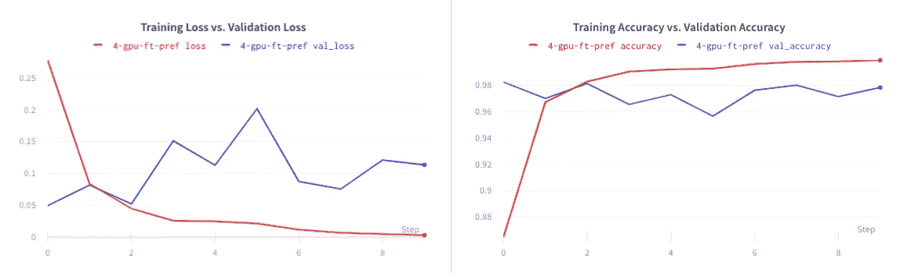

训练进度剧情五(在此与剧情[互动)](https://bit.ly/2SceZsH)

正如你所看到的，我们能够保持同样的性能，并且还稍微减少了模型训练时间( **~ 6 秒**)。

就 GPU 指标而言-

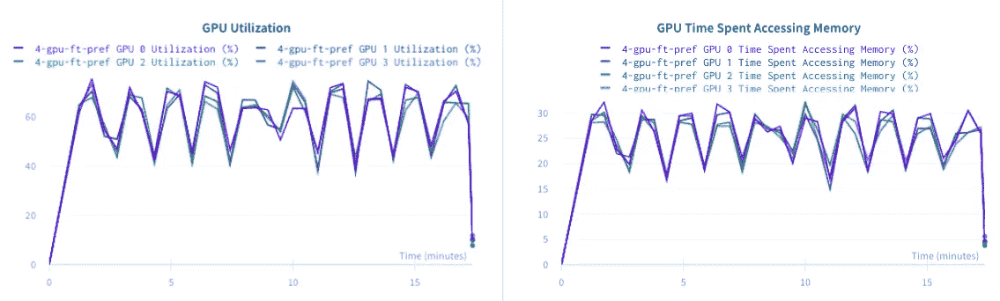

多 GPU 指标 III

如上图所示，GPU 指标几乎没有变化。当使用多个 GPU 时，通常数据越多，利用率就越高。同样重要的是要记住，在这些情况下使用较大的批量可能会损害模型性能，正如我们在上面看到的那样。

我们鼓励您查看下面为两个不同的 Kaggle 竞赛提供的两个惊人的基准:

*   [https://www . ka ggle . com/c/jigsaw-多语言-有毒-评论-分类/讨论/140022#793524](https://www.kaggle.com/c/jigsaw-multilingual-toxic-comment-classification/discussion/140022#793524)
*   [https://www . ka ggle . com/c/flower-class ification-with-tpus/discussion/137983 # 784972](https://www.kaggle.com/c/flower-classification-with-tpus/discussion/137983#784972)

它还提供了许多不同硬件配置之间的成本权衡。这将有助于您根据您的成本预算做出最佳决策。

# 结论和下一步措施

重要的是要记住，在使用分布式培训时，数据集越大，加速器的利用率就越高。无论是 TPU 还是多个 GPU，这一逻辑都是正确的。

当使用多个 GPU 时(无论是在单个还是多个机器/集群中)，注意多个加速器之间协调所需的同步时间的相关成本非常重要。[本视频](https://www.youtube.com/watch?v=I29_VZ82KW4)讲解了与此相关的一些取舍。

我希望您已经意识到为您的`tf.keras`模型分配培训工作量是多么容易。作为下一步，您可能想尝试本报告和我提到的参考资料中分享的不同技巧和诀窍。如果你更喜欢定制训练循环，你也可以尝试混合精度训练和分布式训练。

如果你有任何反馈要与我分享，你可以通过推文[这里](https://twitter.com/RisingSayak)这样做。我真的很感激。