# 建立一个分类算法来预测国会选区翻转并确定因果关系

> 原文：<https://towardsdatascience.com/district-flip-forecasts-in-congressional-elections-47324c71e7ab?source=collection_archive---------39----------------------->

## 预测国会选区的政党变动。

*METIS 数据科学沉浸式解决分类算法项目 5 之 3。你可以在我的* [*Github*](https://github.com/Pamaland1/Forecasting_Congressional_District_Flips) *上看看这个项目的文件。*

根据[维基媒体知识共享许可](https://commons.wikimedia.org/wiki/File:US_Flag_Backlit.jpg)授权的美国国旗

我一直想当然地认为，地区派对的转变是特定地区人口或文化变化(或不公正选区划分)的结果，这种现象通常被称为空间排序——由比尔·毕晓普在《大排序》中推广开来。我用这个项目来评估这个假设。

# 目标

*   预测国会选区的政党变动。
*   确定派对狂欢的最大促成因素

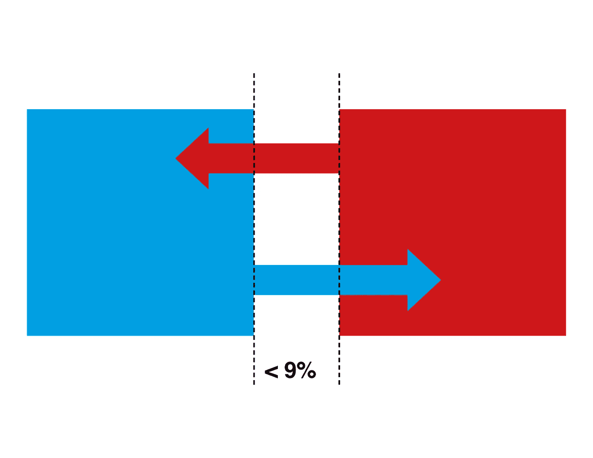

在过去的 45 年里，平均不到 9%的地区改变了党派。图片由 Anupama Garla 提供

当您预测的类别(翻转/非翻转)相等时，分类算法往往会做得更好。这意味着这个项目可能是一个分类问题的挑战，也许可以更好地用异常检测算法进行评估。然而，我想先尝试更简单的分类工具。为了解决班级不平衡的问题，我计划在训练算法时，对我的少数民族班级——翻转的地区——进行上采样。

# 方法学

**区级数据:**

*   **从麻省理工学院选举实验室提取的 1973–2016 年累积翻转历史**并转化为目标(翻转与否)，以及量化先前翻转的 4 个特征。
*   **人口统计和相对城市化**来源于 Daily Kos 对美国人口普查和美国社区调查的分析，涵盖教育、种族和大都市人口的 20 个特征
*   **财务**来源于 SEC，涵盖候选人资金和支出的 10 个特征

**型号选择:**

**支持向量机**是在测试了其他传统分类模型之后选择的:高斯朴素贝叶斯、K-最近邻、CART 模型和逻辑回归。

**指标:**

**回想一下**之所以被选中，是因为该指标优先考虑捕捉尽可能多的翻转案例。精确度和 F1 分数也被参考，以确保模型不会指示太多不会翻转的地区。还参考了 AUC 然而，由于类别不平衡和翻转的相对可预测性，在这方面模型之间没有重大差异。

**结果:**

**76%召回**

63%的 F1 分数，48%的精确度，94%的 AUC

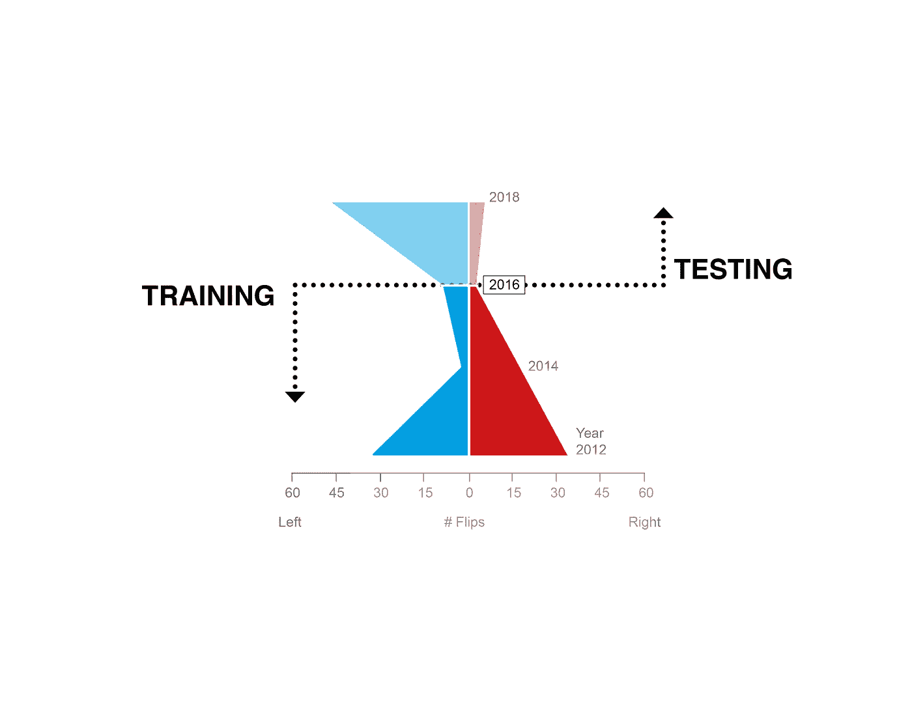

Anupama Garla 的模型限制

测试集的表现不如训练集准确的一个可能原因是包含 2012-2016 年地区变化的训练集和由 2018 年地区变化组成的测试集之间的数据划分。在翻转的次数和方向方面，训练测试组有所不同。一些额外的差异可以通过包括更多的功能来捕捉，如库克的党派投票指数和民意调查结果等。然而，考虑到从训练集中的上采样数据到测试集中的类不平衡的转变，该模型做得相当好。

Anupama Garla 的交互式 Tableau 仪表板，国会选区 Hex 地图来自 Daily Kos 的 Daniel Donner，可在此处获得。

上面的视频显示了根据分类模型的地区翻转可能性，以及映射到 Daily Kos 制作的美国修改地图上的 2018 年实际地区翻转。该地图也是可点击的，因此您可以看到每个地区的相关特征。

该地图将每个国会选区的大小绘制为具有相同的面积，表示根据美国人口普查，每个选区由大约相同数量的人口组成。这使我们能够看到更准确的结果分布，尽管在美国西部人口较少的地区产生了差距。

# 洞察力

还实施了一个决策树模型，以获得最有影响力的功能的排名，前 7 名如下:

**预测特征排名**

1.  $$$ —财务

2.翻转的历史

3.中等收入

4.第二大城市:人口的%

5.状态

6.最大的地铁站的人口比例

7.人口统计超参数—捕捉城市+多样化与农村+同质的比率

如果我们深入研究财务特征，我们可以看到它们的主要预测特征:

**金融特征排名**

1.  业务开支
2.  党委贡献
3.  个人单位化贡献
4.  总支出
5.  总作用

# 结论

竞选活动的运营支出是决定一个选区是否会翻转的最大因素。人口统计和地理因素也有影响，尽管没有专家让我们想的那么大。

仔细观察财务特征，他们的排名显示个人和党委的贡献确实有影响——但是党的贡献排名更高。在这项研究之后，我不得不同意伯尼·桑德斯“让公司资金远离政治”的运动。

翻转的第二大指标是历史上有争议的地区。这是有道理的，因为如果一个特定的地区是高度分裂的，这样或那样的一些投票可能导致翻转。如果一个地区的历史周转率很高，某一年没有发生变化，第二年很可能会发生变化——特别是如果更多的竞选资金投入到这个特定的地区。

翻转的跟踪指标都与人口统计和地理有关，中等收入和居住在第二大城市的人口比例超过了这些预测特征。后者很有趣，因为这意味着第二大城市的选民具有政治多样性，可以以某种方式被说服——第二大城市人口组成的选区越大——就越容易改变立场。然而，由该州人口最多的城市或人口第三多的城市组成的地区，其政治联系更加紧密。

该模型的预测特征排名为进一步的竞选策略提供了信息，而该模型本身在预测国会选区翻转的概率方面表现良好。一些超参数和附加功能的微调可能会带来更多的见解。

# 附录:探索性数据分析

这一部分深入到我开始这个项目时使用的数据集——翻转、人口统计和地理数据的累积历史。在这个项目的早期阶段，我研究了这些数据集的细微差别，以改进模型并更好地理解数据和我的结果。

下面是一张地图，显示了每个地区的整个累积翻转历史。一个地区最大的翻转次数是 7 次。

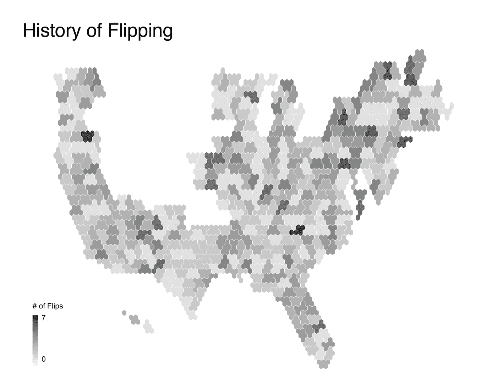

第二强预测因子:Anupama Garla 的累积翻转史

将上面的历史翻转图与下面的 2018 翻转图进行比较，我们可以直观地看到翻转与翻转历史之间的相关性。

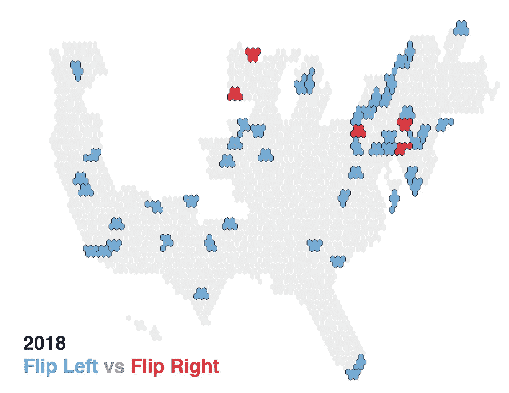

阿努帕马·加拉的 2018 年国会选区翻转

上面的地图——2018 翻转——组成了我的坚持测试集。下面的地图(2010 年至 2016 年)组成了我的训练集。我们可以观察到，地区变化的数量以及变化的方向每年都有很大的差异。2018 年与 2016 年截然不同，之前的选举要追溯到 2010 年。我认为，如果我们再往后看，我们会看到成交量和方向的周期性。

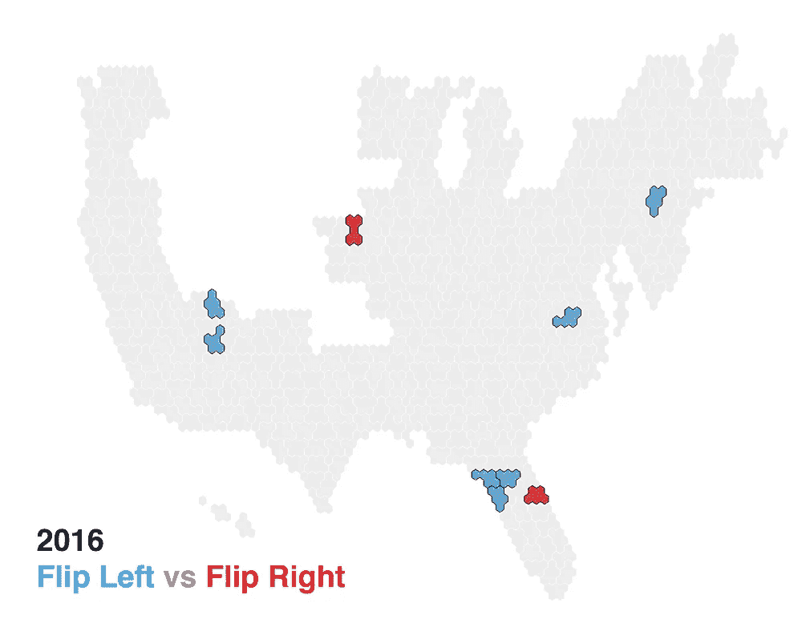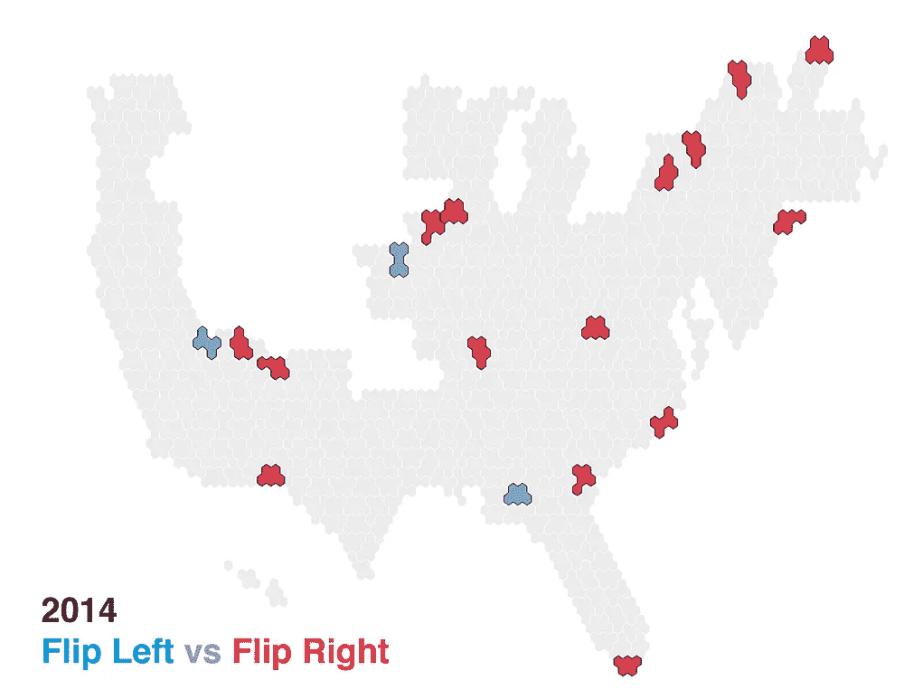

2016 年，2014 年国会选区翻转

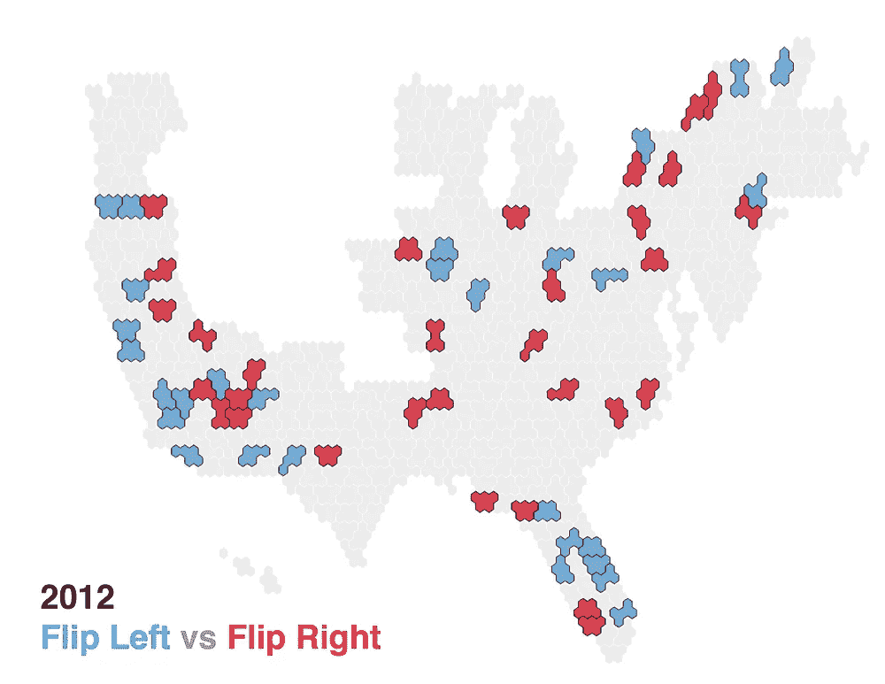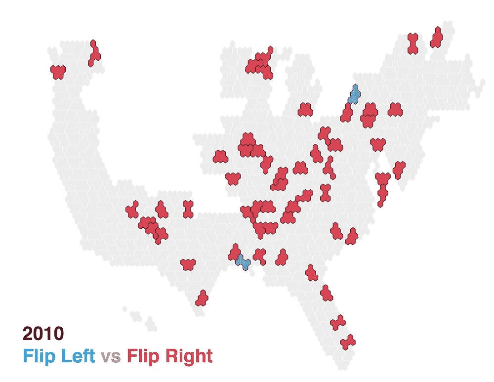

2012 年，2010 年国会选区翻转

对于这些数据集——翻转历史和人口/地理——我的模型表现极差，召回率约为 30%。检查我的配对图和我的模型特征重要性，我可以看到人口统计/地理特征根本没有通知我的模型。

基于我最初的假设，即地区翻转主要是由于该地区的人口统计和地理状况，我认为如果我尝试一种多类分类模型，将类分为 3 类(无翻转|向右翻转|向左翻转)，而不是 2 类(无翻转|翻转)，我的模型会表现得更好。在多类分类模型中，分数必须以不同的方式计算——我创建了一个自定义函数来计算召回率和精确度——并且 AUC-roc 在这里不能被引用。当我将数据集分成三类时，我的配对图显示了这三类之间的更多差异，所以我认为这是一个有希望的方向。我深入我的人口统计和地理特征来设计一些超参数。我在 tableau 中可视化了一些结对图发现，如下所示:

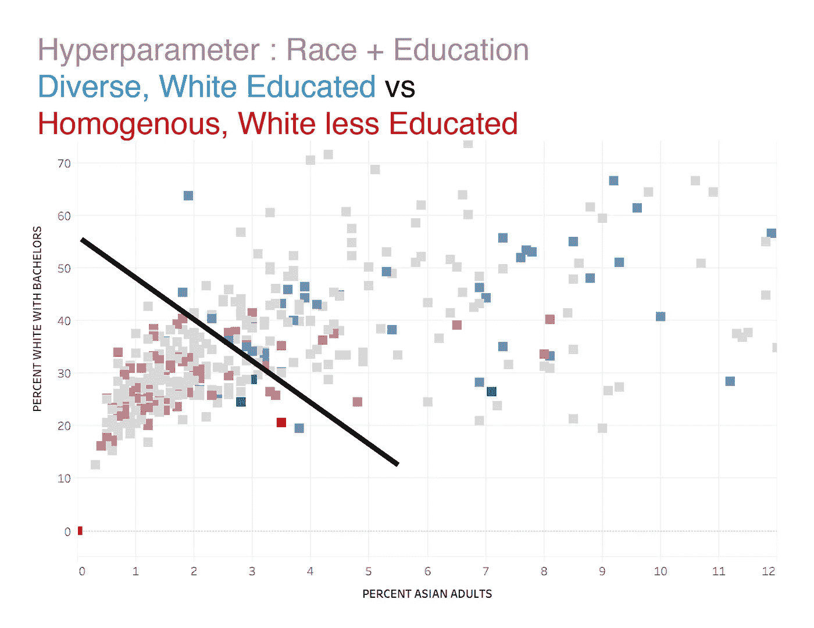

由 Anupama Garla 绘制的配对图

上面的图标识了向左翻转和向右翻转的两个集群。蓝色的左翻转群集通常有较高比例的亚洲人和较高比例的有单身汉的白人。右边红色区域的亚裔比例较低，有单身汉的白人比例也较低。这强化了受过教育的多样化人口向左倾斜和受教育程度较低的同质人口向右倾斜之间的二分法。

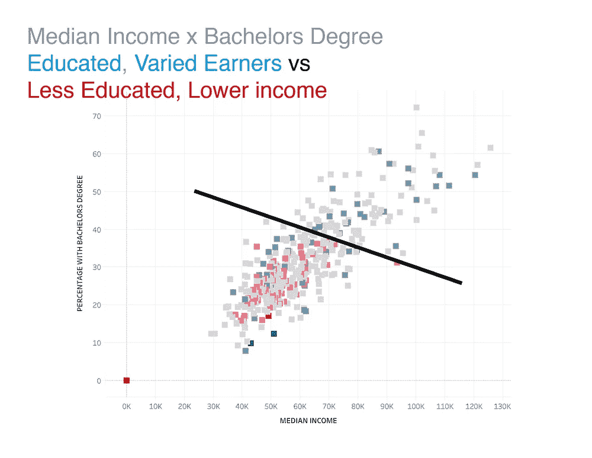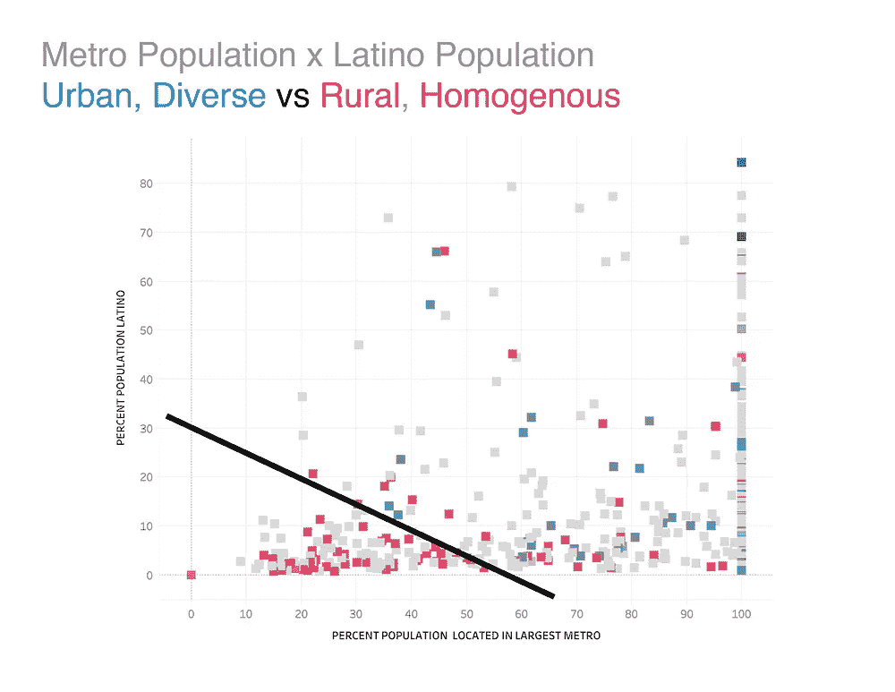

Anupama Garla 的配对图

在左边的图中，你可以看到一个主要由向右转的人组成的集群，他们通常比向左转的地区受教育程度低，收入也少。在右边的图中，我们可以看到一个主要由向右转的地区组成的集群，与向左转的地区相比，它的多样性和城市化程度较低。

这些图加强了我在项目开始时所做的假设。由于这个 EDA，我设计了超参数，这些超参数基本上捕捉了多样化的、受过教育的城市人口与同质的、受教育较少的农村人口的比率。然而，当我运行基于这种多类划分的模型时，我的结果并没有显著提高。我只是需要一个更有影响力的特征来捕捉数据集中的差异。我那精通政治的兄弟——他建议增加竞选财务数据——将模型提高了 33 个百分点。永远不要低估领域知识！

这个多类切线，虽然很有趣，也很有知识性，最后还是走进了死胡同，但是给我提供了宝贵的一课。对项目方法和设计的深入和反复思考对于获得有意义的结果是非常重要的。做到这一点的最好方法是走出你的头脑，与有知识的利益相关者交谈，或者甚至看看那些前人的工作——比如我的英雄，FiveThirtyEight 的 Nate Silver。