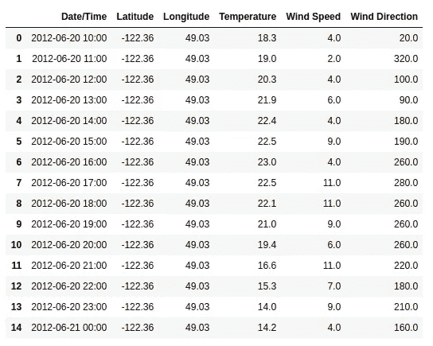
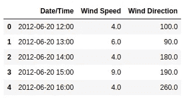
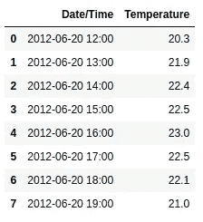

# 丢弃数据库

> 原文：<https://towardsdatascience.com/ditch-the-database-20a5a0a1fb72?source=collection_archive---------13----------------------->

如何使用自动气象站 S3 选择查询更智能，也许更便宜


马库斯·斯皮斯克在 [Unsplash](https://unsplash.com?utm_source=medium&utm_medium=referral) 上的照片

*亚马逊 S3 精选是亚马逊 S3 的一项功能，于 2018 年 4 月正式上市。通过使用亚马逊 S3 精选，可以在没有“经典”数据库的情况下运行应用程序，从而简化应用程序架构。*

任何处理数据的人都可能在其数据管道的某个点上使用过基于云的存储解决方案。就个人而言，亚马逊 S3 是我的首选，因为它使用相对简单，易于扩展，与其他 AWS 服务相结合，并且存储几乎任何文件类型的对象。

虽然亚马逊 S3 在存储数据集方面很棒，但像其他传统的基于云的对象存储解决方案一样，它不允许检索数据集的子集(即必须检索整个数据集)。例如，如果您需要 100 万行数据集中的前 1000 行，您必须检索整个数据集并进行本地过滤。这使得使用亚马逊 S3 作为应用程序的唯一数据库变得不切实际，特别是那些经常需要检索更大数据集的子集的应用程序(例如检索客户记录的 web 应用程序)。

输入亚马逊 S3 精选🙌

# 概述—亚马逊 S3 精选

亚马逊 S3 选择允许您使用简单的 SQL 表达式从亚马逊 S3 对象中提取您需要的数据。这是巨大的！！！

使用 S3 选择，您不再需要为了保留几行而检索整个数据集。相反，您可以使用经典的 SQL 表达式就地查询数据，并只检索一个子集，例如两个日期之间或高于某个价格的数据。目前，亚马逊 S3 精选支持 CSV、JSON 和 Apache Parquet 格式的对象。

> 通过减少您的应用程序必须加载和处理的数据量，S3 精选可以将大多数频繁从 S3 访问数据的应用程序的性能提高**多达 400%** 。—亚马逊网络服务

# 使用亚马逊 S3 精选进行简化

亚马逊 S3 精选最好的部分是它如何简化应用程序结构。在亚马逊 S3 精选之前，web 应用程序的典型结构可能如下所示。

*   *将数据存储在经典 SQL(即 MySQL 或 PostgreSQL)或 NoSQL(即 DynamoDB)数据库中，以便进行查询。*
*   *在持久对象存储器(即亚马逊 S3)中保存数据的备份副本*
*   *将新数据转移到亚马逊 S3，然后添加到数据库。*

使用亚马逊 S3 选择 web 应用程序的结构如下所示。

*   *将数据存储在亚马逊 S3，以便查询。*

**好多了！现在你可以只使用亚马逊 S3 来构建一个端到端的应用程序。它速度快，价格便宜，界面简单！👍**

# 示例—亚马逊 S3 精选

最近[我构建并部署了一个 web 应用程序](/building-a-dynamic-weather-download-app-1ce64a6c3e61)，让下载和可视化加拿大历史天气数据变得更加容易和快捷。这是我构建的第一个 web 应用程序，其中我没有使用经典数据库，而是直接从亚马逊 S3 存储和查询静态和动态数据。使用亚马逊 S3 选择，我能够快速方便地从我的动态仪表板中获取用户输入，将它们传递到选择表达式中，并只查询和检索请求的数据。

下面是一些示例数据和一个在亚马逊 S3 查询 CSV 并返回可以读入熊猫数据帧的 CSV 格式的函数。CSV 的亚马逊 S3 SQL 语法可能有点复杂。您可以使用列名或列索引进行查询，根据您选择的列名或列索引，SQL 表达式会有所不同。



示例“test.csv”

用于在亚马逊 S3 查询 CSV 并将数据解包为 CSV 格式的函数

## 如何按列名查询？

让我们使用列名在两个日期之间查询上面的数据集，并只返回日期、风速和风向的相应列。

使用列名在亚马逊 S3 查询 CSV



查询结果

## **如何按列索引查询？**

让我们使用列索引查询上面的数据集，当温度高于 20 摄氏度时，只返回日期和温度的对应列。

请注意，在 S3 选择中，索引从 1 开始(即 *s._1* ),而 Python 的索引是 0。通过使用“cast”命令将一种数据类型转换为另一种数据类型，确保您正在比较 SQL 表达式中的常见数据类型。如果我的温度数据是字符串格式，我将需要*" cast(s . 4 as float)>20 "*。

使用列索引在亚马逊 S3 查询 CSV



查询结果

## 如何查询表头名称？

让我们只查询上面数据集中的标题名称，这样我们就可以使用它们来追加到其他查询结果中，或者作为动态仪表板下拉列表的输入。在这种情况下，我将 *use_header* 设置为 *False* ，以便在第一行返回列名，并且使用 S3 选择限制特性将返回的行数限制为 1。

在亚马逊 S3 查询列标题 CSV

```
#  query result
['Date/Time', 'Longitude', 'Latitude', 'Temperature', 'Wind Speed', 'Wind Direction']
```

# 亚马逊 S3 精选的成本

亚马逊 S3 精选很便宜！以下是我的应用程序的启动成本明细(截至 2020 年 6 月)。

*   亚马逊 S3 对象存储—每 GB 0.023 美元(前 50tb/月)
*   亚马逊 S3 选择——每 1000 条选择命令 0.0004 美元
*   亚马逊 S3 数据传输—每 GB 0.01 美元(S3 →美国东部地区)

我在 S3 存储了大约 37 GB 的数据，每月执行近 100，000 条 SELECT 命令，每月从 S3 传输大约 50 GB 的数据。这使我每月的估计费用达到…1.39 美元！

# 结论

虽然亚马逊 S3 精选已经推出两年多了(在代码年，这是一个千年😆)这是一个简化应用程序的好工具，尤其是微服务框架。

查询愉快！