# 抛弃 AWS GUI 控制台

> 原文：<https://towardsdatascience.com/ditching-the-aws-gui-console-ac77f46a05fa?source=collection_archive---------60----------------------->

## 通过 AWS CloudFormation 将无服务器基础设施作为代码

## [GitHub 回购/源代码在此！](https://github.com/boscacci/isTheBryantParkLawnOpen.com)

# 2020–09–10

## 背景故事:

当我在时代广场的一家数据分析公司工作时，我经常在美丽的布莱恩特公园草坪上享用午餐。我可以查看 https://bryantpark.org/的草坪目前是否开放，但是 org 页面加载有点慢；里面全是我不在乎的图像。

因为这个原因(以及学习 AWS 的愿望)，我从一个 ec2 盒子上创建了一个愚蠢的[单一服务网站](https://www.wikiwand.com/en/Single-serving_site)，它只显示草坪是否开放。**你会去** [**是布莱恩特公园的草坪开点 com**](http://isthebryantparklawnopen.com/) **然后看这个:**


受[http://hasthelargehadroncolliderdestroyedtheworldyet.com/](http://hasthelargehadroncolliderdestroyedtheworldyet.com/)的启发

在科维德·疫情的萎靡不振中，我的[简陋的网站](http://isthebryantparklawnopen.com/)已经失修，这提供了进行一些翻新的机会。上一次我做这个的时候，我非常依赖于在 AWS GUI 控制台方法**、**中的**点击——这是我想要摆脱的行为。**

## 目标:

今天，我将着手**重新设计**这种(异想天开，可以说是“愚蠢”或“没人要求的”)服务，将其作为基于 AWS 的**无服务器基础设施**——利用 SAM CLI，使用 **CloudFormation** 进行配置，并依靠各种其他代码和基础工具。我想在不接触 GUI AWS 控制台的情况下做到这一点: **CLI 和脚本**全程！

## 架构流程图:

这里有一个我认为我会需要的服务的小地图:它都围绕着一个小数据库，一个 [s3 bucket 网站](http://isthebryantparklawnopen.com/)，和一些 AWS Lambda 函数。

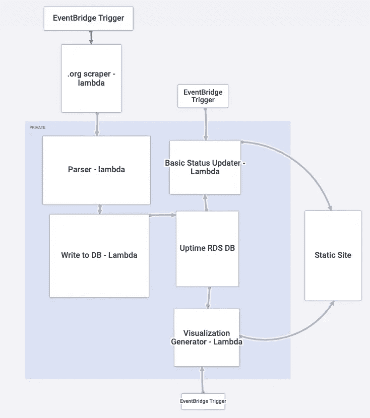

在我看来。以普莱狄卡为蓝本

# 如何使用每项服务:

## 云的形成:

*   从 **YAML 模板**中一次性提供以下所有服务
*   在版本控制中被跟踪；be **基础设施符合规范**
*   学习良好的 DevOps 实践(这个男孩在找新工作)

## RDS 数据库:

*   仓库我们的开放/封闭二进制草坪数据，加上最少的元数据
*   位于私有子网中，只有 Lambda 函数可以访问，从而不受公众影响
*   拥有大约 35，040 个数据点后，丢弃旧行。(任意…2 年)

## S3 水桶:

桶是对象存储容器。他们可以存储文件，也可以服务静态网站。我需要水桶来做以下事情:

*   主持人一个[愚蠢简单**静态网站**用 HTML/CSS/ES6 做成的](http://isthebryantparklawnopen.com/)
*   Lambda 函数的仓库代码包

## 路线 53:

*   至少给我们愚蠢的网站一个自定义域名

## EventBridge(前身为 CloudWatch):

*   在 [cron 时间表](https://en.wikipedia.org/wiki/Cron)上触发 Lambda 函数

## λ函数(I)至(V):

为了完成一些计算，无服务器功能即服务绕过了调试云服务器的成本开销。你可以让 AWS 管理服务器基础设施，并且只在你的代码实际运行时计费，由一些*事件*或*时间表*触发。以下是我需要的函数:

**I)刮刀:**

*   每半个小时，旋转一个无头浏览器，从 Bryant park . org 网站上获取一个原始的草坪状态字符串(和 F 数据，为什么不呢)
*   将收集的原始数据传递给后续的解析器函数

**II)解析器:**

*   接受来自刮刀功能的原始数据
*   将原始草坪状态字符串解析为二进制变量
*   生成其他有趣的元数据，如星期几和小时
*   将解析后的数据传递给 RDS 编写器

**III) RDS 编写器:**

*   从解析器函数接受干净的解析数据。
*   将新行写入 RDS 数据库

**IV)基本状态更新器:**

*   每半小时，读取 RDS 数据库的最后几行
*   如果草坪状态已经改变(这种情况将避免不必要的频繁 S3 推杆)，然后更新 S3 水桶网站的索引页面

**V) Viz 生成器:**

*   每天两次，将整个表加载到内存中，并运行一些聚合
*   用聚合数据生成 Plotly HTML 可视化
*   将这些图表推送到简单的 S3 网站的“统计”页面

# 通过云信息配置 VPC/数据库

是时候开始构建我们的云形成堆栈了。yml！这是我们通过 CloudFormation CLI 提交的文档，以完美协调的方式一次提供我们需要的所有资源。我一直在研究 AWS 上的[云信息文档](https://docs.aws.amazon.com/cloudformation/index.html)，想弄清楚这应该是什么样子:

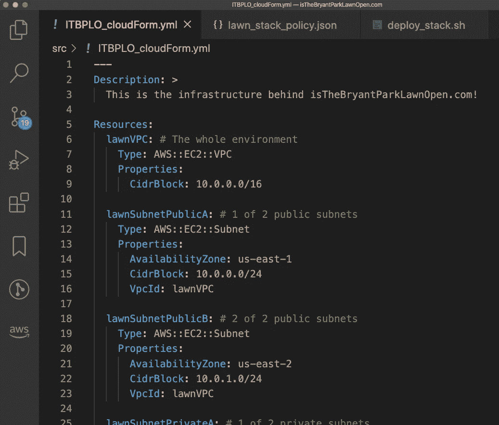

节选自我的第一个云形成模板

```
# Excerpts from the .yml, provisioning more resources...lawnDBsubnetGroup: # RDS DB needs a subnet group. This is it
    Type: AWS::RDS::DBSubnetGroup
    Properties: 
      DBSubnetGroupDescription: The two private subnets
      DBSubnetGroupName: lawn-DB-subnet-Group
      SubnetIds: 
        - !Ref lawnSubnetPrivateA
        - !Ref lawnSubnetPrivateB
```

我今天还没有机会测试和调试，但我已经开始为这个应用程序声明我的云基础设施(网络配置，安全规则，数据库实例)。建立我的网络的一个至关重要的资源是这个[关于](https://medium.com/@justanotherspyy/how-to-connect-your-lambda-function-securely-to-your-private-rds-instances-in-your-vpc-29789220a33)保持你的 RDS 实例私有，同时仍然给 Lambda RDS 访问，不牺牲 Lambda 的网络访问。

这其中的难点(私有子网 RDS +带 web 访问的 Lambdas)是[建立一个廉价的 NAT 实例(通过 ec2 AMI 的硬手动方式)](https://github.com/boscacci/isTheBryantParkLawnOpen.com/blob/master/src/CF_templates/2_lawnNATinstance.yml)而不是简单地在 CloudFormation 中提供一个昂贵的[预烤 NAT 网关。过去，走捷径让我付出了代价，以美元计。](https://docs.aws.amazon.com/AWSCloudFormation/latest/UserGuide/aws-resource-ec2-natgateway.html)

# 2020 年 9 月 11 日:部署试验和错误

我在反复构建这个云层结构。yml 模板(目前)只有一个新的 VPC、一些子网、安全组/子网组和一个 RDS DB——还没有 Lambda 函数或 S3 桶站点。

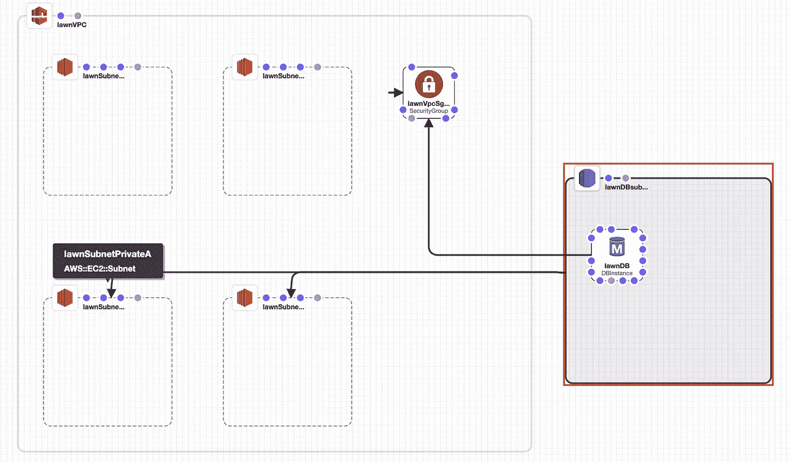

在自动气象站云形成设计器中绘制

部署此堆栈的初始尝试。yml 会导致错误，因为我不可能第一次就做对:

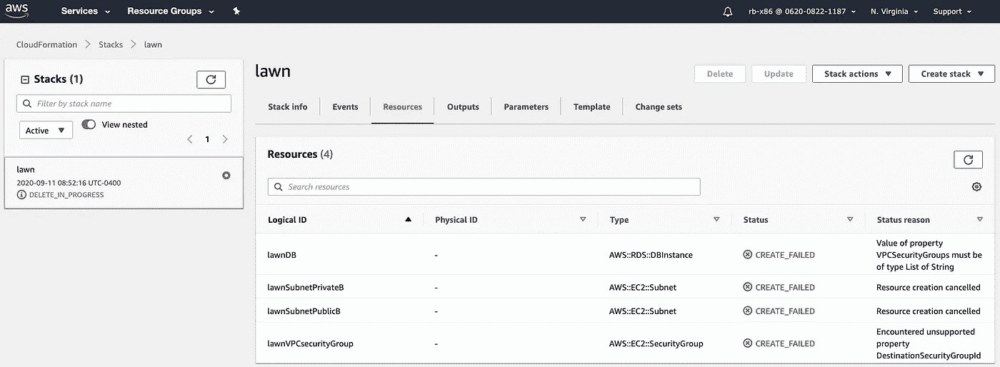

通过查看控制台以 GUI 方式检查错误，这有点作弊

好了，我们得到了一些合理的错误，例如，对于“lawnDB”资源(我的 RDS 数据库)，它没有启动，因为我得到了`Value of property VPCSecurityGroups must be of type **List of** String`。最初，我只给了它一个字符串，而不是字符串列表，这是我的错误。我将递归地纠正这些错误，并继续尝试验证/部署。我现在也很好奇 CloudFormation 中的`!ref`功能…

原来，[](https://docs.aws.amazon.com/AWSCloudFormation/latest/UserGuide/intrinsic-function-reference-ref.html)**`[**!ref**](https://docs.aws.amazon.com/AWSCloudFormation/latest/UserGuide/intrinsic-function-reference-ref.html)`[**函数**](https://docs.aws.amazon.com/AWSCloudFormation/latest/UserGuide/intrinsic-function-reference-ref.html) **是云生成**中必不可少的**。**例如，如果您提供一个 VPC 和一个子网进入其中，子网可能需要`!Ref`VPC 的逻辑名称(您在 YAML 中为其指定的名称)才能属于该 VPC。我的意思是:**

```
# Inside the CF stack .yml:
# See bolded text for relevant bitsResources:
  **lawnVPC**: # The whole big sandbox. Contains all infra for this app
    Type: AWS::EC2::VPC
    Properties:
      CidrBlock: 10.0.0.0/16
      Tags:
      - Key: Name
        Value: !Join ['', [!Ref "AWS::StackName", "-VPC" ]] lawnSubnetPublicA: # 1 of 2 public subnets
    Type: AWS::EC2::Subnet
    Properties: 
      AvailabilityZone: us-east-1b
      CidrBlock: 10.0.0.0/24
 **VpcId: !Ref lawnVPC**
      Tags:
        - Key: Name
          Value: lawn-Subnet-Public-A
```

**在掌握了 CloudFormation 模板之后，看起来我已经有了一个基础设施的雏形，只是一些网络组织垃圾和一个数据库:**

**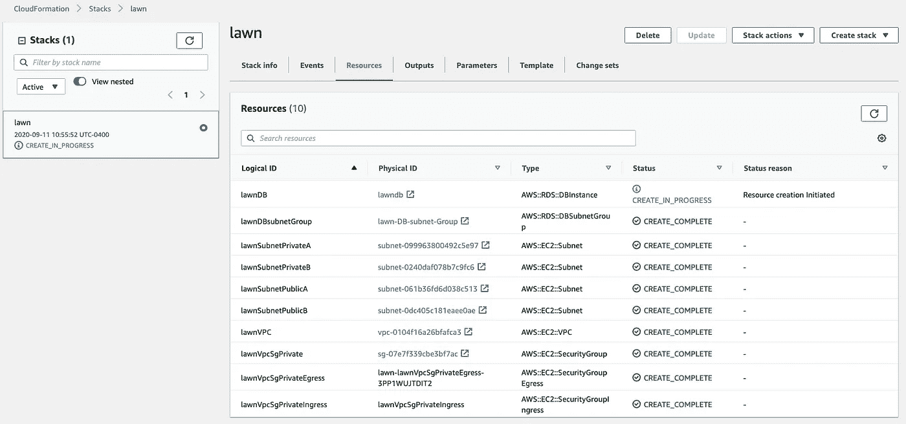**

**绿色的刻度让我的心在歌唱**

**这个。yml 已经变得很长了！有没有办法让我把它分开？[显然，是的](https://dev.to/thomasstep/cloudformation-exports-and-imports-1l1p)。我们可以在带有**输出的栈**之间嵌套 CF 栈或**输入/输出值。**我会的:**

**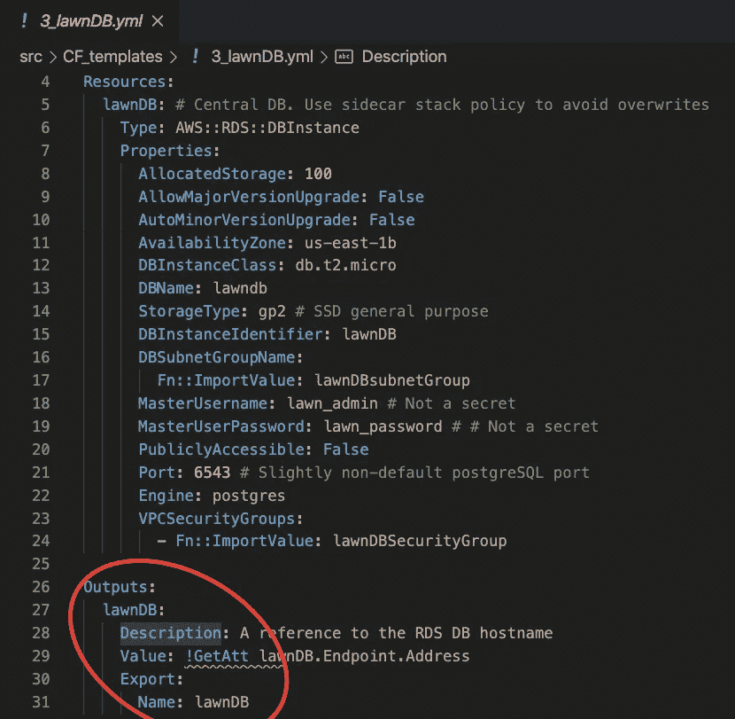**

**检查堆栈输出。其他堆栈现在可以引用这些值。**

**模块化 CloudFormation 模板感觉很好，就像我们将不祥的大 Python 模块分成几个一样。**

**接下来，我将尝试组装上面提到的 Lambda 函数。这是我第一次尝试通过 SAM CLI(和 docker)在本地调试 Lambda 函数的地方！**

# **2020 年 9 月 16 日:λ和云的形成**

**Lambda 到底如何适应这种云计算基础设施即代码模型？我将把它们放入它们自己的“堆栈”中，并给它们分配 IAM 角色，允许它们做像写 RDS 和相互调用这样的事情。回想起来，嵌套堆栈可能是一种更好的方法，因为现在我在这个 CloudFormation 区域中混淆了导出的变量名称空间。**

## **功能一:刮刀**

**我发现了一个方便的 [repo，它生成一个 lambda 函数，可以用一个无头的 selenium 浏览器](https://github.com/ChristopherDedominici/AWSlambda-python-scraper-generator)抓取网页。谢谢克里斯托弗。现在将它应用到我自己的 scraper 函数中，收集关于公园草坪的信息:**

****

**使用 AWS 的 [SAM(无服务器应用程序模型)CLI，我能够快速重用和调试这段代码，从。org 网站。是我的新果酱。](https://aws.amazon.com/serverless/sam/)**

## **功能二:解析器**

**这是将从。org 网站转换成二进制变量。我有一种感觉，这是我的“应用程序”中最不耐用的部分，因为我不知道这个粗糙的文本字段可能存在的值的范围。目前我只看到“草坪开放”和“草坪关闭”当新的可能值出现时，我会不断更新这个函数。好的方面是它有自己的 lambda 函数，有自己的日志和故障率。也许我以后会用 AWS SNS 设置短信故障通知。**

**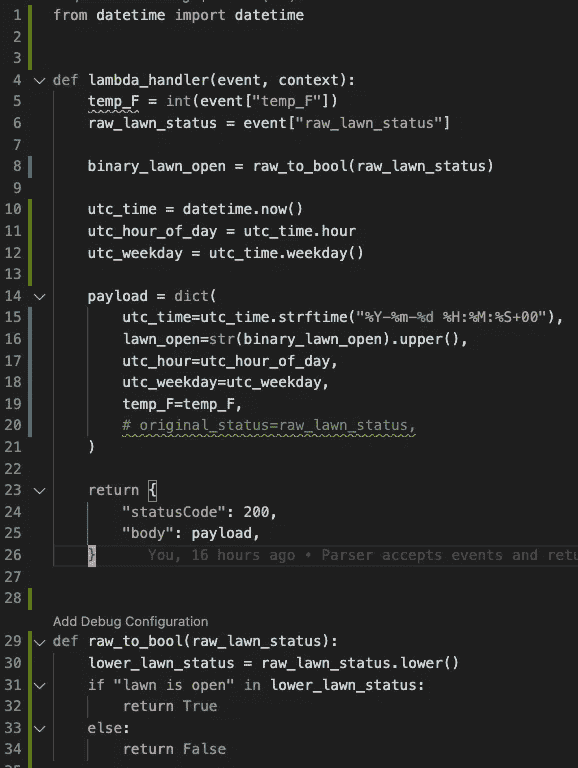**

**一个单独的 lambda 函数来解析原始字符串**

**顺便说一下，所有的原始[代码都在 GitHub](https://github.com/boscacci/isTheBryantParkLawnOpen.com) 上公开，如果你之前没有注意到的话！**

## ****功能三:RDS 写入器****

**最终，我决定让 RDS writer 函数按计划运行，并通过 boto3 同步调用子函数 I (scraper)和 II (parser ):**

**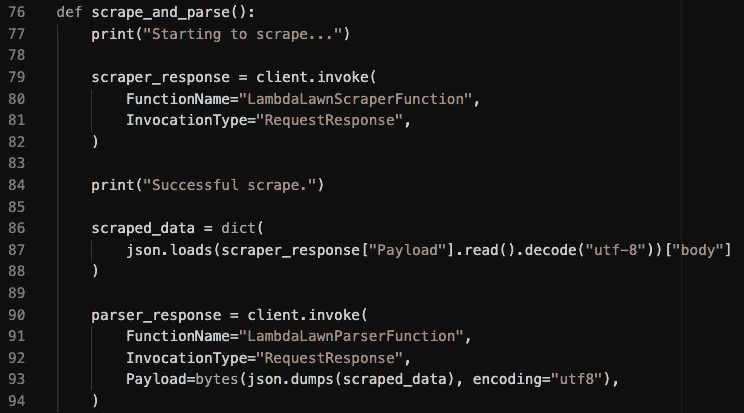**

**在 lambda 函数中调用 lambda 函数**

**这个 lambda 函数有**权限**来调用其他 Lambda 函数，并修改我们在 CloudFormation 模板中提供的 RDS 数据库。它最终负责获取新数据并将其写入数据库。我在某处读到过，确保父 Lambda 函数在其子函数完成工作之前不会超时是个好主意。**

## ****功能四:站点更新器****

**这个函数从数据库中读取数据，从两个可能的 HTML 文档中选择一个(基于二进制的“打开”或“关闭”状态),并将该文档推送到为我们的站点提供服务的 s3 存储桶:**

**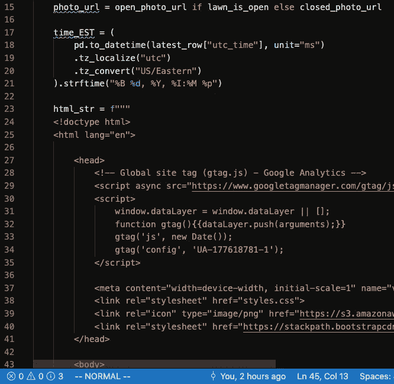**

# **2020 年 9 月 21 日:网站备份**

**现在，我们正在抓取数据，将数据存储到数据库中，并引用该数据库向静态的 S3 网站编写 HTML 我们拥有了一个活生生的 web 服务！**

**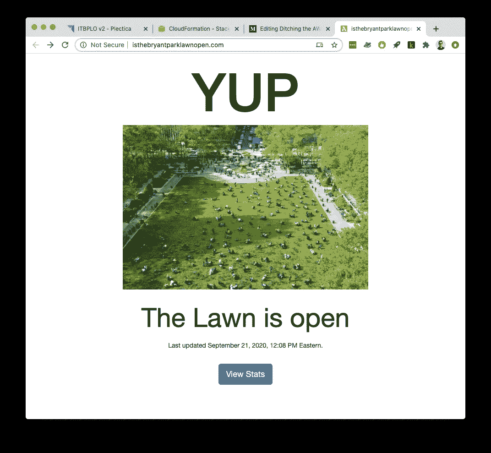**

**一个朋友让我注意到了 TerraForm，因为我一直陷在 AWS 粉丝的泡泡里，所以我不知道它的存在。对于任何对“基础设施即代码”感兴趣的人来说，TerraForm 似乎是下一个自然要学的东西(例如，在 AWS CloudFormation 或 Google Cloud Deployment Manager 之后)。**

## ****功能五:图形统计生成器****

**这个想法是建立一个小 Plotly 仪表板页面，显示按星期几和一天中的小时数汇总的草坪开放历史数据。**

**在我可以构建一个汇总统计页面之前，我会让我的 lambda 函数将大约一周的数据刮到 RDS 数据库中，同时我会申请工作、烹饪千层面和各种丰盛的汤，并玩《野性的呼吸》。**

**我将在 2020 年 9 月 28 日左右回到这个话题。**

# **2020 年 9 月 28 日:统计页面**

**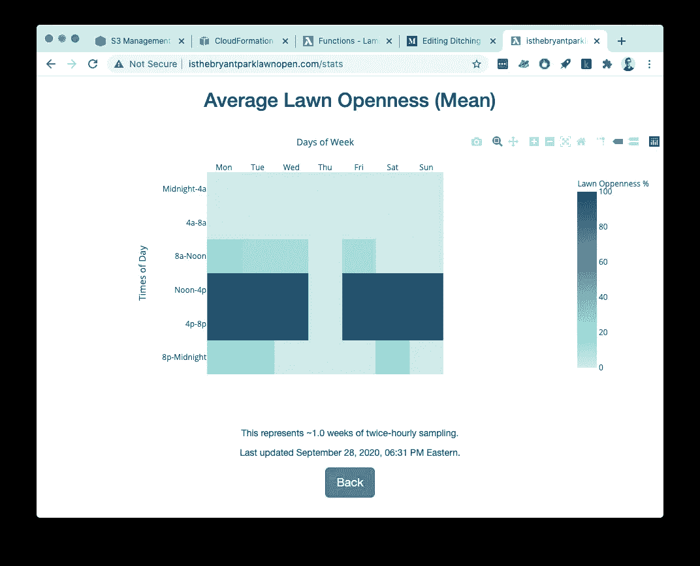**

**现在起来了！**

**简单的统计页面正在工作！目前，这只是一张根据我的 2x/小时采样显示布莱恩特公园草坪在一天和一周不同时间的历史平均开放度的热图。**

**为了添加这个页面，首先我编写了一个 lambda 函数，将我的 RDS SQL DB/table 完整地导出到 S3 桶中的一个. csv 文件中，这样我就可以下载它，并在 Jupyter 笔记本中对它进行试验。有时尽可能多地在本地调试真的很有帮助，因此在这个小项目中尝试 SAM。**

**然后，我修改了 Jupyter 生成的工作 viz 生成器代码，使其返回到 [Lambda 函数(V)中，该函数每 12 小时更新一次新的“stats”页面](https://github.com/boscacci/isTheBryantParkLawnOpen.com/blob/master/src/lambda_funcs/4_viz_gen/lawn_viz_gen/app.py)。**

**让我困扰的是再加一个。我的 s3 存储桶站点的 HTML 页面没有自动使该页面在浏览器中“可加载”。当我在调试时，我的浏览器一直试图下载。HTML 文档到我的本地驱动器，而不只是呈现它。烦人！**

**起初，我认为这是因为 S3 网站不支持服务器端脚本，也许我不小心包含了一些服务器负责的代码..？但是没有。网络搜索让我意识到，我只需要确保在上传(put)时包含 s3 对象的“内容类型”,以便它能被正确地服务:**

**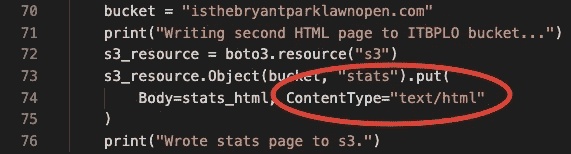**

**包括 boto3 AWS Python API 中的 ContentType 标记，用于网页渲染**

# **结论**

**有了这些，我觉得我已经准备好去做一个不那么俗气的项目了！在未来，我想研究一下:嵌套的 CloudFormation 堆栈，远离 HTML/CSS/ES6 (TypeScript？节点？反应？)，并在我未来的更多项目中利用一些机器学习(回归/分类)，这是我已经非常熟悉的东西。我也很好奇卡夫卡/SQS、DynamoDB，以及管理用户凭证和会话；在写这本书的时候，我对这些东西知之甚少。**

**我最兴奋的是有机会解决一些现实世界的问题！如果你认为我可以开发一些软件，让你的生活(重复的、烦人的部分)变得更容易，或者如果你自己正在构建一些东西(开发团队？)你认为我能帮上忙。**