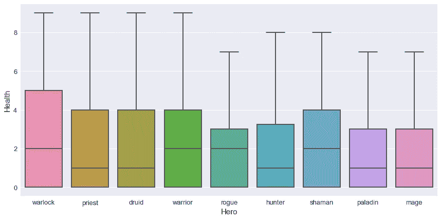

# 从数据角度看炉石

> 原文：<https://towardsdatascience.com/dive-in-hearthstone-from-a-data-perspective-e3c0b2851686?source=collection_archive---------39----------------------->

## 从牌组和卡片的棱镜看炉石

你好，在这篇文章中，我将详细介绍几周前我在炉石游戏上建立的一个数据集。

# 炉石科扎科！？

[炉石](https://playhearthstone.com/en-us/new-to-hearthstone/)是由[暴雪](https://www.blizzard.com/en-us/)在 2013 年制作的一款在线卡牌游戏，也就是说使用了暴雪在 1994 年开始的专营权[魔兽](https://en.wikipedia.org/wiki/Warcraft)的传说。我就不详细挖掘这个游戏的起源了，但是我会邀请你来看这个[电竞一言以蔽之](https://www.youtube.com/channel/UCIL2KOFwGu9XMlzlthSpkqw)的视频。

这个游戏的原理相当简单；你从 9 个可用英雄中挑选一个开始；每个英雄都有一个特殊的能力，并且可以使用一些特殊的卡片。

如果你想了解更多，你可以在这里找到更多关于英雄们的细节。

在选择英雄之后，玩家必须遵守一些规则来建立他的牌组:

*   从三个类别(仆从、能力和武器)中选择 30 张牌
*   它不能包含两次以上相同的卡
*   它不能包括专属于另一个英雄的卡片

在那之后，当一场炉石比赛开始时，每个对手都有 30 个生命指示物，要使用你在每回合结束时或使用某些特定牌时获得的法力来出牌。

我不想输入太多比赛进程的细节，但我会邀请你观看这个解释炉石原理的视频。

我喜欢这个游戏，我在 2013 年它发布时开始玩它，我觉得它很有趣。我认为我在炉石游戏中更像是一个休闲玩家，因为我只是在几周内的暴雪会后定期重启游戏，重启总是很痛苦，因为游戏的元数据改变了，等等。

几年前，我发现了这个关于炉石的 [Kaggle 数据集](https://www.kaggle.com/romainvincent/history-of-hearthstone)，一些卡牌是在一个叫 [HearthPwn](https://www.hearthpwn.com/) 的网站上刮出来的。

这是一个围绕游戏(卡牌、卡片、比赛)分享的社区，我强烈推荐你去看一下。

所以就数据而言，Kaggle 上的数据集包含大约 360000 副牌。尽管如此，它还是老了，所以我决定建立一个系统来收集 Hearthpwn 的数据(与我的 [CrossFit 文章](http://the-odd-dataguy.com/crossfit-games/)中的过程相同，提醒一下，当你在刮的时候，不要做傻事，不要让服务器过载等等)。).

**我收集了大约 800000 副牌和牌上的所有信息(我不分享数据集，因为我不是所有者)。**

# 卡片和副牌概述

这个数据集中有趣的一点是在网站上制作了一些套牌的用户(贡献者)的数量以及他们正在制作多少套牌。在这个箱线图中，有贡献者建造的甲板数的四分位数(不包括传单)。

大多数用户只生产一个甲板(0-50%)，其中 25%的用户生产 1-3 个甲板，在最后一个四分位数，他们生产 3-6 个甲板。我根据每个玩家建造的甲板数量做了一些分类。

现在让我们来看看每周发行的套牌。

大部分重要的内容发布之后是一批 Hearthpwn 上的新甲板(感谢明显船长)。

从英雄的角度来看，一些偏好正在浮现。下图是英雄内置函数的套数。

前三名的英雄似乎是牧师、法师和圣骑士，而且没有一个非常有统治力的。

从副牌中的牌的角度来看，我对副牌中的牌的类型做了一个简单的评估。

该图可能不清楚，但其目的是说明一副牌中的牌的重新分配，该图显示，例如，50%的牌具有:

*   0 件武器
*   0 到 10 个咒语
*   0 到 17 个小黄人

正如我们所看到的，大部分的卡牌都没有使用武器，而且拥有更多的小喽啰似乎是比法术更好的计划。

现在让我们来看一下更高级的数据分析。

# 英雄 VS 套牌 VS 卡片

从卡片的角度来看，英雄们在相关卡片的重新分配上有一点不同。

大多数武器都与战士/盗贼/猎人/萨满和圣骑士有关，每个英雄都有大约 150 张卡片。现在让我们从一个奴才的角度来看一下对套牌内容的评价。

术士似乎是那种需要比普通玩家拥有更多的爪牙的英雄。让我们从法术的角度来看。

术士是从群众中崛起的(不是跟着跟班潮流)。最后，让我们看看武器方面。

在最后两个图表中，我们展示了在卡中拥有武器的特定英雄身上武器的用法。

我将花一些时间来分析与特定英雄相关的卡片的更多详细信息。先来分析一下卡的成本。

我们可以看到，费用上的第一个四分位数对于所有的英雄都是一样的，费用值是 2(快速发挥)。除了德鲁伊，第二个四分位数的牌的成本在 2 到 3 之间。在第三个四分位数中，英雄身上发生了一些分裂:

*   成本 5(术士/牧师/战士/猎人/圣骑士/法师)
*   费用 4(盗贼/萨满)
*   成本 6(德鲁伊)

从一般的角度来看，这个分析说明了基于英雄能力的游戏性的不同。现在让我们来看看卡牌的宠物一面的攻击/生命值。

在小黄人(生命值/攻击值)方面，英雄之间的 boxplot 没有显著差异。

现在让我们看看取决于英雄的总费用/攻击/生命值。

从成本角度来看，我们可以看到，术士的价值范围很广，从 20 到 220 左右。大约在第三个四分位数，所有的英雄都有接近 100 马纳斯的中间值(也许对于建造一副牌来说是个不错的选择)。现在让我们看看牌组的攻击点。

从攻击的角度来看，德鲁伊拥有最广泛的价值范围(0-122 左右)，但是一副牌的总攻击中值似乎在 50 点左右。让我们看看甲板的健康状况。

在这种情况下，对于所有的英雄来说，生命值的范围是相当大的，但是我要说的是中间值大约是 70 点。

这种分析是非常高层次的数据集，并且似乎一般在 Hearthpwn deck 上构建:

*   大多数包含少于 17 个爪牙/ 10 个法术/ 0 件武器
*   这副牌的平均成本大约是 100 法力值
*   副牌的攻击中值约为 50 点
*   甲板健康的中位数大约是 70 分。

除了这些发现，所有这些数据给了我一些想法。

为什么不建立一个卡片推荐系统？

# 如何建立一个(简单！)炉石卡牌推荐

老实说，这不会是我要做的最疯狂的推荐系统，但是让我们从小处着手。对我来说，最直接的推荐系统是“最受欢迎的商品”推荐系统。

每个英雄(以及所有套牌中)的卡片使用是这个推荐器的核心。在下表中，我为每个英雄制作了前 25 张卡片(但是你可以在这个[谷歌电子表格](https://docs.google.com/spreadsheets/d/1YvMwWZNHAyL2PW1CPBGC7OEmZddiSZvFChXx8etgcsU/edit?usp=sharing)上找到所有卡片的排名)。

我计划使用这个数据集作为推荐系统的文章来源。就过程/算法而言，机器学习领域令人兴奋，关于这个主题的一本好书是 P [金·福尔克](https://www.manning.com/books/practical-recommender-systems)的实用推荐系统。

老实说，这是一本关于这个主题的极好的书，我想我会把它作为我未来文章的框架。

敬请关注，不要犹豫，给一些反馈。

*最初发布于 2020 年 1 月 15 日 http://the-odd-dataguy.com***。**