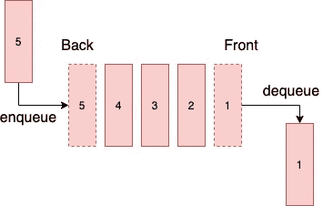
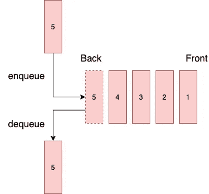
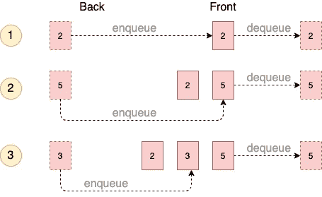
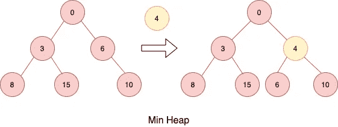

# 深入研究 Python 中的队列模块——它不仅仅是 FIFO

> 原文：<https://towardsdatascience.com/dive-into-queue-module-in-python-its-more-than-fifo-ce86c40944ef?source=collection_archive---------14----------------------->

## 多线程的良好候选


micha Parzuchowski 在 [Unsplash](https://unsplash.com/) 上拍摄的照片

队列是一种非常实用的数据结构。通常与*栈*、*数组*、*链表、*等*线性数据结构*相比较。线性结构与其他结构的不同之处在于添加和删除发生的位置。

队列数据结构有三种类型: **FIFO、LIFO** 和**优先级队列**。Python 中的队列模块实现了所有这些类型。此外，它在**线程编程**中也非常有用，这使得这个模块更加闪亮。

在本文中，我将首先帮助您更新关于数据结构的知识，并学习如何使用模块`queue`。然后我将向您展示如何使用`queue`来解决 2 个不同的多线程问题。最后我会说说这个模块的利弊。

## 数据结构

在讨论一些高级特性之前，让我们先来讨论一下队列数据结构，并学习如何使用该模块来创建一个“简单”的队列。

***先进先出——先进先出***

这是队列的基本类型。首先插入的元素将首先被删除，这类似于现实世界中的等待列表。越早加入名单，你就能越早得到音乐会的门票。



先进先出([高](https://medium.com/u/2adc5a07e772?source=post_page-----ce86c40944ef--------------------------------))

Python 模块提供了实现 FIFO 队列的`queue.Queue()`和`queue.SimpleQueue()`。`queue.SimpleQueue()`是 Python 3.7 中的新特性。它们之间有两个不同之处:

1.  `SimpleQueue()`线程编程中不做任务跟踪。线程编程将在后面讨论。
2.  `SimpleQueue()`是一个无界 FIFO 队列，而`Queue()`可以有一个上限。在这两个类中，如果队列为空，`get()`操作将被阻塞，直到新元素被插入。在`Queue()`中，如果队列已满，`put()`操作也将被阻塞，直到元素被移除。这种情况绝不会发生在`SimpleQueue()`身上。根据 [Python 文档](https://docs.python.org/3/library/queue.html#queue.SimpleQueue)，可以在`get()`和`put()`中使用`block=False`来禁用该块，然后你会立即收到一个`queue.Full`和`queue.Empty`异常。

[queue-fifo.py](https://gist.github.com/highsmallxu/31e37fde0763a253a1dfd10d6daba255)

***后进先出法***

LIFO 队列还有一个名字:Stack。最后插入的元素将首先被移除。这就像超市的货架一样。人们通常会拿第一排最近添加的项目。



后进先出([高](https://medium.com/u/2adc5a07e772?source=post_page-----ce86c40944ef--------------------------------))

这在`queue.LifoQueue()`类中实现。除了移除元素的顺序之外，界面与`queue.Queue()`相同。如果您将结果与之前的结果进行比较，您应该会看到打印结果的差异。

[queue-lifo.py](https://gist.github.com/highsmallxu/ee9bf9cd726c8483720d89a227b47deb)

***优先级队列***

顾名思义，优先级队列赋予队列中的每个元素一个优先级。它首先弹出优先级最高的元素。在下图中，元素 5 具有最高优先级，因此它将是情况 2 和 3 中弹出的第一个元素。



优先队列([高](https://medium.com/u/2adc5a07e772?source=post_page-----ce86c40944ef--------------------------------))

现在的问题是 Python 如何决定优先级？在队列模块中， [**最低值的条目首先被检索**](https://docs.python.org/3/library/queue.html#queue.PriorityQueue) 。该值越低，其优先级越高。那么在前面的例子中，2 实际上比 5 具有更高的优先级。这是因为 Python 优先级队列内部使用了 [**最小堆队列算法**](https://docs.python.org/3/library/heapq.html) 。最小堆的一个特性是最小的元素是第一个元素。

堆实际上是一棵二叉树，其中节点的值小于其子节点的值。当一个新节点被推送到树中时，树将被再次排序。根节点总是下一个要检索的元素。`push()`和`pop()`操作的时间复杂度分别为 O(log n)和 O(1)。



闵堆([高](https://medium.com/u/2adc5a07e772?source=post_page-----ce86c40944ef--------------------------------))

[queue-priority-simple . py](https://gist.github.com/highsmallxu/ad7685a0ec174820ba2cd743bdbb295e)

优先级队列不仅适用于数字，也适用于复杂的数据类型，如*元组*或定制类，只要对象是可比较的。为了使一个类对象具有可比性，你需要实现几个丰富的比较方法。更简单的方法是使用`[@dataclass](/understand-how-to-use-namedtuple-and-dataclass-in-python-e82e535c3691)`，dataclass 可以用 config `[order=True](https://docs.python.org/3/library/dataclasses.html#module-level-decorators-classes-and-functions)`为你实现这些方法。

在本例中，对象首先按*键*排序，然后按*值*排序。

[queue-priority-advanced . py](https://gist.github.com/highsmallxu/853ab436ab3cb6e2de68edcd3c9a2e4a)

## 线程编程

队列数据结构有很多应用。一个众所周知的用例必须是消息队列，其中我们有一个生产者和一个消费者。生产者和消费者通常位于不同的线程中。幸运的是，`Queue()`类有一个线程安全的实现，带有所有需要的锁定机制。因此，来自不同线程的生产者和消费者可以安全方便地使用同一个队列实例。

本质上，队列存储了许多要完成的“任务”，线程可以将任务插入队列，并在任务可用时从队列中取出任务，然后完成任务并返回进行下一个任务。

如果你是 Python 线程的新手，我强烈推荐你阅读 Real Python 的*Python 线程介绍*。这是一篇非常好的文章。

[](https://realpython.com/intro-to-python-threading/) [## Python 线程介绍——真正的 Python

### 立即观看本教程有一个由真正的 Python 团队创建的相关视频课程。和书面的一起看…

realpython.com](https://realpython.com/intro-to-python-threading/) 

好的，我假设你已经阅读了这篇文章，并且很好地理解了`threading`模块在 Python 中是如何工作的。让我们把它与`Queue()`课结合起来。我在这里举了两个例子。它们是略有不同的用例。

***例 1*** :创建一个图片 URL 队列，用多线程“并行”下载那些图片。(如果你不明白我为什么在这里加引号，请阅读上面的文章)

我将在这个例子中使用`save_image`函数。

```
def save_image(id, url):
    with open(f'pic{id}.jpg','wb') as image:
        response = requests.get(url, stream=True)
        for block in response.iter_content(1024):
            if not block:
                break
            image.write(block)
```

每个`Thread`对象都有启动线程的`start()`方法，还有通知主线程等待直到线程 x 完成运行的`join()`方法。我们可以这样解决问题:

[download-images-1.py](https://gist.github.com/highsmallxu/5f2f22aeba1ec0cf5e8682a1661f876b)

由于`Queue()`是为多线程设计的，它还提供了 [2 个方法](https://docs.python.org/3/library/queue.html#queue.Queue.task_done)，支持任务跟踪:`Queue.task_done()`和`Queue.join()`。`Queue.task_done()`表示队列中的一个任务已经被处理，通常在`get()`之后调用。`Queue.join()`类似于`Thread.join()`，它将阻塞主线程，直到队列中的所有任务都被处理完。但是你不必创建一个工人列表`workers`并在最后做一个循环来加入每个线程，只需做一个单独的`queue.join()`。让我们检查一下代码。

[下载-图片-2.py](https://gist.github.com/highsmallxu/9d3b6f21db4eb7f330ea12c0963d9d86)

***例 2*** :创建一个消息队列，一个生产者，一个消费者。来自不同线程的生产者和消费者能够与同一个队列实例进行交互。生产者将发送一个警告消息告诉消费者停止这个过程。

在示例 1 中，我们让 10 个不同的线程执行相同的功能。但是在这个例子中，两个线程正在做完全不同的工作。由于 Python 线程中没有真正的“并行处理”，所以一个线程将首先完成这项工作。在这种情况下，首先触发生产者线程，然后触发消费者线程。您也可以在结果中看到这种行为。

如果我取消第 9 行的注释，结果会是什么？想想吧！😄

[生产者-消费者-队列. py](https://gist.github.com/highsmallxu/9832cc9531ba75699e3f939cb08277a3)

如果我在每个`put()`操作之前暂停生产者线程，那么我们将更清楚地看到生产者和消费者之间的交互。

```
Insert element 0
Retrieve element 0
Insert element 1
Retrieve element 1
Insert element 2
Retrieve element 2
Insert element 3
Retrieve element 3
Insert element 4
Insert sentinel
Retrieve element 4
Receive SENTINEL, the consumer will be closed.
```

## 结论

**`**queue**`**的一个明显优势就是它的线程安全特性**。但我们不能把这种便利视为理所当然。如果我们没有线程安全`queue`会发生什么？如果我想在多个线程之间共享一个字典或者一个定制的类对象怎么办？**

**对于初学者来说，他们可能会遇到[比赛条件](https://realpython.com/intro-to-python-threading/#race-conditions)的问题。同样，[同一篇文章](https://realpython.com/intro-to-python-threading/#race-conditions)有一个关于竞态条件的非常直观的例子。基本上，相同的值不会在线程间同步。一个解决方法是使用`threading.Lock()`。但是它需要一些额外的代码和额外的注意力来控制线程。**

****另一个优势是避免潜在的内存爆炸**。如果生产者的工作速度比消费者快得多，那么任务将被存储在“管道”中，直到到达内存边界。在这种情况下，`maxsize`属性可以避免这个问题。**

**`**queue**` **也有助于程序减少繁忙的等待。**程序不需要一直试图从“管道”中拉东西，但是线程会被阻塞，直到数据可用。**

**同时，我们也应该理解`queue`的局限性。`queue`使用多线程，所以程序不会因此运行得更快。另外，`maxsize`指的是队列中的项目数，而不是内存大小。所以，还是有可能达到极限的。**

**我希望你喜欢这篇文章！如果你有任何想法，请在下面留下你的评论。**

## **参考资料:**

 **[## 队列——一个同步的队列类——Python 3 . 8 . 3 文档

### 源代码:Lib/queue.py 该模块实现了多生产者、多消费者队列。它在…方面特别有用

docs.python.org](https://docs.python.org/3/library/queue.html)**  **[## heapq -堆队列算法- Python 3.8.3 文档

### 源代码:Lib/heapq.py 这个模块提供了堆队列算法的实现，也称为…

docs.python.org](https://docs.python.org/3/library/heapq.html)**