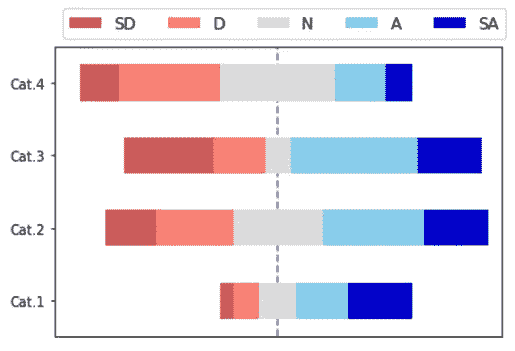
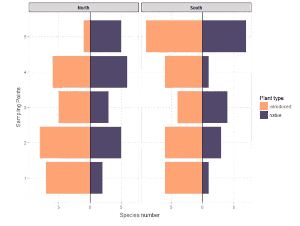
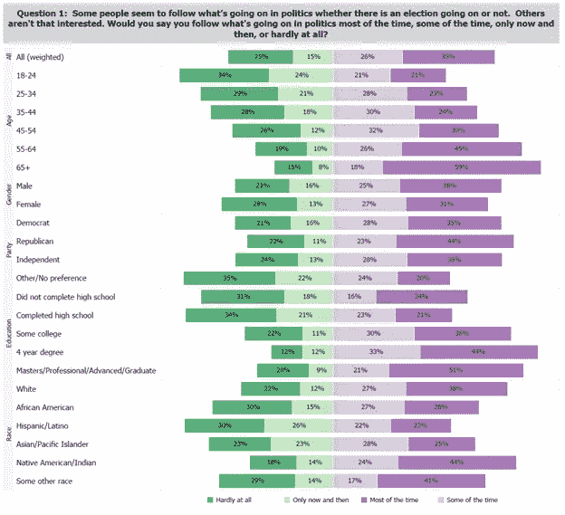
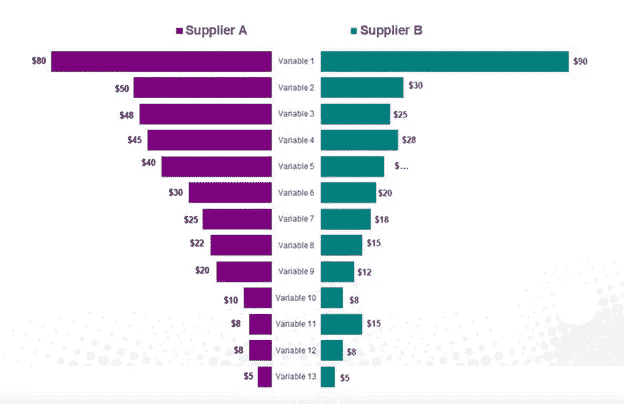
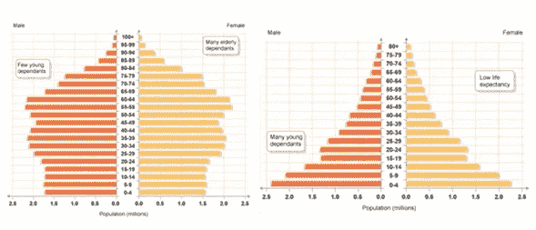

# 背离棒线，为什么&如何

> 原文：<https://towardsdatascience.com/diverging-bars-why-how-3e3ecc066dce?source=collection_archive---------18----------------------->

## 用分歧讲故事

图片来自 [Unsplash](https://unsplash.com/)

术语 **divergent** 来自拉丁语，表示分离或不同。它是意见的不一致、不一致、差异、交叉和争论的同义词。它意味着对某一特定问题的不同意见或分歧。它还用于表示这些问题之间的差异正在增加。自然，必须有一些视觉表现来显示这一方面是人类的特征。**分叉棒线**是最适合此目的的图表。

图 1:发散堆积条形图，SD:强烈不同意；d:不同意；n:没意见；答:同意；山:非常同意。图片作者。

**为什么**:发散条形图是为了方便多个类别的**比较**。它的特殊设计有助于**对比特定类别中的数值**。它的主要应用是正确显示问卷或调查的结果，尤其是那些使用 Likert 量表的结果。它能让我们快速想象出那些不利的、不想要的或消极的积极的、想要的或正面的反应。

**如何操作**:*传统的*变体由两个水平条组合而成，其中一条从右到左，另一条从左到右，两者都从一个公共的垂直基线开始，通常位于图表的中心。与所有条形图不同的是，每个条形的长度与其要显示的数值成比例。每个条形代表一个类别，它们之间通常留有一些空间。

发散条的最佳编码是当只有两个备选项需要比较时。L. Verde Arregoitia 使用该图“代表峡谷不同斜坡上的两个平行植被横断面，其中在五个采样点记录了本地植物和外来植物”(#1)。这张图表清楚地显示了引进植物和本地植物在物种数量上的对比。这些类型的图表也被称为双边，对立，滑动，或双向条形图。

图 L. Verde Arregoitia 使用的分叉棒线，来源:(#1)。

通常的做法是使用不同的颜色和不同的颜色强度来区分向左的线条和指向另一侧的线条。基线左侧的值不一定表示负值，但通常是不需要的或不令人满意的响应。还可以方便地将条形按升序或降序排列，以便于讲故事。

最普遍的变体是**发散堆积条形图**(图 1)。它们是水平堆叠条形图的延伸，增加了一条垂直基线。每个条形被分成一个接一个堆叠的水平矩形段。由线段指示的数值可以是绝对值或百分比(相当于单个堆积条形图与 100%堆积条形图，#2)。

发散堆积条形图广泛用于显示通过李克特量表分析的调查结果。当被不同的[人口统计类别](https://smallbusiness.chron.com/examples-demographics-65678.html)分开时，他们可以比较受访者的回答。显示有利或有利结果的线段通常显示在基线的右侧，而代表不利或不利结果的线段则放在中心线的左侧。在某种类型的中性反应的情况下，它位于中心基线之上。

李克特量表是社会心理学家[伦西斯·利克特](https://en.wikipedia.org/wiki/Rensis_Likert)在 1932 年的博士论文中提出的。当调查的参与者被咨询以对他们对咨询项目的同意程度进行分类时，使用它。最常用的量表包括以下五种回答备选:**强烈不同意、不同意、中立、同意、强烈同意。**虽然 5 点李克特量表是最常见的，但其他作者包括了具有不同数量响应的其他量表(图 4)，甚至还有仅包含两个选项(如有趣和不有趣)的语义差异量表。视觉标度和表情符号也被用作指示备选方案的非文本方式(图 3)。

图 3:李克特量表的表情符号，来源:(#3)。

下图显示了 2016 年总统大选前在美国进行的一项调查结果(#4)。该调查涉及不同人口类别对选举进程之外的政治的态度:年龄、性别、政党、教育水平和种族。有四种可能的回答:两种赞成永久参与政治，两种不愿意。可以看出，与婴儿潮一代和老年人相比，年轻人对政治持不情愿的态度。受教育程度也是如此:51%拥有大学或更高学位的人大部分时间都对政治感兴趣，而最不感兴趣的是那些没有完成高中学业的人。发散堆积条形图无疑是一种非常有效的可视化策略，可以在相对较小的空间内显示大量信息，便于比较、对比和讲述故事。观察到颜色和颜色强度的适当使用来区分四个备选方案。

图 4:由分叉条表示的调查响应。来源:#4。

理查德·黑贝格(Richard Heibegger)和内奥米·罗宾斯(Naomi Robbins)在他们 2011 年的论文《绘制李克特和其他评级量表》(Plotting Likert and Other Rating Scales)中热情地为背离的堆叠条形图辩护。作者举例说明，回顾和评论了一些在研究中使用的图表技术，如李克特量表。他们将背离的棒线与标准的、分组的、堆叠的和多重的棒线图进行比较。他们还将它们与表格、雷达图、带状图和华夫饼图表进行比较。他们总是得出这样的结论:发散堆积条形图最适合用于比较人口统计、职业和其他类别的调查结果。

发散堆叠棒线遇到了与标准堆叠棒线相同的困难:随着分段数量的增加，观众可能会感到困惑，讲故事变得更加困难。基于这个原因，**的分段数不应该超过五个**。有利于发散棒线的一个区别是，通过有一个中心基线，这些线段中的两个与该基线接触，这使得比较它们更容易。

> **Python** 没有绘制分叉棒线的特定功能。最常见的策略之一是使用堆叠的水平条`*(barh(stacked = True))*`后跟一条`*axvline*`指令，在图的中心画一条垂直线。你也可以使用`*hlines*`，一个绘制水平线的函数，用某个值`*linewidth*`来模拟那些线，实际上，是水平的线条。这两种策略都需要一些预先编码来确定将要水平堆叠的段的长度和顺序。Tableau、Power Bi、Excel 和其他复杂的可视化工具也需要一些前期工作才能获得专业水平的结果。

**蝶形图**非常类似于发散条形图，每个类别或变量有两个水平条。在蝴蝶图中，**只有两组数据可以使用两个带有中心基线的水平条进行比较**，类似于蝴蝶的翅膀。蝶形图通常在条形之间留有空间，用来放置被比较变量的名称(图 5)。一些可视化工具将蝴蝶图与[龙卷风图相匹配。](http://wiki.analytica.com/Tornado_charts)然而，后者通常仅用于根据选定输入变量的变化对输出变量进行不确定性和敏感性分析(#7)。

图 5:蝴蝶图。资料来源:#8。

不要将堆积条形图与人口金字塔混淆，这一点非常重要。**人口金字塔**是两个水平条形图的组合，代表给定人口中男性和女性人口的年龄结构。按照惯例，男性表示在左边，女性表示在右边。

这种图表代表一个国家、地区或洲的居民分布，按年龄和性别划分。纵轴显示年龄(以年度或五年为一组，称为组群)，横轴显示每个组群中男性和女性的总数或百分比。通常显示一对人口金字塔，每一个都代表某个时间或地点，以检测所研究人口的变化或趋势。

图 6:人口金字塔。图片作者。

**结论:**

发散条形图允许不同项目或类别之间的比较。它主要应用于使用李克特量表开发的调查或问卷的可视化分析。然而，人们应该始终考虑实际实现所需的额外工作是否在视觉上合理。

如果你对这篇文章感兴趣，请阅读我以前的([https://medium.com/@dar.wtz](https://medium.com/@dar.wtz)):

Mekko 图表，为什么和如何

 [## Mekko 图表

### 为什么和如何

towardsdatascience.com](/mekko-charts-f38311c576e2) 

仪表图和项目符号图，为什么和如何，用仪表讲故事

 [## 仪表图和项目符号图

### 为什么&如何，用量表讲故事

towardsdatascience.com](/gauge-bullet-charts-cfe171ca3094) 

*参考文献:*

【1:[*【https://luisdva.github.io/rstats/Diverging-bar-plots/】*](https://luisdva.github.io/rstats/Diverging-bar-plots/)

*#2:韦茨、达里奥，《堆积条形图，为什么&如何，讲故事&警告》，*[*https://towardsdatascience . com/Stacked-Bar-Graphs-Why-How-f1 b 68 a 7454 b 7*](/stacked-bar-graphs-why-how-f1b68a7454b7)

# 3:*[*https://www . vision metrics . net/en/blog/research/Likert-scale-overview/*](https://www.visionmetrics.net/en/blog/research/likert-scale-overview/)*

**# 4:*[*http://thebarchartguy . blogspot . com/2015/01/divergent-stacked-bars-survey-data . html*](http://thebarchartguy.blogspot.com/2015/01/divergent-stacked-bars-survey-data.html)*

**# 5:*[*http://www . asa SRMs . org/Proceedings/y 2011/Files/300784 _ 64164 . pdf*](http://www.asasrms.org/Proceedings/y2011/Files/300784_64164.pdf)*

**# 6:*[*https://www . Montana . edu/msse/Data _ analysis/Likert % 20 survey % 20g raphs . pdf*](https://www.montana.edu/msse/Data_analysis/Likert%20Survey%20Graphs.pdf)*

**# 7:*【http://wiki.analytica.com/Tornado_charts】*

***# 8:*[*https://www . slide team . net/butterfly-chart-tornado-chart-for-price-comparison-PowerPoint-slide . html*](https://www.slideteam.net/butterfly-chart-tornado-chart-for-price-comparison-powerpoint-slide.html)**