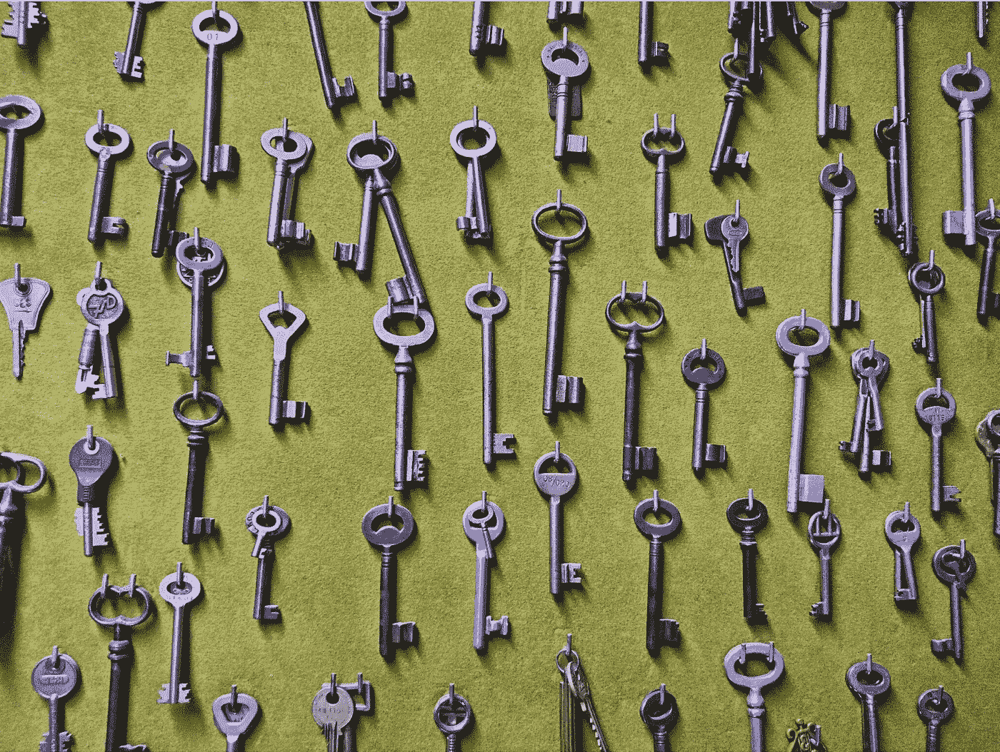
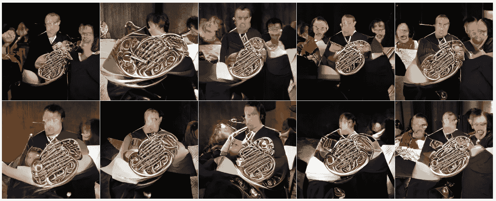
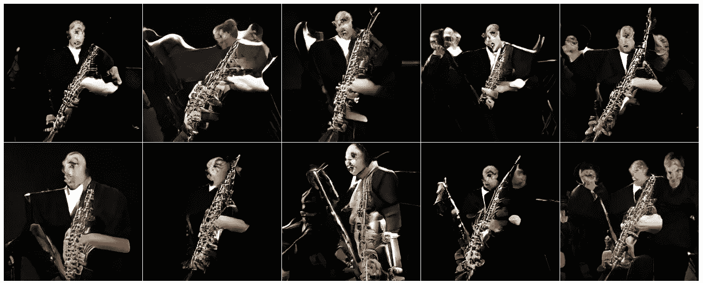
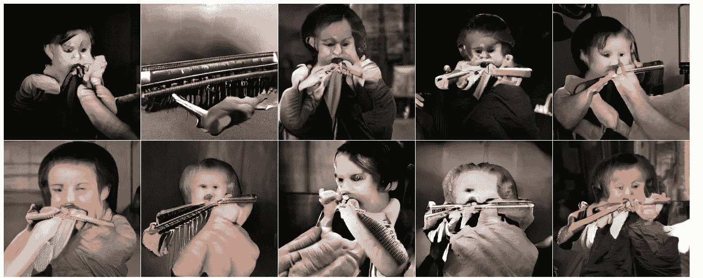
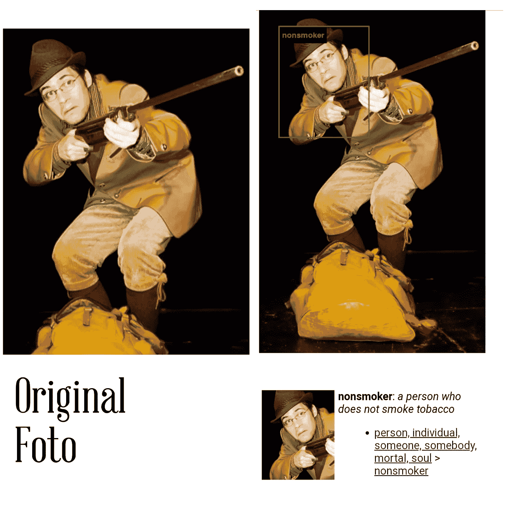
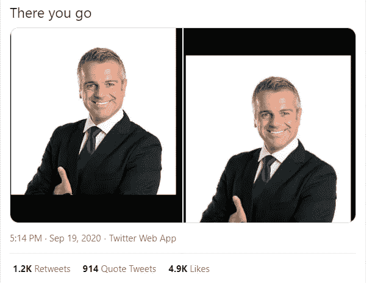
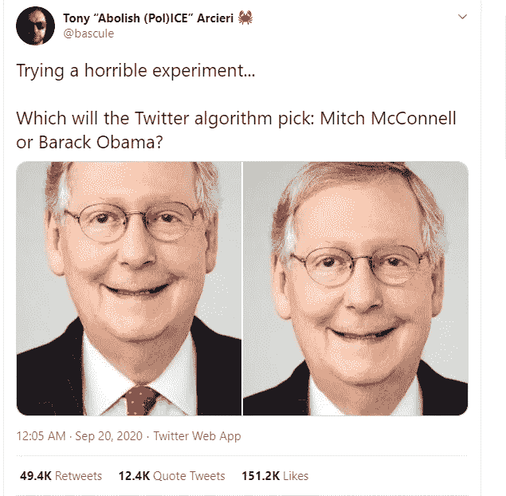
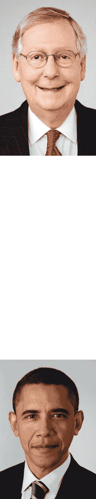
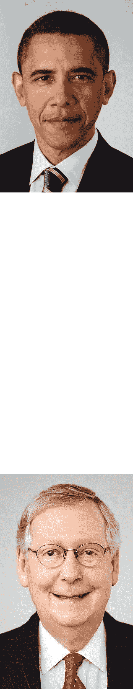

# 多样性是我们所需要的。

> 原文：<https://towardsdatascience.com/diversity-is-what-we-need-98b5f09287c1?source=collection_archive---------36----------------------->

## 现在思考人工智能的未来。

照片:V.A. Merzmensch

你有没有想过所有的狗？随着 [Google Deep Dream](https://medium.com/merzazine/deep-dream-comes-true-eafb97df6cc5?source=friends_link&sk=6d50ebb59584b487183385009ba50f54) 的发布，AI 识别并放大了所有照片中的狗脸。到处，每个角落:狗，除了狗什么都没有。

这个谜团的答案很简单——但令人担忧:

> 在 Deep Dream 的案例中，数据集来自 ImageNet，这是一个由斯坦福大学和普林斯顿大学的研究人员创建的数据库，他们建立了一个包含 1400 万张人类标记图像的数据库。但是谷歌没有使用整个数据库。相反，他们使用了 2012 年发布的 ImageNet 数据库的一个较小的子集，用于一场比赛…这个子集包含“120 个狗子类的精细分类” *(来源:*[*fast company*](https://www.fastcompany.com/3048941/why-googles-deep-dream-ai-hallucinates-in-dog-faces)*)*

[人工智能的 Pareidolia](/pareidolia-of-ai-dba7cf44bfde?source=friends_link&sk=f22677820ca169764e2c076fea98ee6e)只能检测它所训练的模式和物体。数据集才是最重要的。它们越大，质量越好。

但是还有一个方面:贴标签。

你还记得比根那个令人兴奋的时代吗，你可以在历史上第一次把一只狗和一架航天飞机混在一起。

我发现了一个奇怪的现象。如果你想用 BigGAN ( [笔记本](https://colab.research.google.com/github/tensorflow/hub/blob/master/examples/colab/biggan_generation_with_tf_hub.ipynb))生成一个乐器，你就得到一个音乐家。

*法国号:*

比根，566)圆号，法国号

*萨克斯:*

比根:776)萨克斯，萨克斯管

*口琴*

比根:593)口琴，口风琴，竖琴，口琴

唯一的解释是:给图片贴标签的人没有做好他的工作。它不是仅仅给一个乐器贴上标签，而是用一个乐器，包括一个演奏者，给整个形象贴上标签。正确的做法应该是给一张带有萨克斯管的图片贴上“萨克斯管”的标签，而不添加任何其他元素或特征。

如果你让一个在这个数据集上训练的人工智能驱动的机器人给你带来一个萨克斯管，它会给你带来一个萨克斯管演奏家，你不应该责怪机器。它使它的工作变得完美。这是关于我们，谁是错误的。

正如我们将看到的，不准确的贴错标签会导致可怕的后果。

另一个实验，[我报道的关于](https://medium.com/merzazine/merzwoch-image-net-roulette-human-manipulation-and-beauty-of-nightmares-e435fed932b1?source=friends_link&sk=c80d4a07ad408f93cb1d8619813f2723)的实验，已经显示了围绕标签不足而产生的问题:

[凯特·克劳福德](https://medium.com/u/efbec1a070e4?source=post_page-----98b5f09287c1--------------------------------)和[特雷弗·帕格伦](https://medium.com/u/2f160965a3e7?source=post_page-----98b5f09287c1--------------------------------)用他们的 ImageNet-Roulette ( [现在离线](https://imagenet-roulette.paglen.com/))演示了贴错标签的危险。

你可以上传你的照片——砰！——你被系统描述了。该描述来自 ImageNet 中的标签，而这些标签是由人类书写的。不准确。带来毁灭性的后果。

对我来说，这或多或少是无害的(我上传了一张自己为萨沃米尔·mrożek):的舞台剧《卡罗尔》表演的照片

照片:v .佩雷尔曼

我被检测为不吸烟者(“不吸烟的人”)。我手中的巨大来复枪被艾瞄上了。

不过，也有其他案例，比如给某人贴上“强奸嫌疑犯”的标签:

[一次性标签](https://www.theverge.com/tldr/2019/9/16/20869538/imagenet-roulette-ai-classifier-web-tool-object-image-recognition)被曝光在 ImageNet 中贴错标签。这个项目和由两位艺术家[举办的相关展览“](https://news.artnet.com/art-world/imagenet-roulette-trevor-paglen-kate-crawford-1658305)[训练人类](http://www.fondazioneprada.org/project/training-humans/?lang=en)”对 ImageNet 产生了影响:

> ImageNet 背后的研究人员宣布，他们将删除数据集“人物”类别中 120 万张图片中的一半以上。([来源](https://news.artnet.com/art-world/imagenet-roulette-trevor-paglen-kate-crawford-1658305))

# 推特事件

你可能在最近几天偶然发现了这样的推文:

[https://twitter.com/NotAFile/status/1307337294249103361](https://twitter.com/NotAFile/status/1307337294249103361)

或者这个:

[https://twitter.com/bascule/status/1307440596668182528](https://twitter.com/bascule/status/1307440596668182528)

或者:

此外:

我在想，那里发生了什么事。如果你上传一张更大的图片到 Twitter，它会将你时间轴中的预览裁剪到图片的相关部分。如果您打开在此处裁剪的整个图像，您将看到以下内容:

人们对面部图像进行了实验，发现了一种可以被描述为“推特的种族主义”的现象，因为白人占了上风，被选为“相关部分”，与有色人种相反。

尽管如此，在奥巴马与猫的对比中，奥巴马是赢家:

推特上出现了一波可以理解的警告。

但是正如我们所看到的——问题仍然在标签上。我怀疑推特被训练成隐藏非裔美国人的种族主义意图，并被白人面孔所控制。或者被男人。

最有可能的问题是:数据集。他们缺少足够的多样性。他们都是白人。他们有偏见。人为因素。

我们需要更多的多样性。而不是作为“好心”搬东西的托辞。而不是“好吧，如果你幸运的话，这里有一些多样性”。

> 而是多样性作为一种基本的、不可或缺的、必要的、强制性的思维方式。

所以，亲爱的人工智能社区，亲爱的编码者，亲爱的贴标签者，亲爱的人工智能研究者，大家。

这不是演习。我们才刚刚开始培育和训练我们的人工智能系统。如果我们不站在一个角度思考，如果我们忽略了未来的思考，我们的 AI 就会有偏差。

万一 AI 会伤害人类，那是我们人类的错。