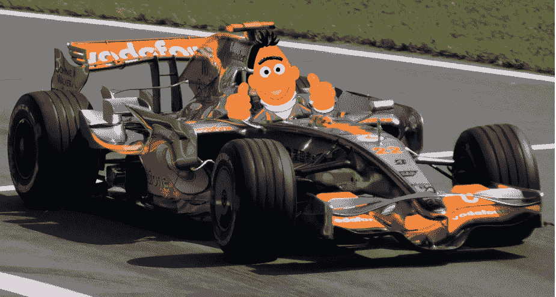
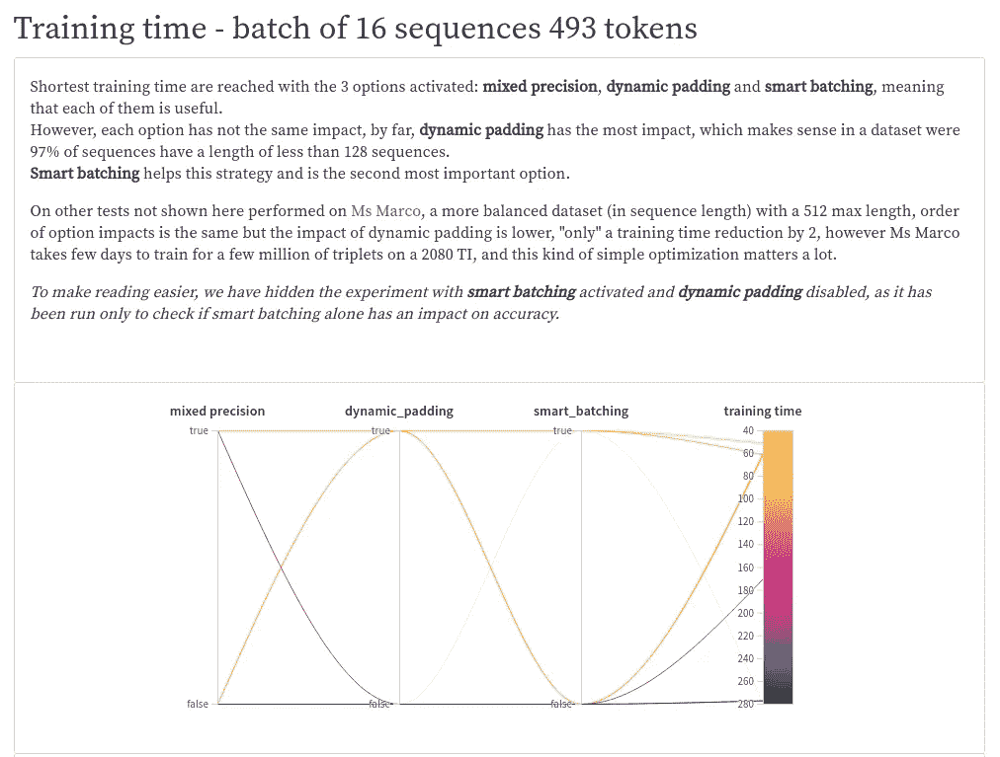
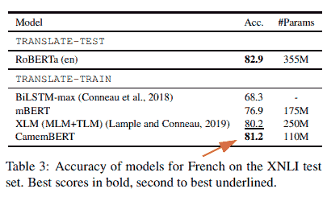
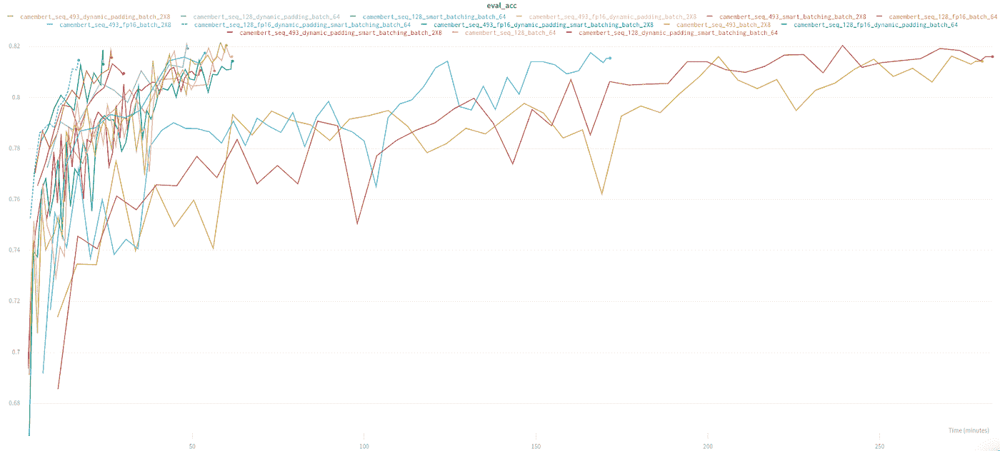
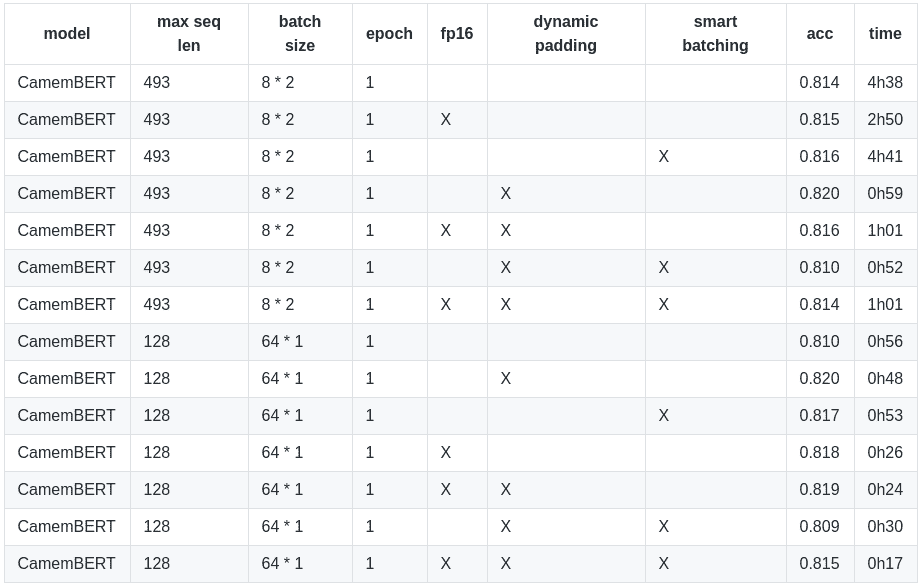
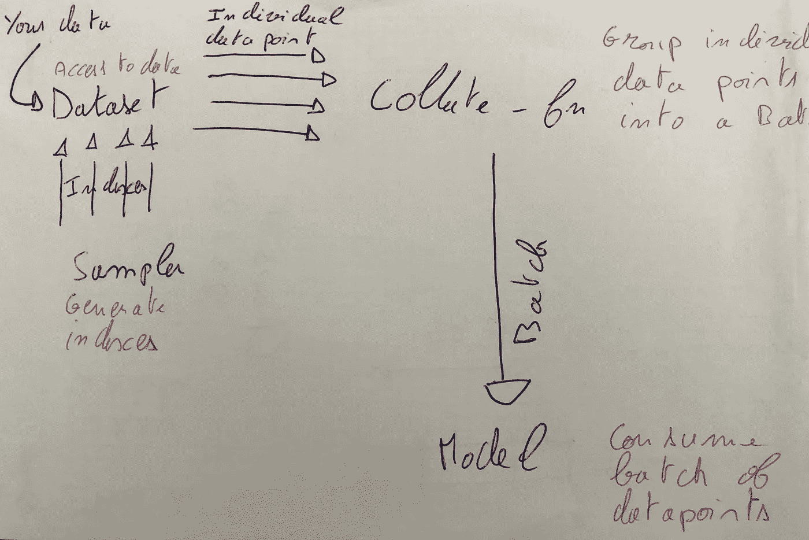
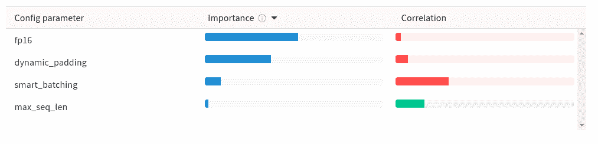
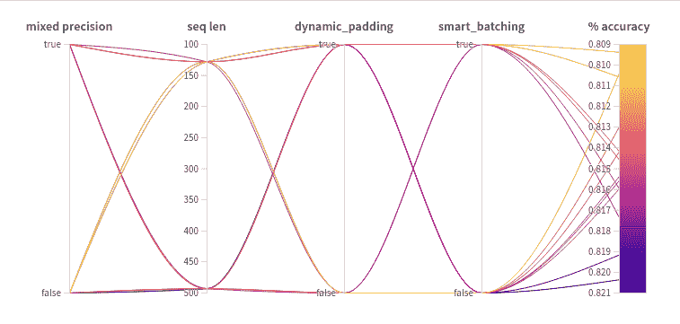
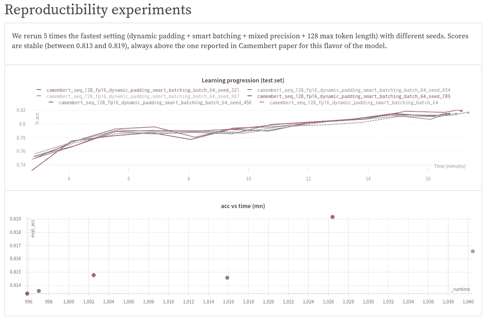

# 用动态填充和统一长度批处理将拥抱面部变形器训练时间除以 2 或更多

> 原文：<https://towardsdatascience.com/divide-hugging-face-transformers-training-time-by-2-or-more-21bf7129db9q-21bf7129db9e?source=collection_archive---------10----------------------->

## 机器学习工程

## **减少训练时间有助于在固定的预算时间内进行更多的迭代，从而达到更好的效果。**



上面的照片是由[这个](https://www.pngwing.com/en/free-png-ncpgf)(免费用于非商业用途)和[那个](https://www.pexels.com/fr-fr/photo/851989/) (Pexel 许可，免费用于任何用途)制作的

> 2020 年 6 月 4 日更新:根据一项建议，在[报告](https://app.wandb.ai/pommedeterresautee/speed_training/reports/Divide-HuggingFace-Transformers-training-times-by-2-or-more-with-dynamic-padding-and-uniform-length-batching--VmlldzoxMDgzOTI)中增加了对**大**口味卡门贝干酪进行的实验。TL；DR:训练时间从 4 小时减少到 1 小时 30 分。

我在 Lefebvre Sarrut 出版社工作，这是一家出版公司，是欧洲法律行业的主要参与者。正如前面的文章中所解释的，我们的需求要求我们在非常大的文本数据集上应用深度学习(法律案件匿名化、文档分类等)。)，这就是为什么我们对让我们所有的(机器学习)工具变得更快如此感兴趣。

本着一篇[先例文章](/why-we-switched-from-spacy-to-flair-to-anonymize-french-legal-cases-e7588566825f)的精神，这篇文章的目的是探索两个非常*简单的*优化，它们可以显著减少[变形金刚](https://github.com/huggingface/transformers)库的训练时间，而不会对准确性产生负面影响。我们在一个大型的知名 NLP 数据集(X-NLI 的法国部分)上运行了 **21 个实验+ 12 个再现性实验**，我们表明，对于模型的**基础**风格，通过简单地使用现成的法国 BERT 模型( [CamemBERT](https://camembert-model.fr/) )、默认参数、单个消费级 GPU 和这些优化，我们可以达到最大令牌长度为 128 的**、最大令牌长度为 16 分钟的 **比没有任何优化的 *56 分钟*训练获得的分数高出 0.5 分**，比 CamemBERT 模型作者为此任务报告的分数高出 0.3 分。 在相同的模型上，对于 493 最大令牌长度，增益甚至更令人印象深刻，其中训练时间从没有任何优化的 4h38 减少到有所有优化的 1h01，仍然达到相同的分数。*与* ***大型*** *型号达到了类似的训练时间缩减(从 4h 到 1h30 为 128 令牌长度)。***

**重现实验的源代码**可从[那里](https://gist.github.com/pommedeterresautee/1a334b665710bec9bb65965f662c94c8)获得。

> 这些优化不是特定于任务/模型/语言的，但前提是下面的代码是为 Pytorch 编写的。
> 
> *如果你对这个话题感兴趣，在推特上关注我:*[*https://twitter.com/pommedeterre33*](https://twitter.com/pommedeterre33)



查看[报告](https://app.wandb.ai/pommedeterresautee/speed_training/reports/Decrease-HuggingFace-Transformers-training-times-by-2-or-more-with-dynamic-padding-and-uniform-length-batching--VmlldzoxMDgzOTI)，看看[权重&偏差](https://medium.com/u/c4669728a9af?source=post_page-----21bf7129db9e--------------------------------)是一个你不知道自己需要的强大工具

此外，我们记录了所有关于[重量&偏差](https://medium.com/u/c4669728a9af?source=post_page-----21bf7129db9e--------------------------------)的实验，这是一种范围更大的在线张量板，所以你可以自己分析我们的实验结果，这里是[的报道](https://app.wandb.ai/pommedeterresautee/speed_training/reports/Decrease-HuggingFace-Transformers-training-times-by-2-or-more-with-dynamic-padding-and-uniform-length-batching--VmlldzoxMDgzOTI)。

*(注意“等长配料”在报告上被命名为“智能配料”)*

**“动态/可变长度填充”**是 NLP 在 2017-2018 年的事情，但现在单个神经网络架构使得任何 GPU 所有者都能够在几乎任何任务上达到 SOTA 分数，似乎 NLP 社区已经将重点从寻找最佳批量大小转移到在神奇的架构上构建东西。**“统一长度批处理”**是一个天真的想法，进一步推动我们想要检查的动态填充增益。

> 在撰写本文时，对于大多数常见任务来说，这两个工具在 Transformers 库上都不是现成的。

您只能在文本生成/语言建模任务中找到动态填充。有希望的是，我们将看到这两种技术都很容易在普通任务(分类等)的用户端实现。)并且我们认为大多数 NLP 从业者应该测试/使用它们。

在过去的一年里，来自[拥抱脸](https://medium.com/u/b1574f0c6c5e?source=post_page-----21bf7129db9e--------------------------------)的变形金刚库成为使用大型预训练语言 NLP 模型的标准方式。它附带了大量的功能，涵盖了大多数 NLP 用例，并且有一个完美的 API，直到你开始期望它是完美的。自从[版本 2.9](https://github.com/huggingface/transformers/releases/tag/v2.9.0) 带给我们[训练器](https://github.com/huggingface/transformers/blob/master/src/transformers/trainer.py)类以来，这种感觉更加强烈，这是一个精心设计的 [William Falcon](https://medium.com/u/8536ebfbc90b?source=post_page-----21bf7129db9e--------------------------------) 的 Pytorch Lightning 训练 API 适应特定的变压器要求，它将用户从大多数工程方面的训练中解放出来(张量板测井、混合精度、梯度累积、多 GPU 设置等)。)因此是微调模型的新的默认方式。

在一切都如此完美的情况下，你倾向于相信一切都被优化到了极致。不要忘记，这个库还很年轻，团队同时在几条战线上工作(最近的例子是与来自 Azure DevOps 的吴合作，利用 ONNX 和在一些设置中减少推理时间。当你深入图书馆时，你可能仍然会发现一些有趣的低挂水果。

我们进行了实验，总结了我们在下面和[那里](https://app.wandb.ai/pommedeterresautee/speed_training/reports/Decrease-HuggingFace-Transformers-training-times-by-2-or-more-with-dynamic-padding-and-uniform-length-batching--VmlldzoxMDgzOTI)的发现。

如果你还不是“填充/注意力面具”专家，你可能想再读一遍这篇为《老式 RNN》写的优秀的[文章](/taming-lstms-variable-sized-mini-batches-and-why-pytorch-is-good-for-your-health-61d35642972e)(摘自[威廉·法尔肯](https://medium.com/u/8536ebfbc90b?source=post_page-----21bf7129db9e--------------------------------) …!).简而言之，在一批序列上训练神经网络要求它们具有完全相同的长度，以构建批矩阵表示。由于现实生活中的 NLP 数据集总是由可变长度的文本组成，我们经常需要通过截断它们来缩短一些序列，并通过在末尾添加一个重复的假标记(称为“填充”标记)来延长一些序列。因为填充令牌不代表真实的单词/子单词/信号，所以当大多数计算完成时，在计算损失之前，我们通过注意力屏蔽矩阵将填充令牌信号乘以 0 来擦除它。

**这两种优化背后的主要思想是尽可能避免不使用的计算**:

*   **动态填充**:我们限制添加填充令牌的数量，以达到每个小批量的最长序列的长度，而不是为整个列车组设置一个固定值。因为添加的令牌的数量在小批之间变化，所以我们称之为"*动态*"填充；
*   **统一长度批处理**:我们通过生成由相似长度序列组成的批处理来进一步推动逻辑，因此我们避免了极端情况，即迷你批处理中的大多数序列都很短，我们需要为每个序列添加大量填充标记，因为同一迷你批处理的 1 个序列非常长。

此外，我们检查了第三种选择的好处，**混合精度**，它单独使用或与上述两种技术结合使用的价值。

# 设置

为了检查这些优化是否与基于 transformer 的语言模型配合良好，我们在 [X-NLI](https://arxiv.org/pdf/1809.05053.pdf) 的法语部分运行了 14 个不同设置的实验。

如果你不知道 X-NLI，它基本上是一个句子对分类任务，其中模型需要猜测第二个句子与第一个句子相比是否需要/矛盾/中性(3 类)。X-NLI 训练集是大型英语数据集的机器翻译，测试集由来自同一英语数据集的 15 种语言(包括法语)的 5K 对人工翻译组成。

用于实验的模型是卡门贝塔建筑，由脸书费尔和 Inria 实验室用法语文本训练而成。存在几种口味，下面的数字与已经发布的第一种相关，在变形金刚中称为[卡门贝干酪基](https://huggingface.co/camembert-base)(在 130 Gb 数据上训练的 110 万个参数)。[*camembert-large*](https://huggingface.co/camembert-base)*实验报告中均有。*



> Camembert 论文作者在 **10 epoch** s 中达到了 81.2%的准确率，提前停止，1e-5 学习率，512 个令牌的序列长度[以及其他一些东西](https://github.com/pytorch/fairseq/blob/master/examples/roberta/README.glue.md)。

对于每个实验，我们将训练限制在 1 个时期，因为我们只能使用单个 GPU 来运行所有实验。所有运行都使用相同的种子(不同种子的“再现性”实验除外，如下所述)。除非另有说明，超参数保持默认值，因为我们没有资源对每个实验进行网格搜索。正如我们将看到的，在大多数实验中，我们在 X-NLI 上击败了作者报告的分数，所以默认设置可能已经足够好了。

**X-NLI 主要由短句对组成**:当短句对的两个部分连接成一个序列时，超过 97%的短句对长度小于 128 个标记。这种长度分布对减少培训时间的机会有很大影响。简而言之，在这个数据集上，即使在消费级 GPU 上，也可以在 128 个令牌处截断序列来构建“大型”批处理。在一个更平衡的数据集上，比如 T2 的马可女士，你需要 512 个单词的限制才能接近 SOTA 的平均倒数排名。在这两种情况下，这里介绍的两种技术带来了大量的训练时间减少(2 倍或更多)，但出于不同的原因，我们将在下面进行分析。在我们对私有数据集使用这些优化时，无论数据集的特征如何，我们总是对训练时间产生显著影响。

时间和精度是在单个 Nvidia 2080 TI GPU 上测量的。3 个优化选项的每个组合已经运行了 2 次，一次是将一批 64 个序列截短为 128 个记号，第二次是将一批 16 个序列(2 步 8 个序列和单个梯度累积)截短为 493 个记号。493 是字符数最长序列中的 Camembert 子词标记数，可能是训练集中标记数最长的标记序列之一。步长已被设置为该 GPU 在内存中可以占用的最大值。

计时包括中间评估(在我们的例子中是每 500 个小批量)，因为在现实生活中，大多数 NLP 从业者都是这样进行培训的。

# 结果



每个组合随时间变化的精确度，报告中的交互式图表[此处](https://app.wandb.ai/pommedeterresautee/speed_training/reports/Decrease-HuggingFace-Transformers-training-times-by-2-or-more-with-dynamic-padding-and-uniform-length-batching--VmlldzoxMDgzOTI)



TL；博士:

## **定时**

*   **单独使用动态填充可以显著减少训练时间，这可以通过使用统一大小批处理和混合精度来增强；**
*   在一些设置中(小批量+短序列)，混合精度可以产生更长的训练时间，在其他情况下，它是游戏改变者(大批量和/或长序列)。

## **精度**

*   **在 14 次运行中，有 11 次在单个时期内获得了 81.18%以上的分数(Camembert 论文中报道的 10 个时期的分数，并提前停止)；**
*   当我们比较成对的运行(相同的设置，在 128 处截断与在 493 处截断)时，不出所料，截断平均具有(小的)准确性成本，即使只有 3%的数据集与 128 令牌截断有关。

> **通过使用优化和混合精度，我们在 16mn 训练中击败了 4h38 训练的分数！**

> **基础**模型的发现与**大型**模型相同，额外 12 个实验的测量结果在[报告](https://app.wandb.ai/pommedeterresautee/speed_training/reports/Divide-HuggingFace-Transformers-training-times-by-2-or-more-with-dynamic-padding-and-uniform-length-batching--VmlldzoxMDgzOTI)中。

# 优化机会

## 当你要抛出结果时，避免计算

如上所述，pad 令牌信号通过应用注意屏蔽来消除。序列末尾的填充标记越多，执行的未使用的计算就越多。

在训练器类中，您定义了一个(固定的)序列长度，训练集的所有序列都被填充/截断以达到该长度，没有任何例外。在 X-NLI 上，最短的序列是 10 个记号长，如果你提供 128 个记号长，你将把 118 个填充记号加到这 10 个记号序列上，然后在这 118 个有噪声的记号上执行计算。

> 最差，如[原伯特回购自述](https://github.com/google-research/bert/blob/master/README.md)、*“…注意是序列长度的平方。换句话说，一批 64 个长度为 512 的序列比一批 256 个长度为 128 的序列要贵得多。”*。

小批量由从数据集中取样的少量序列组成。即使在 X-NLI 中随机选择，小批量中的最长序列也有可能比整个训练集的最大序列长度短。因为学习/梯度下降是在小批量水平执行的，所以我们有机会限制填充效应，更准确地说，我们可以首先在小批量中搜索最长的序列长度，然后相应地填充其他序列。

这些操作可以在 *collate_fn* 功能中执行。该函数的用途在 [Pytorch 文档](https://pytorch.org/docs/stable/data.html#working-with-collate-fn)中有所描述，基本上它采用数据集返回的单个示例，并将它们合并以构建张量矩阵，并将其发送至模型。

## 动态填充

如上所述，这个想法是在小批量水平而不是数据集水平调整序列长度。这样我们可以限制未使用的计算。该工作在 [Pytorch 数据加载器](https://pytorch.org/docs/stable/data.html)内进行。让我们提醒一下它是如何工作的:



Pytorch 数据加载器内部

组件:

*   **Dataset()** 是访问原始文本数据的砖块，是一个简单的字符串列表或类似数据库连接器的东西；
*   **Sampler()** 生成索引，指向数据集中的一个数据点。它遵循一种策略，例如顺序生成(对于测试集)或随机生成(对于训练集)。
*   **collate_fn()** :对于每个小批量，它接收由采样器选择的数据点(来自数据集)并将它们分组到一个张量中(理论上它可以是其他东西，但通常这是您期望的数据加载器输出/模型输入)。

*collate_fn* 是执行动态填充的最佳位置。幸运的是，Pytorch Dataloader 在其构造函数中有一个参数来提供我们自己的实现，不需要覆盖任何东西。变形金刚库中的训练师类在其构造函数中有一个类似的参数，我们将使用它。它不是一个函数，而是等待一个“整理器”(一个特定于 Transformers 的类)的实例，它只有一个目的，包装 *collate* 方法。

在下面找到一个可能的*排序器*类的实现。

```
*# ...*def **pad_seq**(seq: List[int], max_batch_len: int, pad_value: int) -> List[int]:
 *# IRL, use pad_sequence
    #* [*https://pytorch.org/docs/master/generated/torch.nn.utils.rnn.pad_sequence.html*](https://pytorch.org/docs/master/generated/torch.nn.utils.rnn.pad_sequence.html)
    return seq + (max_batch_len - len(seq)) * [pad_value][@dataclass](http://twitter.com/dataclass)
class **SmartCollator**(DataCollator):
    pad_token_id: int def **collate_batch**(self, batch: List[Features]) -> Dict[str, torch.Tensor]:
        batch_inputs = list()
        batch_attention_masks = list()
        labels = list()
        *# find the max length of the mini batch*
        max_size = max([len(ex.input_ids) for ex in batch])
        for item in batch:
            *# apply padding at the mini batch level*
            batch_inputs += [pad_seq(item.input_ids, max_size, self.pad_token_id)]
            batch_attention_masks += [pad_seq(item.attention_mask, max_size, 0)]
            labels.append(item.label)
        *# expected Transformers input format (dict of Tensors)*
        return {"input_ids": torch.tensor(batch_inputs, dtype=torch.long),
                "attention_mask": torch.tensor(batch_attention_masks, dtype=torch.long),
                "labels": torch.tensor(labels, dtype=torch.long)
                }
```

## 动态填充有助于减少训练时间吗？

我们运行了 4 个实验，按每批大小进行分组，对于每组，我们比较了使用和不使用动态填充的情况。当为以下情况启用时:

*   16 批未截短的序列，时间从 4h39 减少到 0h 59(-79%)；
*   64 个序列的批次被截短为 128 个标记，计时从 0h56 减少到 0h48 (-15%)。

在这两种情况下，计时减少都是显著的，并且对于长序列是 4 倍强。这是有意义的，在训练集中，97%的例子短于 128 个令牌，所以对于大多数例子，我们为拥有 493 个最大序列大小而缴税。通过使用优化，我们只为有用的计算付费。

对于 128 个记号的截断，仍然有增益，因为大多数序列仍然比 128 个记号小得多，并且 BERT 复杂度关于其输入长度是二次的，避免的计算成本低得多，并且训练时间减少“仅仅”15%。

## 会影响准确性吗？

我们运行了 4 个实验，按每批大小进行分组，对于每组，我们比较了使用和不使用动态填充的情况。当为以下情况启用时:

*   16 批未截短序列，准确率从 81.42%提高到 82.0%；
*   一批 64 个序列被截短为 128 个标记，准确率从 81.0%提高到 82.0%。

在这两种情况下，动态填充都可以提高精度。

# 均匀尺寸配料

统一批量生产由简单地构建由相似长度序列制成的批次组成。目的是在与动态填充结合使用时尽可能减少填充。

有许多方法可以实现它，我们遵循的方法是:

*   在一个简单的 Python 列表中按长度对示例进行排序，
*   随机选择一个索引，
*   提取示例和后面的 *n* 个示例( *n* 为批次/步长)，
*   从列表中删除提取的示例，
*   重复此操作，直到列表中不再有示例。

这样，每一批都是由相似长度的序列组成的，但是后面的几批是不同长度的。

天真(简单易懂/不干净)的实现可能看起来像这样:

# 统一大小批量真的能减少训练时间吗？

为了减少时间，我们之前已经展示了动态填充带来了大量的训练时间减少，让我们比较使用动态填充和不使用统一大小批处理以及启用两种优化的训练时间。用于:

*   批 16 个未截短的序列，训练时间从 1h01 减少到 0h 52(-15%)；
*   一批 64 个序列被截短为 128 个标记，训练时间从 0h48 减少到 0h30 (-38%)。

所以在这两种情况下，我们天真的想法似乎带来了另一个显著的训练时间减少。

# 统一尺寸配料是否会以任何方式影响精确度？

通常，神经网络是在随机排序的数据点上训练的。均匀尺寸配料限制了这种随机性，因此引入了一种偏差，这种偏差在理论上可能会影响精度。

我们将只比较有和没有统一尺寸配料的设置:

*   对于一批 16 个样品，当激活统一长度配料时，准确度从 81.4%增加到 81.6%；
*   对于一批 64 个样品，当激活统一尺寸配料时，准确度从 81.0%提高到 81.7%。

在这两种情况下，都有改进，我们可以得出结论，对准确性没有负面影响。

然而，我们结合多种选择进行了许多实验，根据[权重&偏差](https://medium.com/u/c4669728a9af?source=post_page-----21bf7129db9e--------------------------------)仪表盘，使用统一尺寸配料与准确性呈负相关。手动检查实验对后(有/没有选项)，这种效果不明显。



(如果您想深入了解，请随时查看[报告](https://app.wandb.ai/pommedeterresautee/speed_training/reports/Decrease-HuggingFace-Transformers-training-times-by-2-or-more-with-dynamic-padding-and-uniform-length-batching--VmlldzoxMDgzOTI))

# 混合精度

通过 Nvidia apex 库，Pytorch 上的混合精度是可能的。简而言之，在其最常见的模式中，混合精度包括以半精度执行大多数操作，并以全精度累加结果(更多信息请参见 [apex 文档](https://nvidia.github.io/apex/amp.html))。

Apex 以在某些场景中带来改进而闻名，有时它也会带来一些不稳定性(例如，训练期间的损失幅度比没有混合精度时更大)，并且很少避免模型收敛。换句话说，它不是一个银弹，而是一个有趣的工具来测试你的情况。

好消息是 Trainer class 实现了开箱即用，要利用它，您只需要在命令行中添加正确的标志(“— fp16”)。

关于 16 个长序列的小批量的训练时间，情况是不寻常的。用于:

*   单独的混合精度通过将训练时间从 4h38 减少到 2h50 而使事情变得更好；
*   混合精度结合动态填充和统一大小批处理，使得训练变慢，从 0h52 到 1h01！

原因可能是在第二种情况下，它增加了开销，并且没有多大帮助，因为大多数批处理只由短序列组成。混合精度对大型矩阵运算帮助最大。

当应用于 64 个短序列的小批量时，事情如预期的那样:

*   单独使用时，时间训练从 0h56 减少到 0h26
*   结合其他两个选项，时间从 0 时 30 分减少到 0 时 17 分

这一次，即使步长由短序列组成，每个包含 64 个序列，使得矩阵足够大，可以从混合精度中受益。

关于准确性，没有明确的模式。你可以通过查看[权重&偏差](https://medium.com/u/c4669728a9af?source=post_page-----21bf7129db9e--------------------------------) [报告](https://app.wandb.ai/pommedeterresautee/speed_training/reports/Decrease-HuggingFace-Transformers-training-times-by-2-or-more-with-dynamic-padding-and-uniform-length-batching--VmlldzoxMDgzOTI)来自己拿主意。

# 重复的结果

所有的实验都是使用相同的种子进行的。可能我们很幸运，我们的方法达到了精度，但不是用这个种子和这个数据集。

我们在启用所有优化设置的情况下用不同的种子重新运行 16 分钟的训练 5 次，并且再现了准确度/计时。

> 对大模型也进行了同样的复制实验。结果是一样的。



还是那句话，想要互动图？-> [报告](https://app.wandb.ai/pommedeterresautee/speed_training/reports/Decrease-HuggingFace-Transformers-training-times-by-2-or-more-with-dynamic-padding-and-uniform-length-batching--VmlldzoxMDgzOTI)<—

# 一个结论？

**我们已经证明，这两种技术都能在不降低准确性的情况下持续大幅缩短时间**。此外，我们了解到，在具有小批量的数据集上，应该小心混合精度，因为如果没有足够的计算来执行，它可能会导致意外的训练变慢。

> 我们确信这两种技术都是唾手可得的，应该被变形金刚用户广泛使用。

总结一个更一般的想法，我们对这些简单的想法所获得的结果感到惊喜。只是为了这个故事，在另一个不相关的实验中，我们注意到 X-NLI 的法语训练集(它是英语数据集的机器翻译)质量很低(许多例子在法语中是绝对无意义的)，我们想知道翻译质量更好的它是否会提高测试集(这是人工翻译)的准确性。这对我们来说是一个重要的机会，因为如果它成功了，就意味着有大量的法语数据集可以使用。我们在 DeepL 上花了几块钱，翻译好了很多……而且准确度也没变(我们甚至觉得我们的度量有 bug)。**并非所有简单的想法都是平等的！**