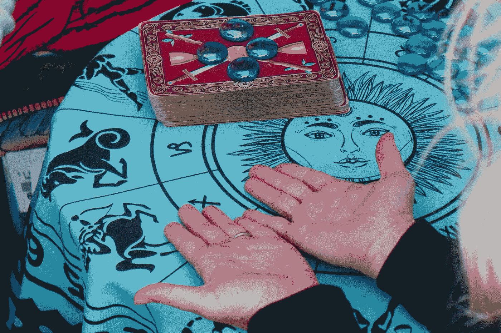

# 将数据科学视为预言

> 原文：<https://towardsdatascience.com/divination-and-data-science-1ddda913b812?source=collection_archive---------49----------------------->

## 为什么占卜实际上与数据科学密切相关

Shreyas shah 在 [Unsplash](https://unsplash.com?utm_source=medium&utm_medium=referral) 上拍摄的照片

我从小就对文化和神话感兴趣。这项研究中让我感兴趣的一部分是占卜的艺术。出于这个原因，在我被监禁的这段时间里，我决定参加哈佛大学提供的关于占卜和他们的系统[的在线课程。](https://online-learning.harvard.edu/course/predictionx-omens-oracles-prophecies?delta=0)

据我所知，每种文化都有自己的方式来预测未来会发生什么，以及如何通过占卜师收集的数据来预测。没错，占卜其实和数据息息相关，和数据科学本身。在这篇文章中，我将尝试以简洁直观的方式解释占卜如何与数据科学相关联。

这篇文章只是纯粹的自以为是和知识的目的。没有任何其他方式贬低任何长期存在的做法已经存在。

# 占卜预测系统

根据维基百科的说法，占卜试图通过神秘的、标准化的过程或仪式来洞察一个问题或情况。简单来说，这意味着通过仪式过程了解未来。

根据他们的输入，占卜本身可以分为四个更广泛的类别，包括:

*   **随机**；其中输入来自**随机过程**，有时也被称为**“自发的”**例如，[罗马鸟预兆](https://en.wikipedia.org/wiki/Augury)我们需要等待鸟儿自发行动后再做预测。
*   **随机化**；其中输入是**人类发起的**以产生**随机**结果。比如掷骰子。
*   **人类**；直接来自占卜者的输入或者除了占卜者之外任何人都不能解释的输入；例如，着魔的人。
*   **非随机**；其中输入来自对任何一致的、可重复的、可预测的和可知的过程的观察；例如，测量行星的位置。

在某种程度上，上面使用的术语在数据科学领域非常熟悉。有一个输入，取决于我们有什么输入；产生预测的仪式类型也会不同。

这个仪式可以被想象成一个预测系统或者是一个用于预测的“算法”。在这个“算法”中，我们可以说，如果我们把“A”输入到“算法”，预测“B”；例如，如果木星在 273.87 度的位置，预测未来的浪漫生活。就像数据科学中的任何预测模型一样；“算法”没那么简单。

占卜系统中有意思的是，系统本身有时候有点不为外界所知；因为其中涉及到神秘主义，或者系统本身过于复杂，甚至因为它在历史上消失了。在数据科学预测模型中，就把这个想象成一个**深度学习**模型。它涉及到很多统计方法，系统真的很复杂，而且经过训练，由于它们的随机性，我们不知道里面发生了什么。我们只要有深度学习模型，我们输入观察到的数据，预测就出来了。太棒了。

以上只是一个有点勉强的例子，说明占卜类似于预测模型。如果我们一步一步地使用系统预测的例子，会感觉更自然。

# 占卜框架

## 1.观察

任何预言或数据科学领域的第一步总是观察数据。这是我们输入到“算法”中产生预测的输入。就像我们把数据输入机器学习模型一样。理论上，我们的观察越多，预测就越强。

## **2。预测**

观察数据后，我们有了预测。预测的清晰程度因系统而异。虽然很少有预测是严格的，比如行星的位置；许多预测系统包含歧义，有意或无意的，不同的解释。

在数据科学中，以**无监督学习**中的聚类分析为例；我们将最终得到系统预测它们应该聚集在一起的聚类结果。作为数据科学家，我们如何解释这个结果将取决于我们。

## 3.评估准确性并做出更改

这个预测正确吗？就像在任何数据科学过程中一样，这是一个简单的问题，但实际上评估它是一个复杂得多的问题。看起来很奇怪，占卜需要评估他们的预测准确性，但这正在发生，尽管并不总是如此。事实上，许多占卜系统本身可以进化得更准确，但大多数时候我们不知道，因为历史已经湮没在时间中。

以古代美索不达米亚时期的春辣为例。haruhiscid 是一种仪式，他们牺牲一只羊并提取肝脏来获得预言。由于预测不可能产生 100%肯定或否定的结果，占卜者可能会进行另一种仪式来减少不确定性。在这种情况下，占卜者就像现代科学家一样，通过进行额外的实验来获取数据。

基于该方法的准确性，可以对系统进行一些改变。就像我们数据科学家玩超参数一样，系统中的一些变化肯定会发生。虽然，正如我之前提到的；大多数时候我们不知道预测系统中发生了什么变化，因为它在时间中丢失了。

# 数据科学中占卜的重要性

我已经在上面的文章中向你解释了占卜和数据科学在某些方面是相似的。事实上，很多占卜都是以数据为基础的。塔罗牌、占星术、罗马鸟占卜术等。它们都是基于发生的数据和模式。

占卜看似不科学，但却是人类的需要。占卜告诉我们未来会发生什么，或者解释过去和现在发生了什么。今天发生的事情与昨天不同，明天也会不同，因此，占卜师在帮助你理解社区的性质，社会的性质，正在发生的事件，当然，如何处理这些事件方面的重要性。

在现代，我们当然会消除由这种不科学的方法产生的任何意见。基于骰子或羊肝的预测会被认为是假的，不会被认真对待。出于这个原因，我们人类需要更多的理由来相信我们的预测是有根据的。在这里，我们发展了许多科学理由，只是为了确保将要发生的事情在某种意义上是可预测的。**数据科学家**只是碰巧做到这一点的角色之一。**我们尝试分析并创建一个基于数据的模型，根据输入数据预测会发生什么。**就像占卜一样。

不同于我们为个人日常生活而咨询的占卜师，数据科学家的需求来自于人类很久以前就想知道未来会发生什么的好奇心。因此，我们作为数据科学家所做的就离占卜者不远了。

# 结论

这篇文章纯粹是我的观点，以及我作为一名数据科学家如何看待占卜。作为人类，我们想知道模式和未来会发生什么的好奇心从未改变；只是我们获取知识的方式不同。

# 如果您喜欢我的内容，并希望获得更多关于数据或数据科学家日常生活的深入知识，请考虑在此订阅我的[简讯。](https://cornellius.substack.com/welcome)

> 如果您没有订阅为中等会员，请考虑通过[我的介绍](https://cornelliusyudhawijaya.medium.com/membership)订阅。