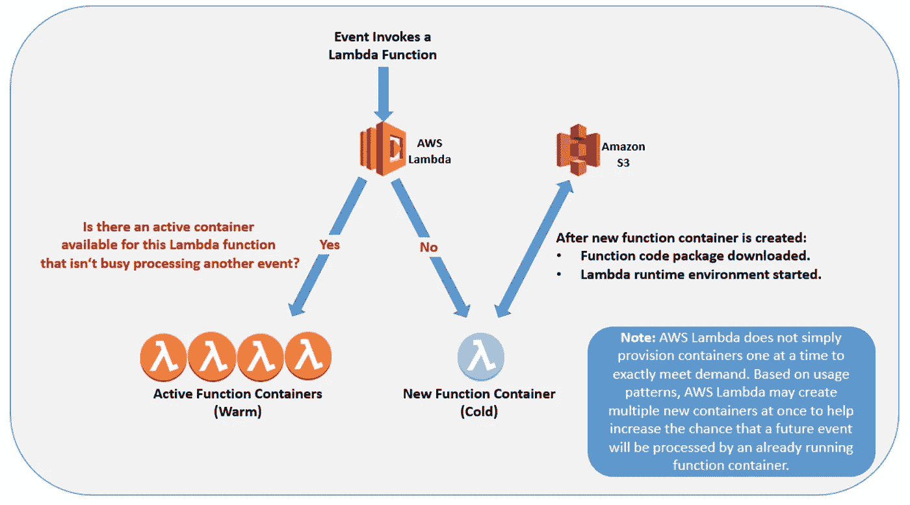

# 深入探究 AWS Lambda

> 原文：<https://towardsdatascience.com/diving-deeper-into-aws-lambda-a52b22866767?source=collection_archive---------13----------------------->

## 了解 Lambda 的基本基础设施，如何运行可执行文件和解析 CloudWatch 日志


杰里米·毕晓普在 [Unsplash](https://unsplash.com?utm_source=medium&utm_medium=referral) 上的照片

# 1.介绍

Amazon Lambda 已经成为云基础设施开发中必不可少的无服务器服务。to focus(功能即服务)背后的理念是让程序员专注于编码，提高他们的生产力和基于微服务的现代系统的灵活性。

[在另一篇文章](/introduction-to-amazon-lambda-layers-and-boto3-using-python3-39bd390add17)中，我介绍了 AWS Lambda 的基本概念，如何用 Python 设置你的第一个函数，使用外部库(Lambda 层)以及使用 [boto3](https://boto3.amazonaws.com/v1/documentation/api/latest/reference/services/lambda.html) 调用函数。

在本文中，我们将探索其他特性，并扩展 AWS Lambda 函数的可用性。

1.  **AWS Lambda 背后的基础设施**
2.  **在 AWS Lambda 中运行可执行文件**
3.  **cloud watch 中的监控日志**

本文中的大部分信息摘自 [AWS 白皮书](https://aws.amazon.com/whitepapers/?nc1=h_ls&whitepapers-main.sort-by=item.additionalFields.sortDate&whitepapers-main.sort-order=desc&whitepapers-main.q=lambda&whitepapers-main.q_operator=AND)，以及参考资料会议中引用的文章。

# 2.AWS Lambda 背后的基础设施

根据 AWS:

> Lambda 是一种基于功能的大规模、免配置的无服务器计算产品。它为您的应用程序提供云逻辑层。Lambda 函数可以由 AWS 或支持第三方服务上发生的各种事件触发。

这可能不是最好的定义，因为它过于依赖模糊、抽象的概念，并且没有定义 Lambda 中的元素。即使你以前运行过一些 AWS Lambda 函数，并且熟悉这个接口，当你调用你的函数时，后面发生的事情对你来说仍然是一个谜。

## 那么，AWS Lambda 的背后到底是什么？

从基础设施的角度来看，每个 AWS Lambda 都是运行 [Amazon Linux](https://aws.amazon.com/amazon-linux-ami/?nc1=h_ls) 的容器的一部分(称为**功能容器**)。您为 AWS Lambda 创建的代码文件和资产被称为**功能代码包**，存储在由 AWS 管理的 S3 存储桶中。每当 Lambda 函数被触发时，函数代码包就从 S3 桶下载到函数容器，并安装在它的 **Lambda 运行时环境中。**这个过程很容易扩展，AWS 基础设施可以毫不费力地执行对特定 Lambda 函数的多次调用。

Lambda 函数代码包的大小限制是:压缩后 50MB，解压缩后 250MB，这可能与每次调用函数时需要从 S3 加载到函数容器有关。如果功能代码包大于当前限制，加载过程的效率可能会受到影响。

## 冷启动与暖容器

当您调用 Lambda 函数时，它会遵循上述步骤并执行代码。执行完成后，Lambda 容器在被终止前会保持可用几分钟。这叫做 [**冷启动**](https://medium.com/hackernoon/im-afraid-you-re-thinking-about-aws-lambda-cold-starts-all-wrong-7d907f278a4f) 。

如果您调用同一个函数，并且 Lambda 容器仍然可用(还没有被终止)，AWS 使用这个容器来执行您的新调用。这个使用活动函数容器的过程被称为**热容器**，它提高了 Lambda 的响应速度(图 2)。



图二。AWS Lambda 冷启动与热启动(“带 AWS Lambda 的无服务器架构”)

## 无状态与有状态

AWS Lambda 的另一个重要方面是它是一个无状态服务，这意味着“你的代码不能对状态做出假设”。即使使用暖容器，新调用也不能使用上一次调用生成的状态和数据，这意味着每次新调用都要重新启动容器。Lambda 处理这些限制的一种方法是使用来自有状态服务的数据，如 S3、DynamoDB、RDS 等。因此，在设计云基础设施时，请记住这一点。

# 3.运行可执行文件

AWS 提供了各种各样的运行时(语言)，如 Ruby、Python、Node.js、Java、Go 和。您还可以运行您在部署包中上传的任何代码或包。这意味着您可以使用运行上述语言的 Lambda 函数，但有时您需要使用通过命令行运行的工具来执行您的函数，比如 bash 文件。由于 AWS Lambda 背后的基础设施是不透明的，实现它可能很棘手，因为您不能简单地调用存储在 Lambda 部署包中的可执行文件。

在 AWS Lambda 上运行可执行文件的关键是:

1.  将其打包到您的部署包中；
2.  将可执行文件复制到 Lambda/tmp/folder；
3.  给它适当的权限；
4.  最后，执行它。

为了说明这个过程，我们将使用一个名为[maft Aligner](https://mafft.cbrc.jp/alignment/software/)的 bash 命令行工具，这是一个用于执行序列比对的生物信息工具。我们可以下载[便携包](https://mafft.cbrc.jp/alignment/software/linuxportable.html)来在我们机器的任何文件夹中运行它。我们将运行以下命令来执行它:

```
# 1) Unzip the package
tar -xvf mafft-7.450-linux.tar# 2) Execute the .bat file inside the extracted folder
./mafft-linux64/mafft.bat
```

要使用 AWS Lambda 复制此流程，我们将使用以下代码:

前两个函数，`load_file_from_S3` 和`upload_file_to_S3`，用于获取存储在 S3 上的文件，并将 Mafft 工具的输出保存回 S3，以便我们以后访问它(记住，Lambda 是无状态的，因此当函数终止时，所有内容都将从环境中删除)。一个重要的细节是，您只能使用 Lambda 的临时文件夹来保存文件，因此第 10 行和第 18 行明确了/tmp/的路径。

`lambda_handler`函数(第 22 行)包含了使用 Mafft 工具加载、执行和保存文件的所有必要命令。第 25 到 28 行指定了变量(输入、输出文件和 S3 桶的名称)。Mafft 的可执行文件从功能代码包复制到`/tmp/`文件夹(第 40 和 41 行)，并授权使用`chmod`执行(第 43 和 44 行)。最后，使用`os.system()`(第 47 行)通过命令行执行该工具，并将输出文件上传到 S3 存储桶(第 50 行)。

通过使用这里介绍的相同逻辑，您可以通过打包用不同语言编码的可执行文件来扩展 Lambda 函数的功能。

# 4.通过 CloudWatch 监控日志

每次运行 AWS Lambda 时，函数日志都会存储在 CloudWatch 上，这样更容易监控执行情况。对于每个函数容器，CloudWatch 都会生成一个**日志流。**所以当你在跟踪**冷启动**调用时，你会有一个**一个调用一个日志关系**。当你有暖容器时，问题就开始了，活动容器的日志流会有关于多个 Lambda 调用的信息，这使得解析信息有点棘手。

[**Boto3**](https://boto3.amazonaws.com/v1/documentation/api/latest/index.html) 是一个不可思议的库，它使用 Python 集成了 AWS 上托管的管道和系统，使得一些流程更容易执行。为了处理暖容器日志的问题，我使用 boto3 开发了一个代码来处理来自 CloudWatch 的日志数据。要运行它，您需要提供与每个 Lambda 调用相关的 3 个重要变量的信息:

**A)日志组:**是 CloudWatch 为你的 Lambda 函数生成的名字。惯例是`aws/lambda/your_lambda_name`。

**B)流名称:**这是为每个执行的 Lambda 函数容器创建的日志的名称。如果使用暖容器执行 Lambda 函数，则当前和过去执行的日志将具有相同的流名称，它们将属于同一个日志。

C)请求 ID: 这是为每个 Lambda 执行生成的唯一标识符。

您可以通过访问`lamdbda_handler`函数中的 [Lambda 上下文对象](https://docs.aws.amazon.com/lambda/latest/dg/python-context-object.html)来找到这些值。

```
# Accessing values from Lambda Context object
def lambda_handler(event, context):
    RequestId = context.aws_request_id
    GroupName = context.log_group_name
    StreamName = context.log_stream_name
```

接下来，您可以使用这些值运行函数`parsing_lambda_logs`,只提取与特定 RequestId 相关的日志行。

上面的代码还返回了`lambda_status`，它会告诉您在 Lambda 调用的执行过程中，对于特定的 RequestId 是否有错误。因此，您可以将 Lambda 调用与该函数集成，以监控您的系统是否正常工作。

# 5.结束语

正如简介中提到的，本文的目的是提供更多关于 AWS Lambda 如何工作以及如何执行一些重要过程的细节，以便在设计云基础设施时为您提供更多资源。我希望 AWS Lambda 现在不再是一个“黑箱”,你可以探索它更多的可能性和功能。

# 非常感谢你阅读我的文章！

*   你可以在我的[个人资料页面](https://medium.com/@gabrielsgoncalves) **找到我的其他文章🔬**
*   如果你喜欢并且**想成为中级会员**，你可以使用我的 [**推荐链接**](https://medium.com/@gabrielsgoncalves/membership) 来支持我👍

# 资源

 [## 无服务器:比 FaaS 多得多

### 也就是数据、逻辑和基础设施——它们是如何结合在一起的？

medium.com](https://medium.com/@PaulDJohnston/serverless-its-much-much-more-than-faas-a342541b982e) [](/introduction-to-amazon-lambda-layers-and-boto3-using-python3-39bd390add17) [## 使用 Python3 介绍 Amazon Lambda、Layers 和 boto3

### 面向数据科学家的无服务器方法

towardsdatascience.com](/introduction-to-amazon-lambda-layers-and-boto3-using-python3-39bd390add17) [](https://aws.amazon.com/whitepapers/?nc1=h_ls&whitepapers-main.sort-by=item.additionalFields.sortDate&whitepapers-main.sort-order=desc) [## AWS 白皮书和指南

### 通过 AWS 和 AWS 社区创作的 AWS 技术内容扩展您的云知识，包括…

aws.amazon.com](https://aws.amazon.com/whitepapers/?nc1=h_ls&whitepapers-main.sort-by=item.additionalFields.sortDate&whitepapers-main.sort-order=desc) [](https://medium.com/hackernoon/im-afraid-you-re-thinking-about-aws-lambda-cold-starts-all-wrong-7d907f278a4f) [## 恐怕你对 AWS Lambda 冷启动的想法完全错了

### 当我在 API Gateway 的上下文中与人们讨论 AWS Lambda 冷启动时，我经常得到这样的回答…

medium.com](https://medium.com/hackernoon/im-afraid-you-re-thinking-about-aws-lambda-cold-starts-all-wrong-7d907f278a4f) [](https://read.acloud.guru/does-coding-language-memory-or-package-size-affect-cold-starts-of-aws-lambda-a15e26d12c76) [## 语言、内存、封装尺寸如何影响 AWS Lambda 的冷启动？

### 比较使用不同语言、内存分配和部署规模的 AWS Lambda 的冷启动时间…

read.acloud.guru](https://read.acloud.guru/does-coding-language-memory-or-package-size-affect-cold-starts-of-aws-lambda-a15e26d12c76) [](https://medium.com/free-code-camp/heres-how-to-make-your-cloud-infrastructure-stable-secure-and-scalable-f9f4749697d6) [## 以下是如何让您的云基础架构稳定、安全且可扩展。

### 启动 DevOps 很难

medium.com](https://medium.com/free-code-camp/heres-how-to-make-your-cloud-infrastructure-stable-secure-and-scalable-f9f4749697d6) [](https://medium.com/free-code-camp/microservices-from-idea-to-starting-line-ae5317a6ff02) [## 了解微服务:从想法到起跑线

### 在过去的两个月里，我花了大部分的空闲时间来学习什么是…

medium.com](https://medium.com/free-code-camp/microservices-from-idea-to-starting-line-ae5317a6ff02)