# 深入线性回归

> 原文：<https://towardsdatascience.com/diving-deeper-into-linear-regression-81adaa7b79e5?source=collection_archive---------18----------------------->

## OLS，山脊，拉索和超越…

[Artem Verbo](https://unsplash.com/@artemverbo?utm_source=unsplash&utm_medium=referral&utm_content=creditCopyText) 在 [Unsplash](https://unsplash.com/?utm_source=unsplash&utm_medium=referral&utm_content=creditCopyText) 上拍摄的照片

W 当我提到“线性回归”时，大多数人都会想到传统的普通最小二乘法 (OLS)回归。如果你不熟悉这个术语，这些等式可能会有帮助…

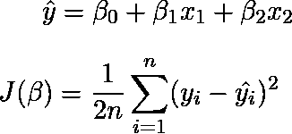

β_1、β_2:权重；β_0:偏倚；J(β):成本函数

你也想到 OLS 了吗？如果是，那么你就在正确的轨道上。但是线性回归不仅仅是 OLS！首先，让我们更仔细地看看 OLS。

# 内源性阿片样物质

这种技术的名字来自于成本函数。在这里，我们取误差平方和(基础事实和预测之间的差异),并试图将其最小化。通过最小化成本函数，我们获得了向量β(包含偏差和权重)的最优值。在下图中，显示了成本函数的等高线(同心椭圆)。最小化后，我们得到β作为中心点。

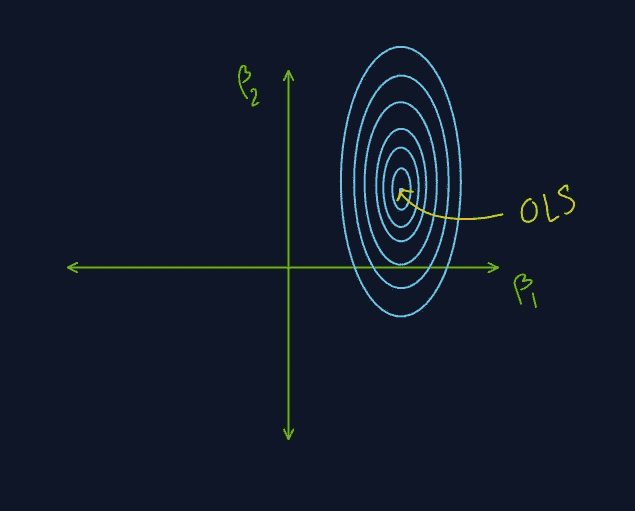

内源性阿片样物质

起初，OLS 似乎足以解决任何回归问题。但是随着我们增加特征的数量和数据的复杂性，OLS 倾向于过度拟合训练数据。过度拟合的概念非常广泛，值得单独写一篇文章(你可以找到很多这样的例子)，所以我会给你一个简要的介绍。过度拟合意味着模型已经很好地学习了训练数据，以至于无法进行概括。换句话说，该模型已经学习了训练数据中即使是小规模(不显著)的变化，因此它不能对看不见的(验证和测试)数据产生良好的预测。为了解决过度拟合的问题，我们可以使用许多技术。在我们的成本函数中增加一个正则化项就是这样一种技术。但是我们应该用什么术语呢？我们一般使用以下两种方法之一。

# 山脉

在这种情况下，我们将权重的**平方之和添加到我们的最小平方成本函数中。所以现在看起来像这样…**

m:β的 1+维；λ:正则化参数

但是这个术语如何防止过度拟合呢？增加这一项相当于对β的可能值增加了一个额外的约束。因为要达到最小成本，β _j 的总和一定不能超过某个值(比如 r)。这种技术可以防止模型对某些特征赋予比其他特征更大的权重，从而解决过度拟合问题。数学上，

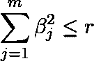

换句话说，β应该位于以原点为圆心，半径为√r 的圆内(或上)。这是可视化效果…

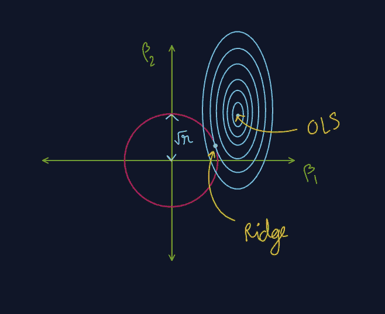

山脉

请注意，由于存在约束(红色圆圈)，β的最终值比在 OLS 中更接近原点。

# 套索

山脊和套索之间的唯一区别是正则化项。这里，我们将权重的绝对值的和添加到我们的最小二乘成本函数中。所以成本函数变成了…

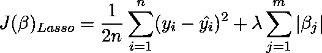

在这种情况下，约束可以写成…

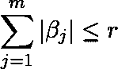

现在我们可以把约束想象成正方形而不是圆形。

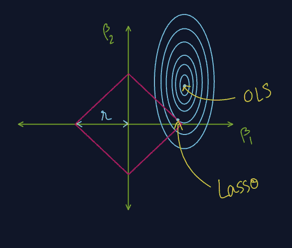

套索

值得注意的是，如果轮廓碰到正方形的一个角，则一个特征被完全忽略(权重变为 0)。对于高维特征空间，我们可以用这个技巧**减少特征的数量**。

> 注意:在正则化项中，我们不使用偏差(β_0 ),因为只有对应于特征的非常大的权重(β_i，对于 i>0)对过拟合有贡献。偏差项只是一个截距，因此与过拟合没有太大关系。

唷…这是很多关于正规化。上述方法的共同点是:它们的成本函数中都有残差/误差(地面真实预测)。这些误差平行于 y 轴。我们也可以考虑沿 x 轴的误差，并以类似方式进行。见下图。

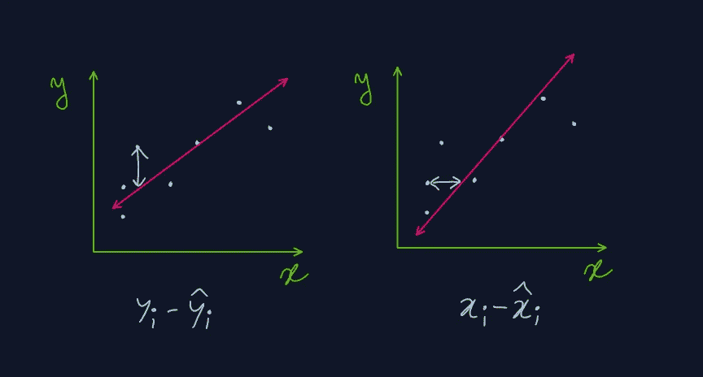

y 误差和 x 误差

如果我们使用一种不同的误差呢？

# 主轴(正交)回归

在这种情况下，我们考虑**两个方向** (x 轴和 y 轴)的误差。观察数据点和预测线之间的垂直距离的平方和将被最小化。让我们通过仅取一个特征来形象化这一点。

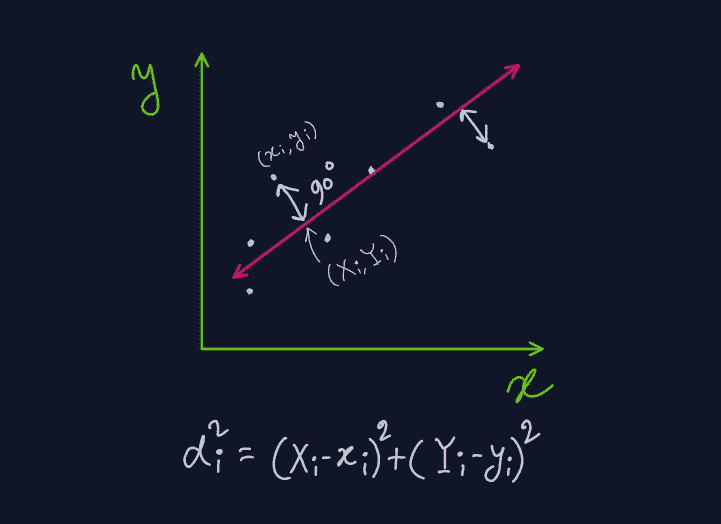

(X_i，Y_i):从最佳拟合线上的(x_i，y_i)绘制的垂线的脚

让我们的模型

然后通过最小化可以获得回归系数

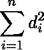

在约束下

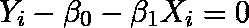

# 简化长轴回归

这与上面的方法非常相似，只是略有变化。这里，我们最小化由(X_i，Y_i)和(x_i，y_i)形成的矩形的面积之和。

缩减长轴

由 n 个数据点扩展的总面积是，

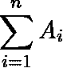

这里的约束条件与正交回归相同。

## 什么时候应该使用正交回归？

> 当研究变量(y)和解释变量(x)都存在不确定性时，应该选择正交和简化的主轴回归。

正交回归中有趣的一点是，它会产生对称的 y 误差和 x 误差。但是在 OLS，我们没有得到对称，因为我们要么最小化 y 误差，要么最小化 x 误差，而不是两者都最小化。

## 还好奇？看一个我最近做的视频…

我希望你喜欢阅读。下次见…学习愉快！