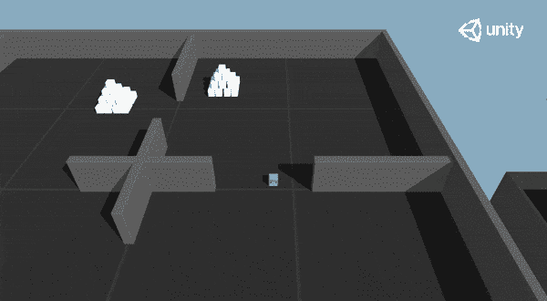

# 深入探究 Unity-ML 代理

> 原文：<https://towardsdatascience.com/diving-deeper-into-unity-ml-agents-e1667f869dc3?source=collection_archive---------11----------------------->

## [Unity-ML 代理课程](http://www.simoninithomas.com/unitymlagentscourse/)

## 训练一个好奇的特工去摧毁金字塔。

**我们推出了新的免费、更新、** [**深度强化学习课程从初学者到专家，用拥抱面对🤗**](https://huggingface.co/deep-rl-course/unit0/introduction?fw=pt)

👉新版教程:[https://huggingface.co/deep-rl-course/unit0/introduction](https://huggingface.co/deep-rl-course/unit0/introduction?fw=pt)

**下面的章节是以前的版本**，新版本在这里👉[https://huggingface.co/deep-rl-course/unit5/introduction?fw=pt](https://huggingface.co/deep-rl-course/unit5/introduction?fw=pt)

unity ML-代理

**我们推出了新的免费、更新、** [**从初学者到专家的深度强化学习课程，用拥抱面对🤗**](https://huggingface.co/deep-rl-course/unit0/introduction?fw=pt)

👉新版教程:[https://huggingface.co/deep-rl-course/unit0/introduction](https://huggingface.co/deep-rl-course/unit0/introduction?fw=pt)

下面的章节是以前的版本，新版本在这里👉[https://huggingface.co/deep-rl-course/unit5/introduction?fw=pt](https://huggingface.co/deep-rl-course/unit5/introduction?fw=pt)

[上一次](/an-introduction-to-unity-ml-agents-6238452fcf4c)，我们学习了 Unity ML-Agents 的工作原理，并训练了一个学会翻墙的代理。

这是一个很好的体验，但是我们想创造能够解决更复杂任务的代理。所以今天我们将训练一个**更聪明的机器人，它需要按下一个按钮来生成一个金字塔，然后导航到金字塔，撞倒它，并移动到顶部的金砖。**

为了训练这个寻找按钮然后摧毁金字塔新代理人，我们将使用两种奖励的组合，一种是环境给予的外在奖励。也是一种内在的好奇心。这一秒会促使我们的代理好奇，或者换句话说，更好地探索它的环境。

因此，今天**我们将了解深度强化学习中好奇心**这一强大想法背后的理论，并且**我们将训练这一好奇代理。**

我们开始吧！

# **深度 RL 中的好奇心是什么？**

*我已经在另外两篇文章***和***中详细介绍了好奇心，如果你想深入研究数学和实现细节的话。***

## **现代逆向物流中的两大问题**

**为了理解什么是好奇心，我们需要首先理解 RL 的两个主要问题:**

**首先是**稀疏奖励问题**:也就是说，大多数奖励不包含信息，因此被设置为零。**

**请记住，RL 是基于[奖励假设](https://medium.freecodecamp.org/an-introduction-to-reinforcement-learning-4339519de419)，即每个目标都可以被描述为奖励的最大化。因此，奖励是对 RL 代理的反馈，**如果他们没有收到任何反馈，他们对哪种行为是适当的(或不适当的)的知识不会改变。****

****

***由于奖励，我们的代理人知道在那个状态下的这个行动是好的***

**例如，在 Vizdoom“末日之家”中，你的代理只有在找到防弹衣时才会得到奖励。但是，马甲离你的起点很远，所以你的大部分奖励会是零。因此，如果我们的代理没有收到有用的反馈(密集的奖励)，它将需要更长的时间来学习一个最优策略，并且可能会花时间转来转去而找不到目标。**

****

**[非常感谢 Felix Steger 的这个插图](https://vimeo.com/felixsteger)**

**第二个大问题是**外在的奖励函数是手工的，也就是说，在每个环境中，一个人必须实现一个奖励函数**。但是我们如何在大而复杂的环境中扩展它呢？**

## **那么什么是好奇心呢？**

**因此，解决这些问题的一个方法是**开发一个奖励函数，该函数是代理固有的，即*，*由代理自身生成。**代理将充当自学者，因为它既是学生，也是自己的反馈主人。**

**这种内在的奖励机制被称为好奇心，因为这种奖励推动探索新奇/不熟悉的状态。为了实现这一目标，我们的代理人在探索新的轨迹时将获得高额报酬。**

**这种奖励实际上是根据人类的行为设计的，我们天生就有探索环境和发现新事物的本能欲望。**

**有不同的方法来计算这种内在奖励，Unity ML-Agents 通过下一状态预测方法使用**好奇心。****

## **基于预测的惊奇(或下一状态预测)引发的好奇心**

***我已经介绍过这个方法* [*这里*](https://medium.com/data-from-the-trenches/curiosity-driven-learning-through-next-state-prediction-f7f4e2f592fa) *如果你想深入到数学的细节。***

**所以我们刚才说，在不熟悉/新奇的状态下，好奇心很高。但是**我们如何计算这种“不熟悉”？****

**给定当前状态和采取的行动，我们可以将好奇心**计算为我们的代理预测下一个状态的误差。**更正式地说，我们可以将此定义为:**

****

**为什么？因为好奇心的想法是**鼓励我们的代理人执行减少代理人预测其自身行为后果能力的不确定性的行为**(在代理人花费较少时间的区域，或者在具有复杂动态的区域，不确定性会更高)。**

**如果代理在这些状态上花费很多时间，那么预测下一个状态(低好奇心)将是好的，另一方面，如果是一个未探索的新状态，那么预测下一个状态(高好奇心)将是不好的。**

**让我们进一步分解一下。假设你玩超级马里奥兄弟:**

*   **如果你在游戏开始的时候花了很多时间(这并不新鲜)，那么**代理就能准确预测到下一个状态会是什么**，那么奖励就会**低。****
*   **另一方面，如果你**发现一个新房间，**我们的代理将非常不擅长预测下一个状态，**所以代理将被推动去探索这个房间。****

****

**使用好奇号将促使我们的智能体倾向于预测误差较高的转换(在智能体花费时间较少的区域或具有复杂动态的区域，预测误差较高)**从而更好地探索我们的环境。****

**但是因为我们不能通过预测下一帧来预测下一个状态(太复杂了，无法直接预测像素)，**我们使用了更好的特征表示，它将只保留可以由我们的代理控制或影响我们的代理的元素。****

****

**而为了计算好奇心，**我们将使用文中介绍的一个模块，好奇心驱动的自我监督预测探索** [称为内在好奇心模块。](https://pathak22.github.io/noreward-rl/resources/icml17.pdf)**

****

***如果你想知道它的工作原理，* [*查看我们的详细文章*](https://medium.com/data-from-the-trenches/curiosity-driven-learning-through-next-state-prediction-f7f4e2f592fa)**

# **训练一名特工摧毁金字塔**

**现在，我们通过下一个状态预测了解了什么是好奇心，以及它是如何工作的，让我们来训练这个新的代理。**

***我们在 github 上发布了我们训练过的模型，你可以在这里下载* [*。*](https://github.com/simoninithomas/unity_ml_agents_course)**

## **金字塔环境**

**这个环境的目标是训练我们的代理人**获得金字塔顶端的金砖。为了做到这一点，他需要按一个按钮来产生一个金字塔，然后导航到金字塔，撞倒它，并移动到顶部的金砖。****

****

**奖励制度是:**

****

**在观察方面，我们使用的是 raycast 版本。有 148 个光线投射，但是探测开关、砖块、金砖和墙壁。**

**我们还使用一个布尔变量来表示开关状态。**

**动作空间是离散的，有 4 个可能的动作:**

****

**我们的目标是达到平均回报为 1.75 的基准。**

## **让我们摧毁一些金字塔！**

**首先我们打开 *UnitySDK 项目。***

**在示例中搜索*金字塔*并打开场景。**

**就像 WallJump，你可以在场景中看到很多代理，他们每个人都来自同一个预置，他们**都共享同一个大脑(策略)。****

****

**同一个代理预置的多个副本。**

**事实上，正如我们在经典的深度强化学习中所做的那样，当我们启动一个游戏的多个实例(例如 128 个并行环境)时，我们在此复制并粘贴代理，以便有更多不同的状态。**

**所以，首先，因为我们想从头开始训练我们的代理，**我们需要从代理预置中移除大脑。我们需要去预置文件夹并打开预置。****

**现在在预设层级中，选择代理*并进入检查器。***

**在*行为参数*中，我们需要移除*模型*。如果你有一些图形处理器，你可以改变推理设备从 CPU 到 GPU。**

****

**对于第一次训练，我们将只修改总训练步骤，因为它太高了，我们只能在 500k 的训练步骤中达到基准。为此，我们转到*config/trainer _ config . YAML*，您将这些修改为 *max_steps 到 5.0e5* 以用于金字塔情况:**

****

**为了训练这个代理，我们将使用 PPO(近似策略优化)，如果你不知道或者你需要更新你的知识，[查看我的文章](/proximal-policy-optimization-ppo-with-sonic-the-hedgehog-2-and-3-c9c21dbed5e)。**

**我们看到，为了训练这个代理，我们需要使用 Python API 调用我们的*外部通信器*。这个外部通讯器**会要求学院启动代理。****

**所以，你需要打开你的终端，到 ml-agents-master 所在的地方，输入这个。**

***ml agents-learn config/trainer _ config . YAML-run-id = " Pyramids _ first train "-train***

**它会要求你运行 Unity 场景，**

**按下编辑器顶部的▶️按钮。**

****

**您可以使用以下命令启动 Tensorboard 来监控您的训练:**

***tensor board—logdir = summaries***

## **看着你的特工翻墙**

**你可以在训练的时候通过查看游戏窗口来观察你的经纪人。**

**培训结束后，您需要将保存在 *ml-agents-master/models 中的模型文件移动到 unity SDK/Assets/ML-Agents/Examples/Pyramids/TF models。***

**再次打开 Unity 编辑器，选择*金字塔*场景。**

**选择*金字塔*预设对象并打开它。**

**选择代理**

**在*代理行为参数*中，拖动*金字塔. nn* 文件到模型占位符。**

****

**然后，按下编辑器顶部的▶️按钮。**

# **是时候做些实验了**

**我们刚刚训练我们的特工学会了翻墙。既然我们有了好的结果，我们可以尝试一些实验。**

**记住，最好的学习方法是通过实验保持活跃。所以你应该试着做一些假设并验证它们。**

**顺便说一下，有一个关于如何通过[沉浸式限制](https://www.immersivelimit.com/)超参数调谐金字塔环境的惊人视频，你一定要看。**

## **将时间跨度增加到 256**

**如[文档](https://github.com/Unity-Technologies/ml-agents/blob/master/docs/Training-PPO.md)、**中所解释的，时间范围是每个代理在将经验放入经验缓冲区之前要收集的经验步数。这在长期范围(偏差较小，但方差估计较高)和短期范围(偏差较大，但方差估计较小)之间进行权衡。****

**在这次体验中，**我们将时间跨度从 128 增加到了 256** 。增加它允许我们的代理**在他的行动序列中捕获比以前更多的重要行为。****

**然而，这并没有影响我们新代理的培训。事实上，他们分享了完全相同的结果。**

***我们在 github 上发布了我们训练过的模型，你可以在这里下载* [*。*](https://github.com/simoninithomas/unity_ml_agents_course)**

****

**今天就到这里吧！**

**你刚刚训练了一个比上次更聪明的特工。你也学到了深度强化学习中的好奇心。太棒了。**

**现在我们已经完成了，你可能**想更深入地了解 Unity ML-Agents** 。不要担心，下一次我们将创建我们自己的环境，下一篇文章我们将创建我们自己的强化学习实现。**

**因此在下一篇文章中，我们将从头开始创建我们的第一个环境。这个环境会是怎样的？我不想破坏现在的一切，但我给你一个提示:**

****

**向培根先生问好🐽**

**下次见！**

**如果你有任何想法，评论，问题，欢迎在下面评论或者发邮件给我:hello@simoninithomas.com，或者发推特给我 [@ThomasSimonini](https://twitter.com/ThomasSimonini) 。**

**不断学习，保持牛逼！**

**第三章:[玛雅奇遇](/unity-ml-agents-the-mayan-adventure-2e15510d653b)**