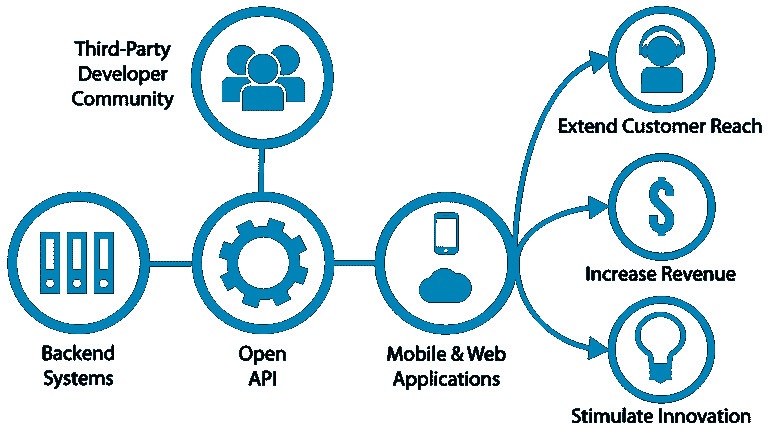
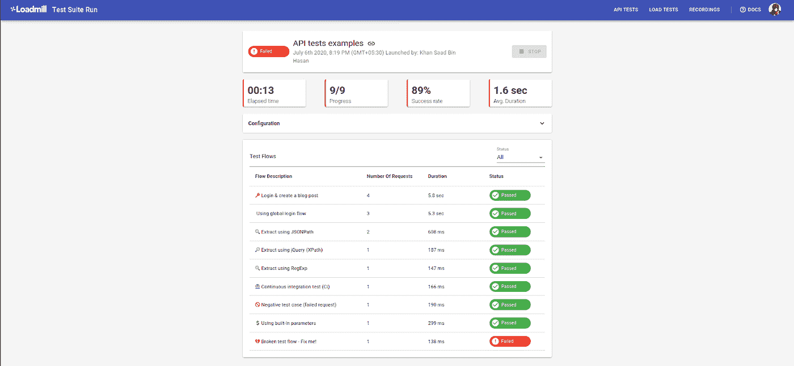

# 深入自动化 API 测试

> 原文：<https://towardsdatascience.com/diving-into-automated-api-tests-e08510c72e7?source=collection_archive---------21----------------------->

[来源](https://www.pxfuel.com/en/free-photo-xzbor)

*想到自动化，你会想到什么？机器人制造机器人，大型工厂生产产品，车辆自动驾驶，或者其他一些遥远的未来？嗯，自动化已经远远不止这些了。*

自动化意味着我们让某种机器在最少的人工协助下完成工作。大多数人可能想到的最常见的自动化[的例子是工厂。其中多台机器以同步方式工作，大量传送带环绕整个设施。](https://en.wikipedia.org/wiki/Automation)

[来源](https://commons.wikimedia.org/wiki/File:Factory_Automation_Robotics_Palettizing_Bread.jpg)

这个形象让很多人相信，很快所有的工厂都会这样运行。然而，自动化远比这种狭隘的视野更广阔。最重要的自动化每天都在我们的生活中发生，而我们甚至没有太注意它。

## 什么是 API，我们为什么需要它？

让我们举一个社交媒体应用程序的例子。你可能在社交媒体帖子里看到过地名。当我们点击它们时，它们会把我们带到一张地图上，给我们指出一个特定的地方。现在，这家社交媒体公司可能有了自己的地图服务。然而，更多的时候，它会使用第三方地图服务。

该第三方地图服务可能正在向许多其他应用程序提供服务。如果它允许所有应用程序使用它的原始数据库，至少会导致数据损坏。最坏的情况是数据完全毁坏(伴随着一些严重的诉讼)。因此，允许任何应用程序不受任何限制地使用其数据库是一种非常糟糕和不切实际的方法。

该服务提供商也不可能向所有应用程序发送数据副本，因为每个应用程序可能只需要非常小的数据子集。此外，数据必须尽快更新。此外，定期发送如此多的数据需要天文带宽的问题。

我们如何克服这些问题，以便地图服务可以将数据发送到社交媒体应用程序？

怎么样-地图服务提供了一组功能、工具和规则，用于通过适当的文档与社交媒体应用程序进行通信。使用这些服务，社交媒体应用程序可以获得所需的数据，而不会危及地图服务提供商的安全(当然，必须需要一些认证系统)。

这个由功能、工具和规则组成的*包被称为* [***API 或应用程序编程接口***](https://en.wikipedia.org/wiki/Application_programming_interface) ，因为它提供了与应用程序交互的接口。

[来源](https://en.m.wikipedia.org/wiki/File:Open-APIs-v5.png)

我喜欢把 API 想象成一台复杂机器上的一组按钮(比如一台带键盘的电脑:)。你可能希望这台机器为你做一些事情。你要做的就是用那些按钮来指挥它做你的工作。

例如，让机器包含一个地图数据库。现在，我们可以要求机器向我们提供关于某个特定坐标的信息，它会把这些信息悄悄告诉我们，而不需要我们关心它的内部工作情况或它有什么其他数据。这是与机器通信的相对安全的方式。

除了提供上述优势和服务之外，API 通常是跨平台的，可以与许多编程语言一起使用。这一点很重要，因为不止一个应用程序可能从一个服务请求数据。

例如，让我们再次考虑我们的地图服务。假设另一个应用程序想要使用它的数据。然而，这个应用程序使用的语言和平台与我们的社交媒体应用程序不同。它如何使用来自地图服务提供商的数据？

这里又出现了一个 API。API 应该能够与多种语言和平台一起工作，因此它应该有助于克服这个问题。

## 为什么要测试 API？

API 在我们的日常活动中非常有用。如果您正在使用任何类型的计算机设备，您可能会在不知不觉中使用 API。大多数应用程序和软件通过 API 进行通信。甚至软件的不同部分也通过 API 进行通信。

现在，如果您如此频繁地使用 API，一个自然的问题可能会出现。我如何知道哪个 API 最适合我？或者我如何确保我正在使用的 API 是安全的，并且按照预期工作。或者也许因为大多数软件都在使用 API，它们甚至是安全的吗？他们重视我的隐私吗？是否有任何漏洞可以被利用来访问我的数据。

API 为我们提供了一条通向公司数据库的通道。如您所料，如果 API 构建不当，它们可能会被用来窃取或破坏数据。因此，彻底测试我们的 API 是极其重要的。

然而，安全性并不是测试我们的 API 的唯一问题。我们还需要确保所有提供的功能都按预期工作。并且 API 可以处理它所声明的任意多的用户。我们还应该测试它在被拉伸到极限时是否有效。我们可能还需要考虑一些极限情况。

提供 API 的公司可能会使用人类来完成这项任务。但是可用的 API 的数量和人类执行这些测试所需的技能的数量会使它变得不可行。再加上应用程序与人工测试人员相比节省的时间，你会同意应用程序测试 API 比人工测试更好。

有许多可用的 API 测试工具。其中最受欢迎的是 JMeter，邮递员，[放心休息](https://en.wikipedia.org/wiki/Representational_state_transfer)。我发现了一个很棒的视频，它用例子解释了 REST API。我推荐你观看这个视频来获得更多关于 API 的信息。观看这个视频会让你感受到应用程序是如何被用来测试 API 的。我也强烈推荐这篇[博文](https://dzone.com/articles/api-testing-and-automation-101-the-essential-guide)。

到目前为止，我们已经确定了自动化的有用性。以及它在节约成本和效率方面的优越性。我们应该更深入地了解测试，以理解如何实现自动化，以及为什么自动化是一个合理的选择。

## 为什么我们应该自动化测试？

浏览网页时，您可能会看到类似“404 网站未找到”或“200 OK”的消息。这些消息对于理解我们的请求状态非常重要。例如，假设我们向服务器发送一个网页请求。它可能没有该网页，并可能返回特定代码。或者它可能拥有该网站或文件，并可能返回特定代码。

我们可以检查代码并获得关于我们请求的信息。因为我们知道发送什么请求和我们期望什么。我们可以将这些信息放在一个自动化工具中，让它在所有服务器上查询网站或文件。这将使测试自动化并帮助我们。

让我们考虑另一个例子。假设我们有大量代码的软件。如果你以前写过代码，你可能会遇到这个问题——你改变了一些小的东西，它破坏了整个代码。因此，如果开发人员改变代码中的一些小东西，就有可能破坏整个软件。

为了确保这种情况不会发生，我们进行了一系列测试。我们将这些上传到测试工具，每当我们对软件进行任何更改时，我们都会运行这些测试。如果发现一些问题，我们会在将代码提交到软件的源代码之前重新检查代码。这有可能为我们节省几个小时的头痛时间。

有许多 API 测试工具可供使用。我一直在用的是 [Loadmill](https://www.loadmill.io/) ，一个我觉得很有帮助的免费工具。让我们仔细看看这个工具，了解它在做什么，以及它如何帮助您的测试过程。

首先，我们必须选择我们想要运行的测试(或者进行我们自己的测试)。然后我们进行测试。最终结果可能是这样的:

来源:loadmill 的自动测试

你可以看到它运行了许多测试，这些测试可以被输入其中。这些测试可以在多个网站上运行。在这里，它运行 9 个测试，并报告所用的时间以及测试是失败还是通过。这里有 8 个测试已经通过，只有一个测试失败。

单击这些测试中的任何一个都会显示关于测试的更多信息，包括为什么测试通过或失败，或者哪里出错了。

# 最后的话

我希望我已经让你相信自动化确实非常有帮助，我们正在日常生活中使用它，甚至没有注意到它的效率或称赞它在使我们的生活更简单和更有成效方面的作用。

自动化并不是什么新鲜事。人类一直在寻找聪明的方法来自动化事情，以便他们可以专注于其他工作。我会考虑一个轮子作为自动化来解决走太多的问题。或者中世纪时用风车碾小麦。或者使用引擎来驱动汽车。

然而，最近越来越多的人认为自动化的兴起是一件消极的事情，会使人类变得无用。这种想法与事实相去甚远。自动化从一开始就已经存在，并且应该一直存在到后来。我们总能让事情变得更有效率。

对自动化持否定态度的人没有意识到，当发动机出现时，它们也取代了许多工作，但随着时间的推移，新的工作也创造出来了，总的来说，人类只是在进步。

即使现代技术已经走了很远，它仍然有很长的路要走，在每一步，都有许多人维护所有的工具，并努力使它们越来越好。此外，即使我们开发了一个程序来自动完成一项工作，我们也需要一些开发人员来维护这个程序。

我认为随着我们获取越来越多的数据，技术变得越来越好，将会有越来越多的任务被自动化。更明智的方法是找到可以自动化的任务，并尝试自动化它们，然后继续下一个任务。一旦一切完成，让我们集中精力去火星！