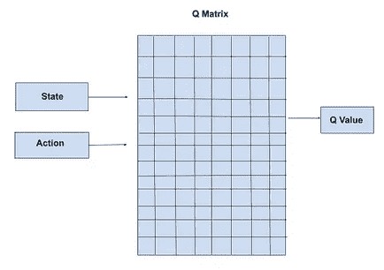
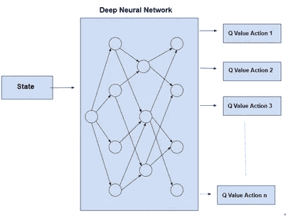
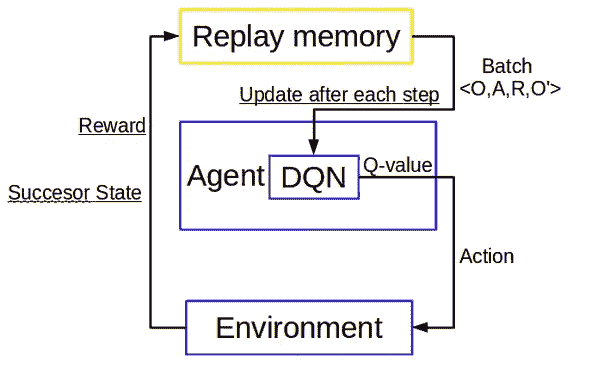

# 用深度 Q 学习潜入深度强化学习

> 原文：<https://towardsdatascience.com/diving-into-deep-reinforcement-learning-with-deep-q-learning-376e588bb803?source=collection_archive---------55----------------------->

## 从表格方法到函数逼近的过渡

在本文中，我们将了解如何开始深度强化学习。经常可以看到，列表 RL 方法比函数逼近方法更容易理解。很多人发现很难从 q 学习过渡到深度 q 学习。所以在这篇文章中，我们将仔细研究深度 Q 学习背后的思想。

## 什么是深度强化学习

我们先来了解一下什么是深度强化学习。深度强化学习由基于函数逼近的算法组成，即有一些函数逼近动作的 Q 值。这里，我们不是维护一个 Q 值表，而是使用像神经网络这样的函数来预测特定状态下的动作的 Q 值。

## 为什么要深度强化学习

你可能想知道，当我们可以简单地使用 Q 值的表格时，为什么我们需要神经网络。答案很简单，将每个 Q 值存储在一个表中会增加内存的使用，这对于具有大的状态空间和动作空间的环境是不可行的，我们的代理可能不会遇到一个状态甚至两次。使用神经网络可以让我们学习网络的权重，而不是学习单个的 Q 值。

表格法与函数逼近。图片由 [**阿灵古塔**](https://auth.geeksforgeeks.org/user/AlindGupta/articles) 经[https://www.geeksforgeeks.org/deep-q-learning/](https://www.geeksforgeeks.org/deep-q-learning/)

# 深度 Q 学习理念

让我们了解一下 Q 学习的概念和优化技巧。

1.  重放记忆:当我们的智能体在环境中行动并探索世界时，我们不会在旅途中训练神经网络。相反，我们将代理的所有经验存储在一个缓冲空间中，并通过随机抽取一批经验或优先化的经验来训练我们的模型。这背后的想法是，神经网络可以找到创建的 b/w 状态，并且可能倾向于过度拟合，并且在新状态下可能无法正常工作。
2.  目标网络:深度 Q 学习使用的不是一个而是两个神经网络。这不是强制性的，但是具有两个网络可以优化性能，并且还可以解决移动目标的问题。当智能体使用相同的神经网络估计 Q 值和目标值时，出现移动目标。因此，为了避免移动目标，我们使用另一个具有固定参数的神经网络(目标网络),并且目标网络定期更新。
3.  堆叠的帧:如果你使用一个图像作为一个状态，那么一堆多个图像可以用来代表一个状态。这种堆叠的图像给代理一种运动感，从而有助于采取正确的行动。
4.  行动选择:许多行动选择技术可以用于探索，如 epsilon greedy，softmax。在这些技术中，Softmax 动作选择要好得多，因为它会在一段时间后自动停止探索。在本文中，我们将使用 greedy。

## 算法:

深度 Q 学习的步骤如下:

1.  代理观察环境的当前状态。如果随机数小于或等于ε，则代理将采取随机行动，否则 DQN 预测 Q 值，并采取最大 Q 值的行动。
2.  下一个状态、奖励和一个终端变量存储在重放内存中。
3.  经过一段时间，当记忆中有足够的例子时，代理通过抽样一批经验来训练 DQN。当前状态集被视为特征，标签是目标值，计算为[Traget = set _ of _ reward+gamma * numpy . max(target _ net . predict(set of next _ state))* set _ of _ done]。这里的 done 是这里使用的终端变量，因此终端状态的值为零。
4.  目标网络定期更新主网络。

图片 via [dnddnjs.gitbooks.io](https://dnddnjs.gitbooks.io/rl/content/deep_q_networks.html)

你可以在这里找到代码。我将在下一篇文章中解释代码

感谢你阅读我的文章，希望你喜欢并且能够理解我想要解释的东西。希望你阅读我即将发表的文章。哈里奥姆…🙏

# 参考资料:

 [## 强化学习

### 由阿尔伯塔大学提供。强化学习专业化包括 4 门课程探索权力…

www.coursera.org](https://www.coursera.org/specializations/reinforcement-learning) 

[https://MIT press . MIT . edu/books/reinforcement-learning-second-edition](https://mitpress.mit.edu/books/reinforcement-learning-second-edition)