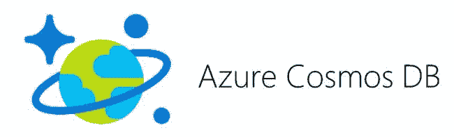
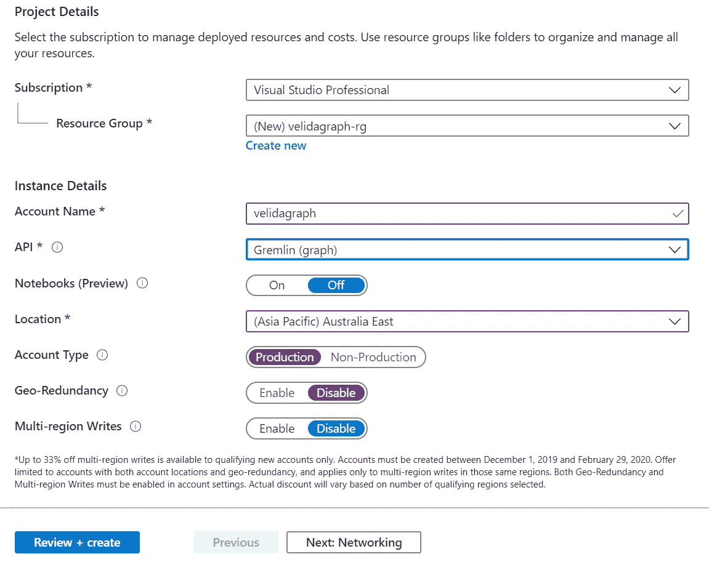
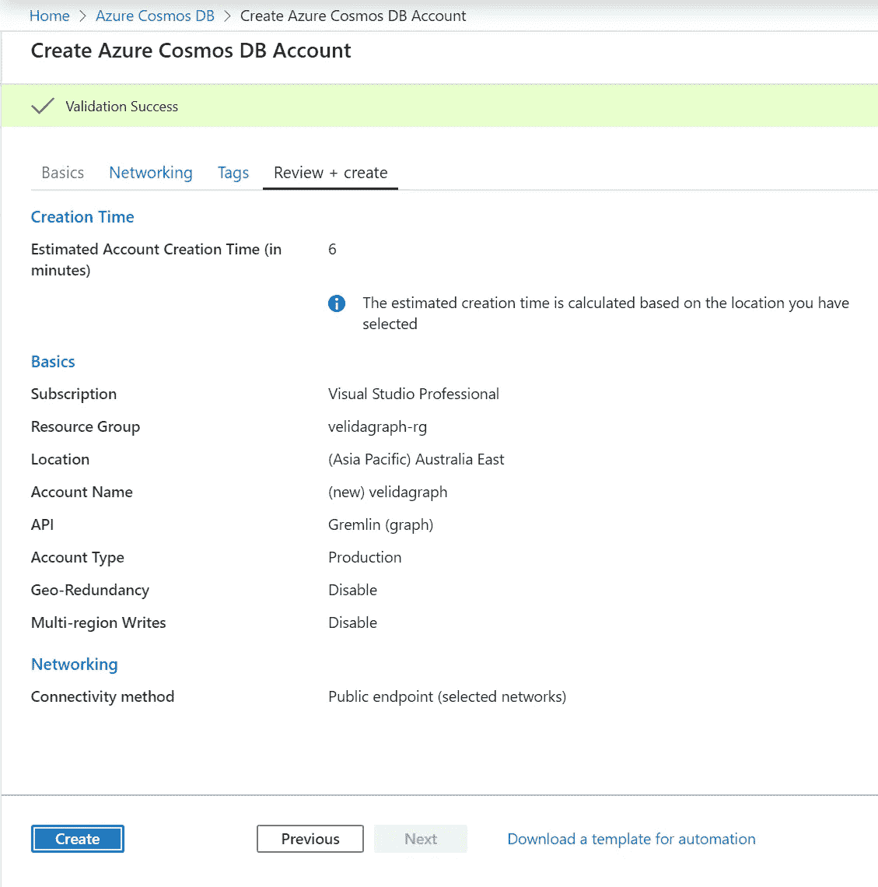
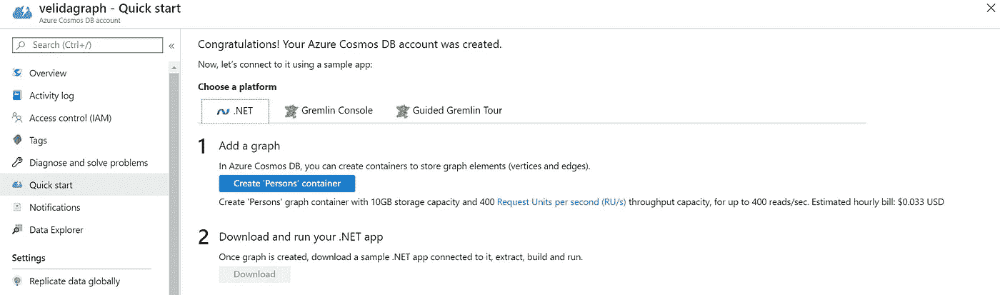
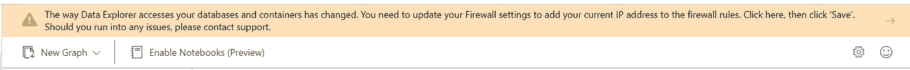
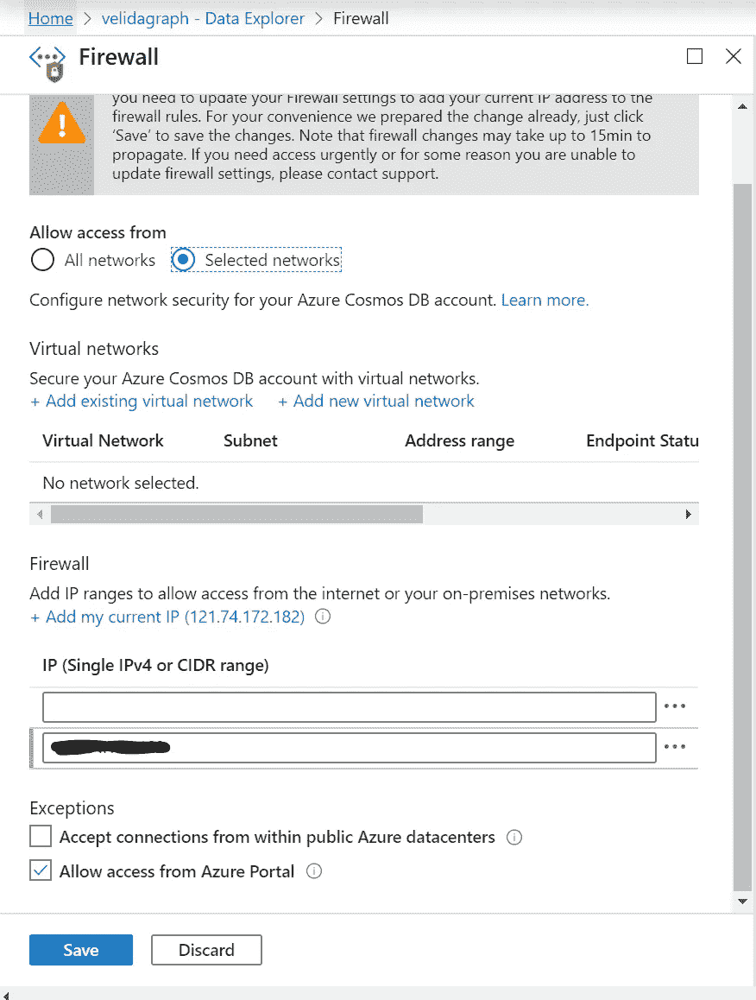
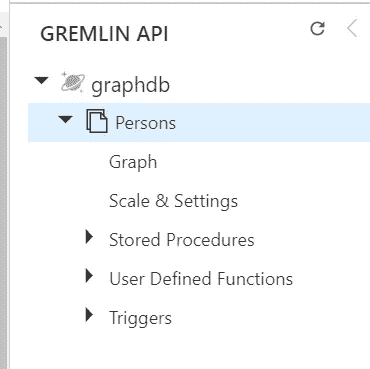
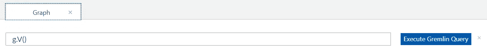
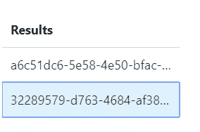
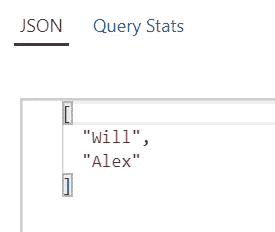

# 深入 Azure Cosmos DB 中的 Gremlin 查询

> 原文：<https://towardsdatascience.com/diving-into-gremlin-queries-in-azure-cosmos-db-83eb1d7c6350?source=collection_archive---------15----------------------->

## 使用 Azure Cosmos DB Gremlin API 执行图形查询的简单介绍



感谢 Azure Cosmos DB 提供的 [Gremlin API，我们可以构建全球分布式数据库来存储和操作图形数据。我们可以使用](https://docs.microsoft.com/en-us/azure/cosmos-db/graph-introduction) [Gremlin 查询语言](https://tinkerpop.apache.org/gremlin.html)在 Cosmos DB 中执行图形查询。

在本文中，我将向您展示如何设置一个支持 Gremlin API 的 Cosmos DB 帐户，以及如何在该帐户中执行一些简单的图形查询。


小妖精吉祥物挺可爱的 IMO:)

如果你想跟进，你需要设置 Azure 订阅。看看这个[链接](https://azure.microsoft.com/en-us/free/search/?&ef_id=Cj0KCQiAtOjyBRC0ARIsAIpJyGOI7zkc0-5H_AIx-DTNAIFceyFTzbj-0QuLR3KABrICZ98KG6qJagkaAngdEALw_wcB:G:s&OCID=AID2000101_SEM_mOdqImR2&MarinID=mOdqImR2_324818828064_%2Bazure%20%2Bsubscription_b_c__69066121910_aud-397602258452:kwd-301997157783&lnkd=Google_Azure_Brand&dclid=CjgKEAiAtOjyBRDM1YzS7I6N1RQSJADOz68DSttG5JBrHK-Te2XPUhH5dsDv_2pGP1dSCHujbiH-rvD_BwE)如何做到这一点。要不，我们开始吧！

**设置我们的图形数据库**

让我们从创建图形数据库开始。进入你的 Azure 门户，点击“**创建新资源**”。搜索 Azure Cosmos DB 并点击“**‘创建新的**”。

为了创建我们的图形数据库，我们需要提供一些基本信息:

*   **订阅** —本质上是将向您的 Cosmos DB 帐户收费的订阅。
*   **资源组** —资源组对于管理 Azure 资源集合非常有用。在本教程结束时，我们可以删除一个组中的所有资源，而不是逐个删除资源。您可以将您的 Cosmos DB 帐户分配给预先存在的资源组，或者为其创建一个新的资源组。我决定在本教程中创建一个新的。
*   **API** —我们可以创建不同种类的 Cosmos DB 数据存储库，具体取决于我们分配给它的 API。在本例中，我们正在创建一个图形数据库，因此我们将选择 Gremlin (Graph) API。
*   **笔记本** —爱 Jupyter 笔记本？Cosmos DB 支持这一点！这超出了本教程的范围，所以我不打算启用它。
*   **位置** — Cosmos DB 是 Azure 中的一项基础服务，这意味着它在所有 Azure 地区都可用。选择一个离你最近的地区。在我的例子中，我位于新西兰的奥克兰，所以我将我的数据库部署在澳大利亚东部。
*   **账户类型** —这是新的？！我以前从未经历过这种事。悬停在工具提示上，看起来它与 UI 体验的工作方式有关。我将不得不对此做更多的调查，但现在，我只是把它投入生产。你可以改变它，它不会影响引擎。
*   **地理冗余和多区域写入** —我现在已经禁用了这个。

请看下面的截图示例:



点击**审查+创建**，你将被重定向到一个验证页面。我们暂时不需要担心网络或标签。如果您的配置有效，您将看到一条成功消息，您可以单击“ **Create** ”来提供您的图形数据库！



在本教程中，我们将使用 Cosmos DB 为所有新的 graph 帐户提供的示例图。为此，点击**快速启动**。您将被要求选择一个平台来创建一个示例应用程序，但是我们在这里所做的只是用一些示例数据创建一个容器。

Cosmos DB 团队有一个我们可以使用的 Persons 容器，所以单击 Create ' *Persons* '容器就足够了。



点击“**数据浏览器**”导航至您的图表。

这是新的吗？他们改变了数据浏览器的工作方式！看起来我们必须将当前的 IP 地址添加到防火墙规则中才能看到我们的数据？(非常 Azure SQL，如果你之前用过 Azure SQL 的话)。



单击通知，您将被重定向到防火墙设置选项卡。您的 IP 地址应该已预先填入下面的防火墙部分，因此只需单击“**保存”**即可将您的 IP 地址添加到允许访问列表中。几分钟后你应该可以走了。



一旦这些都完成了，导航回数据浏览器，我们应该在我们的 Cosmos DB 帐户中看到我们的新人员图表。



好了，这就是我们需要做的所有管理设置，让我们开始深入一些令人敬畏的图形查询！

**在我们的图形数据库中执行查询**

让我们从在 Persons 图表中插入几个项目开始。打开您的数据浏览器，您应该会看到一个允许我们执行 Gremlin 查询的文本框。



让我们从在图表中添加 5 个人开始。键入以下 Gremlin 查询:

```
# Add Will Velida
g.addV('person').property('firstName', 'Will').property('lastName', 'Velida').property('age', 28).property('hairColor', 'blonde').property('userId', 1).property('pk', 'pk')g.addV('person').property('firstName', 'Alex').property('lastName', 'Smith').property('age', 22).property('hairColor', 'brown').property('userId', 2).property('pk', 'pk')g.addV('person').property('firstName', 'Mike').property('lastName', 'Jones').property('hairColor', 'black').property('userId', 2).property('pk', 'pk')g.addV('person').property('firstName', 'Sarah').property('lastName', 'Smith').property('hairColor', 'blonde').property('userId', 4).property('pk', 'pk')g.addV('person').property('firstName', 'Debbie').property('lastName', 'Stevens').property('hairColor', 'black').property('age', 57).property('userId', 5).property('pk', 'pk')
```

我们在这里做的是添加 5 个人的顶点。在我们的图中，顶点是离散的实体。在这个例子中，我们使用人作为顶点，但是他们也可以是地点或事件。

让我们更深入地了解一下每个 Gremlin 命令在做什么:

*   **addV()** —这为我们的图形添加了一个顶点(我们的离散实体)。
*   **属性()** —这为我们的垂直市场增加了一个属性

现在让我们添加一些顶点之间的关系。这些在图形数据库中被称为边。让我们编写以下查询:

```
g.V().hasLabel('person').has('firstName', 'Will').addE('knows').to(g.V().hasLabel('person').has('firstName', 'Alex'))g.V().hasLabel('person').has('firstName', 'Alex').addE('knows').to(g.V().hasLabel('person').has('firstName', 'Mike'))
```

让我们检查一下新的 Gremlin 查询:

*   **add()**—两个顶点之间有一条边(关系)。
*   **has()** 和 **hasLabel()** —用于过滤属性、顶点和边。在本例中，我们根据'*first name*'属性进行筛选。

我们可以用这样的命令更新我们的顶点:

```
g.V().hasLabel('person').has('firstName', 'Mike').property('userId', 3)
```

让我们尝试过滤我们的人员集合。让我们检索年龄小于 30 的所有顶点:

```
g.V().hasLabel('person').has('age', lt(30))
```

在这里，我们得到两个结果:



我们可以进一步细化这个查询，只返回名称属性:

```
g.V().hasLabel('person').has('age', lt(30)).values('firstName')
```

这将返回以下结果:



最后，让我们在图中执行一个简单的遍历，找出 Alex 认识的所有人:

```
g.V().hasLabel('person').has('firstName', 'Alex').outE('knows').inV().hasLabel('person')
```

我们可以看到，他认识一个人，迈克·琼斯:

```
[
  {
    "id": "c2260feb-207b-403b-82cb-30cd47006912",
    "label": "person",
    "type": "vertex"
    "properties": 
    "firstName": [
    {
      "id": "1a383c60-82ce-414b-a610-8c2b9ab08759",
      "value": "Mike"
    }
    ]
    "lastName": [
    {
      "id": "1a1a762a-dace-4912-aa16-e87f4327d1a7",
      "value": "Jones"
    }
    ],
    "hairColor": [
    {
      "id": "5f71ca42-1cf0-4da4-93a9-c24693975e56",
      "value": "black"
    }
    ],
    "userId": [
    {
      "id": "9e06cf3a-e58a-494f-aaf2-e0f1e2940cce",
      "value": 3
    }
    ],
    "pk": [
    {
      "id": "4f27fd02-1861-480a-8887-4b40c8c7d6c6",
      "value": "pk"
    }
    ]
    }
  }
]
```

**评估图形查询的性能**

这是非常酷的东西，但是我已经听到你们中的一些人说‘我如何测量这些查询的性能？’。

Gremlin 查询语言有一个名为 **executionProfile()** 的方法，它允许我们查看查询执行情况的指标。让我们将这个方法附加到前面的查询中，看看它是如何执行的:

```
g.V().hasLabel('person').has('firstName', 'Alex').outE('knows').inV().hasLabel('person').executionProfile()
```

这是我们得到的回应:

让我们来看看以下属性:

*   **gremlin** —被执行的语句。
*   **总时间** —操作所用的时间，以毫秒为单位
*   **指标** —在我们的 gremlin 查询中执行的每个步骤的指标。这些分为 **GetVertices** (获取我们的属性) **GetEdges** (查看我们的顶点之间的关系是什么)和**get neighborhood vertices**(查看哪些顶点有什么关系)。这些指标包括执行查询所用的时间(以毫秒计)、总查询执行时间的百分比时间、返回的结果数量、计数和大小。

**结论**

在本文中，我们建立了一个新的 Cosmos DB 图形数据库，并在其中执行了一些基本查询。我们还研究了如何评估这些查询的性能。如果您已经完成了这个图形数据库，请随意删除它。否则，为什么不添加更多的属性，看看 Cosmos DB Graph 文档，看看还能用 Gremlin 查询做些什么。

在以后的文章中，我将讨论如何为图形数据库建模数据，并查看一些最佳实践。我还将讨论我们如何在为 Azure Cosmos DB 开发应用程序的上下文中应用这些概念。

如果你有任何问题，请在下面的评论区提问。

下次见！