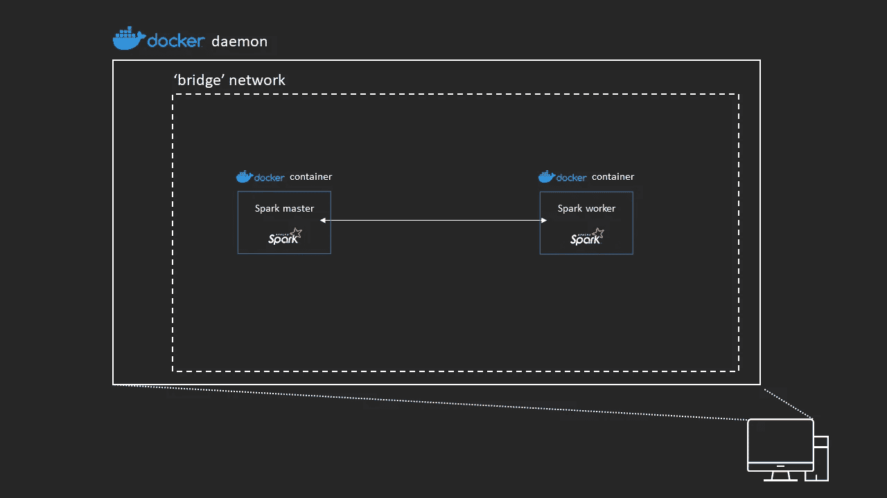
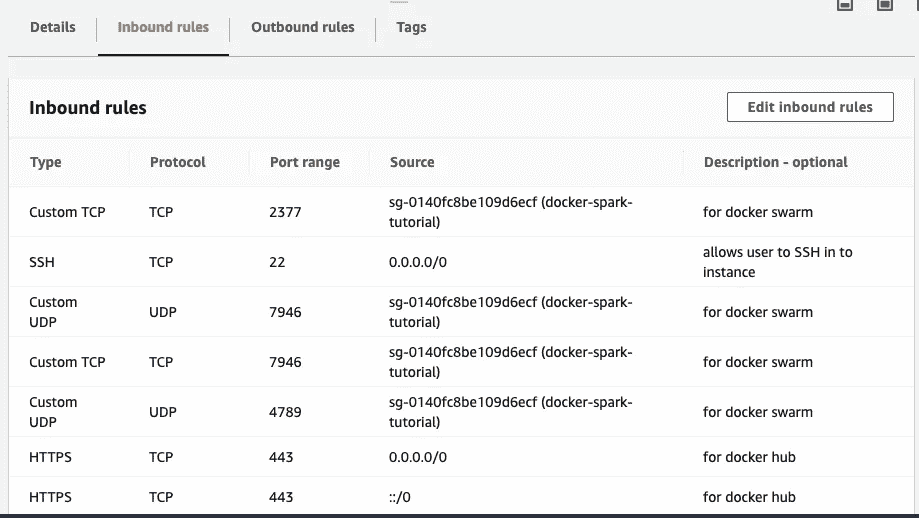

# DIY: Apache Spark & Docker

> 原文：<https://towardsdatascience.com/diy-apache-spark-docker-bb4f11c10d24?source=collection_archive---------3----------------------->

## 全民数据科学

## 被亲切地称为“黑暗”或“斯波克”


在 Docker 容器内运行的完全分布式 Spark 集群

# 介绍

在过去几年中流行起来的两种技术是 Apache Spark 和 Docker。

Apache Spark 为用户提供了一种以分布式方式执行 CPU 密集型任务的方法。与 Hadoop 等其他分布式技术相比，它的速度更快，因此在过去几年中，它的采用率一直在稳步上升。2014 年 [Spark 赢得了 Gray Sort 基准测试](https://spark.apache.org/news/spark-wins-daytona-gray-sort-100tb-benchmark.html),在该测试中，他们对 100TB 数据的排序速度比以前的 Hadoop 集群快 3 倍，使用的机器数量少 10 倍。

另一方面，Docker 在各种情况下被广泛采用。Docker 为用户提供了定义环境最小规格的能力，这意味着您可以轻松地开发、发布和扩展应用程序。此外，由于使用了 linux 容器，用户可以开发 Docker 容器，这些容器可以在一台服务器上同时运行，同时保持相互隔离。最后，Docker 提供了一个名为 Docker Engine 的抽象层，它保证了可以运行 Docker 的机器之间的兼容性，解决了“它在我的机器上可以工作，我不知道为什么它在你的机器上不能工作”这个老问题。

随着大数据的兴起，这两种技术是天作之合。Apache Spark 提供分析引擎来处理数据，Docker 提供快速、可扩展的部署以及一致的环境。

## 先决条件

我假定您了解 Docker 命令和术语以及 Apache Spark 概念。因此，如果您对这两种技术都不熟悉，我不推荐您阅读本文。出于简洁的考虑，本文将有意省略正在发生的事情的大部分细节。对于架构的完整描述和更连续的过程，我将读者引向我的 [github repo](https://github.com/sdesilva26/docker-spark/blob/master/TUTORIAL.md) 。

我还假设您至少有云提供商的基本经验，因此能够在您的首选平台上设置一个计算实例。

本文的其余部分将直接介绍不同层次的架构复杂性:

1.  Docker 容器网络—本地机器
2.  Docker 容器网络—多台机器
3.  Apache Spark 集群—本地机器
4.  Docker & Spark —本地机器
5.  Docker & Spark —多台机器
6.  奖励:Docker Stack 和 Spark

我们开始吧！

【[来源](https://giphy.com/gifs/reaction-typing-unpopular-opinion-13GIgrGdslD9oQ/links)

# Docker —本地机器

首先，我们需要掌握一些基本的 Docker 网络。首先，我们将对运行在同一台机器上的容器执行此操作。

1.  要做的第一件事是使用 my repo 中的[docker 文件](https://github.com/sdesilva26/docker-spark/tree/master/docker)构建 docker 映像，或者更方便的是使用以下命令提取 docker 映像

```
docker pull sdesilva26/spark_master:0.0.2
docker pull sdesilva26/spark_worker:0.0.2
```

*注意:为了这个部分的目的，任何图像都可以。*

2.通过运行以下命令创建桥接网络

```
docker network create --driver bridge spark-net-bridge 
```

3.通过运行以下命令，在这个用户定义的桥接网络上运行两个容器

```
docker run -dit --name spark-master --network spark-net-bridge --entrypoint /bin/bash sdesilva26/spark_master:0.0.2
docker run -dit --name spark-worker1 --network spark-net-bridge --entrypoint /bin/bash sdesilva26/spark_worker:0.0.2 
```

4.检查网络并找到两个容器的 IP 地址

```
docker network inspect spark-net-bridge
```

上面的输出应该如下图所示


5.连接到 spark-master 容器，使用它的 IP 地址和容器名测试它与 spark-worker 容器的通信

```
ping -c 2 172.24.0.3
ping -c 2 spark-worker
```

因为容器已经被部署到相同的 Docker 桥网络中，所以它们能够使用容器的名称来解析其他容器的 IP 地址。这叫做**自动服务发现**，以后会给我们很大帮助。

## 体系结构

使用上述命令，我们创建了以下架构。



# Docker —多台机器

1.  继续在您最喜欢的云提供商上设置 2 个实例
2.  在配置实例的网络时，确保将它们部署到同一个子网中
3.  打开以下端口，以便容器相互通信，并用于覆盖网络流量(入站和出站)；

```
Protocol  |  Port(s)  | Source
TCP       |  2377     | <your-security-group-or-subnet-name>
TCP       |  7946     | <your-security-group-or-subnet-name>
UDP       |  7946     | <your-security-group-or-subnet-name>
UDP       |  4789     | <your-security-group-or-subnet-name>
```

4.打开以下端口，以便实例与 docker hub 进行通信(入站和出站)；

```
Protocol  |  Port(s)  | Source
HTTPS     |  443      | 0.0.0/0, ::/0
```

例如，在 AWS 上，我的两个实例部署在其中的安全组具有以下安全组设置



其中"[SG-0140 fc 8 be 109 D6 ECF](https://eu-west-2.console.aws.amazon.com/ec2/v2/home?region=eu-west-2#SecurityGroup:groupId=sg-0140fc8be109d6ecf)(docker-spark-tutorial)"是安全组本身的名称，因此只有来自网络内部的流量可以使用端口 2377、7946 和 4789 进行通信。

5.安装 docker。

```
sudo yum install docker -y
sudo service docker start
sudo usermod -a -G docker ec2-user # This avoids you having to use sudo everytime you use a docker command (log out and then in to your instance for this to take affect)
```

6.在实例 1 中，提取您选择的 docker 图像。

```
docker pull sdesilva26/spark_master:0.0.2
```

7.将另一个图像拖到实例 2 上。

```
docker pull sdesilva26/spark_worker:0.0.2
```

8.初始化 docker 群，并通过运行以下命令使实例 1 成为群管理器

```
docker swarm init
```

在实例 1 上。

9.从实例 1 复制上面命令的输出，并在实例 2 上运行它，以作为工作者节点加入群

10.在实例 1(群管理器)上创建一个覆盖网络

```
docker network create -d overlay --attachable spark-net
```

11.在实例 1 上，运行一个容器

```
docker run -it --name spark-master --network spark-net --entrypoint /bin/bash sdesilva26/spark_master:0.0.2
```

12.在实例 2 中，在 swarm manager 创建的覆盖网络中运行一个容器

```
docker run -it --name spark-worker --network spark-net --entrypoint /bin/bash sdesilva26/spark_worker:0.0.2
```

13.从实例 2 上的容器内部，通过 ping 实例 1 上运行的容器来检查容器通信

```
ping -c 2 spark-master
```

14.同样，检查从实例 1 中的容器到实例 2 中的容器的向后连接

```
ping -c 2 spark-worker
```

像以前一样，容器能够仅使用容器名称来解析彼此的 IP 地址，因为它们在相同的覆盖网络内。

## 体系结构

按照上面的说明，您已经创建了一个类似于下面的架构。


# Apache Spark —本地机器

现在我们已经掌握了如何让两个不同的 docker 主机进行通信，我们将开始在本地机器上创建一个 Spark 集群。

1.  从他们的[网站](https://spark.apache.org/downloads.html)安装 Spark
2.  从命令行导航到 Spark 安装的 bin 目录
3.  设置 Spark 主节点

```
./spark-class org.apache.spark.deploy.master.Master
```

4.通过导航到 [http://localhost:8080，检查您主节点是否已经成功部署。](http://localhost:8080.)您应该会看到以下内容


5.将一个工作节点连接到群集

```
./spark-class org.apache.spark.deploy.worker.Worker -c 1 -m 3G spark://localhost:7077
```

其中这两个标志定义了您希望该工作线程拥有的内核和内存数量。最后一个输入是前缀为“spark://”的主节点的地址和端口，因为我们使用的是 spark 的独立集群管理器

6.通过返回到 [http://localhost:8080，检查 worker 是否已成功注册到主节点。](http://localhost:8080.)现在，您应该看到 worker 节点是集群的一个资源。(您也可以通过访问 http://localhost:8081 来检查 worker 的 UI)


7.通过从 spark 安装的 bin 目录中打开一个 scala shell 来测试集群

```
./spark-shell --master spark://localhost:7077
```

和跑步

```
val NUM_SAMPLES=10000
var count = sc.parallelize(1 to NUM_SAMPLES).filter { _ =>
  val x = math.random
  val y = math.random
  x*x + y*y < 1
}.count() * 4/(NUM_SAMPLES.toFloat)
```

这将返回圆周率的估计值。

8.通过转到 [http://localhost:4040 检查应用程序的 UI。](http://localhost:4040.)您应该会看到类似于


你现在有一个功能齐全的火花簇！

# **火花&对接机—本地机**

现在是时候将两者结合起来了。我们现在将通过在本地机器上的 Docker 容器中设置一个运行的 Spark 集群来学习先走后跑

1.  创建一个用户定义的桥接网络(如果您还没有这样做)

```
docker create network -d bridge spark-net
```

2.在桥接网络内部创建一个 Spark 主节点

```
docker run -it --name spark-master --network spark-net -p 8080:8080 sdesilva26/spark_master:0.0.2 bash
```

3.通过导航到 [http://localhost:8080](http://localhost:8080) ，检查容器是否成功启动了 Spark 主节点。我已经将 sdesilva26/spark_master:0.0.2 映像设置为默认设置一个主节点。参见[文档](https://github.com/sdesilva26/docker-spark/blob/master/docker/Dockerfile_master)。

4.在桥接网络内部创建一个 Spark 工作节点

```
docker run -dit --name spark-worker1 --network spark-net -p 8081:8081 -e MEMORY=2G -e CORES=1
  sdesilva26/spark_worker:0.0.2 bash
```

缺省情况下，sdesilva26/spark_worker:0.0.2 映像在运行时将尝试加入一个 spark 集群，其主节点位于 spark://spark-master:7077。

如果您更改运行 Spark 主节点的容器的名称(步骤 2)，那么您需要将这个容器名称传递给上面的命令，例如-e <master_container_name>。见 [dockerfile 此处](https://github.com/sdesilva26/docker-spark/blob/master/docker/Dockerfile_worker)。</master_container_name>

5.同样，通过导航到 [http://localhost:8080](http://localhost:8080) 和 [http://localhost:8081，验证工作者已经成功注册到主节点。](http://localhost:8081.)

6.将第二个 spark worker 连接到集群

```
docker run -dit --name spark-worker2 --network spark-net -p 8082:8081 -e MEMORY=2G -e CORES=1
  sdesilva26/spark_worker:0.0.2 bash
```

我们必须对步骤 4 中的命令进行的唯一更改是，我们必须给容器一个惟一的名称，而且我们必须将容器的端口 8081 映射到本地机器的端口 8082，因为 spark-worker1 容器已经在使用您的本地机器的端口 8081。

7.旋转 Spark 提交节点

```
docker run -it --name spark-submit --network spark-net -p 4040:4040 sdesilva26/spark_submit bash
```

您现在应该在 spark-submit 容器中了。

8.打开一个 scala shell 并连接到 Spark 集群

```
$SPARK_HOME/bin/spark-shell --conf spark.executor.memory=2G --conf spark.executor.cores=1 --master spark://spark-master:7077
```

和前面一样，如果运行 spark 主节点的容器的名称不同于 spark-master，那么可以用-master Spark://<your_master_container>:7077 来更改上面的命令。</your_master_container>

上面的命令还要求在您的集群上，您希望每个执行器包含 2G 内存和 1 个内核。Spark 主节点将分配这些执行器，前提是每个 worker 上有足够的资源来允许这样做。有关执行者和工作者的解释，请参见下面的[文章](https://www.informit.com/articles/article.aspx?p=2928186)。

9.在交互式 scala shell 中运行一个示例作业

```
val myRange = spark.range(10000).toDF("number")val divisBy2 = myRange.where("number % 2 = 0")divisBy2.count()
```

10.通过导航到 [http://localhost:4040 来检查应用程序 UI。](http://localhost:4040.)您应该会看到以下内容


您刚刚在 Docker 容器中运行了一个 Spark 作业。斯波克出生了！

## 体系结构

我们在上面所做的是在 Docker 中创建一个网络，我们可以在其中部署容器，它们可以自由地相互通信。

下图中的白色箭头表示容器之间的开放通信。容器上的端口显示为绿色，本地机器上的端口显示为黄色。

您可以看到所有容器都部署在桥接网络中。如果我们现在在这个网络之外部署一个容器，它将不能仅仅通过使用它们的容器名来解析其他容器的 IP 地址。


# Docker & Spark —多台机器

现在让我们把所有东西包装在一起，形成一个完全分布式的 Spark 集群，在 Docker 容器中运行。

*注意:对于这一部分，你需要使用我已经创建的 3 个图像。*

```
docker pull sdesilva26/spark_master:0.0.2
docker pull sdesilva26/spark_worker:0.0.2
docker pull sdesilva26/spark_submit:0.0.2
```

您也可以通过下载[docker 文件](https://github.com/sdesilva26/docker-spark/tree/master/docker)自己构建它们

1.  在您选择的云提供商上启动一个实例，并使其成为 docker swarm manager

```
docker swarm init
```

2.将上述命令的输出复制并粘贴到至少两个其他实例中。我已经在另外 4 个实例上这样做了——3 个将充当 Spark workers，1 个将作为我的 Spark 提交节点

3.在实例 1 上，像我们之前所做的那样创建一个覆盖网络

```
docker network create -d overlay --attachable spark-net
```

4.运行 spark_master 映像来创建一个将成为 spark 主节点的容器

```
docker run -it --name spark-master --network spark-net -p 8080:8080 sdesilva26/spark_master:0.0.2
```

5.通过将以下内容添加到安全组的入站规则中，打开端口 8080–8090 和 4040

```
Protocol    |  Port(s)   | Source
Custom TCP  |  8080-8090 | 0.0.0/0
Custom TCP  |    4040    | 0.0.0/0, ::/0
```

*注意:在 AWS 中，安全组是有状态的，所以从实例到用户的返回流量是自动允许的，所以不需要修改安全组的出站规则。在其他云提供商上，您可能需要在出站规则中添加类似的规则。*

我的入站安全组规则现在看起来像这样


6.在 http:// <public_ipv4_address_of_instance>:8080 查看 Spark 主节点 UI。您应该会看到与我们之前看到的相同的 UI。</public_ipv4_address_of_instance>

7.现在，在您的另一个实例上运行以下命令，将一个 Spark worker 节点连接到集群

```
docker run -it --name spark-worker1 --network spark-net -p 8081:8081 -e MEMORY=6G -e CORES=3 sdesilva26/spark_worker:0.0.2
```

*注意:根据一般经验，启动 Spark worker 节点时，内存=实例内存- 1GB，核心=实例核心-1。这就为实例的操作系统留出了 1 个内核和 1GB 的空间来执行后台任务。*

8.再次检查主节点的 web UI，以确保 worker 被成功添加。

9.冲洗并重复第 7 步，添加尽可能多的火花工作者。确保将容器的名称从 spark-worker1 增加到 spark-worker2，依此类推。

我已经连接了 3 个 workers，我的主节点的 web UI 如下所示


10.在另一个实例中，启动 Spark 提交节点

```
docker run -it --name spark-submit --network spark-net -p 4040:4040 sdesilva26/spark_submit:0.0.2 bash
```

11.启动 pyspark 交互式 shell 并连接到集群

```
$SPARK_HOME/bin/pyspark --conf spark.executor.memory=5G --conf spark.executor.cores=3 --master spark://spark-master:7077
```

*注意:通过使用— conf 标志，您可以指定在将应用程序连接到集群时希望每个执行器拥有的资源。Spark 调优的主题本身就是一整篇文章，所以我不会在这里赘述。这两篇 Cloudera 博文我发现是理解资源分配的一个很好的资源:* [*第一部分*](https://blog.cloudera.com/how-to-tune-your-apache-spark-jobs-part-1/) *&* [*第二部分*](https://blog.cloudera.com/how-to-tune-your-apache-spark-jobs-part-2/) *。我还发现 C2FO.io 的 Anthony Shipman 的一篇* [*博客文章*](https://c2fo.io/c2fo/spark/aws/emr/2016/07/06/apache-spark-config-cheatsheet/) *非常有用，其中还包括一个方便的 excel 表格，可以计算内存、内核和并行化的设置。*

12.通过检查 Spark 主节点的 UI 和 Spark 提交节点的 UI，检查提交节点是否成功连接到集群。它们应该看起来像下面的图片。


13.从 pyspark shell 运行一个示例作业

```
from random import random**def** inside(p):
    x, y = random(), random()
    **return** x*x + y*y < 1NUM_SAMPLES = 100000count = sc.parallelize(range(0, NUM_SAMPLES)).filter(inside).count()print("Pi is roughly {:0.4f}".format(4.0 * count / NUM_SAMPLES))
```

向 spark 集群提交作业更常见的方法是使用 Spark 安装中包含的 spark-submit 脚本。让我们也这样做。

14.退出 pyspark 并向集群上的执行器提交一个程序

```
$SPARK_HOME/bin/spark-submit --conf spark.executor.cores=3 --conf spark.executor.memory=5G --master spark://spark-master:7077 $SPARK_HOME/examples/src/main/python/pi.py 20
```

除了我们调用 spark-submit 脚本，并传递给它一个. py 文件和任何其他配置文件以供执行之外，它的语法与前面的几乎相同。

快乐的日子！我们现在已经创建了一个完全分布式的 Spark 集群，运行在 Docker 容器中，并向集群提交了一个应用程序。

## 体系结构

我们刚刚创建的架构如下所示


每个 Spark worker 节点和主节点都运行在 Docker 容器中，该容器位于它自己的计算实例上。spark 驱动程序节点(Spark 提交节点)也位于它自己的容器中，运行在一个单独的实例上。所有 Docker 守护进程都通过一个覆盖网络连接，在这种情况下，Spark 主节点是 Docker 群管理器。

在覆盖网络中，容器可以通过引用利用自动服务发现的容器名称来容易地解析彼此的地址。

如果需要，更多的 Spark worker 节点可以在其他实例上启动。

欢迎来到终点线！


Jonathan Chng 在 [Unsplash](https://unsplash.com?utm_source=medium&utm_medium=referral) 上拍摄的照片

# 结论

在本教程中，我们已经成功地逐步完成了在 Docker 容器中设置 Spark 集群的不同复杂程度。

我们首先从一些简单的 Docker 网络原则开始，在我们的本地机器上使用桥接网络，然后在分布式机器上使用覆盖网络和 docker swarm。

接下来，我们设置一个在本地机器上运行的 Spark 集群，以处理向集群添加工人的问题。

然后，我们将 Docker 重新引入到这个组合中，并在我们的本地机器上设置一个在 Docker 容器内部运行的 Spark 集群。

最后，我们将所有东西放在一起，构建了一个运行在 Docker 容器中的完全分布式的 Spark 集群。

希望您已经清楚地了解了这两种技术是如何联系在一起的，并且可以为您的特定问题或项目提供帮助。

现在是时候开始试验了，看看你能从这个架构中学到什么。

尽情享受吧！

[ [来源](https://giphy.com/gifs/goodbye-back-to-the-future-marty-mcfly-12xvz9NssSkaS4/links)

# 奖金

手动创建集群的上述步骤信息量更大，因为它需要大量的手动输入和重复命令。

对于只需要 4 或 5 个计算实例的资源的小问题，这种工作量可能低于您的痛苦阈值。

然而，随着数据变得越来越大，所需的计算能力开始增加，遵循上述步骤将使您成为一名全职的集群创建者。

一种更加实用和优雅的建立集群的方式是利用 **Docker compose**

## Docker 撰写

对于那些刚刚接触 Docker compose 的人来说，它允许你启动所谓的“**服务**”。

一个服务由一个 Docker 映像组成，但是您可能希望运行这个映像的多个容器。例如，从 docker 映像 sdesilva26/spark_worker:0.0.2 运行多个 Spark worker 容器将构成一个服务。

要启动一组服务，您需要创建一个 docker-compose.yml 文件，该文件指定了您想要运行的各种服务的所有信息。

然而，Docker compose 用于创建在单个主机上运行的服务。它不支持跨主机部署容器。

进入 **Docker 栈。**

Docker 栈是 Docker compose 思想的简单扩展。现在，您可以在连接成 Docker 群的多台主机上运行服务，而不是在一台主机上运行服务。

最重要的是，如果你有一个 Docker 合成文件，只需要做很少的修改就可以使用 Docker 堆栈命令。

让我们看看如何使用一个组合文件和 docker 堆栈来创建在 Docker 容器中运行的分布式 Spark 集群。

1.  第一步是标记 Docker 群中的节点。从 Docker 群管理器中列出群中的节点。

```
docker node ls
```

您应该会得到类似下图的输出。


2.对于任何你希望成为 Spark 工作者的实例，给它们加上一个标签

```
docker node update --label-add role=worker x5kmfd8akvvtnsfvmxybcjb8w
```

3.现在，用 master 角色标记您希望运行 Spark 主节点的实例

```
docker node update --label-add role=master 
```

4.创建一个 docker-compose.yml 文件或者拉一个我已经[创建的](https://github.com/sdesilva26/docker-spark/blob/master/docker/docker-compose.yml)。

在这个合成文件中，我定义了两个服务——spark-master 和 spark-worker。

第一个服务将单个容器部署到群中标签为“role=master”的任何节点上。

第二个服务将把 sdesilva26/spark_worker:0.0.2 映像的 3 个容器部署到标签为“role=worker”的节点上。如果群中没有找到 3 个合适的节点，它将尽可能多地部署。

最后，所有这些容器都将被部署到为我们创建的名为 spark-net 的覆盖网络中。

5.将 docker-compose.yml 复制到 swarm manager 实例中。

```
scp -i <YOUR_KEY>.pem /path/to/docker-compose.yml ec2-user@<PUBLIC_IP_ADDRESS_OF_INSTANCE>:/home/ec2-user/docker-compose.yml
```

[参见[此处](https://github.com/juanfrans/notes/wiki/Copying-Files-Between-Local-Computer-and-Instance-(AWS))了解替代方法]

6.最后，从 swarm manager 运行 docker 栈，并给它一个名字。

```
docker stack deploy --compose-file docker-compose.yml sparkdemo
```

*注意:你的栈的名字将被加在所有服务名的前面。于是服务“spark-master”就变成了“sparkdemo_spark-master”。您可以使用*查看正在运行的服务

```
docker service ls
```

7.检查 spark_worker 映像是否在标记为“worker”的实例上运行，以及 spark_master 映像是否在标记为“master”的节点上运行。

恭喜你，我们已经将这篇文章中的所有工作简化为 Docker swarm manager 中的几个命令。

Docker 服务最大的好处是它非常容易扩展。例如，如果后来我们向 Docker swarm 添加了另一个实例，然后我们希望扩展“sparkdemo_spark-worker”服务，我们可以简单地运行

```
docker service scale sparkdemo_spark-worker=4
```

现在，您的集群中有 4 个 Spark workers！

码头工人。


照片由[J E W E L M I T CH E L L L](https://unsplash.com/@preciousjfm?utm_source=medium&utm_medium=referral)在 [Unsplash](https://unsplash.com?utm_source=medium&utm_medium=referral)