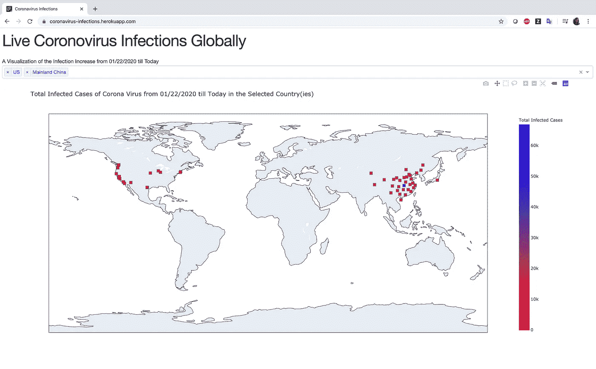
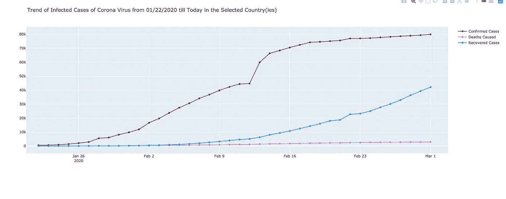
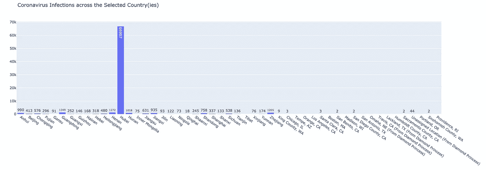
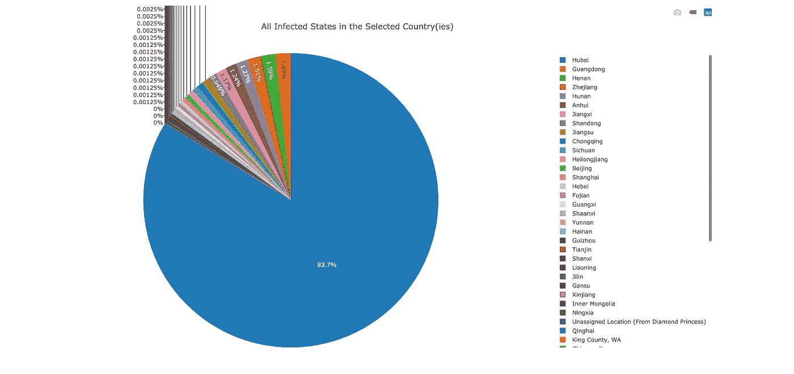
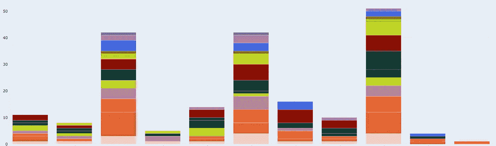

# 使用 Dash、Plotly 和 Heroku 的全球冠状病毒感染 DIY 仪表板

> 原文：<https://towardsdatascience.com/diy-dashboard-for-coronavirus-infections-globally-dash-plotly-1ea1f732eb0a?source=collection_archive---------26----------------------->

## 当前全球冠状病毒感染状况的实时可视化


图片来源: [Flickr](https://www.flickr.com/photos/129635229@N02/49472185781/in/photolist-2inFTfn-gua9vB-gucRox-2ijCPya-gucsHo-gudoXC-gtT23b-gtVKCB-guaE8y-guaGeY-gtVYMT-gub2kv-gucAmi-gucK5a-gubHFy-gtWAjN-gtVeYD-gtVYzb-gtUTUQ-gtTAFU-gudaxP-gtVHtC-gtVXks-guctxm-gtUR9E-gtWkRu-guafvT-gubWPK-gucamF-gtW4W2-gtWva6-gtVhge-gtWV9i-gtWdPH-gtWYno-gtWxoz-gtVJLM-gtWBtS-gtVZQg-gub2mf-gtUxSY-gtTLzS-gubAbw-gtU5Ab-gtTfyF-gtXf4z-gtWoPk-gtVk4B-gtWHHq-gub4EH)

无论你是一个企业还是一个小企业，努力对市场产生影响，你需要了解销售，市场趋势，你的收入驱动因素等等。在 excel 电子表格上绘制图表是老一套。一个组织良好的仪表板是当今企业所需要的。唯一的缺点是，市场上所有可以快速实现这一目标的工具都是有成本的。当然，我们中的许多人希望有一种免费的方式来实现这一点，至少在探索性数据分析阶段是这样。我在这里解决了同样的需求，并提供了一种使用 plotly、dash 和 heroku 开发仪表板的免费而快速的方法。这个演示仪表板将反映当前全世界受冠状病毒影响的病例。我在这里使用的数据取自这个[链接](https://data.humdata.org/dataset/novel-coronavirus-2019-ncov-cases)，并且每天更新，从而为我们提供了关于这种感染传播的最新信息。您可以在[https://coronavirus-infections.herokuapp.com/](https://coronavirus-infections.herokuapp.com/)访问这个最新的交互式仪表盘。



以下是创建该仪表板所需的步骤/编码。您可以修改此代码，用您自己的数据集创建任何自定义仪表板，以发现相关的见解。

**第一步。为您的项目创建一个新文件夹:**

```
$ mkdir dash_app_example
$ cd dash_app_example
```

**第二步。用** `**git**` **和一个** `**virtualenv**`初始化文件夹

```
$ git init        # initializes an empty git repo
$ virtualenv venv # creates a virtualenv called "venv"
$ source venv/bin/activate # uses the virtualenv
```

`virtualenv`创建一个新的 Python 实例。你将需要使用此虚拟重新安装你的应用的依赖项新:

```
$ pip install dash
$ pip install plotly
```

您还需要一个新的依赖项`gunicorn`，用于部署应用程序:

```
$ pip install gunicorn
```

**第三步。用一个样例 app (** `**app.py**` **)、一个** `**.gitignore**` **文件、** `**requirements.txt**` **和一个** `**Procfile**` **初始化文件夹，进行部署**

在项目文件夹中创建以下文件:

`**app.py**`

`**.gitignore**`

```
venv
*.pyc
.DS_Store
.env
```

`**Procfile**`

```
web: gunicorn app:server
```

(注意`app`指的是文件名`app.py`。`server`是指那个文件里面的变量`server`。

`**requirements.txt**`

`requirements.txt`描述你的 Python 依赖关系。您可以用以下内容自动填充该文件:

```
$ pip freeze > requirements.txt
```

**第四步。初始化 Heroku，添加文件到 Git，部署**

```
$ heroku create my-dash-app # change my-dash-app to a unique name
$ git add . # add all files to git
$ git commit -m 'Initial app boilerplate'
$ git push heroku master # deploy code to heroku
$ heroku ps:scale web=1  # run the app with a 1 heroku "dyno" ##not required
```

您应该可以在`https://my-dash-app.herokuapp.com`查看您的应用程序(将`my-dash-app`更改为您的应用程序的名称)。

**第五步。更新代码并重新部署**

当您用自己的代码修改`app.py`时，您需要将更改添加到 git，并将这些更改推送到 heroku。

```
$ git status # view the changes
$ git add .  # add all the changes
$ git commit -m 'a description of the changes'
$ git push heroku master 
```

# 结论

在等待仪表板软件许可获得批准的时候，我开始使用 dash/heroku。Dashboard 是在团队内部以及与其他利益相关方交流数据科学成果的一个非常巧妙的技巧。dash/heroku 的缺点是，你必须像编写传统的 web 应用程序一样编写每一个程序，很明显，这需要后台设计框架的灵活性。但是，这也增加了对定制要交付的内容的控制。我喜欢它…我还想在未来的时间里在这个网站上添加一些过滤功能，使网站的视图更有组织性和可读性。

冠状病毒在湖北的爆发令人震惊，并从那时起以不可阻挡的方式在全球蔓延。通过这篇文章，我想让大家了解世界上以及你所在地区的感染密度。小心——避开人群，保持双手清洁，不要时不时地摸脸。如果您发现了症状，请确保立即与正确的来源沟通。越早发现，存活的机会就越大。

# 奖金

以下是开发 dash/heroku 应用程序时您可能会发现有用的一些额外技巧。

1.  列出与您的 heroku 应用程序关联的 url 的名称

```
heroku info -s | grep web_url | cut -d= -f2
```

2.列出您环境中安装的所有应用程序。用免费版 heroku 最多可以创建 5 个。

```
heroku apps
```

3.删除/销毁 Heroku 上的应用程序

```
heroku destroy appname
```

4.如果堆积/分组条形图中有超过 10 条迹线，如何给出颜色，例如:

```
colorway = ['#f3cec9', '#D2691E', '#FF6347', '#BC8F8F', '#9ACD32', '#006400','#182844','#8B0000','#FFD700','#00FF00','#808000','#4169E1','#BA55D3','#708090','#D2B48C','#4682B4','#F5DEB3','#FFE4E1','#DB7093','#DA70D6','#B0E0E6','#00FA9A','#FF7F50','#F08080','#BDB76B']layout = go.Layout(colorway=colorway)
```



包含 10 个以上类别的堆积条形图