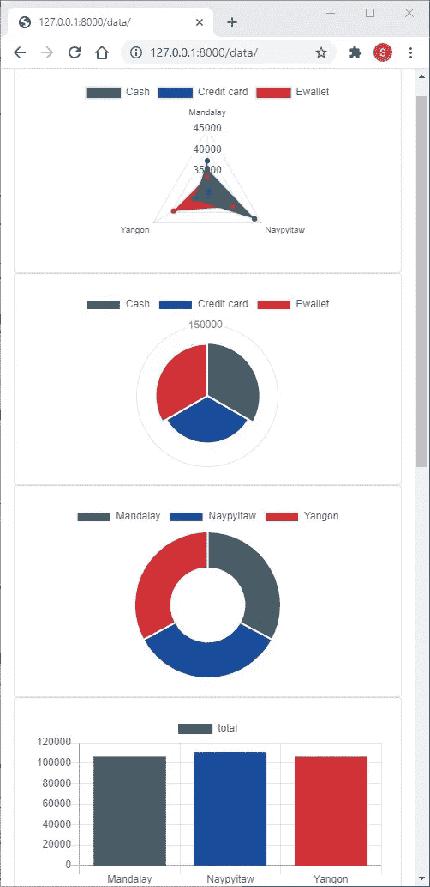

# Django、Pandas 和 Chart.js 用于快速仪表板

> 原文：<https://towardsdatascience.com/django-pandas-and-chart-js-for-a-quick-dashboard-e261bce38bee?source=collection_archive---------4----------------------->

## 仪表盘

## 一个包含 Django、Pandas 和 Chart.js 的快速仪表盘可以在一个小时左右完成



作者截图

今天我们将讨论如何一起使用 Django、Pandas 和 Chart.js 来创建一个快速仪表板。这不是 Django 教程，我在这里走了一些捷径。目标是向您展示如何开始结合使用这些工具来快速显示一些数据。当您需要快速地将一个表可视化为几个不同的图表时，这是最好的应用。这也可能是一个更强大的 django 和 chart.js 站点的起点。

为什么是熊猫？我的经验是，当有人在网站上等待回应时，在网络服务器上做一群熊猫在幕后争吵通常不是一个好策略。当然有一种方法可以在 Django 中直接从数据库中完成所有这些工作。对于一个动态的生产网站来说，正确的数据库查询通常会更快，也是更好的长期答案。然而，有时候你已经在 Jupyter 笔记本上进行了一个很好的数据探索阶段，你只是想把一些东西扔在一起，以显示你到目前为止的发现。

为什么是姜戈？好吧，我们实际上是在讨论让 Django 启动、运行、认证并与您选择的数据库服务器对话的两分钟工作。当您可以将数据导出到单个表中时，Django 是这个项目的绝佳选择。如果您不需要身份验证，并且希望从现有数据库中访问数据，Flask 可能是更好的选择。

为什么选择 Chart.js？我发现，如果你想通过修改几个变量来部署一堆不同的交互式图表，Chart.js 非常棒。在我黑进第一张图表后，我发现其余的几乎只是稍微修改了一下。

这里的代码是[这里的](https://github.com/hobbyhack/django_chartsjs_demo/tree/main)。让我们开始吃吧。

为了这个教程，我抓取了[这个数据集](https://www.kaggle.com/aungpyaeap/supermarket-sales)。这不是动态图表的最佳数据集，但很容易。

# Django 设置

我在 Debian 服务器上运行这个程序，我的目标只是记录下做了什么。同样，这不是 Django 或 python 教程。我将快速浏览这一部分。随意跳过它，但我认为这将是一个很好的参考，以便有人可以直接复制这一点。

```
pip install django pandas
django-admin startproject django_charts
cd django_charts
python manage.py migrate
python manage.py createsuperuser
python manage.py startapp data
cd data 
mkdir templates
cd ..
python manage.py runserver
```

可选[调色板](https://github.com/jiffyclub/palettable)是调色板的绝佳选择。然而，没有它代码也能工作。

```
pip install palettable
```

基于数据集，我创建了以下模型，但这应该为您的数据修改。

从终端创建数据库后，请确保更新数据库:

```
python manage.py makemigrations
python manage.py migrate
```

我使用 pandas 和 Django 创建了一个文件，其中包含了将为 Kaggle 下载的 csv 文件加载到数据库中的方法:

运行它最简单的方法就是导入它并在您的视图中运行它。我们稍后会删除它，但这是确保网站设置的好方法。因此，让我们创建视图，但现在它只需要运行这个函数。

接下来，创建一个名为 base/dashboard.html 的空白文件，并创建一个 data/urls.py 文件

编辑 django_charts/urls.py 以添加数据 URL

更新 django_charts/settings.py 以在 INSTALLED_APPS 中包含“数据”:

让我们通过将它添加到 data/admin.py 来确保我们可以在管理站点中看到 purchase

现在，您应该能够在浏览器中转到[仪表板页面](http://127.0.0.1:8000/data/)。只做一次，然后在[管理网站](http://127.0.0.1:8000/admin/data/purchase/)上查看是否看到记录。如果使用相同的数据集，应该有 1000 条记录。

好的。很抱歉速度跑，但现在我们可以从同一个地方开始。

# HTML 设置

我有一个将被扩展的基本文件。

这可能看起来很多，但这是一个很好的基本模板。我倾向于在我的基本模板中放 4 个代码块。

```

```

名称可能是不言自明的，但这给了我一种从任何页面添加标题、css、body 元素或 javascript 的方法。诚然，我通常只使用 page_content 和 js_scripts 块。

你会注意到我在这里包含了 bootstrap CDN。这个项目真的不需要 popper.js。你可以不使用 bootstrap 来完成这个项目，但是你需要改变一些 dashboard.html。

我还包含了 chart.js cdn。你肯定需要这个。

我把我写的任何脚本都包装到一个$(文档)中。准备就绪，以便在页面准备就绪之前不会发生任何操作。

接下来是 dashboard.html，这是我们图表的页面:

基本上，我们正在创建一个引导容器，然后是一行，然后是一列。在柱子里，我有一副卡牌。卡片组将创建大小均匀的卡片。然后，我循环浏览每张图表，并将一张卡片放入卡片叠中。

卡牌组将试图把所有的东西都塞进同一行。forloop.counters 用于检测屏幕的大小，并相应地包装卡片组。这是我从[这个](https://www.codeply.com/go/nIB6oSbv6q)例子修改的。然而，实际上你会发现 chart.js 忽略了你的画布大小设置。这是我希望 chart.js 重新考虑的一个方面。html 在这里的主要功能是布局，我不知道如何阻止 chart.js 忽略 HTML 布局。

你会看到我的两个主要循环。我将 html 元素一张一张地插入卡片中。然后，在 js 代码块中，我逐个图表地实现了 js 脚本。这是一个非常简单的方法来获得一个响应列(移动)或图表网格。在我最近的案例中，我只是希望在移动设备上显示一列图表。

# views.py

我认为首先查看 views.py 文件来了解事情的流程可能是最简单的。您会注意到我删除了加载数据的一次性方法。

我们将使用模板视图。这是一个非常简单的添加内容的视图。我倾向于给我的 html 文件起一个我能猜到的名字，所以我用 template_name 来标识我使用的模板。在这种情况下，我们需要扩展的唯一方法是 get_context_data。这是 Django 在基于类的视图中使用的方法，用来获取要显示的数据。

我们拉出我们想要的对象并创建一个数据帧。因为 chart.js 通常不能很好地处理日期，所以在创建 dataframe 之后，我继续将日期转换为字符串。然后，我们只需将我们想要的每个图表添加到图表的上下文中。这允许我们在 html 代码中循环遍历图表。作为参考，每个图表都是一个字典，包含一个 html 和一个 js 条目。html 只是一个简单的带有 ID 的画布标签，js 完成了大部分工作。我在上一节 html 中讨论了循环。

# Charts.py

剩下的部分在 data/charts.py 文件中。我这样做是为了便于移植到另一个项目中。你可以把它放在视图中。我真的应该清理并打包它，但这里的目标是快速，临时图表。我将在最后包含整个文件，但最好先浏览一些函数，然后进入图表类。以下所有函数都在 data/charts.py 文件中。

你可以通读评论，了解所有选项。但是这个函数接受一个 Django 模型并返回所有记录。您可以在所有名称参数后包含一些过滤器。比如说:

将结果限制在曼德勒市。Include 和 exclude 字段的工作方式与 Django 通常使用的方式相同。如果您不包含任何内容，它将从模型中提取所有字段。需要注意的是，排除是在包含之后处理的。因此，如果您包含和排除某个列，它将不会显示。我使用 pandas apply 根据输入转换日期。

在这个例子中，这实际上不做任何事情。然而，我为图表使用了一个数据类，这是为所有图表设置默认选项的一种方式。当我想为所有图表设置一个默认选项时，我重用代码并经常修改函数。

如果您不想标记每个图表，这个函数会设置一个随机 ID，js 使用它来修改相关的 html 元素。这个 ID 还用于命名 JS 函数和变量，以便于调试。因此，您需要避免图表 id 包含不允许的 js 字符(例如-).

get_colors 用于设置初始颜色。如果你传入一个调色板，它将使用它。这主要是为了利用任何可移植的导入。但是，如果你没有传入任何东西，也没有从 palletable 导入任何东西，它将随机生成颜色。

get_random_colors 用于在没有颜色传入、导入或颜色多于值的情况下生成颜色。它从你传入的颜色开始，然后随机添加它们，直到你达到想要的数量。

这些都是我们上课前需要的函数。

所以，下面是图表类。我将从这个类开始，然后讨论这个类中的每个函数。

我在这里使用了一个数据类。这些是 Python 中相对较新的内容，对于快速简单的类来说，它们通常是一个不错的选择。设置初始值可能看起来有点奇怪，但它有助于确保不使用可变对象作为实例。这真的不难，但确实会导致编写一些小函数来创建初始值。

from_lists 是我用数据、标签和颜色填充所有图表对象的方式。在检查以确保我们有足够的颜色并添加一些随机颜色后，它构建了 chart.js 所称的数据集。每个堆栈都需要在这里附加它唯一的小字典。如果只有一个值，我们希望追加整个调色板，这样每个条形都是不同的颜色。直接分配标签。from_lists 是如何绕过 pandas 并从数据库查询中创建图表的。

from_dataframe 帮助我们使用几行代码来操作几乎任何数据帧，以便能够轻松地直接输入到 chart.js 的 from_lists 中。数据透视表可以直接转储出图表所需的列表。如果你从一个单一的数据帧中做大量的图表，这是非常快的。

好吧…我知道。这是一个功能，几乎，也许应该阻止我发表这篇文章，直到我分手。然而，很容易看出这是怎么回事。我们需要形成包含标签、数据集和选项的初始元素字典。这些是基本的 charts.js 要求。一旦发生这种情况，代码就使用传入的类型来设置附加的图表选项。我想您会发现，对于大多数(如果不是全部)chart.js 图表来说，这可能是唯一需要添加的函数。例如，在这里我们需要告诉 chart.js 为堆积条形图堆积一个轴。对于其中的一些，您将看到“从零开始”,因为 chart.js 有时会默认从接近最低值的地方开始。我个人认为默认值应该是零。通常只需要定义一个图表类型就可以了。

我在这里编写函数来处理 html 和 javascript 代码。通常我会创建实际的 html 和 js 模板。这很容易做到，但这更便于携带。

没有比这更简单的了。只需创建供 js 更新的画布。这是 html 循环在每个图表的 html 模板中放置的内容。

get_js 只是生成 js 代码。可以看到大部分工作已经在上面的代码中完成了(get_elements)。这将获取 dom(画布)中的图表元素并添加图表。

最后，我定义了一个函数，将 html 和 js 作为字典返回。

# 总结

基本上，您可以将 chart.py 复制到您的项目中，并像我在 views.py 文件中所做的那样使用它。您需要确保您的基本 html 文件导入了 chart.js cdn。Bootstrap 显然是可选的，但确实很容易。快乐的仪表板！！！

下面是一个完整的类定义供参考: