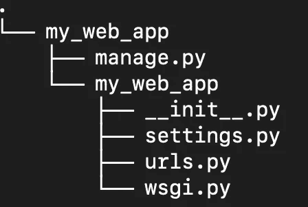
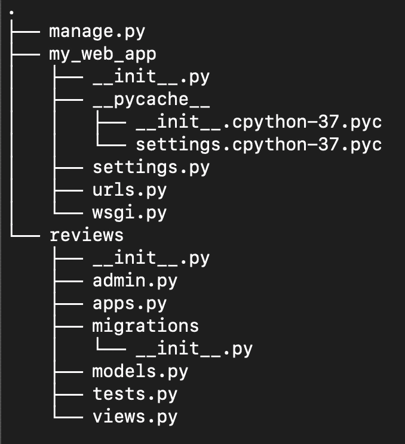
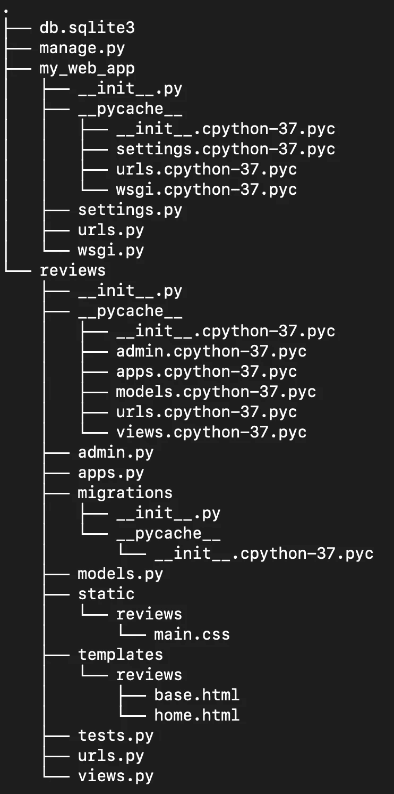
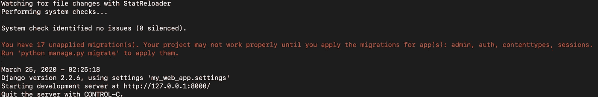
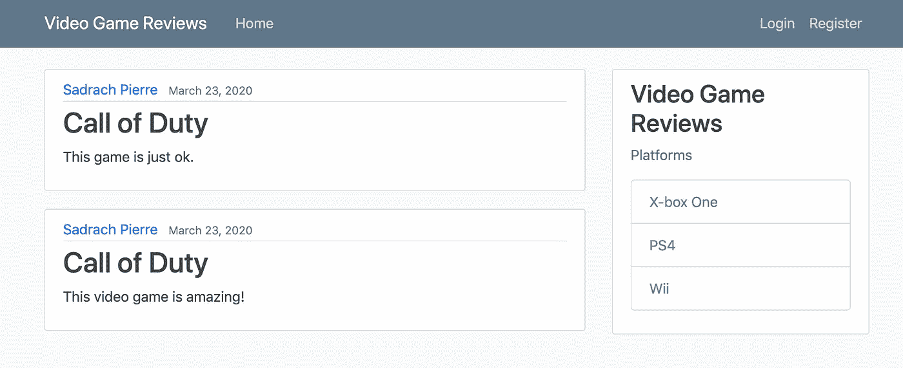
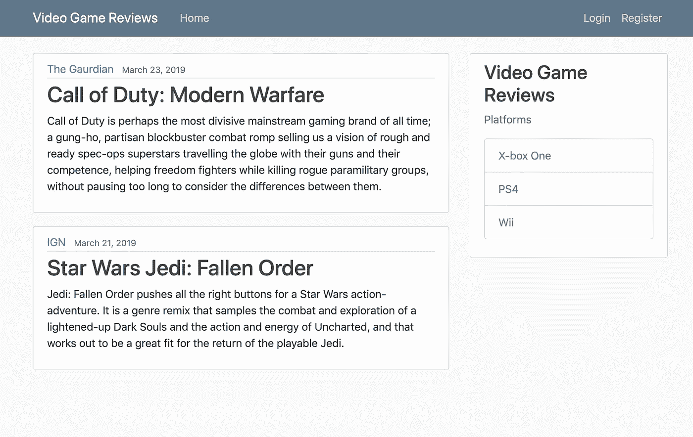

# Django 的 Web 应用程序

> 原文：<https://towardsdatascience.com/django-web-applications-376a14167974?source=collection_archive---------15----------------------->

## 在 Django 中使用模板


[来源](https://www.pexels.com/photo/top-view-photo-of-people-near-wooden-table-3183150/)

Django 是一个强大的基于 python 的 web 框架，支持开发数据库驱动的 web 应用程序。今天，许多技术都使用 Django 框架，包括 Instagram、Spotify 和 Youtube。在这篇文章中，我们将讨论如何使用 html 和 css 模板在 Django 中构建一个简单的视频游戏评论应用程序。

我们开始吧！

我们需要做的第一件事是打开一个终端并安装 Django:

```
pip install django
```

接下来，我们将创建一个 Django 项目。让我们使用以下命令创建一个名为“my_web_app”的项目:

```
django-admin startproject my_web_app
```

我们可以看看使用目录列表命令 tree 创建的文件的结构，我们看到:

```
tree
```



我们看到，在创建一个新项目时，我们已经生成了几个文件。我们有一个“my_web_app”目录，其中包含一个“manage.py”文件和一个附加的“my_web_app”文件夹。“manage.py”文件是一个命令行实用程序，允许我们创建应用程序、在服务器上运行应用程序等等。' __init__ '“py”方法告诉 python 我们的应用程序是一个 python 包。“settings.py”允许我们修改设置和配置。“urls.py”文件包含我们将用来指引用户的路径。“wsgi.py”文件允许我们的应用程序与服务器通信。

现在让我们继续创建一个 reviews 应用程序

```
python manage.py startapp reviews
```

以及显示附加文件:

```
tree
```



现在，让我们进入我们的评论目录，打开“views.py”文件。我们应该看到以下内容:

```
from django.shortcuts import render# Create your views here.
```

让我们添加以下代码:

```
from django.shortcuts import renderposts = [{
'author': 'Sadrach Pierre',
'title': 'Call of Duty',
'review': 'This game is just ok.',
'date_posted': 'March 23, 2020',
}{
'author': 'Sadrach Pierre',
'title': 'Call of Duty',
'review': 'This video game is amazing!',
'date_posted': 'March 23, 2020',
}]def home(request):
    context = {
        'posts':posts
    }
    return render(request, 'reviews/home.html', context)
```

“views.py”现在包含了对视频游戏*使命召唤的评论。*它还包含一个“home”功能，允许我们呈现 html 代码，我们将使用该代码向用户显示文本。注意，在 home 函数中，我们在“reviews/home.html”路径中呈现 html 代码。

要继续，我们需要在 reviews 目录中创建一个模板目录，然后将 cd 放入 templates 目录:

```
mkdir templates
cd templates
```

现在，我们需要在 reviews 目录中创建一个附加的 reviews 文件夹和 cd:

```
mkdir reviews
cd reviews
```

接下来，我们将在“reviews/templates/reviews”目录中创建一个“base.html”文件和一个“home.html”文件。让我们创建我们的基本文件:

```
vi base.html
```

并在这里添加代码。接下来创建我们的主页 html 文件:

```
vi home.html
```

并将找到的代码[添加到这里](https://github.com/spierre91/medium_code/blob/master/django_code/my_web_app/reviews/templates/reviews/home.html)。

接下来，我们需要在“my_web_app/reviews”目录中添加一个 css 文件，为我们的页面添加额外的视觉元素。让我们向上移动两个目录:

```
cd ../../
```

让我们创建一个名为“static”的目录，并将其放入我们的静态目录:

```
mkdir static
cd static
```

在我们的静态目录中创建一个额外的评论目录:

```
mkdir reviews
cd reviews
```

创建一个“main.css”文件:

```
vi main.css
```

并将找到的代码[添加到这里](https://github.com/spierre91/medium_code/blob/master/django_code/my_web_app/reviews/static/reviews/main.css)。

现在，让我们转到我们的根项目目录并打开“urls.py”，我们应该看到:

```
from django.contrib import admin
from django.urls import path

urlpatterns = [
    path(**'admin/'**, admin.site.urls),
]
```

让我们将以下路径添加到我们的 url 列表中:

```
from django.contrib import admin
from django.urls import path, include

urlpatterns = [
    path(**'admin/'**, admin.site.urls),
    path(**''**, include(**'reviews.urls'**)),
]
```

接下来，我们进入“my_web_app/reviews”目录，创建一个“urls.py”文件:

```
vi url.py 
```

让我们添加以下内容:

```
from django.urls import path
from . import views

urlpatterns = [
    path(**''**, views.home, name=**'reviews-home'**),
]
```

我们最终的树应该如下所示:



我们需要做的最后一件事是修改“my_web_app”目录中的“setting.py”文件:

在“setting.py”中，我们应该会看到已安装应用程序的列表:

```
INSTALLED_APPS = [
    **'django.contrib.admin'**,
    **'django.contrib.auth'**,
    **'django.contrib.contenttypes'**,
    **'django.contrib.sessions'**,
    **'django.contrib.messages'**,
    **'django.contrib.staticfiles'**,
]
```

让我们将“评论”应用添加到我们的列表中:

```
INSTALLED_APPS = [
    **'reviews.apps.ReviewsConfig'**,
    **'django.contrib.admin'**,
    **'django.contrib.auth'**,
    **'django.contrib.contenttypes'**,
    **'django.contrib.sessions'**,
    **'django.contrib.messages'**,
    **'django.contrib.staticfiles'**,
]
```

我们应该都准备好了。让我们导航到我们的根项目目录并运行我们的应用程序:

```
python manage.py runserver
```

我们应该看到:



让我们将“http://127.0.0.1:8000/”复制并粘贴到浏览器中，我们应该会看到:



目前为止这还不算多。我们可以修改“views.py”文件中的帖子，以包含更多有趣的评论。下面给*使命召唤:现代战争*加个评论。我来引用一下 [*卫报*](https://www.theguardian.com/games/2019/oct/31/call-of-duty-modern-warfare-review) *的一篇评论。*我还会添加另一款 2019 年游戏的评论，*星球大战绝地:堕落秩序，*来自 [IGN](https://www.ign.com/articles/2019/11/15/star-wars-jedi-fallen-order-review) :

```
from django.shortcuts import renderposts = [{
'author': 'The Gaurdian',
'title': 'Call of Duty: Modern Warfare',
'review': '[Call of Duty](https://www.theguardian.com/games/call-of-duty) is perhaps the most divisive mainstream gaming brand of all time; a gung-ho, partisan blockbuster combat romp selling us a vision of rough and ready spec-ops superstars travelling the globe with their guns and their competence, helping freedom fighters while killing rogue paramilitary groups, without pausing too long to consider the differences between them.',
'date_posted': 'March 23, 2019',
}{
'author': 'IGN',
'title': 'Star Wars Jedi: Fallen Order',
'review': 'Jedi: Fallen Order pushes all the right buttons for a Star Wars action-adventure. It’s a genre remix that samples the combat and exploration of a lightened-up Dark Souls and the action and energy of Uncharted, and that works out to be a great fit for the return of the playable Jedi.',
'date_posted': 'March 21, 2019',
}]def home(request):
    context = {
        'posts':posts
    }
    return render(request, 'reviews/home.html', context)
```

现在，我们的评论应用程序看起来像:



我就讲到这里，但是您可以自己随意摆弄代码。

# 结论

总之，在这篇文章中，我们讨论了如何使用 Django web 框架创建一个视频游戏评论 web 应用程序。您可以自由地将该应用程序进一步扩展为个人视频游戏博客或在线应用程序，供用户注册和评论视频游戏。如果你有兴趣了解 Django，我推荐科里·斯查费的 YouTube 教程，你可以在这里找到。这篇文章的代码可以在 [GitHub](https://github.com/spierre91/medium_code/tree/master/django_code/my_web_app) 找到。感谢您的阅读！