# 黑人的命也是命吗？警察暴力的统计分析

> 原文：<https://towardsdatascience.com/do-black-lives-matter-do-white-lives-matter-e49948d0ffd3?source=collection_archive---------7----------------------->

## 谁的生活重要呢？

死亡是一系列严重问题的永久证据。除非复活，否则受害者无法从死亡中恢复，但这也减少了对个人、社会和少数群体造成伤害的灰色地带。为了理解谁的生活对一个社会至关重要，我们可以看看当局以及他们如何对待人民，以及人民如何对待当局。所以我把死亡作为评估警察暴力和针对警察的暴力的主要标准。我想回答这个问题，黑人的生命重要吗？在这个过程中，我偶然发现了另一个有趣的问题，白人的生命重要吗？

虽然数据清楚地表明黑人被杀的比率高于白人，但也表明很多人被警察枪杀。所以如果你相信“所有的生命都很重要”，那么你应该和黑人社区问同样的问题:为什么警察如此暴力？

我在这里不是要回答为什么，而是如何，在哪里，对谁的问题。暴力有多暴力？这哪里是暴力？这种暴力对谁的影响更大？

# 一般统计

首先，我从一个更高的层面看了被警察打死的人的统计数据。然后，我根据 4.91 的比率调整了人口，因为在美国，每 100 个黑人，就有 491 个白人。看着左上图中的数据，人们可能会认为没有问题。当这些数值根据人口进行调整时，特别是对于手无寸铁的人来说，显然存在一个问题。

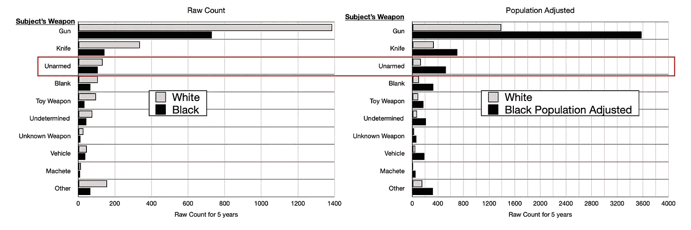

然后我们可以看看黑人和白人谋杀的比例，同样，如果你是黑人，你比白人更有可能被警察杀死，不管情况如何。

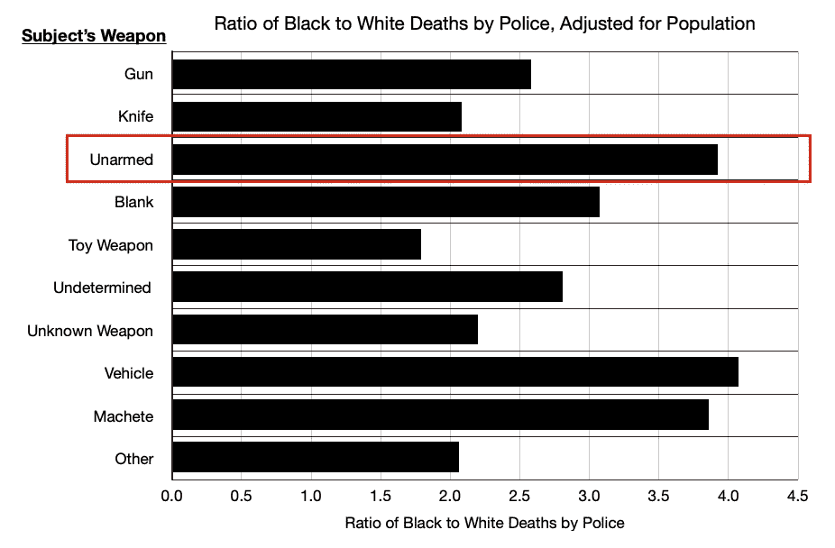

## 拘留

第一个批评是，可能有更高比例的黑人卷入暴力犯罪。我们不得不考虑这种可能性，但应该注意的是，这种情况也可能是由系统性的种族主义造成的。撇开这个不谈，我们来看看 [**的抓捕人数**](https://ucr.fbi.gov/crime-in-the-u.s/2017/crime-in-the-u.s.-2017/tables/table-49) 。

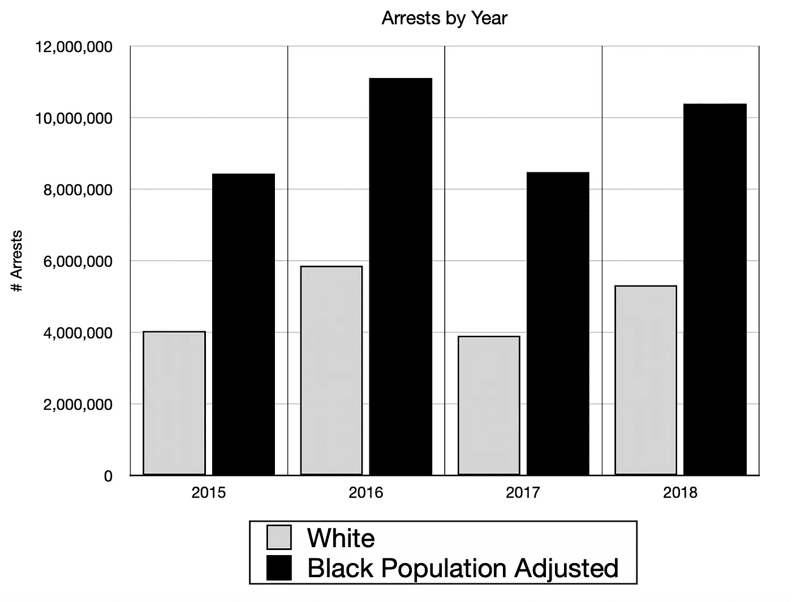

当按人口调整这些逮捕时，黑人被逮捕的次数是白人的两倍。现在我们可以看看警察因逮捕人数而导致的死亡人数。这个问题减轻了，但是它仍然存在，特别是对于没有武器或者在汽车里的人。

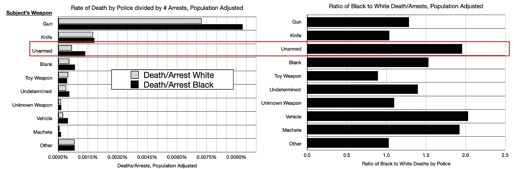

警告是，如果存在系统性的种族主义，我们如何确定黑人不会比白人更容易成为目标和被逮捕？我没有数据，所以不好说，但是大部分数据都指向一个问题。

## 年龄

按年龄分类显示，年轻黑人男性的趋势比总体统计趋势更糟糕。

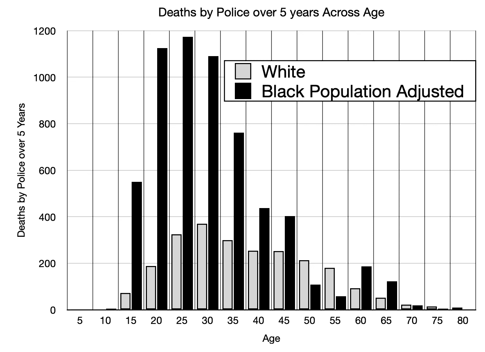

## 按州

让我们按州来划分。任何一个白色的州都没有足够的数据。每个州的死亡人数根据该州的种族统计数据进行了调整。我本以为南部各州的情况会更糟，更不用说 4 比 1 的比例了。加州绝对令人惊讶。

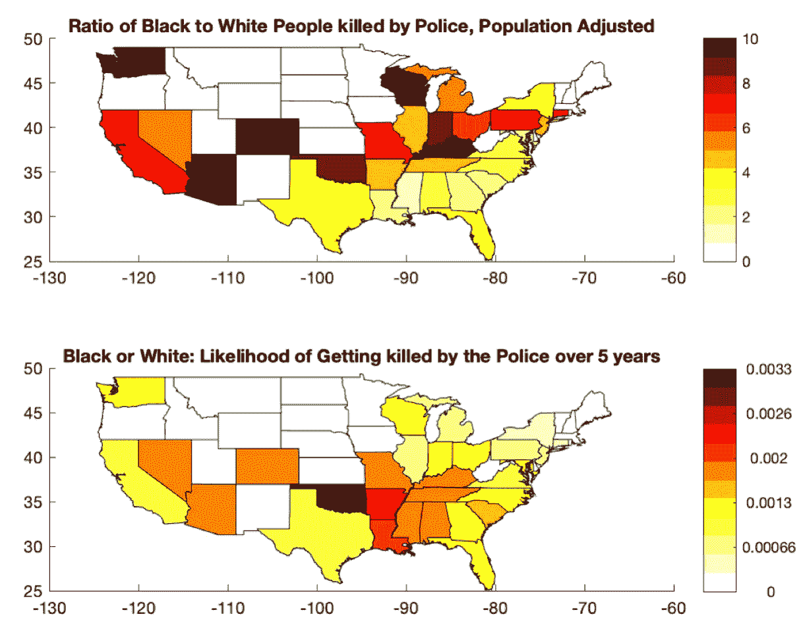

一般警察对白人和黑人的暴行是相当高的，尤其是在南方。让我们通过种族来分析一下，看看你被警察杀死的概率。同样，如果你是黑人，在警察周围不是你想做的事情，但奇怪的是，南方似乎不那么可怕。

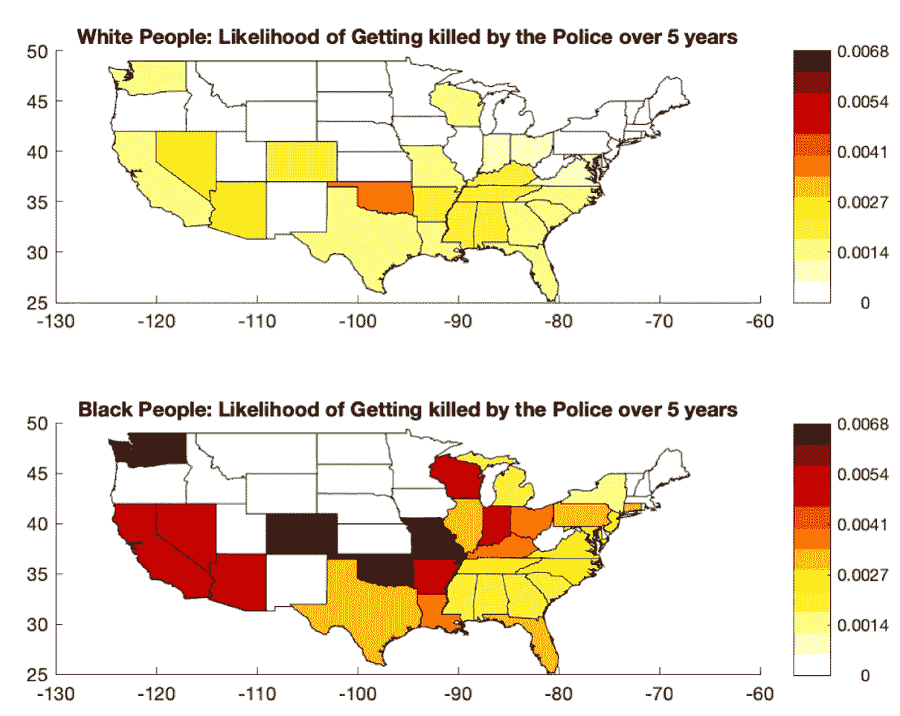

# 警察

没有对警察暴行的讨论，关于政策暴行的讨论是不完整的。还是那句话，让我们从过去几年的死亡人数开始了解风险。在 5 年零 5 个月的时间里，警察被谋杀的总数为 369 起，因此平均每年有 68 名警察因殴打而被暴力杀害。

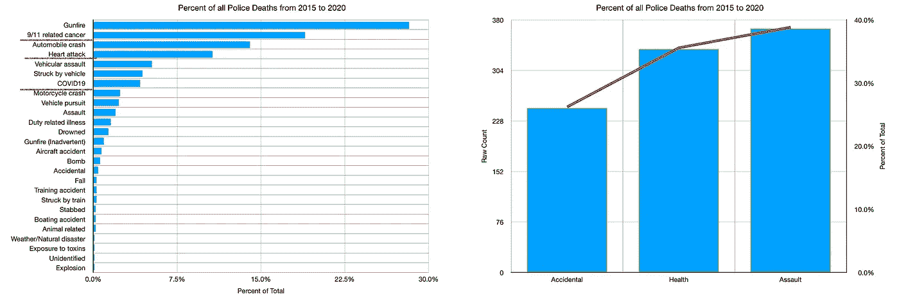

据 https://datausa.io/profile/soc/police-officers[报道，白人与黑人警察的比例为 5.84 比 1，相对接近 4.91 比 1 的全国平均水平。我们可以看看被谋杀的警察人数，按照警察和被侵犯者的种族来划分。在这种情况下，警察的种族似乎与他们是否被杀无关。然而，当按人口调整警察谋杀案时，杀害警察的人是不成比例的黑人。](https://datausa.io/profile/soc/police-officers)

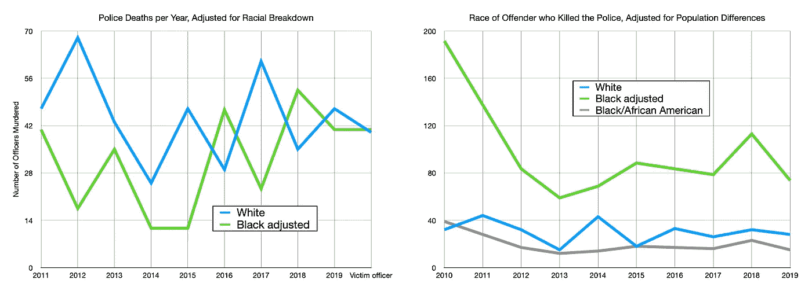

# 谁是负责人？

维持治安的一个重要方面是谁来维持治安？谁管理警察部门？谁在忍受这样的暴力？于是我调出了一些[数据](https://www.bjs.gov/content/pub/pdf/lpd16p.pdf)，我发现了一个有趣的趋势。对于较大的城市，根据人口调整的权力地位是公平的。我用的是白人和黑人 4.91 的比例，但对于较小的城市，这个比例要高得多。这意味着小城镇的差距更大。

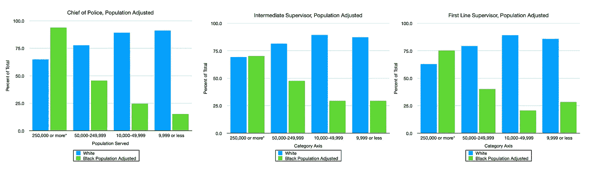

我们可以看看大城市 vs 小城镇，有很大的出入。

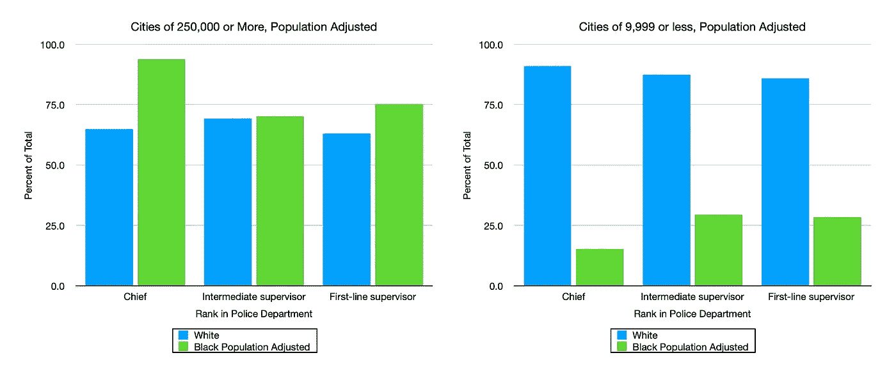

因此，我决定从城镇人口中提取我所掌握的关于警察暴力的数据。这些警察暴行发生在哪里？

# 按城市规模划分的残暴程度

我分别提取了城市规模信息，并将数据关联起来。这第一个分类显示了被警察杀害的人，然后我根据皮尤研究中心的[假设白人和黑人的分布进行了调整，皮尤研究中心根据城市、郊区和农村地区进行了分类。我的假设是人口少于 9999 的城市。](https://www.pewsocialtrends.org/2018/05/22/demographic-and-economic-trends-in-urban-suburban-and-rural-communities/)

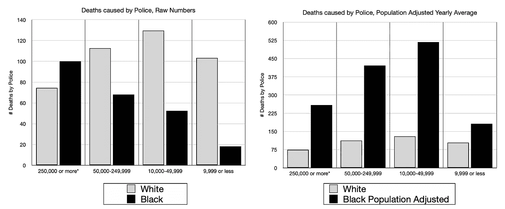

现在，让我们来确定这些地区每 10 万人中的警察死亡率。趋势是住在小城镇对黑人来说更危险，但另一个有趣的趋势是，就警察暴行而言，他们对白人来说更危险。

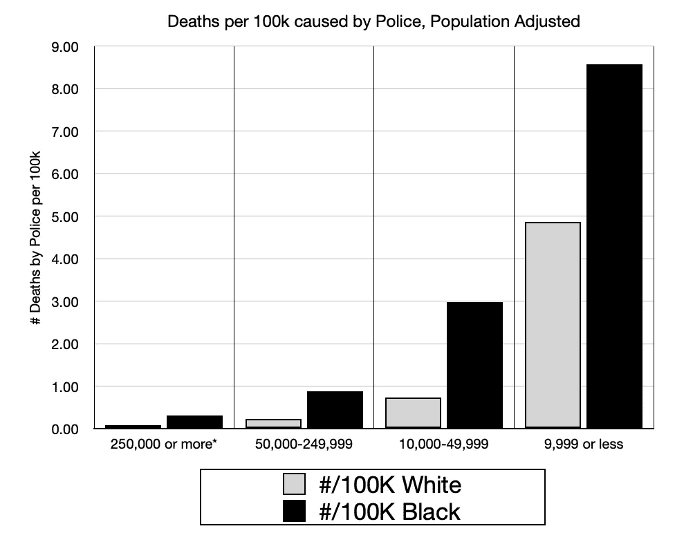

> 为什么人们不在小镇上游行？

# 按每个城市的种族划分数据

我进一步分解了数据。我使用了一个[人口普查工具](https://data.census.gov/cedsci/table?q=Black%20or%20African%20American&t=Black%20or%20African%20American&hidePreview=true&tid=ACSDT1Y2018.B02001&vintage=2018)尽可能多地查看主要城市，以确定它们的种族构成。这涵盖了人口超过 50，000 的大多数城市。至于其余的，我结合了每个州的种族分类和城市、郊区和农村地区的种族分类的一般数据。有了这些数据，我可以更深入地研究，我将警察造成的黑人死亡与他们所在的城市或州的人口进行标准化。

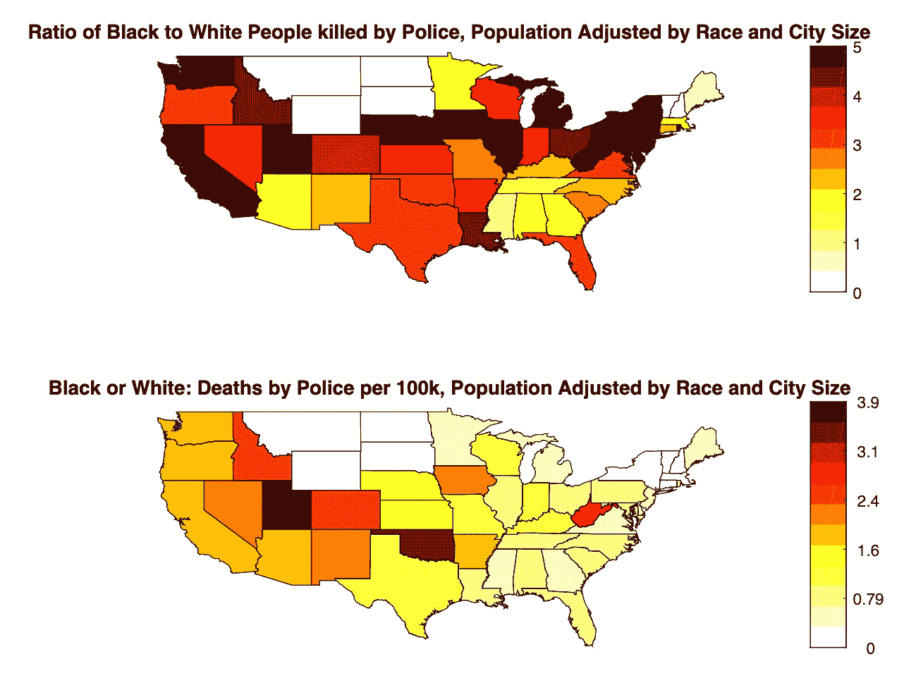

首先，在一些州，如纽约、加利福尼亚和许多北方州，由警察造成的黑人和白人的死亡比例要高得多。然而，令人震惊的是，如此多的国家是危险的。警察很危险。

我们按种族来分解一下，看看情况有多黑多白，如下图。在左边，我用不同的比例来衡量每 10 万人中白人和黑人的死亡率。在右边，你可以看到，一旦你使用同样的尺度，白人的死亡人数与黑人的死亡人数相差甚远，但有一点是清楚的，俄克拉荷马州不是你想去的地方。

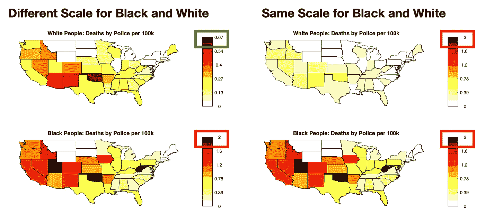

我们可以把这个数据拆分成 5 万人以上和 5 万人以下的较大城市。这表明小城镇对黑人尤其危险，对白人也是如此。

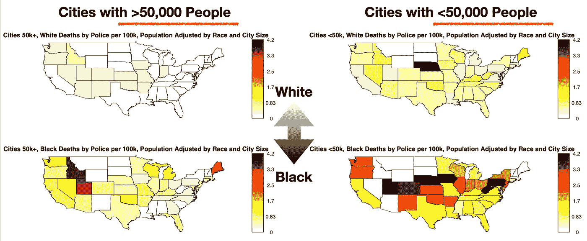

总结一下这个数据，调整了城市和种族分类，我们可以看到小城镇的死亡人数要多得多，但是比率要低一些。

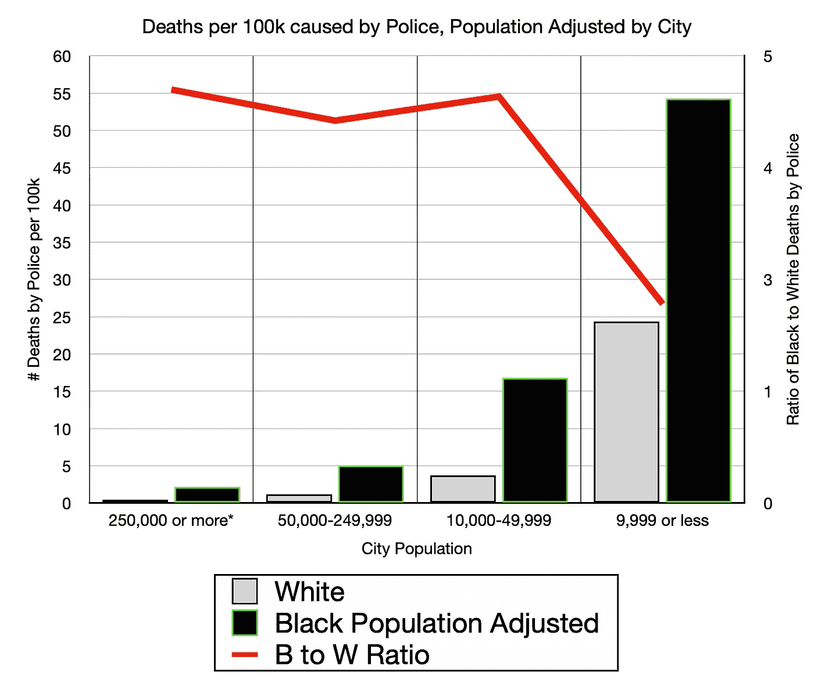

我已经尽我所能对这个分析保持客观和不带感情色彩，但是这个分析已经耗尽了我的精力。我知道警察暴力的问题很严重，我三年前看过这个数据。但是，这些数据很重要，而且还不完整。

一个更好的数据集应该具有以下内容:

1.  记录每一站
2.  记录每一次逮捕
3.  记录每一次射击
4.  记录警方的每一次暴力行为
5.  记录涉案官员

这些数据还没有被收集甚至没有被尝试的原因是因为它会显示这个问题比这里呈现的更糟糕。这个数据是冰山一角。这些数据显示了最极端的种族主义形式，有时很难发现。

那么谁的生命重要呢？你告诉我。给我看看数据。

# 放下恐惧，实践爱