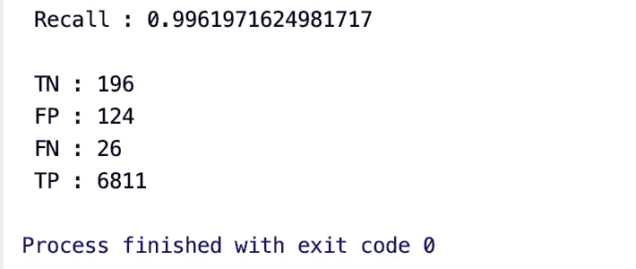
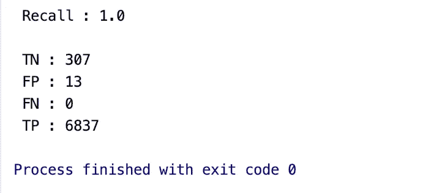
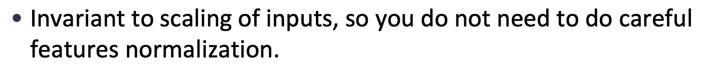

# 决策树需要特征缩放吗？

> 原文：<https://towardsdatascience.com/do-decision-trees-need-feature-scaling-97809eaa60c6?source=collection_archive---------26----------------------->


亚里沙·戈洛文斯卡的照片

## 决策树和集成方法需要特征缩放吗？

机器学习算法从一开始就一直走在进化的道路上。今天，这个领域已经从数学建模发展到集合建模等等。这种进化已经看到了更强大的 SOTA 模型，几乎弥合了人类和人工智能潜在能力之间的差距。集合模型给了我们一个 SOTA 模型 XGBoost。

## 招聘挑战

最近我碰巧参加了一个机器学习招聘挑战，其中的问题陈述是一个分类问题。虽然问题陈述是一个入门级的问题，但我想在这里分享一下竞赛中的一些关键收获。

我的日常工作是从数据清理、数据预处理、EDA 和类上采样开始的(因为训练数据集是不平衡的)。作为 EDA 的一部分，我发现数据集的特征具有很高的方差。因此，我计划用 MinMax Scaler 进行特征缩放。

```
*#Feature Preprocessing and Feature Transformation:* **def** feature_preprocess_transformation(data):
    **global** train,test
*#   data['X_12']=data['X_12'].fillna(value=1.0).astype(int)                                                    
#   scaler=MinMaxScaler(feature_range=(0,4))
#   for j in to_normalize:
#        data[j]=scaler.fit_transform(data[j].values.reshape(-1,1)).astype(int)

#Calling the preprocessing function for Train and Test Data* feature_preprocess_transformation(train)
feature_preprocess_transformation(test)
```

完成所有先决条件后，我决定尝试集成算法，因为它基于决策树的逻辑以及从弱学习者学习的能力，预计它在分类问题上表现更好。所以我决定使用 XGBoost。

```
xgb=XGBClassifier()
xgb.fit(X_train,y_train)
y_pred=xgb.predict(X_test)

tn,fp,fn,tp=confusion_matrix(y_test,y_pred).ravel()
recall=recall_score(y_test,y_pred)
precision=precision_score(y_test,y_pred)
print(**'\n'**,**'Recall : '**+str(recall))
print(**'\n'**,**'TN : '**+str(tn),**'\n'**,**'FP : '**+str(fp),**'\n'**,**'FN : '**+str(fn),**'\n'**,**'TP : '**+str(tp))
```

如下所示，该模型的召回分数为 0.9961，并且高假阳性计数表明该模型在对阴性类别进行分类时的难度。



具有最小最大标度模型的召回度量

后来，我删除了特性缩放的预处理部分，并尝试应用相同的 XGBoost 模型。

```
**def** feature_preprocess_transformation(data):
    **global** train,test
    data[**'X_12'**]=data[**'X_12'**].fillna(value=1.0).astype(int)                                                   *
#   scaler=MinMaxScaler(feature_range=(0,4))
#   for j in to_normalize:
# data[j]=scaler.fit_transform(data[j].values.reshape(-1,1)).astype(int)*xgb=XGBClassifier()
xgb.fit(X_train,y_train)
y_pred=xgb.predict(X_test)

tn,fp,fn,tp=confusion_matrix(y_test,y_pred).ravel()
recall=recall_score(y_test,y_pred)
precision=precision_score(y_test,y_pred)
print(**'\n'**,**'Recall : '**+str(recall))
print(**'\n'**,**'TN : '**+str(tn),**'\n'**,**'FP : '**+str(fp),**'\n'**,**'FN : '**+str(fn),**'\n'**,**'TP : '**+str(tp))
```

从下面可以看出，召回分数提高到 1.0，并且该模型能够更有效地对阴性类别进行分类，而假阳性更少。



具有最小最大标度模型的召回度量

## 直觉



礼貌:【https://homes.cs.washington.edu/~tqchen/pdf/BoostedTree.pdf】T2

*   以上节选自 XGBoost 作者的一篇演讲。
*   决策树分类不受数据中异常值的影响，因为数据是使用分数分割的，分数是使用所得数据点的同质性计算的。

## 外卖食品

*   决策树和集成方法不需要执行特征缩放，因为它们对数据中的方差不敏感。

## 参考

[https://papers with code . com/paper/xgboost-a-scalable-tree-boosting-system](https://paperswithcode.com/paper/xgboost-a-scalable-tree-boosting-system)

 [## 正常化有必要吗？问题#357 dmlc/xgboost

### 解散 GitHub 是超过 5000 万开发者的家园，他们一起工作来托管和审查代码，管理项目，以及…

github.com](https://github.com/dmlc/xgboost/issues/357)