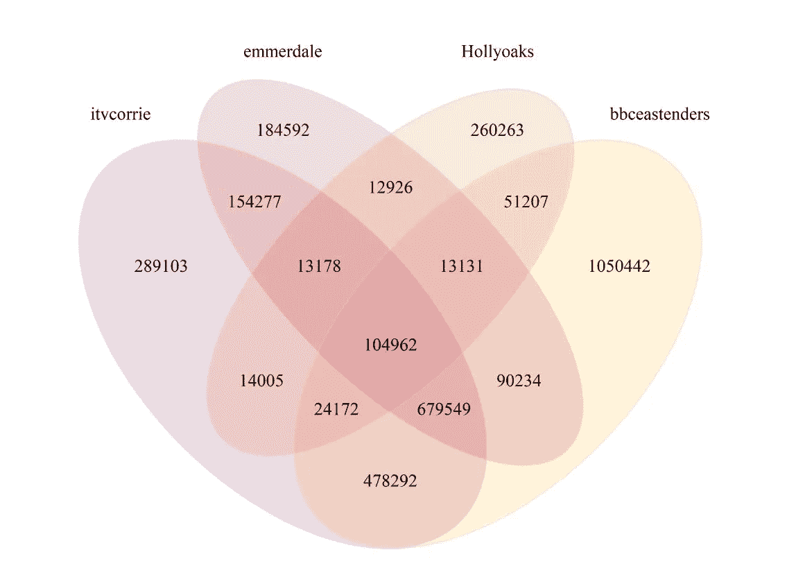

# 伦敦东区的粉丝喜欢 Hollyoaks 吗？

> 原文：<https://towardsdatascience.com/do-eastenders-fans-like-hollyoaks-analysis-in-r-4eed0fe3b7e?source=collection_archive---------61----------------------->

## 使用 rtweet 和 VennDiagram 进行简单的 Twitter 追随者重叠分析。


Joshua Hoehne 在 [Unsplash](https://unsplash.com?utm_source=medium&utm_medium=referral) 上拍摄的照片

想知道你和你最喜欢的名人有多少粉丝吗？没有吗？哦..我也没有。但是，如果你*真的*想知道，这里有一个简单的 R 脚本，使用 rtweet 和 [VennDiagram](https://cran.r-project.org/web/packages/VennDiagram/VennDiagram.pdf) 来找出答案。

例如，这是一个很棒的小脚本，可以用来写那些“值得拥有”的分析；分析你的品牌和竞争对手的追随者重叠，或者回答类似*伦敦东区的粉丝喜欢 Hollyoaks 吗？继续滚动查看大揭秘！*

完整的脚本(下面的分步指南):

# 逐步地

## 步骤 1 —运行所需的包

这个脚本使用了 3 个包:

*   [rtweet](https://cran.r-project.org/web/packages/rtweet/rtweet.pdf) —从 Twitter API 收集所需的数据。
*   Tidyverse —处理数据。
*   [文迪雅图](https://cran.r-project.org/web/packages/VennDiagram/VennDiagram.pdf) —可视化数据。

```
library(rtweet)
library(tidyverse)
library(VennDiagram)
```

当您第一次运行 [**rtweet**](https://cran.r-project.org/web/packages/rtweet/rtweet.pdf) 包时，R 会尝试打开您的网络浏览器，以便您登录并允许访问 Twitter。

## 第 2 步—设置账户

设置你想要分析的账户，在这个例子中，我们将会看到英国的 Soap Twitter 账户。在下面的代码片段中，我们陈述的用户名与 Twitter 上显示的完全一样。我们将存储它，以便在收集数据时在函数中使用，并在稍后命名维恩图的区域时使用，以使脚本可重用。

```
a_name <- “itvcorrie”
b_name <- “bbceastenders”
c_name <- “emmerdale”
d_name <- “Hollyoaks”
```

## 步骤 3 —收集数据

接下来，我们将使用 **rtweet** 包中的 **get_followers** 函数来收集英国肥皂剧关注者的用户 id📺推特账户。

以下代码片段将收集所有用户 id 的表数据帧，存储为 a、b、c 和 d，供以后在维恩图中使用。

如果您正在分析拥有大量追随者的帐户，此步骤可能需要一些时间。首先，我们使用 **lookup_users** 函数收集关于帐户的高级数据，并将其存储为 X *_lookup。*数据提取包含一个列，其中包含该帐户的关注者总数。

```
a_lookup <- lookup_users(a_name)
```

接下来，我们获取关注者的数量并存储为 **n** ，这将告诉下一个函数何时停止收集，以确保我们有一个完整的数据集。如果您想对数据集进行采样，您可以对该部分应用采样函数。在没有声明 **n** 的情况下， **get_followers** 函数会自动抽取一个非常大的数据样本。

```
n = a_lookup$followers_count
```

现在收集用户 id。使用 **get_followers** 函数，我们可以声明感兴趣的用户名(我们在步骤 2 中将其存储为一个值)、我们希望收集的关注者数量(n，如上所述)以及设置为 **TRUE 的 **retryonratelimit** 子句。**这将确保 **get_followers** 函数在达到速率限制时继续运行。*注意，*速率限制是为您的整个会话设置的，而不是为每个用户名设置的。达到速率限制和重试之间通常需要 10-15 分钟，所以如果您想处理大型数据集，请记住这一点。

```
a <- get_followers(a_name, n = n, retryonratelimit = TRUE)
```

我们重复这个过程来提取存储在 a、b、c、d _ name 下的用户名所需的所有数据，以创建 4 个整洁的数据集。

在你等待这个部分运行的时候，最好把水壶放上。 ☕

```
a_lookup <- lookup_users(a_name)
n = a_lookup$followers_count
a <- get_followers(a_name, n = n, retryonratelimit = TRUE)b_lookup <- lookup_users(b_name)
n = b_lookup$followers_count
b <- get_followers(b_name, n = n, retryonratelimit = TRUE)c_lookup <- lookup_users(c_name)
n = c_lookup$followers_count
c <- get_followers(c_name, n = n, retryonratelimit = TRUE)d_lookup <- lookup_users(d_name)
n = d_lookup$followers_count
d <- get_followers(d_name, n = n, retryonratelimit = TRUE)
```

## 步骤 4 —可视化数据

4 天后，我们终于收集到了我们需要的数据😄现在是我们期待已久的时刻，视觉化！

我们将使用 [**文迪雅图**](https://cran.r-project.org/web/packages/VennDiagram/VennDiagram.pdf) 包来分析结果。

下面使用的**文氏图**功能主要关注以下内容:

*   **x** =您想要可视化的数据。这里采取了一个额外的步骤，从每个表数据框中提取用户 ID 数据并转换为字符值，您可以减少或扩展列表以匹配您想要分析的用户数量。
*   **category.names** =步骤 2 中创建的值，您可以缩小或扩大列表以匹配您想要分析的用户数量。
*   **filename** =包含矢量输出的 png 文件的名称，您可以随意重命名。
*   **col** =每个区域周围的边框，这是灰色的，可以随意更改。
*   **填充** =你想要的每个区域的颜色，这将遵循与 **x** 和**类别名称**相同的顺序，同样，你可以减少或扩展以匹配你想要分析的用户数量。**α**和本节中的 0.3，表明颜色将透明到什么程度。

还有许多其他可用的定制，我建议浏览一下文档以获得更多样式。

```
venn.diagram(
 x = list(
           a %>% select(user_id) %>% unlist(),
           b %>% select(user_id) %>% unlist(),
           c %>% select(user_id) %>% unlist(),
           d %>% select(user_id) %>% unlist()
          ),
 category.names = c(a_name,
                    b_name,
                    c_name,
                    d_name),
 filename = ‘output.png’,
 output=TRUE,
 col = alpha(“#D3D3D3”,0.3),
 fill = c(alpha(“#581845”,0.3), 
          alpha(‘#FFC300’,0.3), 
          alpha(‘#C70039’,0.3),
          alpha(‘#FF5733’,0.3))
 )
```

完成后，您将在 R Studio 的文件窗格中看到输出。单击该文件，您应该会看到如下所示的内容:



那么，伦敦东区的粉丝喜欢好莱坞吗？

伦敦东区拥有 **2，491，993** 名推特粉丝，其中:

*   **51.64%** 也跟随加冕街、
*   **35.62%** 也跟着艾默代尔，
*   **7.76%** 也跟着和利时，
*   **4.21%** 沿着加冕街、埃默代尔和霍利亚克，
*   **2.05%** 跟随 just EastEnders 和 Hollyoaks。

分析表明，Hollyoaks 在伦敦东区粉丝的肥皂剧排行榜上排名不高……或者他们只是认为自己的推文不有趣。

你会发现什么？

# 快乐分析！

克洛伊👩🏽‍💻📈

Instagram: @the.numerist

Github: chloeanalyst