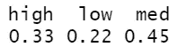

# 通过功能工程领先一步

> 原文：<https://towardsdatascience.com/do-feature-engineering-right-c3aa2d842563?source=collection_archive---------33----------------------->

## 利用分类数据创建更好的模型


图片由[黛博拉·布林·怀汀](https://pixabay.com/users/dbreen-1643989/?utm_source=link-attribution&utm_medium=referral&utm_campaign=image&utm_content=1083796)拍摄，来自[皮克斯拜](https://pixabay.com/?utm_source=link-attribution&utm_medium=referral&utm_campaign=image&utm_content=1083796)

# 利用分类数据创建更好的模型

机器学习模型很难解释分类数据；特征工程允许我们重新将我们的分类数据置于上下文中，以提高我们的机器学习模型的严谨性。特征工程还为数据分析提供了额外的视角层。特征工程方法解决的大问题是:我如何以有趣而巧妙的方式利用我的数据，让它变得更有用。

# 它是什么&它不是什么

特征工程不是清理数据、删除空值或其他类似的任务；特征工程与改变变量有关，以改善它们所讲述的故事。它是关于利用内容知识和数据探索。

# 分类数据的方法

# 垃圾箱/桶

通常，当您使用分类数据作为预测值时，您可能会发现该变量的某些级别很少出现，或者变量级别严重冗余。

您做出的任何开始对可变级别进行分组的决定都应该是战略性的。

这两种方法的良好开端是 r 中的`table()`函数。

我将使用 UCI 银行营销数据集，该数据集详细描述了客户的人口统计数据&营销活动是否成功。数据集可以在这里找到:[http://archive . ics . UCI . edu/ml/machine-learning-databases/00222/bank . zip](http://archive.ics.uci.edu/ml/machine-learning-databases/00222/bank.zip)


这里的想法是识别记录太少的级别的出现，或者看起来更能指示数据试图传达的信息的箱。

有时一个表格更难理解，所以把它放在条形图中也很好。

```
bank.df %>%
   group_by(job)%>%
   summarise(n = n())%>%
   ggplot(aes(x = job, y = n))+
   geom_bar(stat = "identity")+
   theme(axis.text.x = element_text(angle = 90, hjust = 1))
```


为了这个练习，让我们假设我们实际上想要理解在一个给定的角色中沿着技术使用的路线的职业。在这种情况下，我们将开始相应地绑定这些职称。

你可以在`dplyr`的`mutate`中使用一个漂亮的`case when`函数，当你重新分配一个变量的许多不同级别时，这个函数非常方便，而不是使用一些嵌套的`ifelse`函数。这个函数在将数值变量转换为分类数据时也非常有用。如果你想了解更多，请发表评论。

```
bank.df <- bank.df %>%
   mutate(technology_use = 
          case_when(job == 'admin' ~ "med",
                    job == 'blue-collar' ~ "low",
                    job == 'entrepreneur' ~ "high",
                    job == 'housemaid' ~ "low",
                    job == 'management' ~ "med",
                    job == 'retired' ~ "low",
                    job == 'self-employed' ~ "low",
                    job == 'services' ~ "med",
                    job == 'student' ~ "high",
                    job == 'technician' ~ "high",
                    job == 'unemployed' ~ "low",
                    job == 'unknown' ~ "low"))
```

正如您在上面看到的，我创建了一个名为“技术使用”的新字段，并根据其技术使用情况为每个字段赋值。我肯定你会为这些不同的作业争论，但是为了这个例子，我没有想太多。

现在让我们快速回顾一下这个新领域。

```
table(bank.df$technology_use)
```


```
round(prop.table(table(bank.df$technology_use)),2)
```



## 如何决定如何绑定

宁滨应该依赖于你试图理解的东西。比方说，工作的粒度要大得多，我们有几个营销相关的工作，CMO，营销分析师，数字营销经理等。您可能想要了解一个部门、一组技能或者只是稍微高一点的粒度级别的影响。

请务必利用表格、道具表和条形图来更好地了解如何对可变级别进行重新分类。

# 虚拟变量&一种热编码

假设您有一个两级分类变量，机器学习模型仍然不喜欢它，因此我们不会将默认变量级别保留为“是”和“否”，而是将它编码为虚拟变量。虚拟变量是分类变量的数字表示。任何时候 default 的值为 yes，否则我们将把它编码为 1 和 0。对于互斥的两级变量，这消除了对 no 的额外列的需要，因为它隐含在第一列中。

```
bank.df <- bank.df %>%    
  mutate( 
    defaulted = ifelse(default  == "yes", 1, 0))
```

我们已经讨论了将单个列作为虚拟变量的创建，但是我们应该讨论一次性编码。一个热编码实际上是相同的事情，但是对于许多级别的变量，其中除了值对应于新列的位置之外，列在所有行中都为 0，那么它将为 1。

`caret`包里的`dummyVars`在这里很有用。

```
library(caret)
dmy <- dummyVars(" ~ .", data = bank.df)
bank.dummies<- data.frame(predict(dmy, newdata = bank.df))
print(bank.dummies)
```

上面，我们加载了`caret`包，对所有变量运行 dummyVars 函数，然后根据它识别的一个热编码变量创建一个新的 dataframe。

让我们看看新桌子

```
str(bank.dummies)
```


我没有包括所有的列，但是你可以看到它只留下了年龄，然后是一个热门的编码工作&婚姻。您可以看到所有列的数据类型现在都是数字。

注意稀疏字段，并准备将宁滨方法与一种热编码进行比较，以获得更有效的结果。

# 组合特征或特征交叉

特征交叉是将多个变量结合在一起的地方。有时将变量组合在一起可以产生比单独使用更好的预测性能。

类似于你对宁滨的探索，将你考虑交叉的两个变量分组，并计算每个组合的数量。

```
bank.df %>% 
   group_by(job, marital) %>%
   summarise(n = n())
```


这种形象化通常更容易理解

```
bank.df %>% 
  group_by(job, marital) %>%
  summarise(n = n()) %>%
  ggplot(aes(x = job, y = n, fill = marital))+
  geom_bar(stat = "identity", position = "dodge") +
  theme(axis.text.x = element_text(angle = 90, hjust = 1))
```


要在一个步骤中完成交叉和编码步骤，您可以使用我之前向您展示的相同的`dummyVars`函数。

```
dmy <- dummyVars( ~ job:marital, data = bank.df)
bank.cross <- predict(dmy, newdata = bank.df
```

请记住，当您将多个变量组合在一起时，您可能会有一些非常稀疏的新值。与对任何给定的分类变量执行宁滨相似，您应该检查任何要素交叉的输出，以验证它们是否应该被预先分箱。

# 结论

我希望这是对 r 中使用分类变量的特征工程的一个有帮助的介绍。我们可以使用主成分分析来提高解释变量的预测能力。我将在另一篇文章中讨论这些问题。有关 PCA 的课程，请查看我在[https://datasciencelessons . com/2019/07/20/principal-component-analysis-in-r/](https://datasciencelessons.com/2019/07/20/principal-component-analysis-in-r/)的帖子，或者查看我在[https://datasciencelessons.com/](https://datasciencelessons.com/)的博客

祝数据科学快乐！