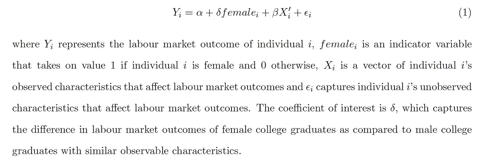
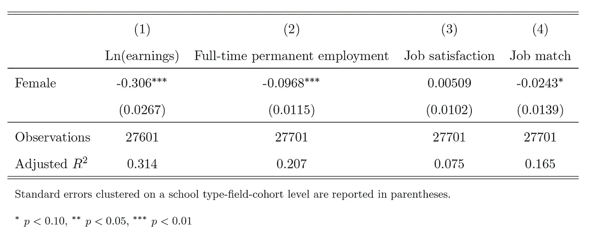
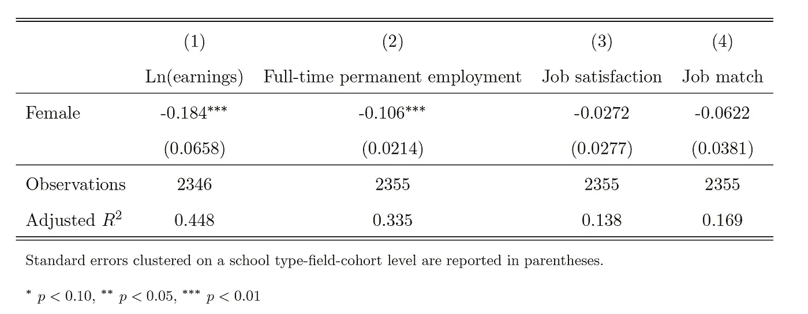
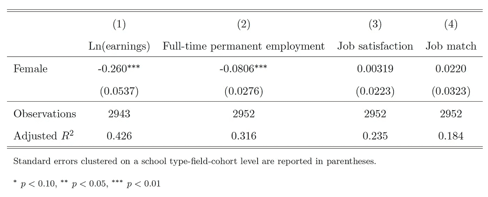
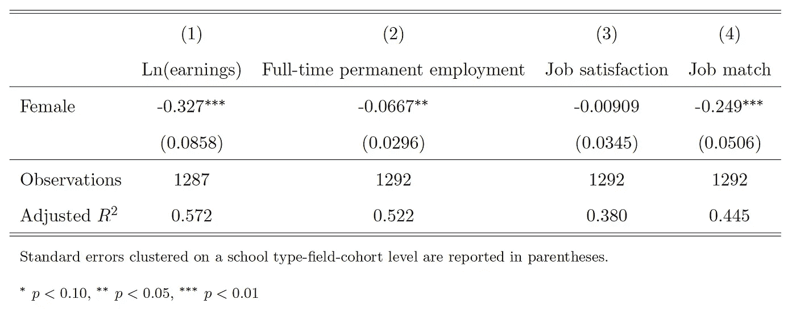
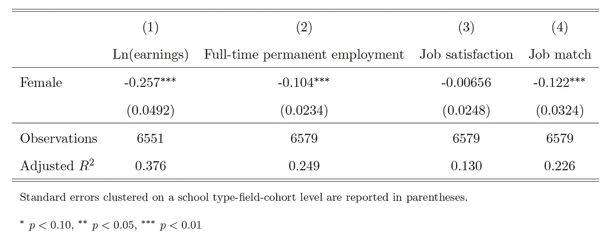
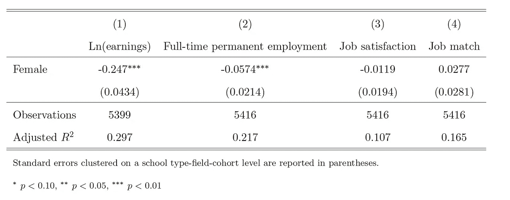
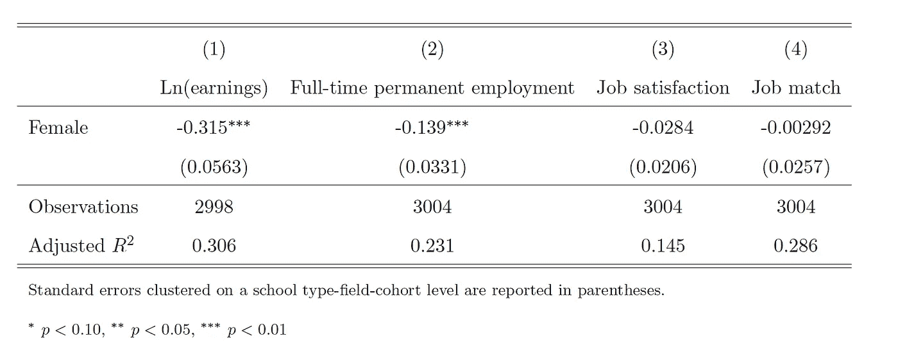
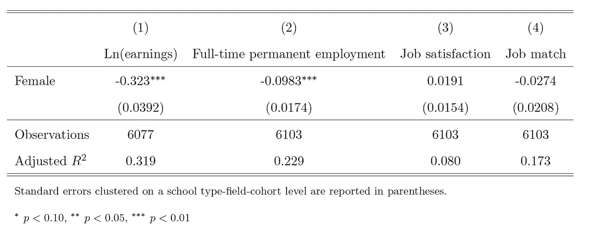

# 女大学毕业生挣钱少吗？

> 原文：<https://towardsdatascience.com/do-female-college-graduates-earn-less-than-their-male-peers-d5bdfd3165b9?source=collection_archive---------67----------------------->

## 利用线性回归，我研究了美国女性大学毕业生在劳动力市场上的境遇是否比男性大学毕业生差。

[杨雅筑](https://unsplash.com/@sylviasyang?utm_source=medium&utm_medium=referral)在 [Unsplash](https://unsplash.com?utm_source=medium&utm_medium=referral) 上拍照

我相信我们大多数人(如果不是所有人)都听说过生活中许多领域的性别差距，包括劳动力市场。它们仅仅是没有任何根据的说法吗？在这篇文章中，我调查了受过高等教育的人——美国的大学毕业生——在就业结果方面是否存在性别差异。

简单地比较所有女性和男性大学毕业生的就业结果会给我们一个不准确的性别差距，因为男性和女性毕业生在许多方面都有所不同。我不会进行详细的解释(并冒着让每个人都睡着的风险)，但一般来说，我们经常说这两个群体在可观察的特征(如种族、公民身份、雇主部门)以及不可观察的特征(如能力和动机)方面有所不同。对于这项研究，我将假设女性和男性大学毕业生仅在可观察到的特征方面有所不同，并通过使用多元线性回归来解决这些差异。回归背后的主要思想是，我们试图让女性和男性大学毕业生在可能影响劳动力市场结果的可观察特征方面彼此相似(这些是我们控制的变量)，以便这两个群体更具可比性。

# 资料组

我使用的数据集是 2017 年全国大学毕业生调查(NSCG)提供给[公众使用](https://ncsesdata.nsf.gov/datadownload/)。NSCG 是对美国大学毕业生进行的两年一次的调查。它是由美国国家科学基金会赞助的，所以它从他们感兴趣的领域中过度取样。但是，提供调查权重是为了允许进行调整，以使样本能够代表整个人口。这些砝码用于我的研究。

# 关注的结果

将研究以下结果。

*   收入:这是从一个人的主要工作中获得的收入。我利用美国劳工统计局提供的年度 CPI，对通货膨胀进行了调整，以获得实际收入。使用收入的自然对数。
*   全职长期就业:这只适用于那些劳动力。如果一个人从事全职长期工作(每周至少工作 35 小时)，则其值为 1，否则为 0。
*   工作满意度:如果一个人对自己的工作比较满意或非常满意，则该值为 1，否则为 0。
*   工作匹配度:如果一个人的工作与他的大学学位有一定关系或密切相关，那么这个值为 1，否则为 0。

# 感兴趣的样本

为了进行清晰的对比，我将样本限于那些只有一个学士学位的人。换句话说，那些继续完成研究生学位、多个学士学位或副学士学位的人被排除在我的样本之外。

# 战略

使用以下回归规范:

至于标准误差，我在学校类型-领域-群组水平上对它们进行聚类，这将考虑到每个聚类内的异方差性和任意相关性。聚类的一个例子是在 1971 年到 1973 年间从一所研究型大学毕业并获得计算机和数学科学领域的学位的观察结果。

我将从两个层面进行分析。

1.  同质效应:身为女性对大学毕业生的劳动力市场结果有什么总体影响？
2.  异质效应:女性对大学毕业生劳动力市场结果的影响在不同的研究领域有所不同吗？

# 控制变量

我纳入了所有可能影响劳动力市场结果的控制变量。我使用的控制变量可以分为几组。

*   社会人口特征:年龄、种族、出生地、国籍、家中是否有孩子、父母教育水平、婚姻状况
*   身体特征:他们是否有任何身体上的困难，是否有任何残疾
*   学院特征:学院机构类型(基于 1994 年卡内基准则)，授予学位的年份，学院的位置，专业，他们是否参加了双学位课程
*   雇主特征:公司部门、公司规模、公司所在地

此外，我还控制了他们所属的美国社区调查队列。

# 结果

让我们先来看看同质效应分析的结果——对于大学毕业生来说，女性对劳动力市场的总体影响是什么？

## 同质效应

表 1 总结了这一分析的结果。

表 1:同质效应分析的结果

在表 1 的第(1)栏中，对收入结果的估计在 1%的水平上具有统计显著性，它表明女大学毕业生的平均收入比具有类似观察特征的男大学毕业生低 30.6%。这表明男女大学毕业生之间的收入差距相当大！

让我们看看劳动力市场的其他结果。从第(2)栏来看，该估计表明，女性大学毕业生获得全职永久就业的可能性低 9.68 个百分点。从第(3)栏来看，没有证据表明女性大学毕业生更有可能对自己的工作感到满意，因为这一估计在统计学上是不重要的。从第(4)栏来看，该估计表明，女性大学毕业生从事与其学位相关的工作的可能性要低 2.43 个百分点。然而，与收入和全职长期就业的估计数相比，这一估计数没有那么重要。

总体而言，对这一部分的分析似乎表明，与男性相比，女性大学毕业生面临更不利的就业结果。

## 异质效应

在这一部分，我将考虑到跨研究领域的影响异质性。我想知道在不同的研究领域，感兴趣的就业结果的性别差异是否有所不同。例如，学社会科学的大学毕业生是否存在更大的性别差距？

**1。计算机和数学科学**

这将包括计算机科学、数学和统计学专业的大学毕业生。表 2 总结了该分析的结果。

表 2:计算机和数学专业大学毕业生的调查结果

如表 2 所示，在这些领域，与男性大学毕业生相比，女性大学毕业生的收入低 18.4%，获得全职长期就业的可能性低 10.6%。与同质效应分析相比，收入差距似乎要小得多。

**2。生物、农业和环境生命科学**

这包括主修动物科学、生物学和环境科学的大学毕业生。表 3 总结了该分析的结果。

表 3:生物、农业和环境生命科学专业大学毕业生的调查结果

如表 3 所示，在这些领域，与男性大学毕业生相比，女性大学毕业生的收入低 26%，获得全职永久就业的可能性低 8.06 个百分点。

**3。物理科学**

这包括主修物理和化学的大学毕业生。表 4 总结了该分析的结果。

表 4:主修物理科学的大学毕业生的成绩

如表 4 所示，在这些领域，与男性大学毕业生相比，女性大学毕业生的收入低 32.7%，找到全职长期工作的可能性低 6.67%，找到与其学位相关的工作的可能性低 24.9%。

**4。工程**

这包括化学工程、机械工程和土木工程专业的大学毕业生。表 5 总结了这一分析的结果。

表 5:工程专业大学毕业生的调查结果

如表 5 所示，在这些领域，与男性大学毕业生相比，女性大学毕业生的收入低 25.7%，找到全职长期工作的可能性低 10.4%，找到与其学位相关的工作的可能性低 12.2%。

**5。社会科学**

这包括主修经济学和心理学的大学毕业生。表 6 总结了这一分析的结果。

表 6:主修社会科学的大学毕业生的成绩

如表 6 所示，在这些领域，与男性大学毕业生相比，女性大学毕业生的收入低 24.7%，获得全职长期就业的可能性低 5.74%。

**6。其他理工科相关领域**

这包括药学和数据处理专业的大学毕业生。表 7 总结了该分析的结果。

表 7:主修其他科学和工程相关领域的大学毕业生的结果

如表 7 所示，在这些领域，与男性大学毕业生相比，女性大学毕业生的收入低 31.5%，获得全职长期就业的可能性低 13.9%。

**7。非理工科相关领域**

这包括主修教育、商业、艺术和人文学科的大学毕业生。表 8 总结了这一分析的结果。

表 8:非理工科相关专业的大学毕业生的调查结果

如表 8 所示，在这些领域，与男性大学毕业生相比，女性大学毕业生的收入低 32.3%，获得全职长期就业的可能性低 9.83%。

根据表 2 至表 8 中的结果，似乎是自然科学专业毕业生的收入差距最大，计算机和数学专业毕业生的收入差距最小。然而，收入差距确实存在于所有的研究领域，这似乎是事实。对于全职永久就业，所有研究领域的估计都是显著的负值。其他科学和工程相关专业的毕业生系数最大，而学习社会科学的毕业生系数最小。对于工作匹配，只有物理科学和工程专业的毕业生的估计具有统计学意义。系数为负，这意味着学习这些领域的女性大学毕业生不太可能找到与其学位相匹配的工作。

# 限制

这项研究的发现依赖于这样一个假设，即女性和男性大学毕业生只是在可观察到的特征方面有所不同。这可能是不现实的，因为男女大学毕业生可能在不可观察的特征方面有所不同，如能力和动机水平。这意味着从这项研究中获得的估计值可能有偏差。也可以采用其他技术，如差异中的差异、回归不连续性或固定效应分析。此外，该数据集没有提供任何关于这些毕业生在大学表现如何的信息，与他们父母的教育水平相比，这些信息可以更好地反映他们的能力。

# 结论

根据这项研究，男女大学毕业生之间确实存在收入差距，差距从计算机和数学科学毕业生的 18.4%到物理科学毕业生的 32.7%不等。各行各业的女大学毕业生在获得全职长期就业的可能性方面也经历了负面影响。这是否意味着女性大学毕业生在劳动力市场面临歧视？如果我们想找出是否存在性别歧视，使用另一种叫做 Blinder-Oaxaca 分解的统计模型会更合适，这将在另一篇文章中讨论！

注:所有分析均使用 Stata 进行。可用于复制本文中所有分析的 do 文件位于 [GitHub](https://github.com/meredithwan/Gender-gap) 上。