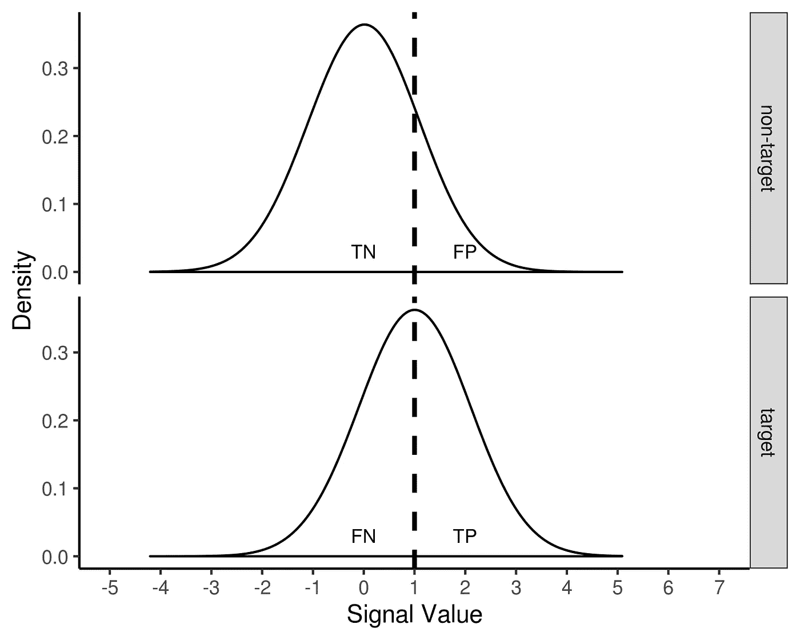
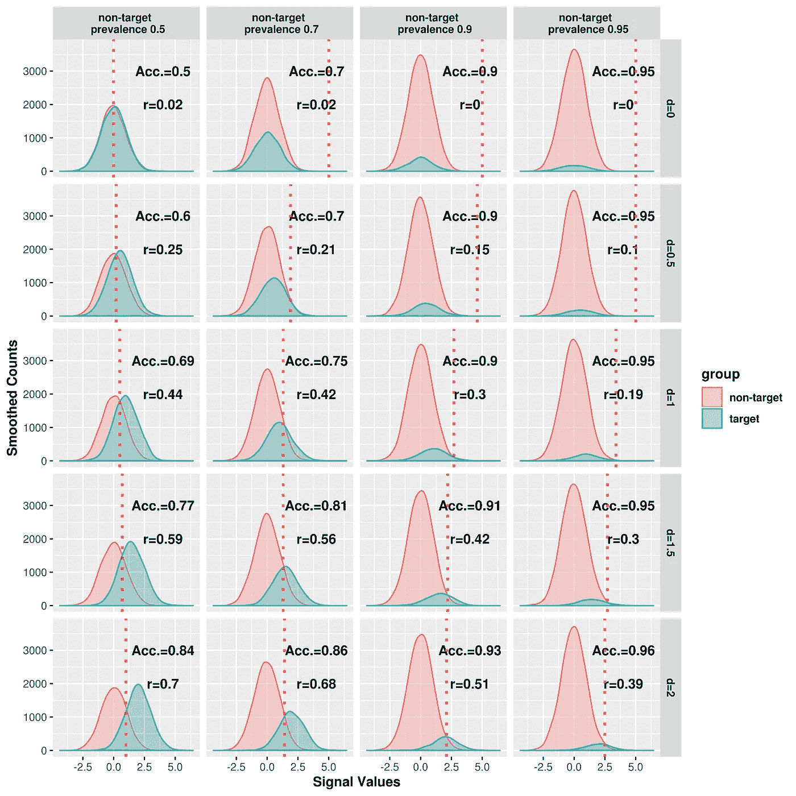
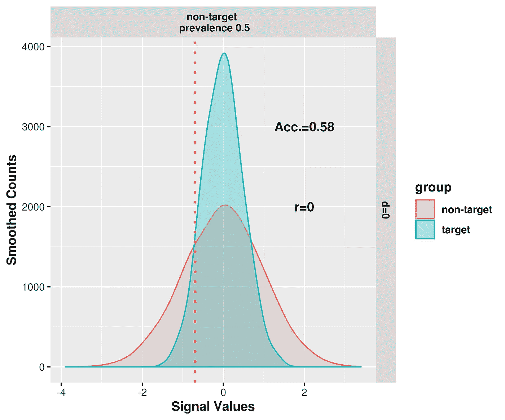

# 好的预测者预测的好吗？

> 原文：<https://towardsdatascience.com/do-good-predictors-predict-well-6f237e7e757e?source=collection_archive---------36----------------------->

# 论假设检验与分类性能的异同。

来源: [lassedesignen](https://www.shutterstock.com/g/lassedesignen) 通过 [shutterstock](https://www.shutterstock.com) (SL)

不久前，我使用 SVM 构建了一个文本分类器，我很高兴看到 98.5%的初始准确率。然而，在一些快速检查之后，我注意到我的非目标类别流行率大约是 99%。如果我预测了所有情况下的“非目标”,实际上我会观察到比我的复杂模型更高的准确性！我检查了从 SVM 中提取的最具预测性的特征，它们肯定通过了快速的健全性检查:分类器肯定得到了有价值的信号，而不仅仅是噪声。我怎么能有一个工作的分类器，但它的性能并不比偶然的好？我的困惑部分来自于我的实验背景，计算效应大小和估计统计学意义通常是定量分析的最终目标。我熟悉其他一些适用于不平衡组的性能指标，但是我对统计显著性/效应大小和分类器性能之间的关系没有很好的直觉。为了对这种关系有一些基本的了解，我模拟了几个例子，我发现这些例子提供了很多信息，我希望这些结果能够帮助其他数据科学家解决同样的问题。

**假设检验对比分类任务**

对于那些通过实验进入数据科学的人来说，统计推断，更具体地说，假设检验可能是应用统计学的主要焦点。在讲授统计学导论课程时，教师通常将自变量称为“预测因素”，并将重要的预测因素描述为那些能提高我们对因变量的最佳猜测的变量。例如，回归模型的一个常见直观解释是，如果我们没有显著的预测值，我们对因变量的值的最佳猜测是它的平均值，而如果我们有一组显著的预测值，我们应该根据这些预测值来调整我们的预测。虽然这一术语在许多情况下肯定是有用的(有时学术期刊的评论者特别建议避免因果语言)，但它可能导致错误的预期，即强预测因素(当样本量不变时，具有大的效应大小和相应的高统计显著性)必然会提高我们对结果的最佳猜测。

更具体地，在两个变量(结果和预测)的简单情况下，显著性测试和分类任务都基于两个变量的联合概率分布。如果结果变量和预测变量是独立的，例如，对于预测变量的所有值，P(目标|预测值)= P(目标)，则任何统计测试都将是不显著的，并且分类性能不会比机会好。尽管这种对联合概率分布的共同依赖，然而，统计推断和分类任务正在回答本质上不同的问题。假设检验是关于比较两种不同水平结果的预测值的概率分布。另一方面，预测是关于选择考虑(或不考虑)预测值的结果值。Lo 等人( [2015](https://www.ncbi.nlm.nih.gov/pmc/articles/PMC4653162/) )展示了这两个目标在一般情况下如何产生分歧；这里我们将只探讨最明显的:不平衡组(例 1 和例 2)，和非线性关系(例 3)。

## 例 1:二元预测器和预测的不对称性

假设你正在研究肺癌和吸烟之间的关系，给你一个列联表(表 1 ),上面有这两个变量的联合分布。

表 1。肺癌和吸烟的假设频率。

显然，吸烟与肺癌之间有很强的关系，χ (1，n = 100) = 30.72，p < 10e-7, and the effect size is phi = 0.58, which in Social and Behavioral Sciences is considered large. Will this relationship be helpful for predicting the value of one of the variables based on the value of the other? Let us first try predicting if someone is a smoker based on their lung cancer status. If for every smoker we predict the presence of lung cancer, and for everyone non-smoker we predict no lung cancer, we will be correct in 75% of all cases (recall what a [**混淆矩阵**](/understanding-confusion-matrix-a9ad42dcfd62) 为)。这比肺癌的基本发病率(50%)要好得多，因此考虑吸烟状况有助于我们改进预测。但是反过来呢？关于肺癌状况的知识是否改善了我们对吸烟的预测？基于肺癌预测吸烟状况再次导致 75%的正确预测，但这与吸烟的基础率没有区别。如果我们预测每个人都是“吸烟者”，而不考虑任何其他信息，我们在 75%的情况下仍然是正确的。细心的读者可能已经注意到这种差异来自于患病率的不同。提高我们对平衡组预测的准确性要比不平衡组容易得多。

## 示例 2:连续预测器

在本例中，我们仍将使用二元结果变量，但这次预测器将是连续的。它将松散地基于信号检测理论框架。假设您希望根据连续信号的值来预测目标是否存在。当目标存在时，信号呈正态分布 N(M0，σ)，当目标不存在时，信号为N(M1，σ)。如果我们想要预测目标是否存在，我们可以设置一个信号阈值，如果一个观察值低于它，我们预测“没有目标”，如果它高于它，我们将预测“目标”(见图 1)。在某些情况下，当目标不存在时，我们会观察到低于阈值的信号(真阴性)，然而在其他情况下，我们会做出错误的预测，因为即使目标存在，信号也可能低于阈值(假阴性)。如果我们增加阈值并将其从 1 改为 2，我们将增加 TNs 的数量(理想的),但也不可避免地会有更多的 FNs(不理想的)。

图一。一个基本的信号检测设置，我们选择一个分界点来预测目标的存在和不存在。在该设置中，TP 和 TN 是正确的预测，而 FP 和 FN 是不正确的预测。

注意，在假设检验中，我们感兴趣的是这两个分布是否相同。在分类中，我们选择一个最大化给定性能指标(如准确性)的分界点。M0 和 M1 之间的差异越大，我们就越有可能拒绝零假设，分类器就越准确。然而，与例 1 类似，在高度不平衡组的情况下，即使两个平均值相差很远(例如，通过 t 检验，差异非常显著)，我们仍然会有很差的预测。我们将用图 2 所示的一系列模拟来说明这一点。

图二。二元结果和连续预测因子的准确性和效应大小之间的关系。曲线代表理想化的(平滑的)直方图。横向上，我们改变了非目标群体的患病率。在垂直方向上，我们改变组均值之间的距离(以标准差表示)。r 是点-双列相关系数，可用作效应大小的量度。Acc。是使用红色虚线作为决策阈值时达到的最大精度。

图 2 中的关键信息是，两组之间的不平衡越大，预测变量对分类的用处就越小。例如,≈ 0.3 的相关性提高了平衡组(第 2 行，第 1 列)的准确性，但它不会提高不平衡组(第 3 行，第 3 列)的准确性。虽然效应大小和显著性都受到组不平衡的影响，但预测准确性的提高受到的影响更大。

## 示例 3:方法相同，但精确度提高

虽然前面的两个例子说明了即使结果和预测因子之间有很强的关联，预测的准确性也不会增加，但在这个例子中，我将说明相反的情况:在变量之间没有显著关联的情况下，准确性有所提高。

想象一下，您再次看到一个二元结果(目标和非目标)和一个连续信号，如图 3 所示。你检查相关性，它是 0，你运行 t 检验，两个组的平均值之间没有显著差异。你很容易忽略这个信号，并错误地认为这个信号不能帮助我们预测结果。事实上，在这种特殊的情况下，有一个最佳的阈值将导致 58%的准确性，这是一个比原来的患病率大幅度提高。

*图 3。*目标和非目标群体的理想化直方图。两种分布的均值相同，但目标分布的标准差比非目标组小两倍。这两个变量之间的相关性为 0，但我们可以找到一个决策阈值，它可以提高预测的准确性，超出流行程度。

这个例子揭示了统计推断和分类任务之间的另一个重要区别。在统计推断中，我们通常测试两个变量之间特定类型的相关性。最常见的是均值、比例或相关系数大小的差异。当然，我们也可以测试方差的相等性，测试两个变量是否来自同一个分布，或者测试更高阶的关系(二次关系对于当前的例子来说尤其合适)。然而，在大多数情况下，当处理大型数据集或在时间压力下工作时，相关性和 t 检验是显著性检验的主要工具。另一方面，分类模型将较少关注特定类型的关系，并且最有可能探索多个阈值/关系。例如，如果不是像信号检测理论中那样使用单个阈值，而是运行决策树，我们将获得两个阈值而不是一个，这将获得更高的精度。

## 结论

这篇文章的关键信息是提供一系列简单的例子来证明分类中的统计推断和预测任务应该区别对待。您可能有很强的统计关系和很差的分类性能。你也可以有一个与弱统计关系相关的良好表现(对于一个特定的假设)。

我们在这里没有解决的是如何评估一个基于一组重要预测因子的分类器的有效性，但是它的准确性并不比患病率好。当这种情况发生时，可以使用替代的性能指标，区分不同类型的正确和不正确的预测。事实上，我们在示例 2 中使用的点-双列相关也被用作分类器的性能度量，它被称为马修系数。结果和预测之间更强的关系可能不会提高准确性，但它会改善混淆矩阵中的某些特定单元。如果某些类型的误差比其他类型的误差代价更高，那么使用预测器可能会更好，即使这会影响整体精度。然而，这超出了本文的范围，对于感兴趣的读者来说，这里有很棒的学术论文( [Davis & Goadrich，2006](https://www.biostat.wisc.edu/~page/rocpr.pdf) ， [Ferri 等人，2009](https://www.sciencedirect.com/science/article/abs/pii/S0167865508002687) )和关于该主题的优秀文章( [Fawcett，2016](https://www.svds.com/learning-imbalanced-classes/) )。

## 要点

*   统计推断和分类都基于联合概率分布，但它们回答不同的问题。
*   如实施例 1 和 2 所示，较大的效应大小不能保证良好的预测。
*   从实施例 3 中可以明显看出，小/零效应大小并不排除良好的分类性能。
*   在所有其他条件相同的情况下，强预测器(大效应大小)将比弱预测器产生更好的分类器，然而这可能不会通过增加的准确性直接捕获。重要的预测因素可能是提高其他性能指标，这可能是您关心的，也可能是您不关心的。

**参考文献:**

[1] Davis，j .，& Goadrich，m . Precision-Recall 和 ROC 曲线之间的关系(2006 年 6 月)，*第 23 届机器学习国际会议论文集*(第 233–240 页)。

[2] Ferri，c .、Hernández-Orallo，j .、& Modroiu，r .分类性能测量的实验比较(2009)，*模式识别字母*， *30* (1)，27–38。

[3] Lo，a .，Chernoff，h .，郑，t .，& Lo，S. H .为什么显著变量不是自动良好的预测器(2015)，*美国国家科学院学报*， *112* (45)，13892–13897。

**脚注:**

1.机器学习专家可能已经注意到，我在这里使用的是最简单的性能指标，叫做准确度。准确度是正确预测的比例，并假设所有正确和所有不正确预测的权重相同。度量标准的选择是 ML 领域的一个大话题，我在这里不讨论它，尽管，无可否认地，使用准确性作为度量标准会加剧统计推断和分类性能之间的差异。