# 香港人还在新冠肺炎下吃饭吗？

> 原文：<https://towardsdatascience.com/do-hong-kongers-still-dine-out-under-covid-19-9ac4bf49d4ab?source=collection_archive---------36----------------------->

## 事实证明，在疫情爆发期间，有一样东西可以吸引美食家

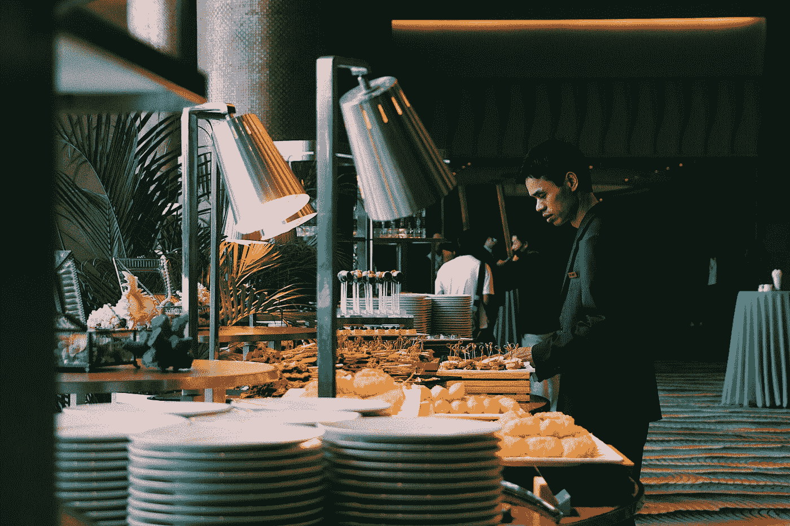

[叶晨](https://unsplash.com/@yeeu?utm_source=medium&utm_medium=referral)在 [Unsplash](https://unsplash.com?utm_source=medium&utm_medium=referral) 上拍照

# 整体情况

自 1 月 21 日至 1 月 22 日以来，一切都发生了变化，当时 mainland China 的情况变得非常严重，他们开始报告新冠肺炎的统计数据，出现了第一例通过高铁输入香港的“高度易感”病例。

由于这种病毒在香港越来越流行，人们倾向于减少外出就餐是很自然的。在下面的图表中，数据来自一个流行的餐厅预订应用程序，我们可以看到自 1 月下旬以来，酒店自助餐预订数量一直在下降，从 40000+的水平下降到 15000 左右。*(注意:这些数字是某一时期的滚动总和，因此并不是某一天的确切预订量，但仍然显示了趋势)*

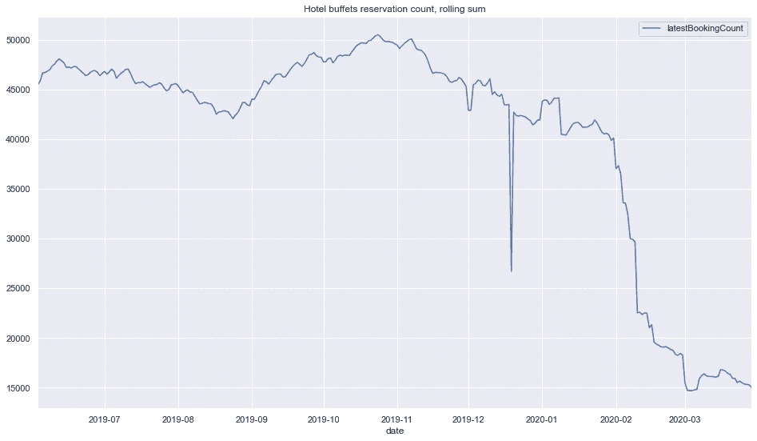

不仅外出就餐的人越来越少，酒店餐厅也从该应用中退出，从 1 月下旬的 27 家餐厅减少到 3 月的 14-15 家餐厅——可能酒店预计外出就餐的人会少得多，因此为预订平台付费可能没有太大价值。

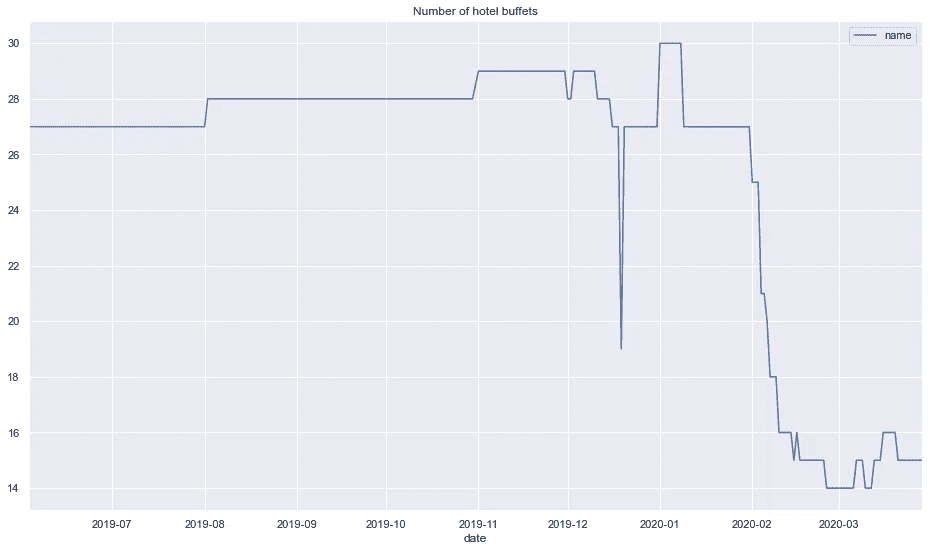

# 为什么是自助餐？

为什么我们要看自助餐厅的数量？

1.  他们是预订应用程序上最受欢迎的类别之一，预订容量很高。
    = >测量误差更小
2.  我的感觉是，自助餐没有太多的季节性，人们对它有一个相当恒定的需求，不像火锅，它更像是一种“冬季食品”。少了一个需要担心的变量
3.  我的感觉是，在新冠肺炎的统治下，自助餐厅是一个危险的环境。与其他餐厅不同，吃自助餐的人必须步行去取食物，而酒店的自助餐厅通常会容纳很多人。
    = >所以要让 COVID 因子更敏感。如果环境不是那么危险，人们可能会像往常一样做出决定。
4.  我相信大多数去自助餐的人会通过应用程序预订桌子(考虑到折扣)，所以预订应用程序趋势很好地代表了人们去餐馆的情况。

# 海军部是一个异数

当按香港地区查看预订数量时，我们可以看到一个有趣的趋势。自 1 月下旬以来，几乎所有地区的房价都在下跌，只有一个例外——金钟。

自 1 月下旬以来，金钟(深蓝线)自助餐厅的预订量一直在飙升，从 2500 英镑左右升至 9000 英镑。另一方面，尖沙咀自一月以来下跌了很多。是什么造成了如此大的差异？

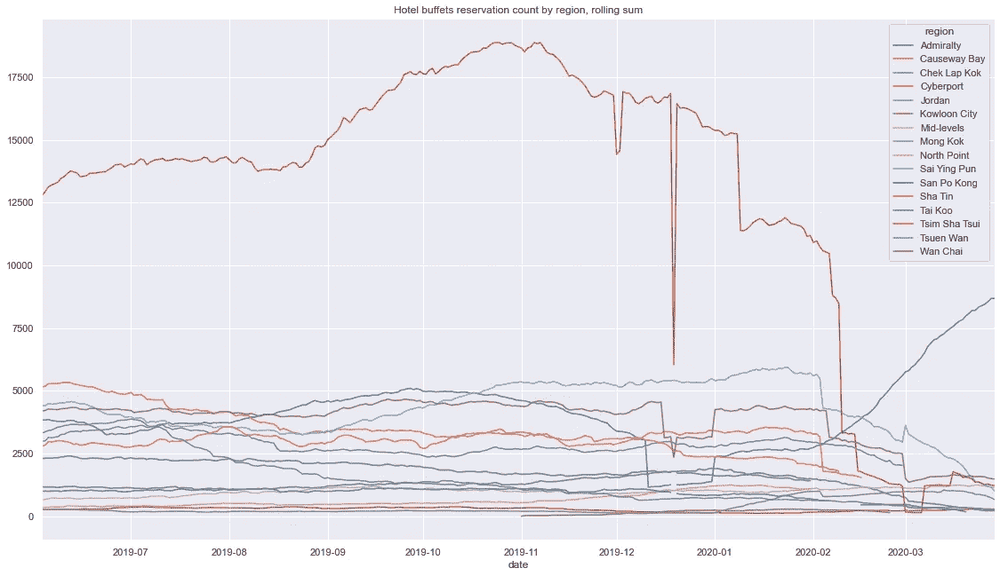

让我们更深入地研究一下餐厅的预订数量。下面是位于金钟的两家 JW 万豪自助餐厅。JW 咖啡馆似乎在去年 12 月暂停了一段时间，从 2 月初开始激增。自去年 11 月以来，休息室的人数一直呈上升趋势，并在 2 月底被 JW 咖啡馆超过

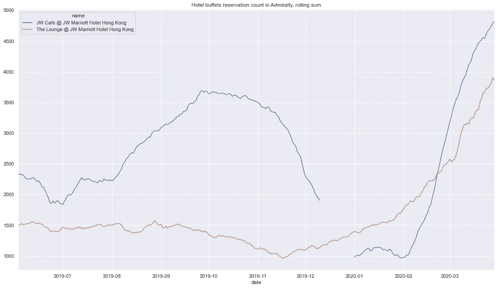

对于尖沙咀，我们可以看出为什么这个地区的数量下降了这么多——许多自助餐厅不再使用这个平台了！厨房(W 酒店)是平台上点击率最高的餐厅之一，于 2 月中旬退出平台。这可能是由 1 月 29 日的一条新闻引发的，该新闻报道了一名新冠肺炎患者在 1 月 22 日至 28 日期间住在 W 酒店。一些餐厅在 3 月份恢复了该平台，但自那以来趋势仍然是向下的。

尖沙咀和金钟距离地铁站仅 1 站之遥，两者相距约 7 分钟。事情怎么会如此不同？

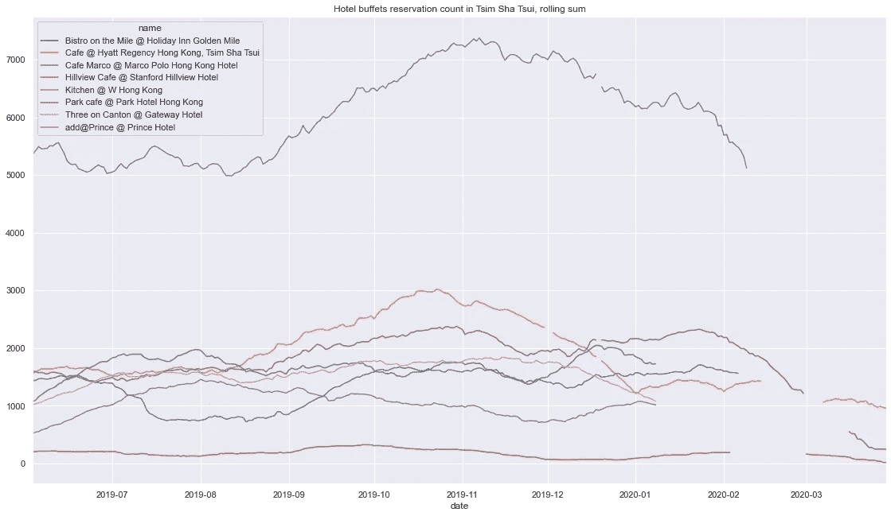

# **如何？有意义的折扣**

## 海军部

让我们看看两家金钟餐厅的折扣百分比热图:

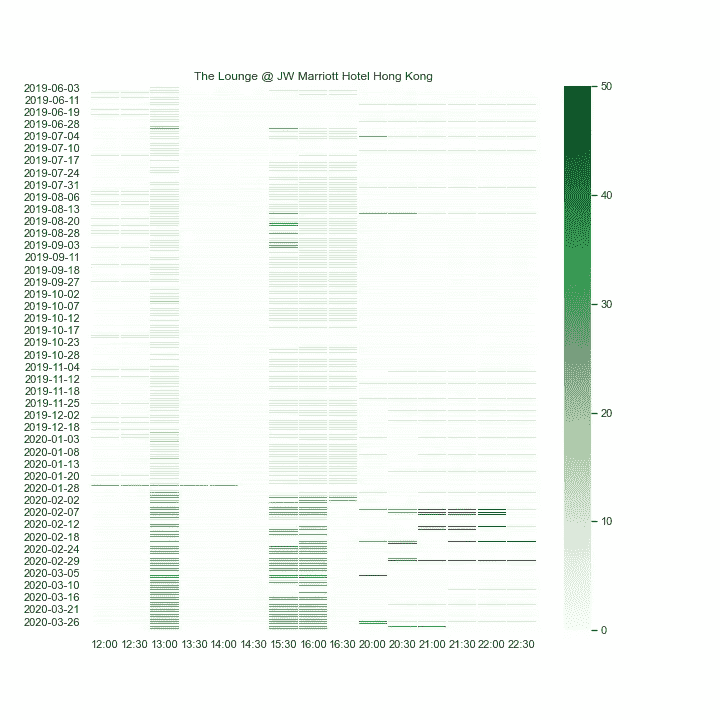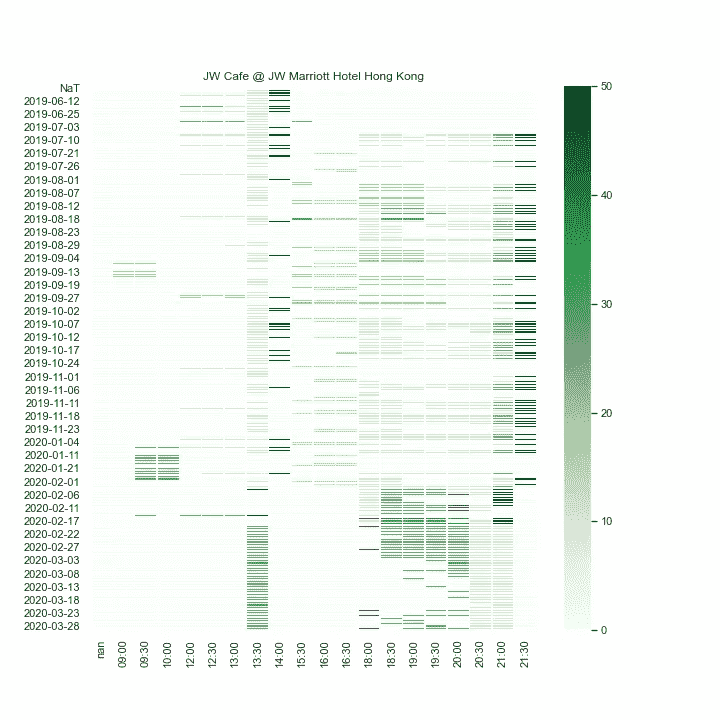

1.  从 2 月开始，我们可以看到这两家餐厅在午餐、茶点和晚餐期间的折扣%有了“有意义的”增加。尤其是午餐，他们只保留 1 强 13:00 时段。从他们过去很少提供超过 10%的折扣，但现在他们定期提供 30%以上的午餐折扣的意义上来说，这种增加是“有意义的”。
2.  如果有很好的折扣，人们实际上愿意出去吃饭，即使是在自助餐的环境下！

## 尖沙嘴

对于尖沙咀来说，许多餐馆没有二月/三月的时间段。即使对那些有影响的人来说，他们似乎也确实对午餐/晚餐时间做出了重大改变。我想，从另一个角度来看，他们中的许多人实际上已经给出了相当好的折扣，他们可能没有太多的空间来“有意义地增加”折扣。这也可以解释辍学的原因。

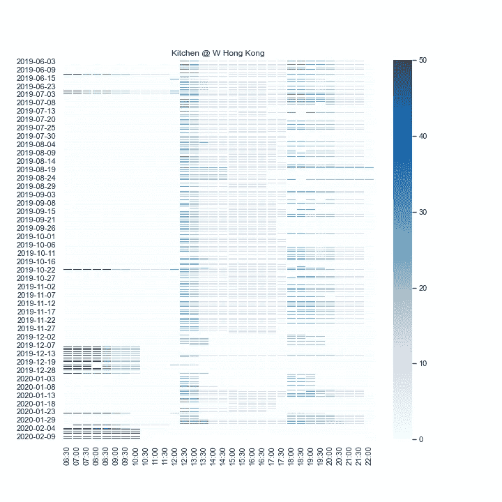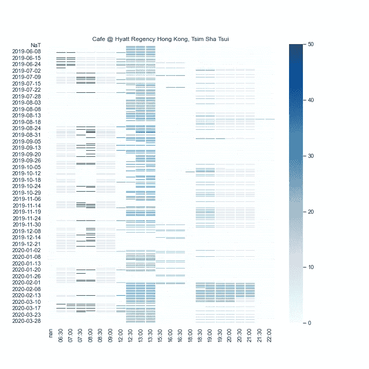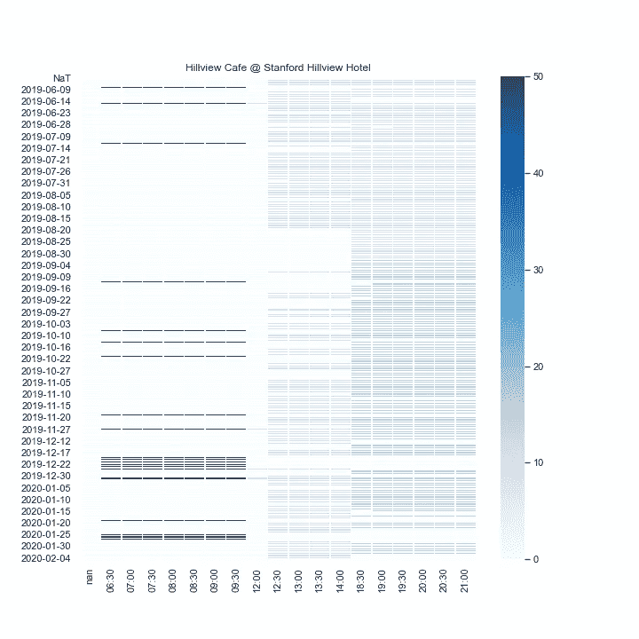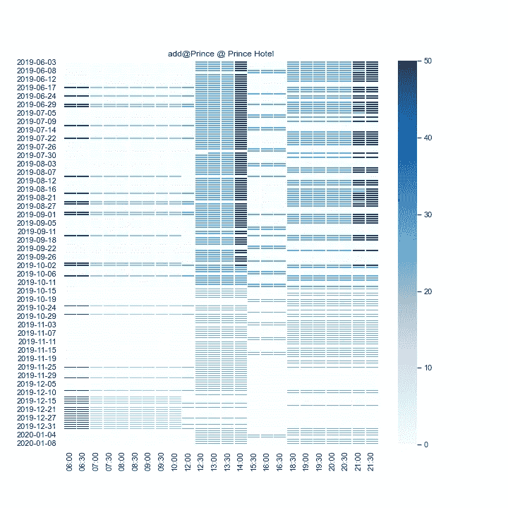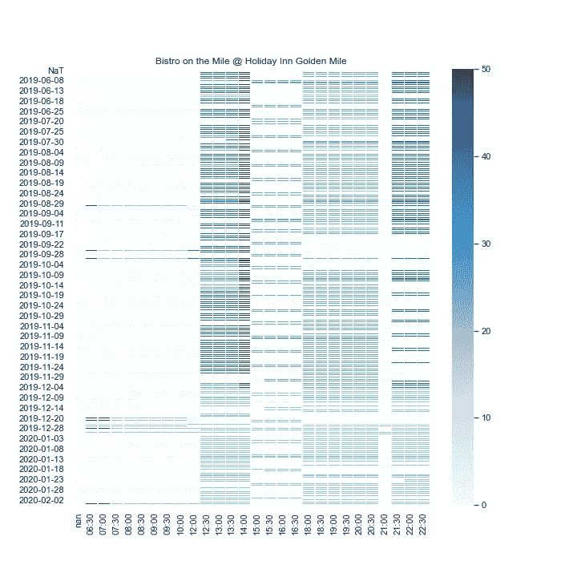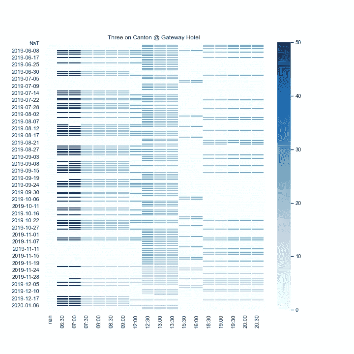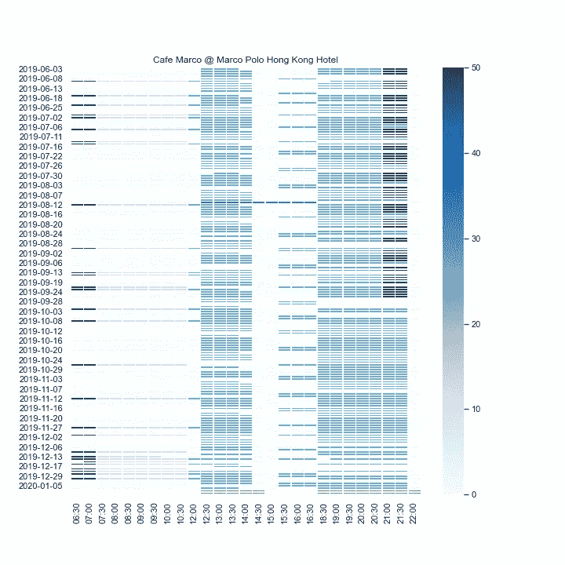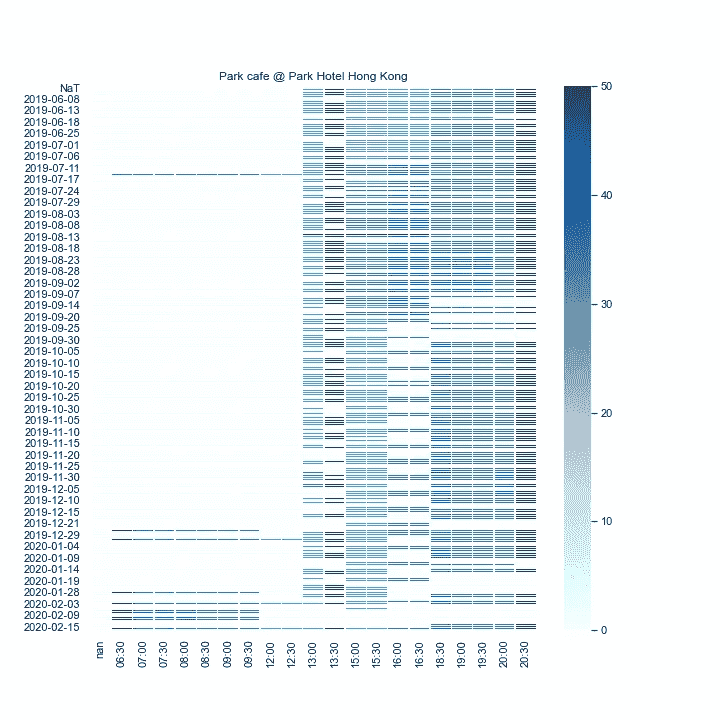

# 关闭

原来 HKers 还是会在外面吃饭，原因是…$？

香港政府刚刚对餐馆实施了新的限制，包括限制每桌最多 4 人，并且每桌必须相距 1.5 米，这对这些餐馆经营者来说只会更糟。这些限制将如何应用于自助餐顾客？“有意义的折扣”的把戏还有效吗？

看到 JW 氏症 50%的折扣真的很令人难过，海军部的数字上升得比感染人数还快。我觉得香港人比这个强，不是吗？

***编者按:*** [*走向数据科学*](http://towardsdatascience.com/) *是一份以数据科学和机器学习研究为主的中型刊物。我们不是健康专家或流行病学家，本文的观点不应被解释为专业建议。想了解更多关于疫情冠状病毒的信息，可以点击* [*这里*](https://www.who.int/emergencies/diseases/novel-coronavirus-2019/situation-reports) *。*