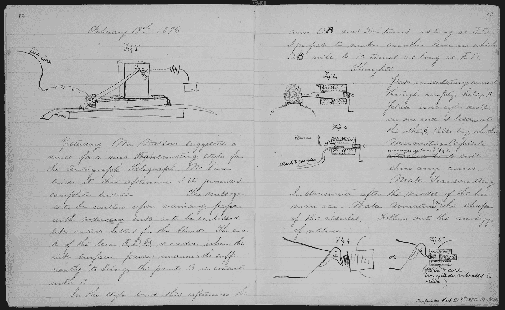
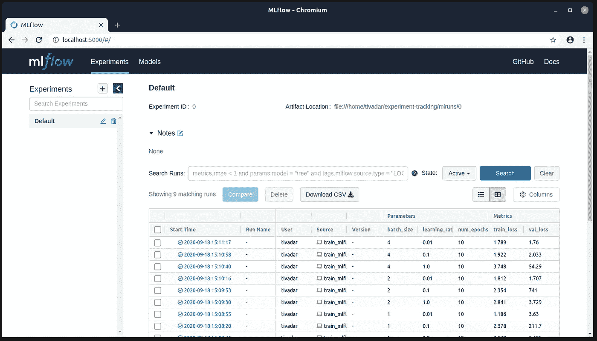
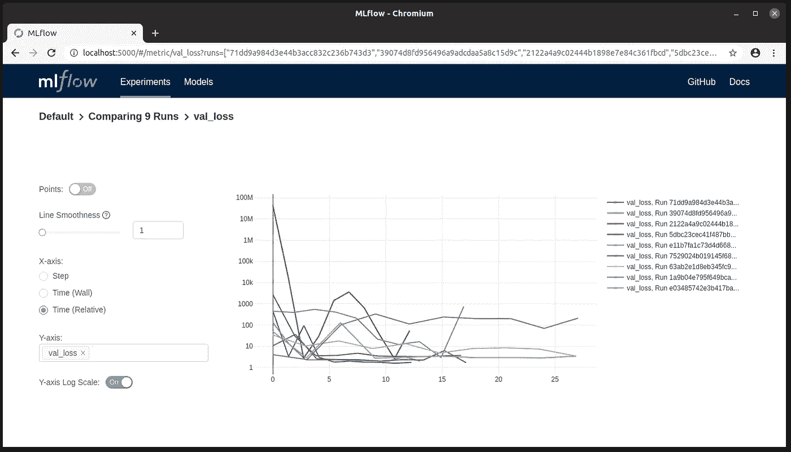
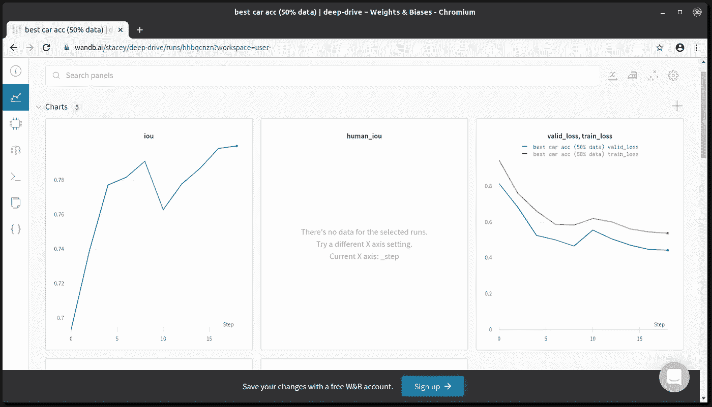
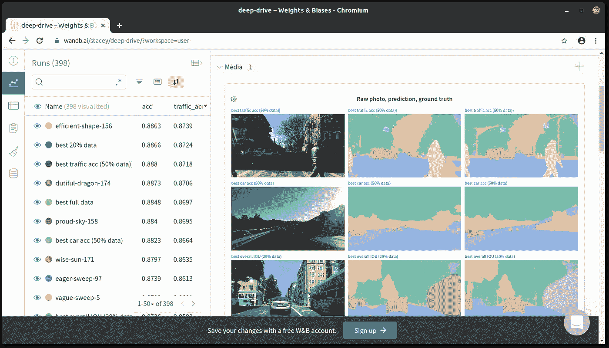

# 像实验科学家一样做机器学习

> 原文：<https://towardsdatascience.com/do-machine-learning-like-an-experimental-scientist-35b827a70a01?source=collection_archive---------36----------------------->

## 开始跟踪你的实验，并变得非常高效

让我们回到几十年前。

莱纳斯·鲍林是唯一获得两次非共享诺贝尔奖的科学家，也是有史以来最伟大的化学家之一，他是一个条理清晰的人。除了其他事情之外，他还以一丝不苟地保存笔记本而闻名，其中包含他的实验、结论和想法。

[在他一生的工作中，他留下了 46 本研究笔记本](http://scarc.library.oregonstate.edu/coll/pauling/rnb/)，这是一个令人印象深刻的数字。

鲍林并不是唯一这样做的科学家:查尔斯·达尔文、[亚历山大·格雷厄姆·贝尔](https://www.loc.gov/search/?in=&q=Notebook+by+Alexander+Graham+Bell&new=true&st=)、[托马斯·爱迪生](http://edison.rutgers.edu/index.htm)，以及他们那个时代之前和之后的几乎所有科学家。



亚历山大·格雷厄姆·贝尔笔记本中的一页。来源:[国会图书馆](https://www.loc.gov/resource/magbell.25300201/?sp=8)

笔记本提供了一个很好的工具来帮助重现实验，制定假设，并得出结论。当一个实验有几个敏感的参数(如湿度、温度和植物生物学家的光照条件)时，如果不进行跟踪，复制结果是不可能的。

快进到今天。

尽管工具已经进化，实验科学家仍然在做这个。笔记本可能是数码的，但重点是一样的。

你可能会问，这跟数据*科学*或者机器学习有什么关系？让我解释一下。以下文件夹看起来熟悉吗？

```
models/
├── model_v1
├── model_v1_final
├── model_v1_final_l1_regularization
├── model_v2_adam_final
├── model_v2_final
├── model_v2_final_finetuning
└── model_v2_final_on_augmented_dataset
```

一个月后，事实证明`model_v1_final_l1_regularization`是最好的。现在你必须回去复制它。超参数是什么？最初的学习率？你用过哪个数据集？(因为从上一款的名字猜测，你有好几个。)什么是模型架构？这些都是本质问题。

如果你没有跟踪这个，你就有麻烦了。谢天谢地，你不是第一个面临这个问题的人，正因为如此，已经有了行之有效的解决方案。

记录参数和指标除了再现性之外还有其他好处。评估结果可以提供有价值的见解，了解模型如何变得更好，以及哪些超参数是重要的。最重要的是，由于大多数项目是由团队完成的，所以可以通过漂亮的图表和报告简化交流。

在您的工作流程中引入实验跟踪需要时间投入，这将在以后得到成倍的回报。改掉旧习惯需要有意识的努力，但这是值得花时间的。

# 如何跟踪实验

因此，您已经决定在您的机器学习开发工作流程中不仅仅使用 Jupyter 笔记本。有几种工具，从简单到复杂的全栈解决方案。

举一个具体的例子，假设您正在构建一个基于 ResNet 的分类模型。

即使不考虑模型架构产生的超参数(如卷积层学习的滤波器数量)，您仍然有很多。例如，在

*   学习率，
*   学习速率衰减策略和速率，
*   优化器及其参数，
*   数据扩充方法，
*   批量大小，
*   时代数

都很重要，并且会影响结果。

在这篇文章中，我们将看看你可以用来跟踪你的机器学习实验的两个工具: *MLFlow* 和*Weights and bias*。

## 快速解决方案:Excel 表格

在我们继续之前，我想提一下，如果你想快速实现一个解决方案，你应该在表格中记录你的实验。

我知道，手动跟踪远非最佳。记录是乏味的，如果你的笔记不够清楚，以后的解释会很困难。尽管如此，使用 Excel 表格(或 Google Sheet 或您使用的任何东西)来记录超参数和实验结果还是有很多理由的。

这个方法非常简单，你可以马上开始，不需要学习任何新的东西或者花几个小时浏览教程。你并不总是需要一个先进的解决方案，有时你只需要快速做出一些东西。打开一个 Excel 并记录下你的实验，会立刻给你的工作流程带来一些秩序。

然而，通常你需要更多。让我们看看你能用什么像 Kaggle 特级大师一样有条理！

# MLFlow

第一个也是最成熟的实验跟踪工具之一是 [MLFlow](https://mlflow.org/) ，它由三个主要组件组成:[跟踪](https://mlflow.org/docs/latest/tracking.html)、[项目](https://mlflow.org/docs/latest/projects.html)和[模型](https://mlflow.org/docs/latest/models.html)。

*MLFlow Tracking* 提供了一个交互式用户界面，用于记录超参数、指标和其他实验跟踪数据。我们将重点关注这一部分，然而，它与*项目*和*模型*协同工作，前者是一种将模型轻松打包成 API 的工具，后者让您可以将模型部署到生产中。这些被设计成无缝集成，总结成一个完整的*机器学习工作流程*。(因此得名。)它可以与主要的机器学习框架一起使用，如 *TensorFlow* 、 *PyTorch* 、 *scikit-learn* 等。

一旦您用`pip install mlflow`安装了它，您就可以开始将它添加到您的代码中，而不需要任何额外的步骤。

MLFlow 在*运行*中跟踪您的实验。每次跑步都保存在硬盘上，您可以在交互式仪表盘中查看。要开始运行，您应该将训练代码包装到`mlflow.start_run()`上下文中。举个例子，它是这样工作的。

日志保存在工作目录中。要检查运行的结果，可以使用

```
mlflow ui
```

来自保存运行的同一个目录。默认情况下，用户界面可以在浏览器的`localhost:5000`打开。



[MLFlow](https://mlflow.org/) UI

记录数量的图表也是可用的，其中不同的运行可以相互比较。



比较 [MLFlow](https://mlflow.org/) 中运行之间的验证损失

下面是一个线性回归的教程示例。

[](https://mlflow.org/docs/latest/tutorials-and-examples/tutorial.html) [## 辅导的

### 本教程展示了如何使用 MLFlow 端到端地训练线性回归模型。

mlflow.org](https://mlflow.org/docs/latest/tutorials-and-examples/tutorial.html) 

要使用 MLFlow，不必在本地记录所有实验。您可以使用远程跟踪服务器，通过使用 Databricks 上的托管 [MLFlow 服务，甚至托管您自己的服务。(然而,](https://databricks.com/product/managed-mlflow) [Databricks 社区版](https://databricks.com/product/faq/community-edition)是托管平台的免费版本，可以访问远程跟踪服务器。)

MLFlow 缺乏的一个特性是协作和团队管理。机器学习项目很少是孤立进行的，交流结果可能很困难。

**总结一下，**

*   MLFlow 是一个完全开源的工具，
*   它具有管理(几乎)整个机器学习开发周期的特性，
*   易于安装并整合到您的实验中，
*   提供一个简单的 UI 来跟踪您的实验，您可以在本地或远程跟踪实验，
*   但是对于远程跟踪，你要么拥有自己的服务器，要么使用 Databricks 平台，
*   此外，协作功能不可用。

近年来，人们创造了一些工具来改善用户体验，并使机器学习开发过程更加无缝。这两个工具在功能上是相似的，所以我们只挑选一个:权重和偏差工具*。*

# 权重和偏差

名单上最新的应用之一是[权重和偏差](https://www.wandb.com/)，或者简称为 *wandb* 。它也是免费使用的，但是某些功能只有付费会员才能使用。与 MLFlow 类似，它提供了一个可在线访问并实时更新的交互式仪表盘。但是，跟踪是由远程服务完成的。

有了权重和偏差，开始也非常容易，将实验跟踪添加到现有的代码库也尽可能简单。

注册后，用`pip install wandb`安装包，并获得您的 API 密匙，您可以通过输入

```
wandp login
```

命令行中，提示您使用密钥验证自己的身份。

现在，您已经准备好向代码中添加跟踪了！

为了简单起见，我们假设我们只有两个参数:批量大小和学习速率。首先，您必须初始化`wandb`对象，它将跟踪超参数并与 web 应用程序通信。

```
import wandbwandb.init(
    project="wandb-example",
    config=config,    # config dict contains the hyperparameters
)
```

这里，`config`字典存储了超参数，比如

```
config = {"batch_size": 4, "learning_rate": 1e-3}
```

这些会被记录下来，当稍后查看具有不同超参数的运行时，您可以在仪表板中对这些变量进行过滤和分组。



给定运行中权重和偏差的记录指标的可视化。[此示例可在线探索。](https://wandb.ai/stacey/deep-drive/runs/hhbqcnzn)

设置好之后，您可以使用`wandb.log`方法来记录指标，比如一个时期之后的训练和验证损失:

```
wandb.log({"train_loss": train_loss, "val_loss": val_loss})
```

对该方法的每次调用都会将指标记录到交互式仪表板中。除了标量，还可以保存图像或 *matplotlib* 图等样本预测。



重量和偏差仪表板。[这个例子可以在网上探究。](https://wandb.ai/stacey/deep-drive)

如果你使用 PyTorch，`wandb.watch`方法可以用来注册你的模型并跟踪它的所有参数。

Weights and Biases 收集的数据比您指定的要多得多。首先，它记录它可以访问的所有系统数据，如 GPU 和 CPU 利用率、内存使用情况，甚至 GPU 温度。

除此之外，日志中呈现的图表和可视化可用于创建研究论文质量报告，并将其导出为 pdf。它甚至支持数学公式的 LaTeX。(我喜欢这个功能。)[见此例。](https://wandb.ai/stacey/deep-drive/reports/Semantic-Segmentation-Masks--Vmlldzo4MDYyNA)

免费版本已经提供了大量的价值，但是如果你想访问协作和团队管理工具，你必须支付月费。

要更详细地了解这个工具，可以看看下面这篇文章，作者是 Weights and Biases 的创始人。

[](/machine-learning-experiment-tracking-93b796e501b0) [## 机器学习实验跟踪

### 为什么实验跟踪对于进行真实世界的机器学习如此重要？

towardsdatascience.com](/machine-learning-experiment-tracking-93b796e501b0) 

与 MLFlow 相比，一些功能非常突出。举个例子，

*   UI 设计精美，用户体验明显更好，
*   默认情况下，追踪是在 web 应用程序中远程完成的，
*   您可以创建漂亮的报告，并将其导出为 pdf 格式。

除了*MLFlow* 和*Weights and bias*之外，还有很多功能类似的工具。其中一些甚至超越并提供了全栈 MLOps 平台。没有任何偏好，这里是其中的一些。

*   [海王星](https://neptune.ai)
*   [彗星](https://www.comet.ml/)
*   [公会 AI](https://guild.ai/)
*   [聚轴](https://polyaxon.com)
*   [瓦罗海](https://valohai.com/)

# 结论

与软件开发类似，创建机器学习解决方案不是一个线性过程。

在软件开发中，随着功能的增加，产品会不断地被测试和改进。随着用户反馈、特性请求和错误报告的涌入，工程师们经常回到绘图板，重新思考组件。

这是事情经常出错的地方。

随着每一次变化，事情都可能发生变化。可能会引入错误，事情会变得非常混乱。如果没有像 *git* 这样版本控制，在多个开发者之间管理一个共享的代码库是不可能的。

在机器学习中，复杂性被带到了另一个层面。不仅训练和服务模型的代码变化很快，而且模型开发本身更像是一个实验过程。如果没有专门的工具来跟踪结果，数据科学家就会迷失方向。

其中两个最好的工具是 *MLFlow* 套件和*权重和偏差*工具。根据你的需要，如果你没有花额外的时间来组织你的工作，这些可以给你介绍一个全新的世界。这些很容易学习，并带来了许多积极的东西，你不应该错过它们。

[***如果你喜欢把机器学习概念拆开，理解是什么让它们运转，我们有很多共同点。看看我的博客，我经常在那里发表这样的技术文章！***](https://www.tivadardanka.com/blog)