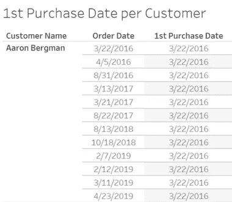
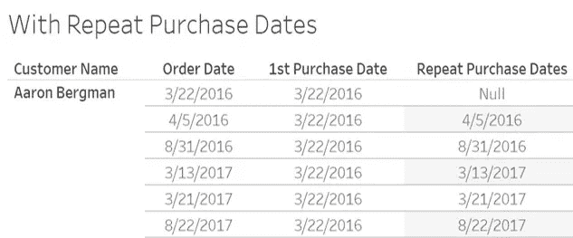
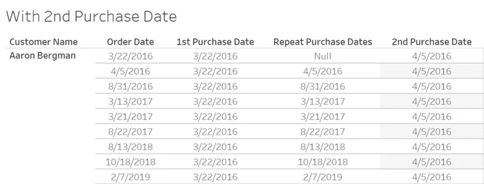
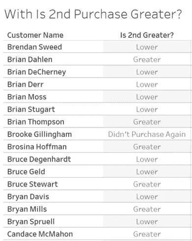
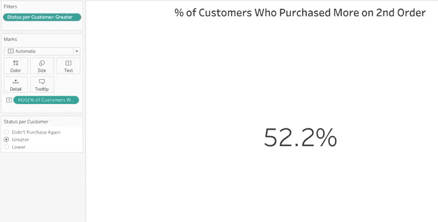

# 我的回头客倾向于在第二次购买时花费更多吗？

> 原文：<https://towardsdatascience.com/do-my-repeat-customers-tend-to-spend-more-on-their-2nd-purchase-6db1005500ff?source=collection_archive---------44----------------------->

## 一步一步地解决一个重大的细节层次的挑战。

今天，我在“Tableau-is-a-wonderful-tool-for-analytics-in-adding-to-visualizing-data”这一边醒来，作为挑战我的学生( [*【纳亚学院】*](https://www.naya-college.co.il/) *，*伊斯雷尔)的持续模式的一部分，我想到了一个主意，它直接涉及 Tableau Desktop 中最具挑战性的分析主题——细节层次(LOD)。

简而言之，他们的任务是**计算客户在总数中的比例，谁在第二次购买中花了更多的钱，并以单个文本数字的形式给出答案，在视图中没有维度。**其灵感来源于著名的[Bethany Lyons](https://www.tableau.com/about/blog/LOD-expressions)的 15 大 LOD 表达式文章(他提出了回头客的类似业务问题)，以及由 Ann Jackson 撰写的 [*周三锻炼*第 24 周挑战，她的重点是 Tableau Prep，并以不同的方式可视化答案。](http://www.workout-wednesday.com/week-24-do-customers-spend-more-on-their-first-or-second-purchase/)

以下计算基于 Tableau 给出的欧盟超市数据集样本。内容如下:

1.计算每个客户的第一个和第二个购买日期 LOD 表达式允许聚合维度数据，这些数据不一定在视图中。让我们从分类什么是第一次购买开始。这是第一次购买的语法，我们称之为**第一次购买日期**:

`{Fixed [Customer Name]: MIN([Order Date])}`

我们应该通过拖动**第一个购买日期**来检查自己，看看它是否忽略了订单日期字段(当客户在视图中时)，如下所示，这意味着它忽略了视图中的粒度级别。

2.为了计算第二个购买日期，我们需要以不同的方式处理它。通常，如果所有的购买日期都在视图中，我会用查找函数来处理它。Bethany Lyons 用一个聪明的方法解决了这个问题，给每一个购买日期一个自己的日期，除非是第一次；因此，这将有助于我们在之后为该字段带来最小日期，即第二个购买日期。我们将这个字段称为**重复购买日期**及其语法:

`IIF([Order Date] > [1st Purchase Date], [Order Date], Null)`

将它放入视图中，就像我们之前做的那样，如下所示:

现在，正如我们对第一个购买日期所做的那样，我们可以对第二个购买日期实施相同的思路，取**重复购买日期**字段:

`{FIXED [Customer Name]: MIN([Repeat Purchase Dates])}`

3.**1 日和 2 日购买日期的销售额:**我们需要匹配他们的销售额进行比较。我们可以像以前一样与 IIF 职能部门沟通(常规的 IF 也可以)，确定是第一天还是第二天，并分别匹配他们的销售。因为我们数据的粒度级别是购买的产品而不是订单 ID，所以我们应该合计给定的销售额，这样我们就可以在以后互相减去它。这些是**第一次采购总销售额**和**第二次采购总销售额**的计算:

`SUM(IIF([1st Purchase Date] = [Order Date], [Sales], 0))`

`SUM(IIF([2nd Purchase Date] = [Order Date], [Sales], 0))`

注意——我们也可以给所有其他购买日期一个空值，而不是 0，因为总和不考虑空值。

4.如果第二次购买确实大于第一次购买，那么通过简单减去我们在条件语句中创建的最后两个字段来比较销售额将会分类。我们将命名为**第二次购买更大吗？:**

`IFNULL(IIF[2ND Purchase Aggregated Sales] > [1st Purchase Aggregated Sales], 'Greater', 'Lower'), 'Didn''t Purchase Again')`

注意——该语法包含在 IFNULL 函数中，因为他们是只有一次购买的客户；因为这些客户没有第二次购买的值，并且两个值之间的减法，如果其中一个是空值，将导致空值。为了方便起见，我们可以将他们归类为“没有再次购买”，这也是一个很好的信息。

放**第二次购买更大？**在视图中，客户名称字段旁边的内容如下:

4.快到终点了！最后一个字段比较了两次购买，但是它没有给出我们需要的每个客户的“戳记”，而是给出了购买本身的“戳记”，并且这个字段的一个简单的过滤器用客户计数取“较大的”值是不行的，所以让我们再次汇总它，每个客户有一个**状态**字段 **:**

`{FIXED [Customer Name]: [Is 2nd Greater?]}`

5.以这种方式对每个客户状态进行分类后，让我们来数一数！将文本中的客户名称字段作为 COUNTD ( = COUNT DISTINCT)放入一个新表中，在过滤器中使用每个客户的**状态**字段，仅包括“更大的”值，将得到我们的数量(= 415 个客户，到 2019 年 12 月 31 日结束的数据集的有效数量)。但是我们试图将它与总数进行比较。为此，我们将使用额外的 LOD 表达式构建一个计算(最后但同样重要的是！)这将在过滤器之前评估客户计数，因为固定函数发生在维度过滤器之前。我们将新的计算方法命名为 **%的客户在第二次订购时购买了更多:**

`COUNTD([Customer Name]) / MAX({COUNTD([Customer Name])})`

分子代表我们的 415 个客户，而分母代表客户总数(= 795)。分母的花括号(即使没有固定的——冗余的)创建了我们需要的滤波器的旁路；但是分母包含在 MAX 函数中，因为每个 LOD 在某种程度上都是表格变量，即使没有在计算字段中指定维度，使用单个值作为聚合，它仍然算作一个表(很难理解！).最大化它(也可以是 SUM，MIN)将使它成为标量函数，因为它可以是分数的一部分，因为聚合表达式不能被 LOD 表达式除。

将新字段放入文本标记中，并将该字段格式化为带有 1 DP 的百分比，如下所示:

现在你知道了。这是衡量客户成功的一个重要指标和聪明的商业问题；当然，它还可以改进，甚至可以通过第三次购买来解决，或者甚至可以通过每位客户两次购买之间的百分比增长来衡量。但是本文的主要重点是在学生掌握了所需的 Tableau 功能和[操作顺序](https://help.tableau.com/current/pro/desktop/en-us/order_of_operations.htm#about-the-order-of-operations-aka-query-pipeline)知识后，通过实际业务示例向他们展示更高级的 LOD 挑战。但是说实话，还有一个隐藏的信息——为社区贡献知识是值得的，我希望他们也能通过阅读这篇文章学到这一课。

感谢阅读。我会很感激阅读任何评论——在我的 Linkedin 个人资料上，或者通过 alonrechavia@gmail.com。