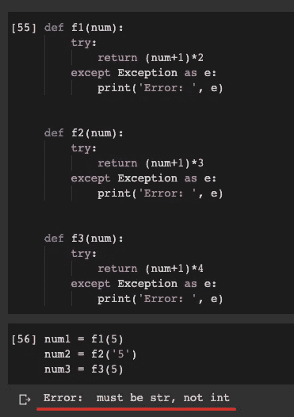
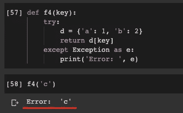
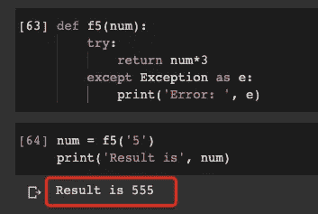
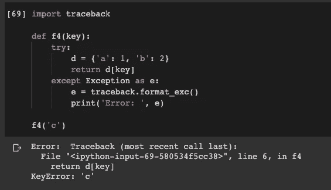
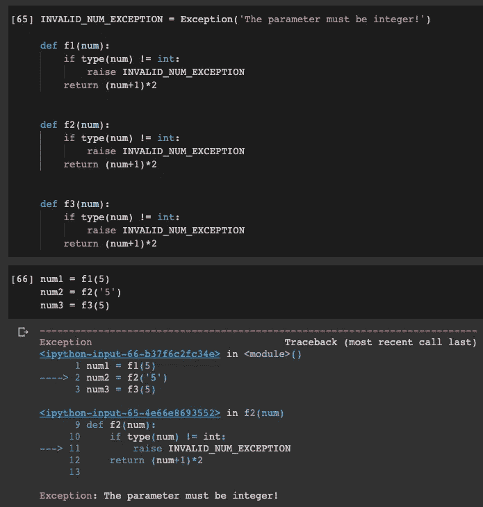
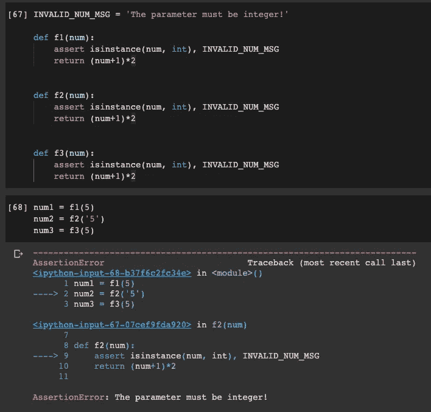

# 除非在 Python 中，否则不要滥用 Try

> 原文：<https://towardsdatascience.com/do-not-abuse-try-except-in-python-d9b8ee59e23b?source=collection_archive---------4----------------------->


[光婆罗](https://pixabay.com/users/Quangpraha-7201644/)在 [Pixabay](https://pixabay.com/photos/fish-fishermen-fishing-net-fishing-3062034/) 上的照片

## 试着除了有时会让你的生活变得困难

像大多数其他编程语言一样，Python 支持在运行时捕获和处理异常。但是，有时候我发现它已经被过度使用了。

原来有些开发者，尤其是 Python 新手，一旦发现这样的特性，就倾向于用 try …除了…很多。然而，我想说的是，如果可能的话，我们应该尽量避免使用它，尤其是在开发的早期阶段。你会发现，让问题显露出来，比隐藏起来更好。

在本文中，我将展示一些例子来说明“try … except …”如何产生问题，以及在 Python 编程中什么是更好的方式。

# 问题定义


照片由 [geralt](https://pixabay.com/users/geralt-9301/) 在 [Pixabay](https://pixabay.com/photos/definition-man-finger-touch-show-4255411/) 上拍摄

先说一个有问题的例子，这是我见过的非常典型的场景。

```
def f1(num):
    try:
        return (num+1)*2
    except Exception as e:
        print('Error: ', e)def f2(num):
    try:
        return (num+1)*3
    except Exception as e:
        print('Error: ', e)def f3(num):
    try:
        return (num+1)*4
    except Exception as e:
        print('Error: ', e)
```

我们有三个函数来做一些简单的数值计算。都是用 try 实现的…除了…用 everything。然后，我们希望在代码中使用它们，如下所示。

```
num1 = f1(5)
num2 = f2('5')
num3 = f3(5)
```

请注意，我故意在第二个函数中传递了一个字符串“5”，因为我只是想人为地创建一个异常。我们得到的结果如下。



这里我们只有几行代码。或许，意识到这个问题并不太难。然而，假设你正在做一个更大规模的项目，错误消息`must be str, not int`对你定位问题没有太大帮助。

# 另一个例子


照片由 [guvo59](https://pixabay.com/users/guvo59-9285194/) 在 [Pixabay](https://pixabay.com/photos/pc-computer-stethoscope-technology-3540378/) 上拍摄

我们能从异常对象`e`中得到的错误信息有时非常有限。我认为在 Python 中这并不总是有意义的。事实上，前一个并不太坏，因为它至少告诉你为什么会发生错误。让我们看看这个。

```
def f4(key):
    try:
        d = {'a': 1, 'b': 2}
        return d[key]
    except Exception as e:
        print('Error: ', e)f4('c')
```



当然，在这个例子中我们只有一行代码，我们知道什么是“c”。然而，同样，如果这发生在一个项目中，如果我们只得到一个错误消息“c ”,我们如何解决这个问题呢？

# 最坏的情况


[拉姆德隆](https://pixabay.com/users/Ramdlon-710044/)在[皮克斯贝](https://pixabay.com/photos/good-bad-opposite-choice-choose-1123013/)拍摄的照片

你能想象情况还能更糟吗？嗯，这个问题可能与我们的主题不是 100%相关，但我只是想提出它，因为它可能会被后面部分的解决方案解决。

如果我们把所有的代码放在 try 块中，并在 except 块中捕获所有的一般异常，你认为这样会非常安全吗？答案是否定的，不然我大概会推荐到处用:)

让我们看看这个例子。

```
def f5(num):
    try:
        return num*3
    except Exception as e:
        print('Error: ', e)num = f5('5')
print('Result is', num)
```

同样，我们定义了一个非常简单的数值计算函数，并向其中传递一个字符串。我们可能期望“异常”会被捕获，但是没有异常。



Python 太灵活了，不会有错误:)

# 丑陋的解决方案:回溯库


照片由 [geralt](https://pixabay.com/users/geralt-9301/) 在 [Pixabay](https://pixabay.com/photos/terrorist-terror-happiness-positive-2481808/) 上拍摄

如果想尝试所有代码并捕捉异常，可以使用 Python 内置的`traceback`库。让我们使用如上所示的相同示例。

```
import tracebackdef f4(key):
    try:
        d = {'a': 1, 'b': 2}
        return d[key]
    except Exception as e:
        e = traceback.format_exc()
        print('Error: ', e)f4('c')
```



使用 traceback 帮助我们打印出关于错误的更多信息，因此我们可以更容易地解决问题。然而，我们需要导入一个额外的库并编写更多的代码来完成这个任务。

只是需要再三考虑这样做是否值得？让我们看看其他的好习惯。

# 解决方案 0:不要抓它


由 [lechenie-narkomanii](https://pixabay.com/users/lechenie-narkomanii-3764644/) 在 [Pixabay](https://pixabay.com/photos/freedom-sky-hands-handcuffs-clouds-1886402/) 上拍摄的照片

添加这一部分是为了防止有人会说这样的话:

> 为什么使用 raise 或 assert？如果你根本不使用 try … except …的话，完整的回溯堆栈将会简单地显示出来！

的确，这也是我在这篇文章中想说的。正是对标题“不要滥用 try …除了…用 Python”的解决方案。我提供下面两个“解决方案”的原因只是想展示什么是好的方式。

# 解决方案 1:引发异常


照片由 [Pezibear](https://pixabay.com/users/Pezibear-526143/) 在 [Pixabay](https://pixabay.com/photos/child-girl-water-stone-throw-541908/) 上拍摄

正如我前面所说的，我们应该避免使用太多的 try … except …这样会隐藏异常。相反，我们希望尽可能多地揭示异常。使用`raise`手动引发异常是一种很好的方式。

让我们修改我们的`f1`、`f2`和`f3`函数。

```
INVALID_NUM_EXCEPTION = Exception('The parameter must be integer!')def f1(num):
    if type(num) != int:
        raise INVALID_NUM_EXCEPTION
    return (num+1)*2def f2(num):
    if type(num) != int:
        raise INVALID_NUM_EXCEPTION
    return (num+1)*2def f3(num):
    if type(num) != int:
        raise INVALID_NUM_EXCEPTION
    return (num+1)*2
```

这里，我们定义了一个异常，并在函数中当传入的参数类型不是整数时引发它。

然后，让我们运行相同的代码来使用这些函数。

```
num1 = f1(5)
num2 = f2('5')
num3 = f3(5)
```



遇到一个错误并不太糟糕，如果它告诉你错误到底是什么，在哪里发生的。

# 解决方案 2:断言


照片由[艾托夫](https://pixabay.com/users/aitoff-388338/)在 [Pixabay](https://pixabay.com/photos/bolt-padlock-lock-security-shed-1751089/) 上拍摄

尽管断言在测试中更常用，但我们仍然可以在开发过程中使用它来确保我们的代码有更少的 bug。此外，如果我们不关心确切的异常类型，使用断言通常比引发异常更简洁。

```
INVALID_NUM_MSG = 'The parameter must be integer!'def f1(num):
    assert isinstance(num, int), INVALID_NUM_MSG
    return (num+1)*2def f2(num):
    assert isinstance(num, int), INVALID_NUM_MSG
    return (num+1)*2def f3(num):
    assert isinstance(num, int), INVALID_NUM_MSG
    return (num+1)*2
```



# 摘要


照片由 [pasja1000](https://pixabay.com/users/pasja1000-6355831/) 在 [Pixabay](https://pixabay.com/photos/dandelion-sphere-fluffy-plant-3347363/) 上拍摄

在编程语言中知道更多的技巧是有益的。我不得不说，每当我知道一些很酷的东西，我也会倾向于使用它。然而，它也需要再三考虑我们是否需要这样做，以及这样做是否比设置障碍给我们带来更多的好处。

因此，不要将所有代码放在 Python 中的 try … except …块中。让错误显露出来，让我们的生活更轻松！

[](https://medium.com/@qiuyujx/membership) [## 通过我的推荐链接加入 Medium 克里斯托弗·陶

### 作为一个媒体会员，你的会员费的一部分会给你阅读的作家，你可以完全接触到每一个故事…

medium.com](https://medium.com/@qiuyujx/membership) 

如果你觉得我的文章有帮助，请考虑加入 Medium 会员来支持我和成千上万的其他作者！(点击上面的链接)