# 不要像这样使用决策树

> 原文：<https://towardsdatascience.com/do-not-use-decision-tree-like-this-369769d6104d?source=collection_archive---------26----------------------->

由 [geralt](https://pixabay.com/users/geralt-9301/) 在 [Pixabay](https://pixabay.com/photos/book-read-student-students-board-4126483/) 上拍摄的照片

## 展示 ID3 中信息获取的局限性以及使用 C4.5 的优势

作为最流行的经典机器学习算法之一，决策树在可解释性方面比其他算法更直观。在我以前的一篇文章中，我介绍了决策树模型的基本思想和机制。它使用一种称为 ID3 的算法演示了这种机器学习模型，ID3 是训练决策树分类模型的最经典的算法之一。

 [## 出去锻炼还是不锻炼？让数据科学来决定

### 决策树机器学习算法简介

towardsdatascience.com](/go-out-for-exercise-or-not-let-data-science-decide-34f8f28ce7b4) 

如果您对决策树不是很熟悉，强烈建议您在阅读本文之前先看看上面的文章。

要直观地理解决策树，从 ID3 开始确实不错。但是，在实践中使用它可能不是一个好主意。在本文中，我将介绍一种构建决策树模型的常用算法— C4.5。

# 经典 ID3 算法的缺点

照片由[艾托夫](https://pixabay.com/users/aitoff-388338/)在 [Pixabay](https://pixabay.com/photos/railway-platform-mind-gap-1758208/) 上拍摄

在我们演示 ID3 算法的主要缺点之前，让我们先来看看它的主要构件是什么。基本上，重要的是熵和信息增益。

## 熵概述

这是熵的公式:

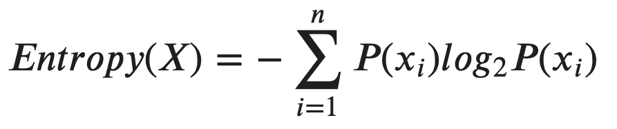

集合“ *X* ”是节点集合中的一切，“ *xᵢ* 是指每个样本的具体决策。因此，“*【p(xᵢ】)*”是用某个决策做出的集合的概率。

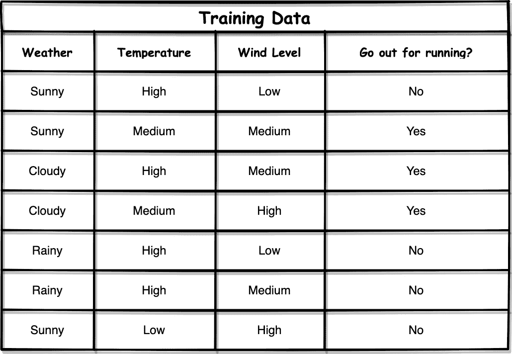

让我们以同一个训练数据集为例。假设我们的决策树中有一个“天气=下雨”的内部节点。可以看出，最后的决定都是“否”。然后，我们可以很容易地计算这个节点的熵，如下所示:

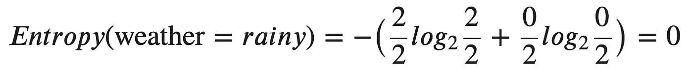

基本上，回答“否”的概率是 2/2 = 1，而回答“是”的概率是 0/2 = 0。

## 信息增益概述

在熵的概念之上，我们可以计算信息增益，这是决定一个特征是否应该作为要分裂的节点的基本标准。

比如我们有三个特征:“天气”、“温度”、“风力等级”。当我们开始使用 ID3 构建决策树时，我们如何决定哪一个应该被用作根节点呢？

ID3 使用信息增益作为标准。规则是，在所有特征中选择具有最大信息增益的特征。下面是计算信息增益的公式:

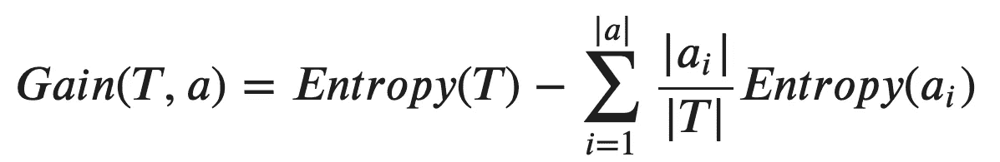

在哪里

*   “T”是父节点,“a”是“T”的属性集
*   符号“|T|”表示集合的大小

使用相同的例子，当我们计算“天气=下雨”的信息增益时，我们还需要考虑它的子节点的熵。具体的推导和计算过程可以在引言中分享的文章中找到。

## 使用信息增益的主要缺点

使用信息增益作为确定将哪个特征用作根/下一个节点的标准的主要缺点是，它倾向于使用具有更多唯一值的特征。

但是为什么呢？让我用一个极端的场景来演示一下。比方说，我们的训练集多了一个特性:“日期”。

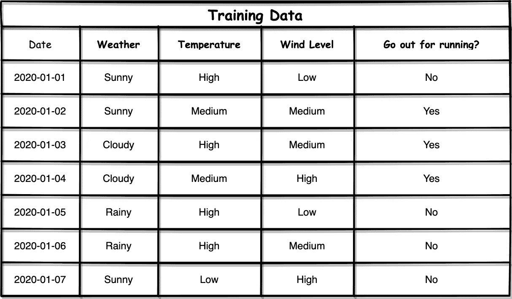

你可能会说，在这种情况下不应该考虑“日期”这个特征，因为直觉上它对决定我们是否应该出去跑步没有帮助。是的，你说得对。然而，实际上，我们可能有更复杂的数据集要分类，我们可能无法理解所有的特征。因此，我们可能并不总是能够确定一个特性是否有意义。在这里，我将用“日期”作为一个例子。

现在，让我们计算“日期”的信息增益。我们可以开始计算其中一个日期的熵，比如“2020–01–01”。

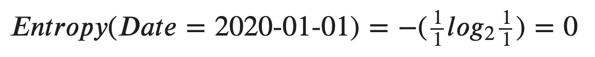

因为每个日期只有一行，所以最后的决定必须是“是”或“否”。所以，熵一定是 0！就信息理论而言，这相当于说:

> 日期没有告诉我们任何事情，因为结果只有一个，这是确定的。所以，根本不存在“不确定性”。

类似地，对于所有其他日期，它们的熵也是 0。

现在，让我们计算日期本身的熵。

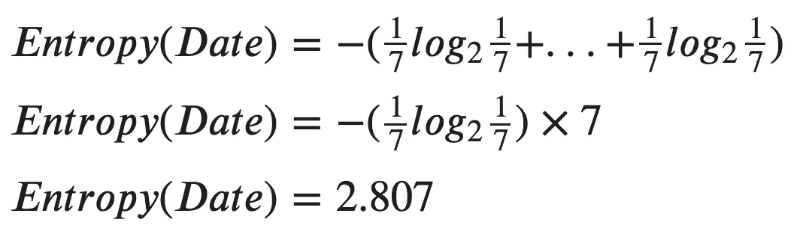

哇，与其他功能相比，这是一个相当大的数字。所以，我们现在可以计算“日期”的信息增益了。

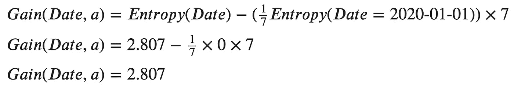

不出所料,“日期”的信息增益就是它本身的熵，因为它的所有属性的熵都是 0。

如果我们计算其他三个特征的信息增益(您可以在引言中链接的文章中找到详细信息)，它们是:

*   天气的信息增益为 0.592
*   温度的信息增益为 0.522
*   风级的信息增益为 0.306

显然，迄今为止的信息增益远远大于其他的。此外，可以看出，如果训练数据集更大，它甚至会更大。之后，别忘了“日期”这个特征实际上在决定我们是否应该出去跑步时没有意义，但它被决定为“最好”的一个作为根节点。

更有趣的是，在我们决定使用“日期”作为我们的根节点后，我们就完成了:)

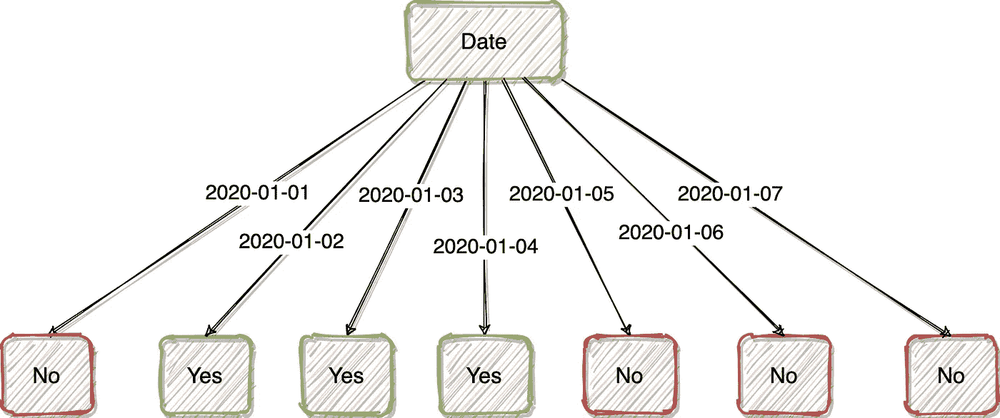

我们最终得到如上所示的决策树。这是因为“约会”这个特性太好了。如果我们把它作为根节点，它的所有属性都会简单的告诉我们是否应该出去跑步。没有必要具有其他特征。

由 [Pixabay](https://pixabay.com/vectors/fish-funny-cartoon-odd-surprised-33712/) 上的 [Clker-Free-Vector-Images](https://pixabay.com/users/Clker-Free-Vector-Images-3736/) 拍摄的图像

是的，你此刻可能有一张像这条鱼一样的脸，我也有。

# 修复信息增益限制

照片由 [jarmoluk](https://pixabay.com/users/jarmoluk-143740/) 在 [Pixabay](https://pixabay.com/photos/electrician-electric-electricity-1080554/) 上拍摄

ID3 算法中存在的信息增益限制的最简单解决方案来自另一种称为 C4.5 的决策树算法。减少这一问题的基本思想是使用**信息增益比**而不是信息增益。

具体来说，信息增益比是简单地通过除以父节点的熵在信息增益上添加惩罚。

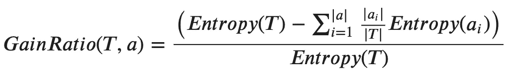

换句话说，

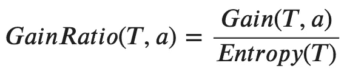

因此，如果我们使用 C4.5 而不是 ID3，特性“日期”的信息增益比将如下。

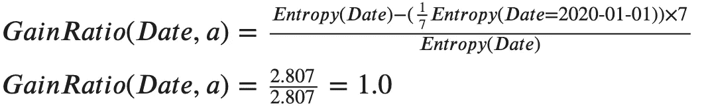

与其他特性相比，它确实是最大的一个，但是不要忘记我们实际上是在使用一个极端的例子，特性“Date”的每个属性值只有一行。在实践中，信息增益比将足以避免信息增益将导致偏差的大多数情况。

# C4.5 的其他改进

由 [silviarita](https://pixabay.com/users/silviarita-3142410/) 在 [Pixabay](https://pixabay.com/photos/bake-motto-world-improve-sweetness-1838364/) 上拍摄的照片

在我看来，使用信息增益比是从 ID3 到 C4.5 最显著的改进。尽管如此，在 C4.5 中还有更多你应该知道的改进。

## 悲观错误修剪

如果您不熟悉决策树的“修剪”概念，您可能需要再次查看我之前的文章，该文章附在本文的介绍中。

PEP 是 C4.5 中的另一个重大改进。具体来说，它将以自顶向下的方式修剪树。对于每个内部节点，该算法将计算其错误率。然后，尝试剪枝这个分支，比较剪枝前后的错误率。因此，我们决定是否应该保留这个分支。

PEP 的一些特征:

1.  这是后剪枝方法之一。
2.  它在不依赖验证数据集的情况下修剪树。
3.  通常很好地避免了过度拟合，从而提高了未知数据的分类性能。

## 离散化连续特征

C4.5 支持连续值。所以，我们并不局限于拥有“低”、“中”、“高”这样的分类值。取而代之的是，C4.5 会自动检测能够产生**最大**信息增益比的连续值的**阈值**，然后使用该阈值分裂节点。

# 摘要

照片由[贝西](https://pixabay.com/users/Bessi-909086/)在 [Pixabay](https://pixabay.com/photos/tree-lake-reflection-water-calm-838667/) 上拍摄

在本文中，我解释了 ID3 不理想的原因。主要原因是它使用的标准-信息增益-可能会明显偏向那些具有大量不同值的特征。

另一个名为 C4.5 的决策树算法中给出了解决方案。它改进了信息增益与信息增益的比率，这将减少属性的大量不同值的影响。

同样，如果你觉得需要更多关于决策树的上下文和基础知识，请查看我以前的文章。

 [## 出去锻炼还是不锻炼？让数据科学来决定

### 决策树机器学习算法简介

towardsdatascience.com](/go-out-for-exercise-or-not-let-data-science-decide-34f8f28ce7b4)  [## 通过我的推荐链接加入 Medium 克里斯托弗·陶

### 作为一个媒体会员，你的会员费的一部分会给你阅读的作家，你可以完全接触到每一个故事…

medium.com](https://medium.com/@qiuyujx/membership) 

如果你觉得我的文章有帮助，请考虑加入 Medium 会员来支持我和成千上万的其他作者！(点击上面的链接)