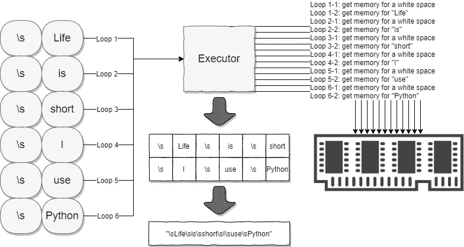

# 不要在 Python 中使用“+”来连接字符串

> 原文：<https://towardsdatascience.com/do-not-use-to-join-strings-in-python-f89908307273?source=collection_archive---------0----------------------->


照片由 [tcausley](https://pixabay.com/users/tcausley-1584840/) 在 [Pixabay](https://pixabay.com/photos/rope-cleat-dock-knot-pier-mooring-1014799/) 上拍摄

## 使用“+”和 join()方法在 Python 中连接字符串的方法比较。

当我开始使用 Python 的时候，使用加号运算符`+`来连接字符串是非常直观和容易出来的，很多编程语言都是这样做的比如 Java。

然而，很快我意识到许多开发人员似乎喜欢使用`.join()`方法，而不是`+`。在本文中，我将介绍这两种方法之间的区别以及为什么不应该使用`+`。

# 开始


照片由[戴恩·托普金](https://unsplash.com/@dtopkin1?utm_source=medium&utm_medium=referral)在 [Unsplash](https://unsplash.com?utm_source=medium&utm_medium=referral) 上拍摄

作为一个初学者，或者刚刚从使用`+`连接字符串的其他语言转换过来的人，编写这样的代码是非常容易的:

```
str1 = "I love "
str2 = "Python."print(str1 + str2)
```


随着您越来越多地使用 Python，您可能会意识到其他人更喜欢像这样使用`join()`方法:

```
str1 = "I love "
str2 = "Python."print(''.join([str1, str2]))
```


老实说，当我第一次看到上面的方法时，我认为这不直观，而且看起来有点难看。

# 连接多个字符串


照片由 [Tim Boote](https://unsplash.com/@toboote?utm_source=medium&utm_medium=referral) 在 [Unsplash](https://unsplash.com?utm_source=medium&utm_medium=referral) 上拍摄

然而，有一次我需要在一个列表中连接多个字符串。

```
strs = ['Life', 'is', 'short,', 'I', 'use', 'Python']
```

最初，我是这样做的:

```
strs = ['Life', 'is', 'short,', 'I', 'use', 'Python']def join_strs(strs):
    result = ''
    for s in strs:
        result += ' ' + s
    return result[1:]join_strs(strs)
```


在这个例子中，我必须编写一个 for 循环来逐个连接字符串。此外，结果字符串需要修剪一个我在开始时添加的空格，因为所有的字符串都需要在前面添加一个空格，但不是第一个。您可能有其他解决方案，例如向 for 循环添加一个索引，这样索引= 0 处的字符串就不会添加这个空白。无论如何，你仍然需要这个 for 循环，并为空白做一些事情。

之后，我想起我以前见过`.join()`方法，也许这是我需要使用它的时候了！

```
def join_strs_better(strs):
    return ' '.join(strs)join_strs_better(strs)
```


多简单啊！一行代码完成所有工作。因为`.join()`方法是由一个字符串对象调用的，字符串对象将被用来连接列表中的每个字符串，所以你不需要担心开头的空格。

但是等等，你真的认为这是我们需要使用`join()`方法而不是`+`的唯一原因吗？不，请阅读下一节。

# `join()`方法背后的逻辑


迈克尔·泽兹奇在 [Unsplash](https://unsplash.com?utm_source=medium&utm_medium=referral) 上拍摄的照片

现在，让我们比较这两种方法的性能。我们可以用《朱庇特笔记本》的神奇方法`%timeit`来评价他们。


上面显示的性能基于 100k 次试验，因此结果非常有把握且显而易见。使用`join()`方法可以比使用`+`连接列表中的字符串快 4 倍。

为什么？

这是我画的一个概念图，用来演示使用`+`连接字符串的方法。



使用+运算符和 for-loop 连接列表中的字符串

这显示了 for 循环和`+`操作符的作用:

1.  对于每个循环，从列表中找到字符串
2.  Python 执行器解释表达式`result += ' ' + s`并为空白空间`' '`申请内存地址。
3.  然后，执行程序意识到空白需要用一个字符串连接，所以它将为字符串`s`申请内存地址，这是第一个循环的“生命”。
4.  对于每个循环，执行器需要申请两次内存地址，一次是空白，另一次是字符串
5.  内存分配有 12 倍

然而，对于`join()`方法发生了什么？


使用“join()”方法连接列表中的字符串

1.  执行程序将计算列表中有多少字符串。有 6 个。
2.  这意味着用于连接列表中字符串的字符串需要重复 6–1 = 5 次。
3.  它知道总共需要 11 个内存空间，所以所有这些都将立即应用并提前分配。
4.  按顺序排列字符串，返回结果。

因此，显而易见，主要区别在于内存分配的次数是性能提高的主要原因。

想象一下，使用`join()`方法将 6 个字符串连接在一起已经快了 4 倍。如果我们要连接大量的字符串呢？这会产生更大的不同！

# 摘要


照片由[利亚姆·布里斯](https://unsplash.com/@liam_1?utm_source=medium&utm_medium=referral)在 [Unsplash](https://unsplash.com?utm_source=medium&utm_medium=referral) 上拍摄

在这篇短文中，我比较了在 Python 中连接字符串时`+`操作符和`join()`方法之间的区别。显然，`join()`方法因其性能而更受青睐。

学习一门编程语言通常是一条很长的曲线，但 Python 让它对于初学者来说相对较短，这绝对是很棒的。我们进了门之后，开始使用 Python，我们不应该止步于此，满足于我们能用 Python 做什么。通常情况下，高手和普通开发者的区别来自于细节方面的知识。

让我们继续寻找更多关于 Python 的技巧，让自己更接近 Python 大师！

[](https://medium.com/@qiuyujx/membership) [## 阅读克里斯托弗·陶的每一个故事(以及媒体上成千上万的其他作家)

### 作为一个媒体会员，你的会员费的一部分会给你阅读的作家，你可以完全接触到每一个故事…

medium.com](https://medium.com/@qiuyujx/membership) 

**如果你觉得我的文章有帮助，请考虑加入中等会员来** [**支持我和其他成千上万的作家！**](https://medium.com/@qiuyujx/membership) **点击上面的链接。**