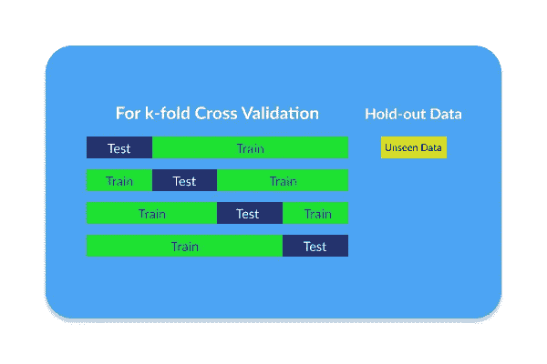
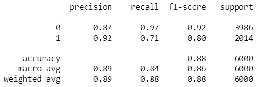

# 做这个额外的步骤，你就做了一个一般化的机器学习模型

> 原文：<https://towardsdatascience.com/do-this-additional-step-you-have-made-a-generalize-machine-learning-model-9d85b7e09313?source=collection_archive---------57----------------------->


Jukan Tateisi 在 [Unsplash](https://unsplash.com/s/photos/step?utm_source=unsplash&utm_medium=referral&utm_content=creditCopyText) 上拍摄的照片

## 只是一个额外的步骤，它可以增加我们对预测未知数据的模型的信心。

想象一下，你正在做一些机器学习项目，并且你已经计算了指标。假设您的度量标准，在示例准确性中，大约是 90%，并且您已经基于 k 倍交叉验证计算了它。当您训练模型时，您通过拆分训练和测试数据来训练模型，因此您训练模型，然后使用我们制作的模型直接测试它。因为它不可推广，所以我们引入了 k 倍交叉验证的概念，这是通过 k 次对训练和测试数据进行不同的采样。由于使用了这种方法，模型开始变得更具普遍性，并在此基础上具有良好的准确性。

> 你确定吗？
> 
> 模型如何处理不存在的看不见的数据呢？
> 
> 如果模型是基于交叉验证分数而不是基于看不见的数据那么好呢？

这就是**保留数据集**概念的由来。什么是拒绝数据集？保留数据集是在我们使用交叉验证时不用于训练模型的数据集。因此，不用于交叉验证的数据集将成为看不见的数据。因此，这个数据集将增加我们的信心，证明我们的模型可以准确地预测看不见的数据，也更具普遍性。



交叉验证和保留数据集的图示

根据这个定义，我们知道拒绝数据集是我们分割的数据，这样一个可以用于交叉验证，然后另一个可以用作看不见的数据。现在的问题是我们如何在我们的模型上应用这个概念？我已经有了一个例子，我将向您展示如何使用 Python 应用保留数据集概念。

# 履行

第一步是将数据拆分为训练和测试数据。训练数据将被用于交叉验证，而测试数据将被用作看不见的数据。然后，拆分数据后，我们可以对训练数据进行交叉验证，您可以调整想要使用的 k 值。最后，我们可以对看不见的数据进行预测，我们可以看到模型的得分。执行这些操作的代码如下所示，

```
from sklearn.tree import DecisionTreeClassifier, plot_tree
from sklearn.pipeline import make_pipeline
from sklearn.model_selection import GridSearchCV, train_test_split
from sklearn.metrics import classification_report, confusion_matrix**# Split the X and Y**
X = df_preprocessed.drop(default, axis = 1).values
y = df_preprocessed[default].values**# Split the dataset for cross validation and unseen data**
X_train, X_test, y_train, y_test = train_test_split(X, y, random_state=42, stratify=y)**# Doing Hyperparameter Tuning and Cross Validation without the 
# unseen data using Decision Tree. Then, fit the model on it**
param_grid = {
    'max_depth': [i for i in range(3, 10, 2)]
}
dt = DecisionTreeClassifier(random_state=42)
clf = GridSearchCV(dt, param_grid, cv=5)
clf.fit(X_train, y_train)**# Predict the unseen data and print the score** y_pred = clf.predict(X_test)
clf.score(X_test, y_test)
classification_report(y_test, y_pred)
```

基于上面的实现，我在测试数据上获得了大约 88.3%的准确率。这意味着该模型得分很高，能够处理看不见的数据。此外，当我们使用 classification_report 函数创建分类报告时，结果如下所示:



我们要预测的主要标签是 1，它有 92%的准确率和 71%的召回率。该模型还可以通过调整超参数以及进行一些特征选择和工程来改进。如果你想看看我在这方面的工作，你可以在这里看到我的 GitHub[](https://github.com/khalidmeister/my-projects/blob/master/DS2_Credit%20Default%20Prediction%20(DAC%20ITS)/Credit%20Default%20Prediction.ipynb)**。**

# **结论**

**如你所知，拥有一个可概括的模型非常重要，因为我们将预测以前从未存在过的数据。通过执行这一额外的步骤，即拆分数据以进行交叉验证和保留，也许我们的模型没有任何改进，但我们可以增加我们的信心，即我们的模型可以通过使用这些数据来准确预测未知的数据。**

## **感谢您阅读我的文章，您也可以在下面查看我以前的文章:**

**[](/greater-accuracy-does-not-mean-greater-machine-learning-model-performance-771222345e61) [## 更高的准确性并不意味着更好的机器学习模型性能

### 我们可以定量地衡量机器学习模型的性能，但不仅仅是准确性，还有很多…

towardsdatascience.com](/greater-accuracy-does-not-mean-greater-machine-learning-model-performance-771222345e61) [](/this-is-how-i-will-learn-data-science-if-i-got-back-my-own-time-e9148c909ce9) [## 如果我有自己的时间，我会这样学习数据科学

### 感觉不知所措和筋疲力尽让我在释放数据科学技能方面表现不佳。这个…

towardsdatascience.com](/this-is-how-i-will-learn-data-science-if-i-got-back-my-own-time-e9148c909ce9)**