# 美国大学城的平均房价在衰退期间受影响较小吗？

> 原文：<https://towardsdatascience.com/do-university-towns-in-us-have-their-mean-housing-prices-less-effected-during-recession-e612e9808cf3?source=collection_archive---------63----------------------->

在这篇文章中，我使用 Python 的 **Pandas** 和 **SciPy** 库来测试一个**假设**，该假设指出，与非大学城相比，美国大学城的平均房价受经济衰退的影响较小。

大学城是众所周知的大学生占城市总人口比例很高的城市。SciPy 著名的 **t_test** 可以用来比较衰退开始前一个季度大学城的平均房价与衰退底部的比率。同样的测试也适用于非大学城，之后我比较了两个结果列表的平均房价值，以确定差异(如果有的话)。

在我们深入研究手头的数据集之前，我觉得有必要澄清一些术语，以免随着文章的进展而陷入混乱。

*   **季度**是特定的三个月期间，Q1 是一月到三月，Q2 是四月到六月，Q3 是七月到九月，Q4 是十月到十二月。
*   衰退的定义是从连续两个季度的 GDP 下降开始，到连续两个季度的 GDP 增长结束。
*   衰退底部是衰退中 GDP 最低的一个季度。

# 数据源

Zillow 数据站点包含美国的住房数据。我们特别需要城市级别的住房数据，这些数据可以在名为[**City _ Zhvi _ all homes . CSV**](http://files.zillowstatic.com/research/public/City/City_Zhvi_AllHomes.csv)的数据文件中找到

接下来，我们需要美国所有大学城的列表，可以在维基百科上找到。这些数据存储在一个名为 **university_towns.txt** 的文本文件中。

最后，从经济分析局的[网站](https://www.bea.gov/data/gdp/gross-domestic-product#gdp)中，我们按季度提取美国的 GDP 数据，并将其存储在一个名为 **gdplev.xls.** 的文件中。

# **数据清洗&数据提取**

## 获取大学城数据

在整理好各自文件中的数据后，我们必须根据美国的**州**对每个大学城进行分类。university_towns.txt 文件包含该州的数据。以下是存储在该文件中的信息:

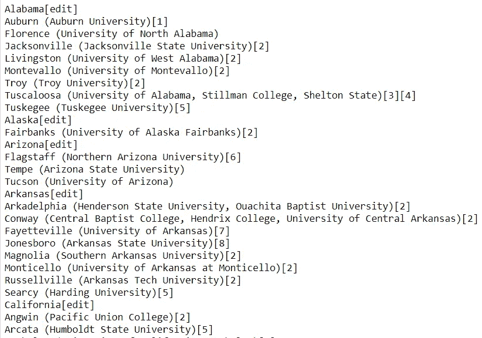

从上面的片段中，可以推断出州名是前面带有**'【编辑]'** 字符串的州名，而其下的其余名称(直到下一个州名)是该州的大学城。我们必须提取州名及其给定的地区名，并将它们存储在数据帧中。**列**应该是["State "，" RegionName"]，而 DataFrame 的一般**格式**应该是这样的:[ ["Michigan "，" Ann Arbor"]，["Michigan "，" Yipsilanti"] ]。

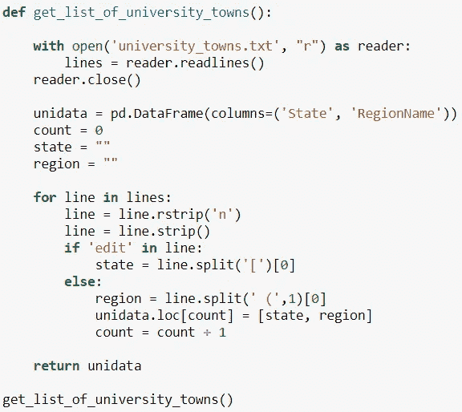

遍历文本文件的每一行，我提取相关信息并设法以 DataFrame 的形式存储它，如下所示。这个名为 unidata 的数据帧的形状是(517，2):

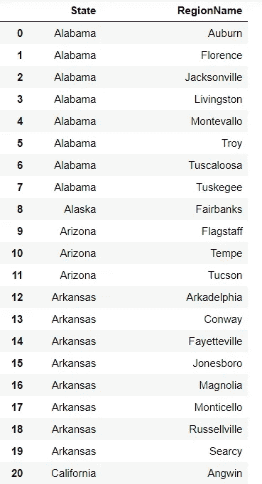

## 发现衰退开始季度

接下来，我们必须设计一种方法来提取衰退**开始**的季度，衰退**结束**的季度，以及衰退期间的**底部**。如上所述，与 GDP 相关的数据存储在 gdplev.xls 中。下面是该文件的预览:

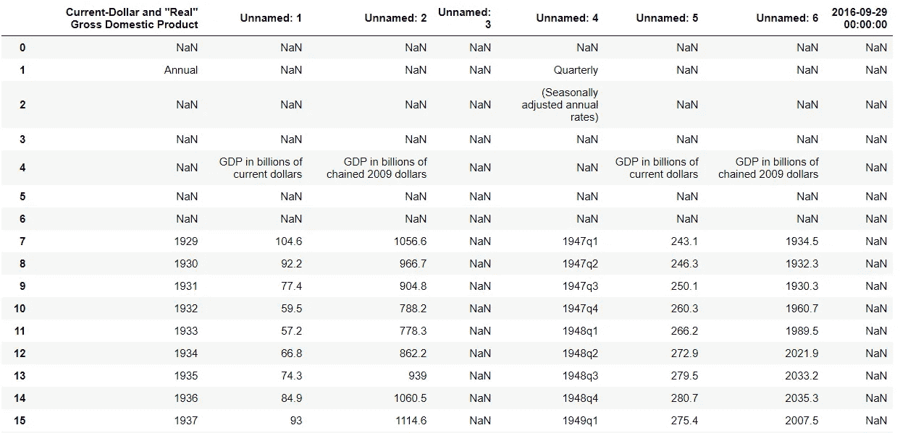

可以看出，很难从这个数据帧的当前形状中推断出任何有意义的信息。未命名的列 4 表示季度，而接下来的两列表示特定季度中各自的 GDP。出于本文的目的，我们限制自己只考虑 2000 年以后的季度，并使用 2009 年美元的环比值。因此，我们跳到第 219 行，即 2000 年的第一季度，并删除除第 4 列和第 6 列之外的所有列。

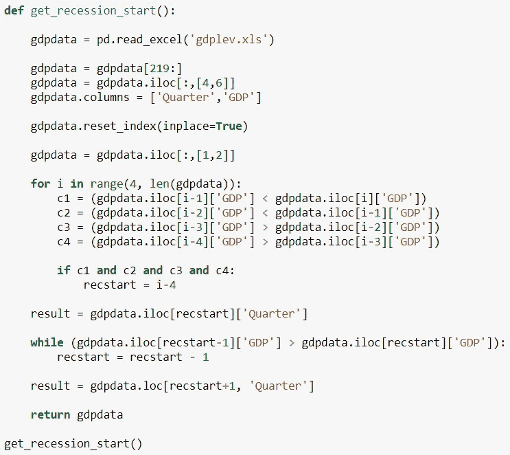

如介绍性段落中所述，衰退被定义为以连续两个季度的 GDP 下降开始，以连续两个季度的 GDP 增长结束，因此出现了 for 循环。经过清理和重新排列的数据帧如下所示:

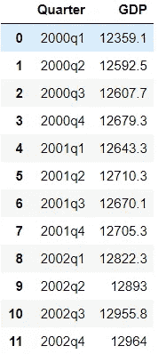

将 get_recession_start()函数的返回值更改为 **result** 将为我们提供衰退期开始的季度。在这种情况下，是 2008 年第三季度，即 2008 年的第三季度。

## 发现季度末的衰退

然后定义一个名为 get_recession_end 的类似函数来查找衰退结束的季度。除了所选的索引发生了变化之外，逻辑基本保持不变。2009 年第四季度作为衰退结束季度返回。

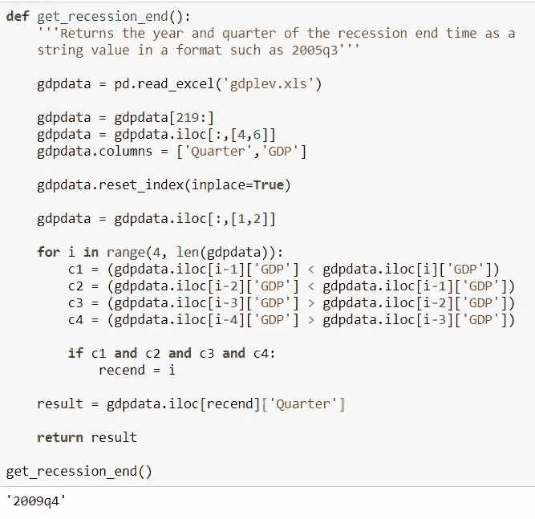

## 发现衰退底部季度

衰退底部是指经济衰退期间 GDP 最低的季度。虽然，找到衰退的底部并不能帮助我们证明给定假设的正确性，但出于教育的目的，我还是会继续下去。get_recession_bottom()函数返回 2009 年第二季度，考虑到本季度在 2008 年第三季度和 2009 年第四季度之间的 GDP 最低，该函数是正确的。

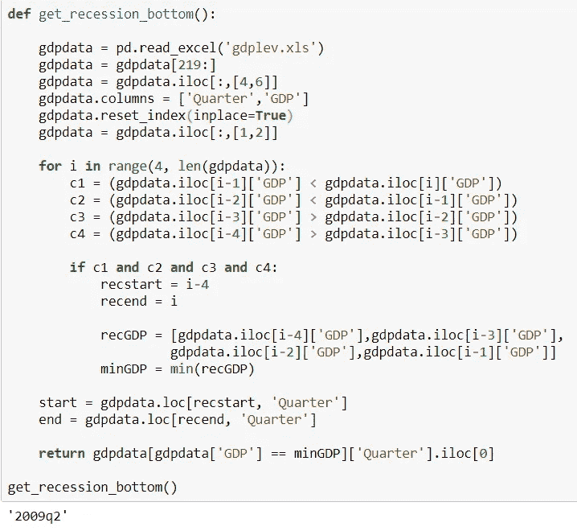

# **将住房数据转换为季度数据**

接下来，我们必须将 City_Zhvi_AllHomes.csv 文件中提供的住房数据转换为季度数据，并计算每个季度每个州每个地区的平均 GDP。将所需的数据帧列保存在名为**列**的列表中，我们将列表分成三块，以便按季度制定数据。divide_chunks()函数主要用于此目的。它将输入的列表分成大小相等的子列表。

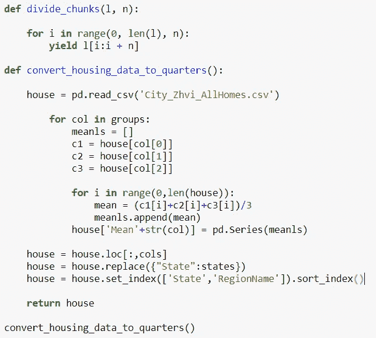

州名以两个字母的缩写形式给出，因此，它们需要映射到实际的州名，以确保进一步的分析。创建了一个名为 **states** 的字典，如下所示，它用字典的值替换“State”列中的数据，即将键映射到它们的值。

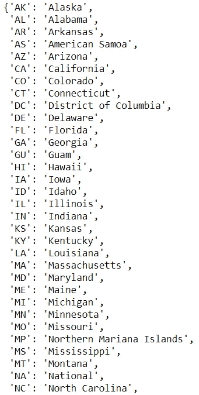

执行 convert _ housing _ data _ to _ quarters()函数会得到一个组织良好的数据帧，其形状为(10730，67):

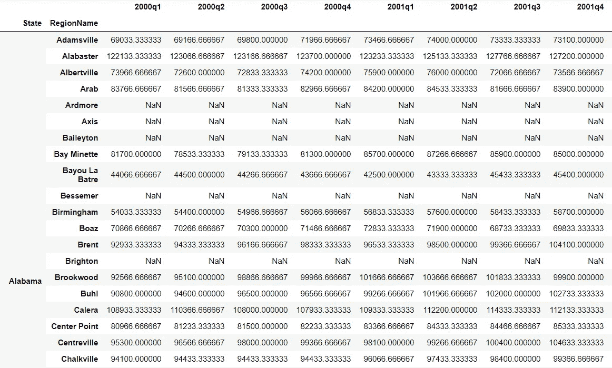

## 房价走势

我们现在需要构建一个数据框架，显示衰退开始和衰退底部之间房价的下跌或上涨。

然后我们要进行 t 检验，比较衰退开始前一个季度大学城的平均房价与衰退底部的比率**: price _ ratio = quarter _ before _ recession/recession _ bottom**

在我们的例子中，我们已经发现衰退从 2008 年第三季度开始，衰退底部季度是 2009 年第二季度。因此，名为 **housingdata** 的所需数据帧以如下方式创建:

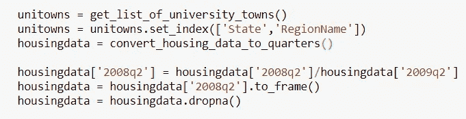

请注意，之所以选择 2008 年第二季度而不是 2008 年第三季度，是因为我们必须按照最初设计的方法选择紧接衰退开始季度之前的季度。

## **住房数据分离**

一旦检索到数据，我们的下一个任务是**根据大学城和非大学城对其进行**分离，这样我们就可以在两个数据框架上执行 t_test。使用**内部**合并/连接方法，通过合并住房数据数据帧和单位所有数据帧来完成这种划分。这确保了我们提取的数据框架只包含大学城的住房数据。

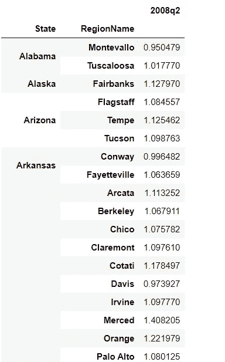

然后，通过从住房数据框架中删除大学城数据的所有指数，获得非大学城的住房数据。这反过来给我们留下了所有非大学城各自的指数。

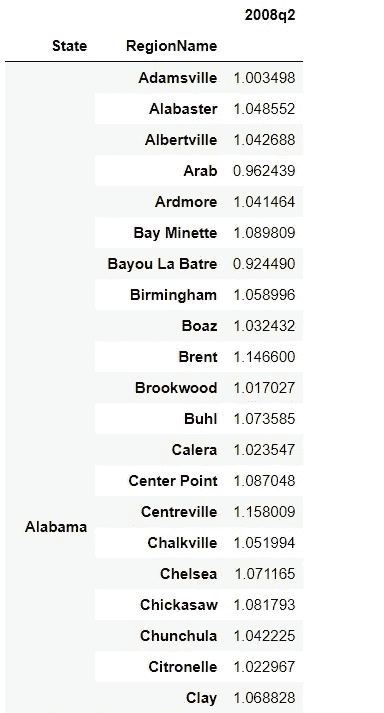

# 运行测试

最后，我们得出了我们进退两难的症结所在:全美大学城的平均房价是否较少受到衰退时期的影响？为了测试这个假设，我们在上面提取的两个数据帧上运行 SciPy 的 stats 包中的 **ttest_ind()** 函数。

此函数计算两个独立分数样本的平均值。这是对两个独立样本具有相同平均值(预期值)的零假设的双边检验。该测试假设总体在默认情况下具有相同的方差。

我们将 p 值设置为 0.01，这在统计上是有意义的。 **P 值**是统计假设检验中的边际显著性水平，代表给定事件发生的概率。

因此，获得的小于 0.01 的 p 值**会使我们倾向于拒绝**无效**假设，反之亦然，对于大于或等于 0.01 的值。**

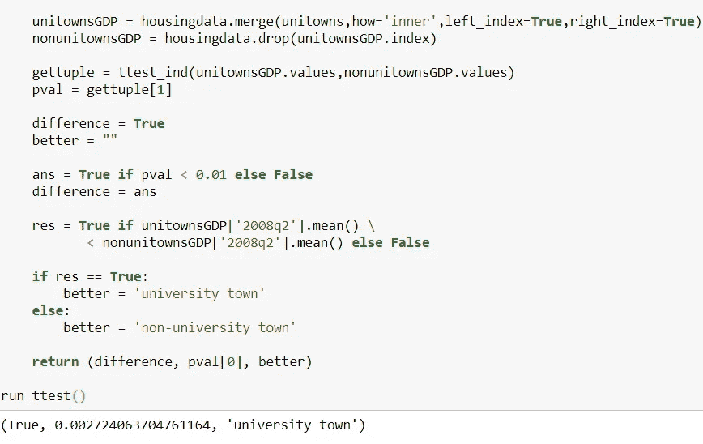

如返回的元组所示，两个地区的平均房价实际上存在**差异**，大学城被认为**更好**。获得的 p 值为 **0.003** ，四舍五入到小数点后三位，并且**明显小于**0.01。因此,**替代**假设被**接受**,事实证明，大学城的平均房价在经济衰退期间受影响较小。