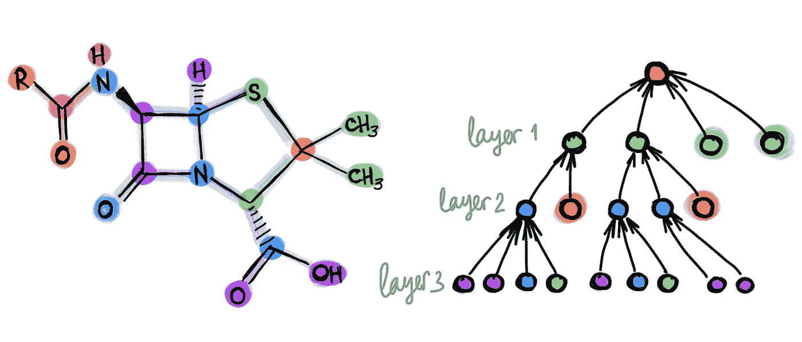
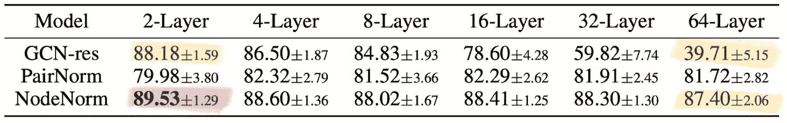
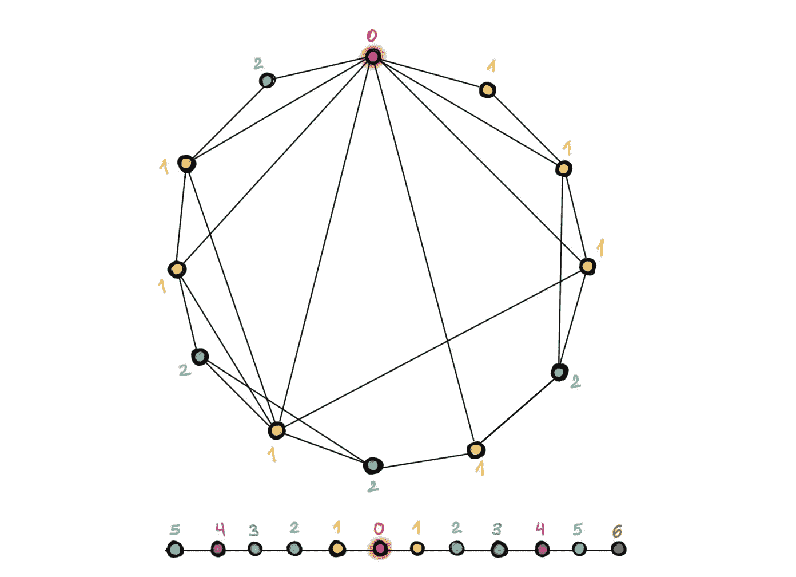
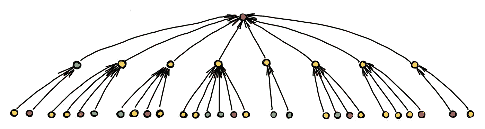
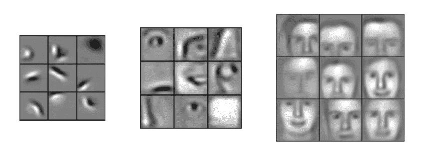

# 我们需要深度图神经网络吗？

> 原文：<https://towardsdatascience.com/do-we-need-deep-graph-neural-networks-be62d3ec5c59?source=collection_archive---------6----------------------->

## 被认为有害的深度？

## 深度学习的标志之一是使用数十层甚至数百层的神经网络。与之形成鲜明对比的是，图形深度学习中使用的大多数架构都很浅，只有少数几层。在这篇文章中，我提出了一个异端的问题:图神经网络架构中的深度带来任何优势吗？

T 今年，关于图形的深度学习被冠上了机器学习领域[最热门话题](https://twitter.com/prlz77/status/1178662575900368903)的桂冠。然而，那些习惯于想象具有数十甚至数百层的卷积神经网络的人*会失望地看到大多数关于图形“深度”学习的工作最多只使用了几层。“深度图神经网络”是一个误称吗？我们是否应该，套用经典的说法，想知道深度是否应该被认为对图形学习有害？*

训练深度图神经网络是困难的。除了在深度神经架构中观察到的标准困境，如反向传播中的消失梯度和由于大量参数导致的过拟合，还有一些图形特有的问题。其中之一是*过度平滑*，由于应用了多个图卷积层，节点特征倾向于收敛到同一个向量并且变得几乎不可区分的现象[1]。这种行为首先在 GCN 模型[2，3]中观察到，其作用类似于低通滤波器。另一个现象是*瓶颈，*导致来自指数级邻居的信息“过度压缩”成固定大小的向量[4]。

最近，大量的努力致力于解决图形神经网络中的深度问题，希望获得更好的性能，并且在涉及只有两层的图形神经网络时，可能避免使用术语“深度学习”时的尴尬。典型的方法可以分为两类。首先，正则化技术，如逐边丢失(DropEdge) [5]，节点特征之间的成对距离归一化(PairNorm) [6]，或逐节点均值和方差归一化(NodeNorm) [7]。第二，架构变化包括各种类型的剩余连接如跳跃知识[8]或仿射剩余连接[9]。虽然这些技术允许训练具有数十层的深度图神经网络(否则这是一项困难甚至不可能的壮举)，但它们未能展示出显著的收益。更糟糕的是，使用深层架构经常会导致性能下降。从[7]复制的下表显示了在节点分类任务上比较不同深度的图形神经网络的典型实验评估:

深度图神经网络架构的典型结果显示在合著者引文网络的节点分类任务中。随着深度的增加，基线(具有剩余连接的 GCN)表现不佳，性能从 88.18%急剧下降到 39.71%。使用 NodeNorm 技术的架构随着深度的增加表现一致。然而，当深入时，性能下降(尽管不显著，从 89.53%下降到 87.40%)。总体而言，深度 64 层架构实现的最佳结果(87.40%)不如简单基线的结果(88.18%)。此外，观察到 NodeNorm 正则化提高了浅层 2 层架构的性能(从 88.18%提高到 89.53%)。从[7]中复制的表(显示的是每类 5 个标签的情况；论文中研究的其他设置表现出类似的行为)。类似的结果显示在[5]和其他几篇论文中。

从该表中可以明显看出，很难将深度架构带来的优势与训练这种神经网络所需的“技巧”区分开来。实际上，上面例子中的 NodeNorm 也改进了一个只有两层的浅层架构，达到了最佳性能。因此，尚不清楚在其他条件不变的情况下，更深层次的图神经网络是否表现更好。

T 这些结果显然与网格结构数据深度学习的传统设置形成鲜明对比，其中“超深度”架构[10，11]带来了性能上的突破，并在今天得到了广泛应用。在下文中，我将尝试提供一些可能有助于回答这篇文章标题中提出的挑衅性问题的方向。我自己也没有一个明确的答案。

**图表的结构。**由于网格是特殊的图形，当然*也有*深度有助于图形的例子。除了网格之外，代表分子、点云[12]或网格[9]等结构的“几何”图形似乎也受益于深层架构。为什么这样的图与通常用于评估图神经网络的引用网络(如 Cora、PubMed 或 CoauthorsCS)如此不同？其中一个区别是，后者类似于低直径的“[小世界](https://en.wikipedia.org/wiki/Small-world_network)”网络，人们可以通过几跳从任何其他节点到达任何节点。结果，仅仅几个卷积层的感受域就已经覆盖了整个图[13]，所以增加更多的层无助于到达远程节点。另一方面，在计算机视觉中，感受野多项式增长，需要许多层来产生捕捉图像中对象的上下文的感受野[14]。

在小世界图(上图)中，从一个节点到达另一个节点只需要几跳。结果，邻居的数量(以及相应地，图形卷积滤波器的感受域)以指数速度增长。在这个例子中，为了从红色节点到达任何节点，只需要两次跳跃(不同的颜色指示从红色节点开始将到达的相应节点的层)。另一方面，在网格(底部)上，感受野的增长是多项式的，因此需要更多的层来达到相同的感受野大小。

在邻居呈指数增长的图中(如上图所示),会出现瓶颈现象:来自太多邻居的太多信息必须压缩到单个节点特征向量中。结果，消息无法传播，性能受到影响。

**长程 vs 短程问题。**一个稍微不同但相关的区别是问题需要长范围还是短范围的信息。例如，在社交网络中，预测通常仅依赖于来自节点的本地邻居的短程信息，并且不会通过添加远程信息来改进。因此，这样的任务可以由浅 gnn 来执行。另一方面，分子图通常需要长程信息，因为分子的化学性质可能取决于其相对侧的原子组合[15]。可能需要深层 GNNs 来利用这些长程相互作用。然而，如果图的结构导致感受野的指数增长，瓶颈现象可以阻止远程信息的有效传播，这解释了为什么深度模型在性能上没有改善[4]。

**理论局限。**除了更大的感受域，深度架构在计算机视觉问题中提供的一个关键优势是它们能够从简单的特征组合出复杂的特征。将 CNN 从面部图像中学习的特征可视化，显示出从简单的几何图元开始，到整个面部结构结束的越来越复杂的特征，这表明传说中的“[祖母神经元](https://en.wikipedia.org/wiki/Grandmother_cell#:~:text=The%20grandmother%20cell%2C%20sometimes%20called,as%20his%20or%20her%20grandmother.)”比神话更真实。这种复合性对于图形来说似乎是不可能的，例如，无论神经网络有多深，都无法从边组成三角形[16]。另一方面，研究表明，如果没有特定的最小深度，使用消息传递网络计算某些图属性(如图矩)是不可能的[17]。总的来说，我们目前缺乏对哪些图形属性可以由浅 gnn 表示，哪些需要深度模型，以及哪些根本无法计算的理解。

卷积神经网络在人脸图像上学习特征的例子。注意当进入更深的层时，特征如何变得越来越复杂(从简单的几何图元到面部分到整个面)。图改编自马修·斯图尔特的[博客文章](/advanced-topics-in-deep-convolutional-neural-networks-71ef1190522d)。

深度与丰富度。与底层网格固定的计算机视觉相反，在对图形的深度学习中，图形的结构确实很重要，并且会被考虑在内。有可能设计更复杂的信息传递机制，考虑复杂的高阶信息，如标准 GNNs 不能发现的基序[18]或[子结构计数](/beyond-weisfeiler-lehman-using-substructures-for-provably-expressive-graph-neural-networks-d476ad665fa3) [19]。人们可以选择具有更丰富的多跳过滤器的浅层网络，而不是使用具有简单 1 跳卷积的深层架构。我们最近关于[可扩展类初始图神经网络(SIGN)](https://medium.com/@michael.bronstein/simple-scalable-graph-neural-networks-7eb04f366d07) 的论文通过使用具有多个预先计算的过滤器的单层线性图卷积架构，将这一想法发挥到了极致。我们展示了比复杂得多的模型更好的性能，而时间复杂度只是它们的一小部分[20]。有趣的是，计算机视觉社区选择了相反的道路:早期带有大(高达 11×11)滤波器的浅层 CNN 架构，如 [AlexNet](https://en.wikipedia.org/wiki/AlexNet) ，被带有小(通常为 3×3)滤波器的非常深层架构所取代。

**评价。**最后但并非最不重要的一点是，图形神经网络的主要评估方法受到了来自 Stephan Günnemann 小组的 Oleksandr Shchur 及其同事的严厉批评[21]，他们提请注意常用基准的缺陷，并表明如果在公平的环境下进行评估，简单模型的性能与更复杂的模型相当。我们在深度架构中观察到的一些现象，比如性能随深度而下降，可能只是源于对小数据集的过度拟合。新的 [Open Graph Benchmark](https://ogb.stanford.edu/) 解决了其中的一些问题，提供了非常大的图形，具有严格的训练和测试数据分割。我认为，我们需要做精心设计的具体实验，以便更好地了解深度在图形的深度学习中是否或何时有用。

[1]更准确地说，过度平滑使节点特征向量塌陷到一个子空间，参见 K. Oono 和 t .铃木，[图神经网络对节点分类的指数松散表达能力](https://arxiv.org/pdf/1905.10947.pdf) (2019)。arXiv:1905.10947，使用动态系统形式提供渐近分析。

[2] Q. Li，Z. Han，X.-M. Wu，[对半监督学习的图卷积网络的更深入见解](https://www.aaai.org/ocs/index.php/AAAI/AAAI18/paper/download/16098/16553) (2019)。继续。AAAI。将 GCN 模型与拉普拉斯平滑法进行类比，并指出过度平滑现象。

[3] H. Nt 和 T. Maehara，[重温图形神经网络:我们所拥有的只是低通滤波器](https://arxiv.org/pdf/1905.09550.pdf) (2019)。arXiv:1905.09550。使用图形的频谱分析来回答 gcn 何时表现良好。

[4] U. Alon 和 E. Yahav，[关于图神经网络的瓶颈及其实际意义](https://arxiv.org/pdf/2006.05205.pdf) (2020)。arXiv:2006.05205。确定了图形神经网络中的过度挤压现象，这类似于在顺序递归模型中观察到的现象。

[5] Y. Rong 等 [DropEdge:走向节点分类上的深度图卷积网络](https://openreview.net/pdf?id=Hkx1qkrKPr) (2020)。进行中。ICLR。一种类似于丢弃的想法，其中在训练期间使用边的随机子集。

[6]赵和阿科格鲁。 [PairNorm:在 GNNs](https://arxiv.org/pdf/1909.12223.pdf) (2020)中解决过度投机问题。继续。ICLR。建议对结点要素之间成对距离的总和进行归一化，以防止它们塌陷为一个点。

[7] K. Zhou 等[深度图神经网络的有效训练策略](https://arxiv.org/abs/2006.07107) (2020)。arXiv:2006.07107。

[8] K. Xu 等，[具有跳跃知识网络的图上的表征学习](https://arxiv.org/pdf/1806.03536.pdf) (2018)。继续。ICML 2018。

[9] S. Gong 等[图神经网络中的几何原理连接](https://openaccess.thecvf.com/content_CVPR_2020/papers/Gong_Geometrically_Principled_Connections_in_Graph_Neural_Networks_CVPR_2020_paper.pdf) (2020)。继续。CVPR。

[10] C. Szegedy 等人，深入研究卷积(2015 年)。继续。CVPR。

[11] K. He 等，用于图像识别的深度残差学习(2016)。继续。CVPR。

[12] G .李等[DeepGCNs:GCNs 能不能做到和 CNN 一样深？](https://arxiv.org/pdf/1904.03751.pdf) (2019)。继续。ICCV。展示了几何点云数据的深度优势。

[13] Alon 和 Yahav 将一个节点不能从比层数更远的节点接收信息的情况称为“欠达”。这一现象最早由 P Barceló等人在[图神经网络的逻辑表达能力](https://openreview.net/pdf?id=r1lZ7AEKvB) (2020)中指出。继续。ICLR。Alon 和 Yahav 在分子图(使用层数比图的直径多的 gnn)中的化学性质预测问题上通过实验表明，性能差的原因不是不足，而是过度挤压。

[14] André Araujo 和合著者有一篇关于卷积神经网络中感受域的[优秀博客文章](https://distill.pub/2019/computing-receptive-fields/)。随着 CNN 模型在计算机视觉应用中的发展，从 AlexNet 到 VGG、ResNet 和 Inception，它们的感受域随着层数的增加而增加。在现代架构中，感受域通常覆盖整个输入图像，即，最终输出特征图中每个特征使用的上下文包括所有输入像素。Araujo 等人观察到分类准确性和感受野大小之间的对数关系，这表明大的感受野对于高水平的识别任务是必要的，但回报递减。

[15] M. K. Matlock 等[用波网络在无向图中深度学习长程信息](https://arxiv.org/pdf/1810.12153.pdf) (2019)。继续。IJCNN。观察图形神经网络捕捉分子图形中长距离相互作用的失败。

[16]这源于与 [Weisfeiler-Lehman 图同构测试](/expressive-power-of-graph-neural-networks-and-the-weisefeiler-lehman-test-b883db3c7c49)的消息传递 GNN 等价，参见例如 V. Arvind 等人[关于 Weisfeiler-Leman 不变性:子图计数和相关图属性](https://arxiv.org/abs/1811.04801) (2018)。arXiv:1811.04801 和 Z. Chen 等人[图神经网络能统计子结构吗？](https://arxiv.org/abs/2002.04025) (2020)。arXiv:2002.04025。

[17] N. Dehmamy，A.-L. Barabási，于荣，[理解图神经网络在学习图拓扑中的表示能力](https://papers.nips.cc/paper/9675-understanding-the-representation-power-of-graph-neural-networks-in-learning-graph-topology.pdf) (2019)。继续。神经炎。表明学习某阶图矩需要一定深度的 gnn。

[18] F. Monti，K. Otness，M. M. Bronstein， [MotifNet:一种基于 motif 的图卷积网络，用于有向图](https://arxiv.org/pdf/1802.01572) (2018)。arXiv:1802.01572。

[19] G. Bouritsas et al. [通过子图同构计数提高图神经网络表达能力](https://arxiv.org/abs/2006.09252) (2020)。arXiv:2006.09252。

[20] E. Rossi 等人[签署:可扩展的初始图神经网络](https://arxiv.org/pdf/2004.11198) (2020)。arXiv:2004.11198

[21] O. Shchur 等人[图神经网络评估的陷阱](https://arxiv.org/pdf/1811.05868.pdf) (2018)。关系表征学习工作坊。显示简单的 GNN 模型与更复杂的模型表现相当。

*我非常感谢尤里·阿龙分享他在图形神经网络瓶颈方面的工作，也非常感谢他、法布里齐奥·弗拉斯卡、费德里科·蒙蒂和伊曼纽·罗西对这篇文章的校对。本帖的* [*中文翻译*](https://www.infoq.cn/article/4wZrGLeyyUghWLaF6DVi) *由* [*刘止庸*](https://medium.com/@zhiyongliu) *提供。关于图形深度学习的其他文章，请参见我的* [*博客*](https://towardsdatascience.com/graph-deep-learning/home) *关于走向数据科学，* [*订阅*](https://michael-bronstein.medium.com/subscribe) *到我的帖子，获取* [*中等会员*](https://michael-bronstein.medium.com/membership) *，或者关注我的*[*Twitter*](https://twitter.com/mmbronstein)*。*