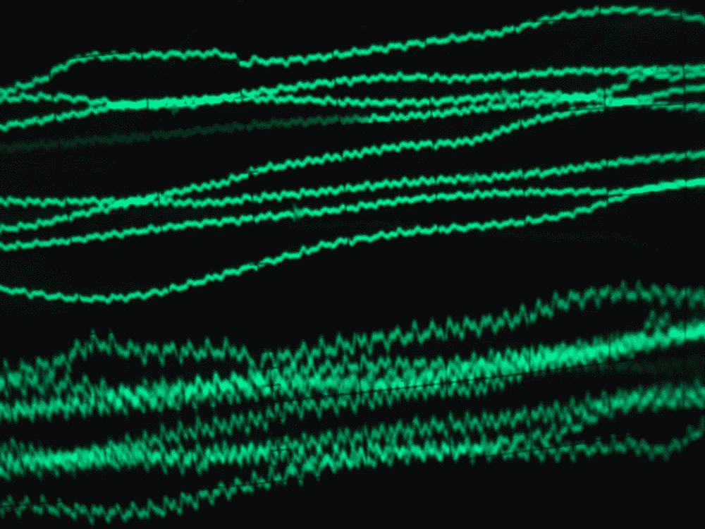
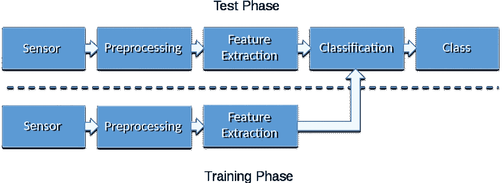
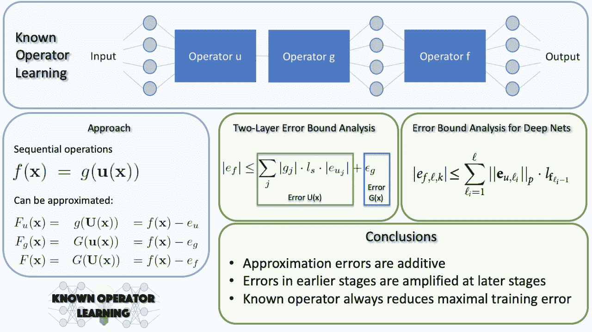
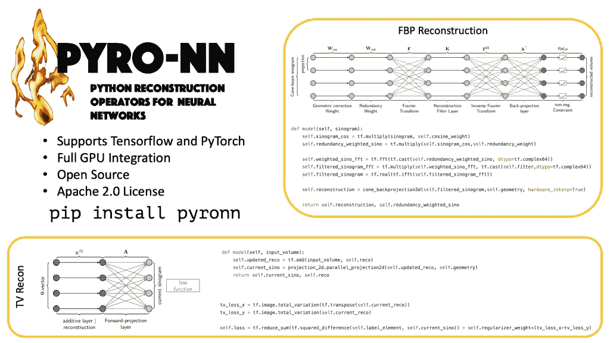
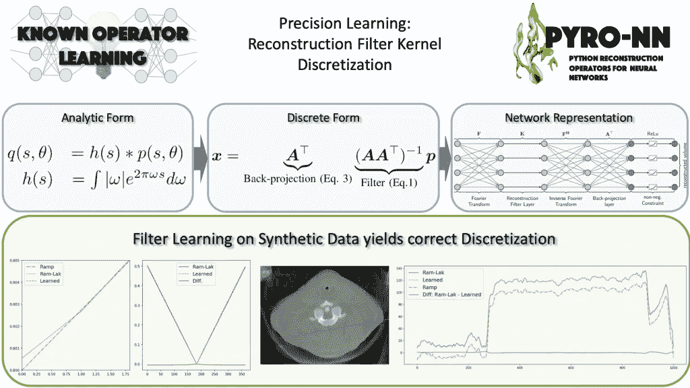

# 深度学习时代我们还需要传统的模式识别、机器学习、信号处理吗？

> 原文：<https://towardsdatascience.com/do-we-still-need-traditional-pattern-recognition-machine-learning-and-signal-processing-in-the-age-9ffe58512ff9?source=collection_archive---------39----------------------->

## 指数增长领域的理论与实践

使用示波器的信号处理。图片:[来源](https://de.freeimages.com/photo/oscilloscope-1254068)。

深度学习是过去几年我们在计算机科学中看到的最成功的方法之一。结果表明，用这种方法可以解决许多问题，每天都有惊人的结果发表。事实上，模式识别中的许多传统方法似乎已经过时。在科学界，模式识别和信号处理的讲师讨论我们是否需要重新设计我们所有的课程，因为许多方法不再反映最先进的水平。基于深度学习的方法似乎优于所有这些方法。

尼曼之后的经典模式识别流水线。过程中的每一步都是独立优化的，这导致了经典的“特征工程”。图片:[来源](https://www.sciencedirect.com/science/article/pii/S093938891830120X)。

对于经典意义上的模式识别和机器学习来说，我们感兴趣的是解决依赖于感知的任务，现有的先验知识非常少，可以利用这些知识来有效地解决任务。经典模式识别中使用的主要方法是使用专家知识来识别对给定任务有区别的特征。这种方法现在通常被称为“特征工程”。这些方法中的大多数已被证明优于在架构设计中勾画特定算法蓝图并以数据驱动的方式训练所有参数的深度方法。这样做，我们能够在许多问题上接近甚至超过人类的表现。

所有这些“感知任务”共有的一个主要目标是，我们无法真正理解人类大脑是如何解决它们的。因此，建立深层网络，在如何解决问题上提供很大的自由度，会给我们带来最好的结果。我还不知道有什么更好的方法来处理这个基本的限制。

深度学习现在也应用于其他领域，如医学图像重建，黄等人的实验表明。在这里，我们看到成功，但也有意想不到的结果。图片:[来源](https://www.sciencedirect.com/science/article/pii/S093938891830120X)。

鉴于这一巨大成功，看到许多研究人员开始将深度学习应用于经典信号处理任务就不足为奇了。范围从助听器的降噪、图像超分辨率，到医学成像模式(如计算机断层成像)的 3D 体积图像重建。事实上，许多论文表明，对于许多给定的任务领域，深度学习能够胜过经典方法。在最好的情况下，这些网络学习针对特定应用优化的经典算法的变体。在其他情况下，我们甚至会看到惊人的结果，尽管网络架构在数学上无法模拟真正的底层功能。然而，在有限的应用领域，给定适当的训练数据，对于各种各样的问题，该任务仍然是近似的。

由于神经网络是通用函数逼近器，这些结果并不完全令人惊讶。如果我们已经知道，例如对于磁共振成像(MRI)的情况，处理链必须包含傅立叶变换，我们是否真的需要从头开始学习所有的可训练参数。事实上，最近的一篇论文提出了“T2 已知算子学习”的概念，研究了这种已知算子的积分效果，如 MRI 中的傅立叶变换。该论文证明了将操作包含到网络中实际上减少了学习问题的最大误差界限。因此，该知识有助于找到更稳定的解决方案，同时减少可训练参数的数量。在大多数情况下，这也减少了所需的训练样本数量。

[已知算子学习](https://www.nature.com/articles/s42256-019-0077-5)允许混合经典和深度方法。图片由 [Andreas Maier](https://lme.tf.fau.de/person/maier/) 在 [CC 4.0 下由](https://creativecommons.org/licenses/by/4.0/deed.de)提供。

在这一点上需要提及的一个重要前提是，允许计算相对于输入数据以及可选地相对于其参数的梯度/导数的任何操作都适用于该框架。因此,“算子”的范围可以从简单的矩阵乘法到复杂的方法[,如计算机图形学中的整个光线跟踪器](http://papers.nips.cc/paper/8014-rendernet-a-deep-convolutional-network-for-differentiable-rendering-from-3d-shapes)。即使是高度非线性的方法，如中值滤波器，也允许计算线性化的梯度，这使得[能够在此框架内使用](https://link.springer.com/chapter/10.1007/978-3-030-32248-9_11)。

到目前为止，“已知算子学习”已经被应用于构建将深度学习方法与经典信号处理相结合的网络。它可以用于为计算机断层摄影设计高效且可解释的重建方法，将物理学集成到 X 射线材料分解中，并减少分割和去噪网络中的参数数量。我们甚至看到深度学习和经典理论的融合能够在数学意义上“衍生”新的网络结构。这样做，一个新的数学图像重组公式被发现，这是以前未知的。这个新公式现在允许将并行 MRI 原始数据映射到 X 射线采集几何图形中。这一新发现是迈向[新型核磁共振成像/X 射线混合扫描仪](https://link.springer.com/chapter/10.1007/978-3-030-12939-2_35)的重要一步，可能会为全新一代医疗扫描仪铺平道路。

[PYRO-NN](https://aapm.onlinelibrary.wiley.com/doi/full/10.1002/mp.13753) 是在 [TensorFlow](https://www.tensorflow.org/) 中实现的利用深度学习进行图像重建的开源框架。在这里找到 GitHub 库。图片由 [Andreas Maier](https://lme.tf.fau.de/person/maier/) 在 [CC 4.0 下由](https://creativecommons.org/licenses/by/4.0/deed.de)拍摄。

事实上，有人可能会说，我们已经在深度学习中使用这个概念很长时间了。原则上，卷积层和池层是受大脑中神经处理启发的已知运算符。因此，有人可能会说，它们的包含是一种应该存在于网络中的先验知识。然而，与 X 射线和 MRI 的例子相比，我们不能保证操作员需要出现在网络中。尽管如此，这些观察结果非常符合深度学习每天产生的结果。

我们还需要学习过滤器离散化吗？滤波器学习能够[从分析初始化](https://arxiv.org/abs/1710.06287)中找到正确的离散化。在这里找到一个代码示例[。图片由](https://github.com/csyben/PYRO-NN/blob/master/examples/ct_reconstruction/example_learning_tensorflow/train_model.py) [Andreas Maier](https://lme.tf.fau.de/person/maier/) 在 [CC 4.0 下由](https://creativecommons.org/licenses/by/4.0/deed.de)拍摄。

基于这些发现，我不认为我们应该在课堂上省略经典理论，而只用深度学习的讲座来代替。事实上，我确实相信经典理论和深度学习非常兼容，可以用来促进彼此的理解。一方面，我们已经观察到证据，例如噪声增强技术类似于维纳滤波器，并且端到端离散滤波器网络[可以从很少的训练示例中学习正确的滤波器离散化](https://arxiv.org/abs/1710.06287)。所以深度学习有助于简化经典理论中的实际问题。另一方面，我们也看到，我们可以在深度网络中用经典运算替换块，以了解它们的用途。这限制了网络的解空间，并允许我们用来自经典理论的方法分析它们的更简单的部分。因此，深度学习也可以受益于传统方法。事实上，我相信这两个世界的融合是未来研究的一个很好的方向，并可能使我们在未来联合符号处理和深度学习方法的领域。因此，我们需要继续传达经典方法，但是我们需要将它们放入正确的上下文中，并将它们连接到适当的深层方法。

如果你喜欢这篇文章，你可以在“[医学图像处理深度学习的温和介绍](https://arxiv.org/abs/1810.05401)中找到这个观点的扩展版本，或者看看[我的 YouTube 频道](https://www.youtube.com/channel/UCoiMqX5FHfk_KDow7xSe7pg)。这篇文章最初出现在 MarkTechPost.com 的[上](https://www.marktechpost.com/2018/11/28/do-we-still-need-traditional-pattern-recognition-and-signal-processing-in-the-age-of-deep-learning/)，以[知识共享 4.0 归属许可](https://creativecommons.org/licenses/by/4.0/deed.de)发布。