# 你会举吗？通过锻炼和营养预测体重减轻

> 原文：<https://towardsdatascience.com/do-you-even-lift-predicting-weight-change-with-workouts-and-nutrition-a6b8b4cf6f23?source=collection_archive---------14----------------------->

## 将经典的数据科学方法应用到我的减肥旅程中

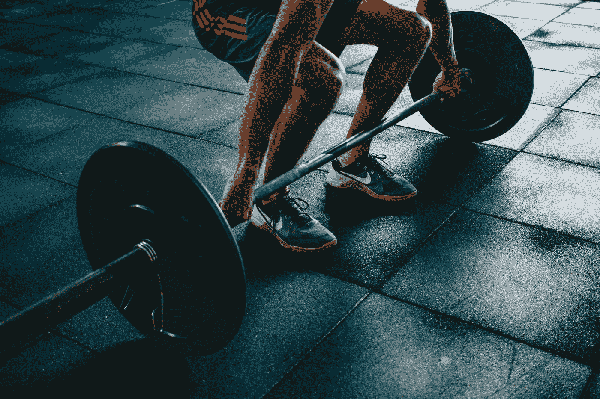

维克多·弗雷塔斯在 [Unsplash](https://unsplash.com?utm_source=medium&utm_medium=referral) 上拍摄的照片

# 背景

新年新我！但是我没有新年决心，而是有一个新年前的决心:在 2020 年前让我的体重回到健康范围。我记得 2018 年我在一家节奏极快的初创公司实习了 3 个月，每天都有很高的进步要求，我没有意识到我给自己带来了多少压力。每一天结束时，我都筋疲力尽，没有任何精力去快速锻炼。

在我的实习和**结束时，我的体重增加了 6 公斤**，这让我的身体质量指数身份立刻变成了超重。3 个月 6 斤！我完全惊呆了，我外表的变化变得很明显。

快进到今天，谢天谢地，我在一家大公司担任数据分析师，工作与生活的平衡让我可以在下班后腾出一些精力去健身房。

## 我的体重状况

我一直想减掉身上的脂肪，保持身材，因为在这个项目开始时，我的身体质量指数处于临界超重状态。网上消息指出，保持 50-70%的运动强度是脂肪燃烧卡路里的最佳比例。

我试着在两周内每周去健身房五次，果然我已经看到了我身体形状的微妙变化。体重秤上显示的我的总重量变化不大，但我很高兴看到力量的增长。

## 动机

随着我继续频繁地去健身房，我受到启发**利用应用机器学习的想法，根据我在健身房锻炼的类型和我的饮食来预测我未来的体重减轻**。我想采用经典的数据科学方法，根据以下方法预测我的体重变化:

> **数据采集:**通过移动应用程序记录我的营养和健身活动，并将数据输入 csv 文件，然后导入 Python 脚本。
> 
> **分析:**可视化我的饮食习惯和健身习惯的个人关系，并决定哪些特征适合回归模型。
> 
> **统计:**了解我的饮食习惯和健身程序如何影响我的体重变化，并去除高度相关的特征。
> 
> **建模和评估:**选择基于 R 平方统计量和最小均方误差的最佳线性回归模型。

是的，我知道[通过像全栈数据科学项目](/a-full-stack-data-science-project-part-1-9f73a997dc4d)这样的网站收集数据是一种更酷的方法。但是，嘿，我可以减肥，保持身材，我觉得这对我来说足够酷了！

**声明:**我既不是营养学家，也不是运动科学专家。我写这篇文章是出于对结合数据科学和锻炼的兴趣。我在运动营养学方面的知识仅限于我在网上看到的和我的生物医学文凭上的一点点。因此，如果下面任何关于营养的信息对读者来说是不正确的，我道歉。我只是对数据方面感兴趣。

> “这是我个人的减肥旅程，有我自己的一套数据，不一定对你有用。每个人的身体都有不同的工作方式，如果你有兴趣开始这段旅程，你应该提供自己的一组数据。”

为了正确看待我在这个项目开始时所处的位置，下面是一些测量结果:

*   **当前体重:74.9 公斤**
*   **目前的身体质量指数:24.96(是的，我差 0.04 就被认为超重了)**
*   **目标重量:68 公斤**

# 数据采集

## 收集方法

每天早上醒来后测量体重和其他身体指标。卡路里和宏量营养素的分解记录在 MyFitnessPal 应用程序免费版中，锻炼数据由 Jefit 应用程序精英版获取。

所有工作日锻炼都在晚上下班后进行，周末锻炼通常在下午进行。

## 数据描述

在决定用于预测分析的变量之前，让我们看看每个变量，并探索它们与体重变化的关系。

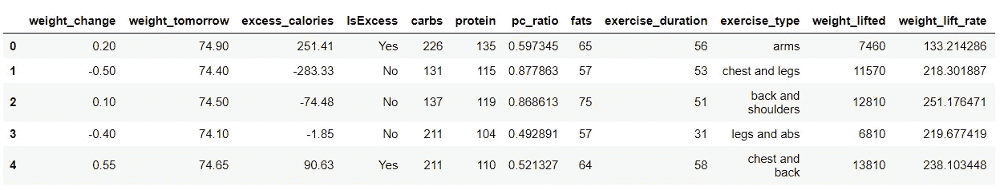

**体重变化:**我考虑使用脂肪百分比变化作为感兴趣的变量。因为毕竟燃脂练肌是这个项目想要的结果。然而，许多消息来源指出浴室身体成分量表的不准确性，尽管很高兴看到与你的身体相关的某些指标。我尝试使用小米的身体成分量表和 **e** [**ven，尽管产品评论本身承认它不准确，尽管它包含了一系列有用的功能。**](https://www.trustedreviews.com/reviews/xiaomi-mi-body-composition-scale)

我决定使用体重变化作为感兴趣的因变量，因为我想探索我的活动和相应体重变化之间的关系。

weight_change 变量是用 weight_today 减去 weight_tomorrow 得到的。

出于一致性的目的，所有的测量都是在第二天早上醒来后进行的。

**多余卡路里:**我把多余卡路里定义为消耗的卡路里减去自己的基础代谢率(BMR)。人的基础代谢率通过以下公式计算:

*   **女性:BMR = 655 + (9.6 *体重公斤)+ (1.8 *身高厘米)-(4.7 *年龄岁)**
*   **男性:BMR = 66 + (13.7 *体重公斤)+ (5 *身高厘米)-(6.8 *年龄岁)**
*   **多余卡路里=消耗的卡路里-基础代谢率**

一道蛋白质与碳水化合物比率极高的菜肴(照片由[马克·德扬](https://unsplash.com/@tempestdesigner?utm_source=medium&utm_medium=referral)在 [Unsplash](https://unsplash.com?utm_source=medium&utm_medium=referral) 上拍摄)

**蛋白质-碳水化合物比率:**在互联网上查找关于[低碳水化合物饮食的文章](https://www.mayoclinic.org/healthy-lifestyle/weight-loss/in-depth/low-carb-diet/art-20045831)，你读得越多，你就越确信限制碳水化合物燃烧储存的脂肪作为能量。

如果你经常去健身房，你就会明白蛋白质对肌肉修复和生长是多么重要，这样你就能在随后的锻炼中恢复并继续前进。其他消息来源指出用蛋白质代替碳水化合物是减肥的关键。

这让我有兴趣研究它与减肥的关系，因为我打算用更多的蛋白质消费来代替碳水化合物，如肉、豆腐和蛋白奶昔。

单独吃炸鸡而不吃薯条或苏打水实际上可能有助于减肥。一些健身者称之为肮脏的膨胀

**脂肪:**与吃脂肪会让你变胖的普遍观点相反，[用有益的脂肪代替碳水化合物有助于燃烧全部脂肪](https://www.hyperbiotics.com/blogs/recent-articles/how-a-high-fat-diet-can-help-you-lose-weight-and-improve-your-health)。不幸的是，我正在使用的移动应用程序不提供将脂肪准确分为饱和脂肪、多不饱和脂肪和反式脂肪的功能。但是很自然地，我会认为从常规饮食中持续摄入脂肪可能会导致体重增加..对吗？

**锻炼类型:**我遵循 Jefit 的“5 天肌肉量分割”计划，并根据我的要求和可用的健身房设备量身定制。这是一个分类变量，仅限于以下类型的健身程序:

*   胸部和背部
*   腿和腹肌
*   手臂，胳膊（arm 的复数）
*   肩膀和后背
*   胸部和腿部
*   休息

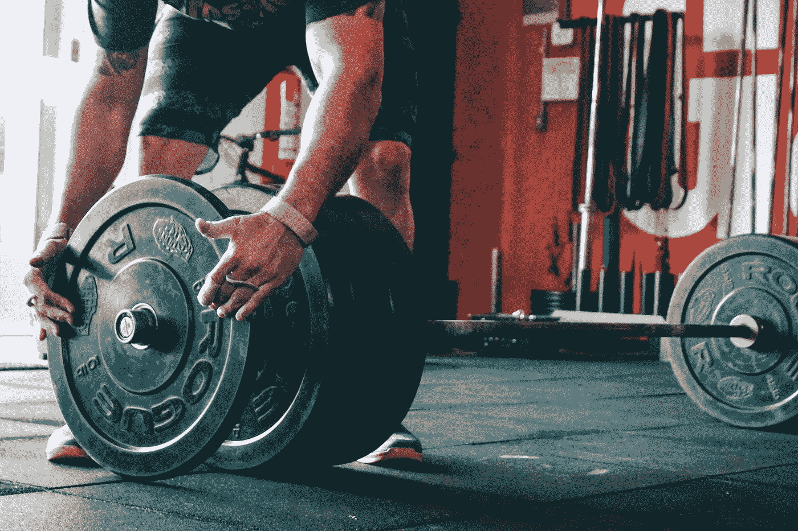

维克多·弗雷塔斯在 [Unsplash](https://unsplash.com?utm_source=medium&utm_medium=referral) 上拍摄的照片

由于该应用程序没有将每个肌肉成分花费的时间分开(除了 arms day)，我决定将它们分组到单一的运动类型中以保持一致性，而不是用一键编码将每个肌肉成分分开。

**健身房举重率:**这是我试过的第一款显示每次锻炼举重量的应用。某些锻炼，如手臂日，会期望举起较低的重量，因为手臂不属于主要肌肉群，而我们会期望在包括胸部、背部和腿部的锻炼中看到较高的重量。一开始，知道每天举起多少重量似乎是对特定锻炼表现的充分衡量。然而，我认为休息的时间长短取决于锻炼的强度。想象一下休息 2 分钟和休息 1 分钟，差别是巨大的，这是保持 50-70%运动强度的关键。

# 探索性数据分析

是时候深入这个项目的数据方面了。以下是我减肥的 TL:DR 仪表盘总结:

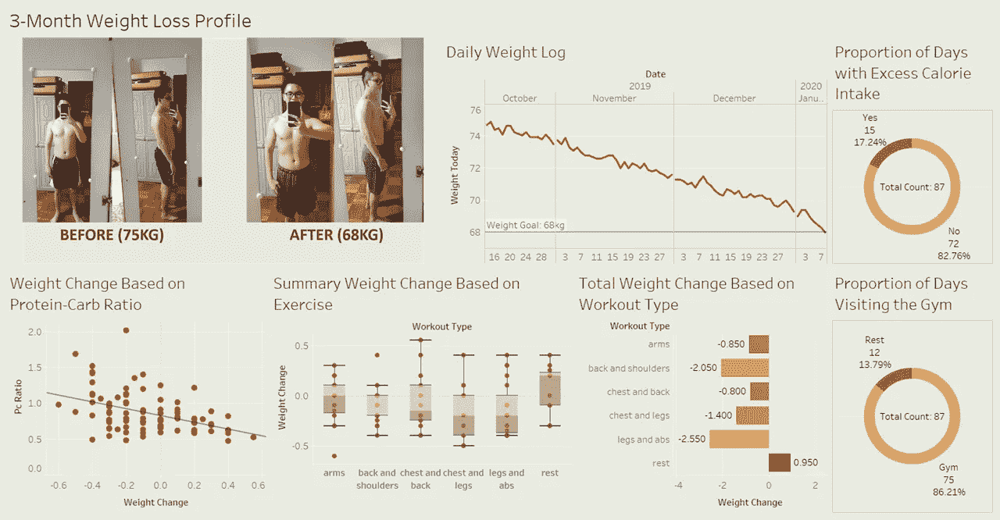

首先，原谅变形图片的恐怖灯光。当我第一次拍这张照片时，我并不是很认真地开始这次旅程，我也不确定这张照片的正确角度。当我开始看到渐进的结果时，我意识到我应该选择一个光线更好的地方。为了保持一致性，我用相似的设置拍摄了“之后”的照片。

首先，下面是我每日体重随时间变化的简单快速线性回归:

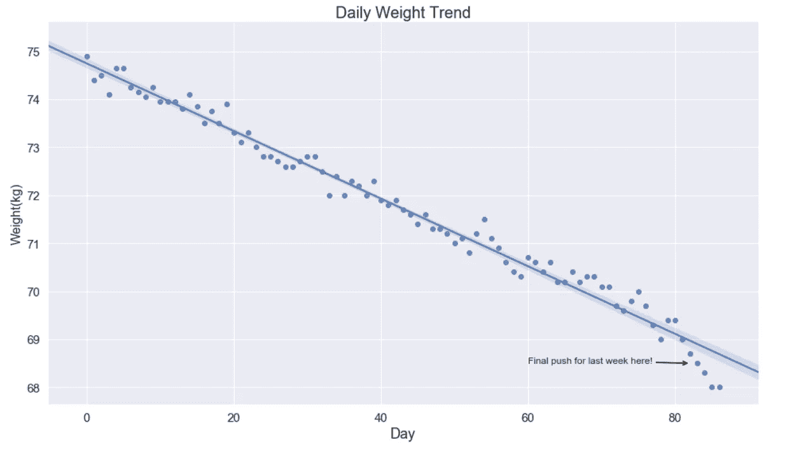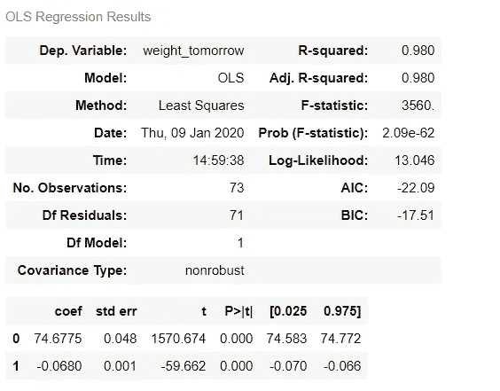

在我继续之前，请注意，回归图是在整个数据集上绘制的，而汇总统计数据是从过去 14 天中提取的数据。稍后我会解释这一点。

显然，使用天数作为因变量进行简单的线性回归并不能真正解释我体重减轻的原因。然而，有趣的是，我每天平均减轻 0.068 公斤，每周平均减轻 0.476 公斤**。有 98%的 R 平方统计，它解释了我减肥习惯的一致性。**

## **那么营养是如何影响体重变化的呢？**

**从不吃饭到大吃自助餐，你吃什么就是什么。每个人都有一个特定的基础代谢率，燃烧足够的热量来维持他们的身体机能。人们很自然地认为，你的体重与你摄入的超过你个人基础代谢率的量直接相关。**

**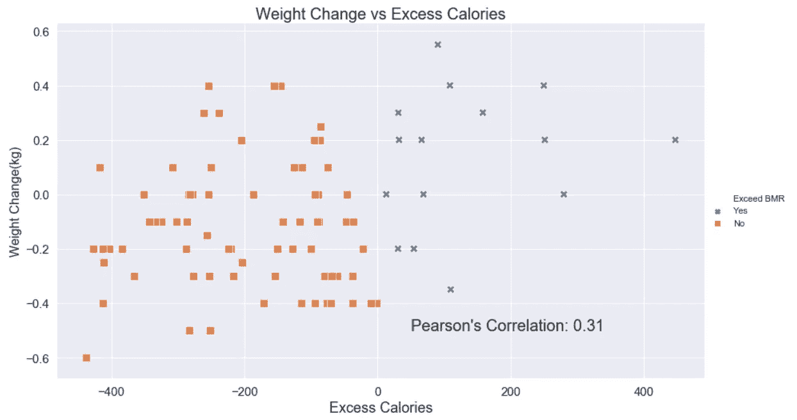**

**过量的卡路里和体重变化之间似乎存在着相当积极的关系。公平地说，我确实期望这两个变量之间有更强的相关性。出现这种现象有几个原因:**

1.  **计算卡路里只是估算你吃了多少。MyFitnessPal 有一个食物数据库，但不一定提供大量营养素的准确分类，因为它是由全球用户共享的。某些食物，尤其是亚洲菜肴在数据库中不存在，我不得不通过与类似的菜肴进行比较来提供宏量营养素的粗略估计。**
2.  **我身体的生理机能也起了作用。当我生病的时候，即使喝了很多水，我还是经常脱水。在我生病期间，我不断地减肥。但是当我恢复健康的时候，我的体重猛增。由于必须处理有限的数据，这些异常可能会影响我的分析。**

**我们知道，健美运动员发誓摄入高蛋白，同时减少一点碳水化合物，以达到轮廓分明的效果。对于初学者来说，将碳水化合物:蛋白质:脂肪的宏观营养比例分配到 40:30:30 是一个很好的开始，这就是我开始的地方。随着我旅程的进行，这个比例慢慢变成了 40:40:20。所以理想情况下，我会尽最大努力保持我的蛋白质和碳水化合物的比例在 1 以上来减肥。**

**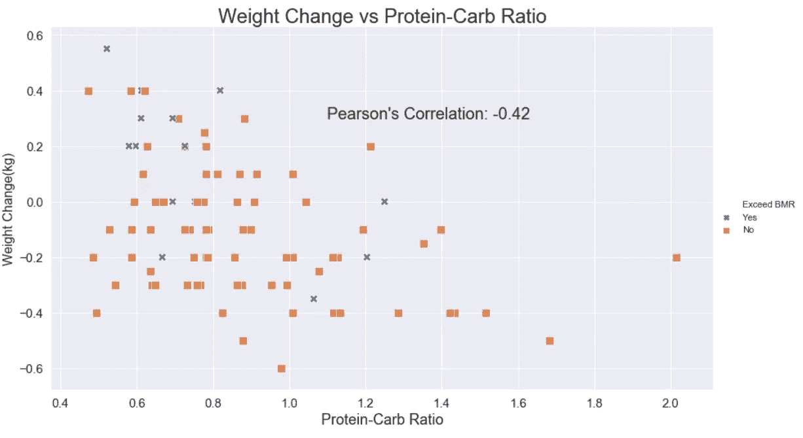**

**这部分解释了为什么我的体重下降速度没有那些酮饮食的人快。我日常消费的大部分仍然含有高碳水化合物！即使我在旅程的后半段没有吃任何主食。负相关告诉我，减少碳水化合物的摄入并用蛋白质代替确实有助于减肥。但是脂肪呢？肯定是正相关的吧？**

**不完全是。**

**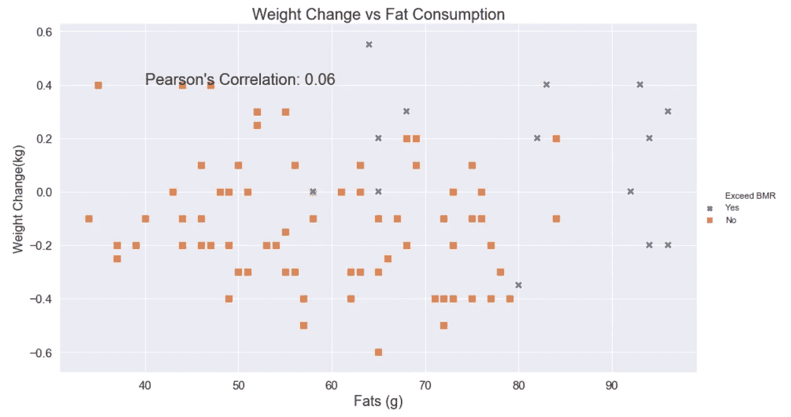**

**令人惊讶，不是吗？体重变化和脂肪消耗之间几乎没有任何关联。这真的可以归结为你摄入的碳水化合物的量和对你体重变化高度负责的多余卡路里！不要只相信我的话，你可以看看 Ariel Faigon 的这个实验。**

** [## 减肥/减肥

### 该图表是由这个 git 存储库中的脚本 date-weight.r 从数据集 weight.2015.csv 生成的。它需要…

github.com](https://github.com/arielf/weight-loss) 

在负责减肥的顶级食物中，它包括橄榄油、天妇罗、鸡蛋和培根！是的，美味的熏肉！许多主食是体重增加的原因，这也不足为奇。

正如你所注意到的，我已经使用皮尔逊系数作为主要指标来评估体重变化和营养变量之间的关系。因此，我必须强调**相关性不等于因果关系**。减少碳水化合物并用蛋白质代替并不总是能保证减肥。总会有一个独立的第三方因素影响体重变化，这就是为什么我们要调查我的锻炼对体重变化的影响。

## 锻炼的类型会影响体重变化吗？

如果你看过我体重减轻的仪表板资料，你会注意到我的体重减轻大部分来自腿部/腹肌日，累积休息日解释了积极的体重变化。然而，我们不能简单地得出结论，做腿部/腹肌运动一定会带来最大的减肥效果。让我们来看一个箱线图进行比较:

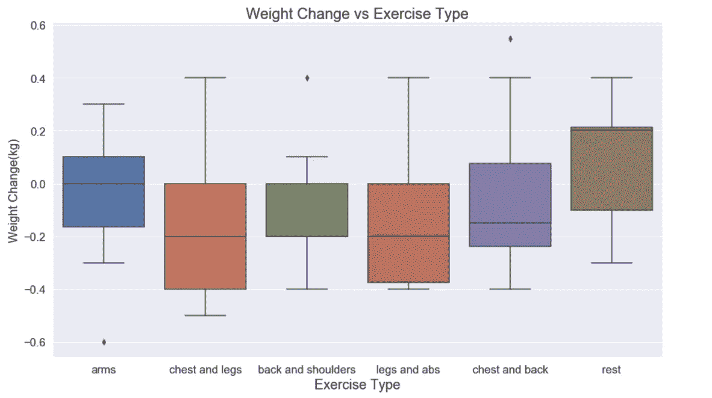

乍一看，我们可以看到包括休息日在内的某些锻炼类型具有高度倾斜的数据，其中中位数接近上/下四分位数。假设不是所有的锻炼类型都不符合正态分布是合理的。这在很大程度上是因为捕获的数据数量非常有限。回想一下，在这个项目总共 87 天中，我只有 12 天休息。随着数据数量的增加，每个变量很可能遵循正态分布。需要对独立变量进行非参数统计检验，以验证分布的差异，即“曼-惠特尼 U 检验”。然而，我最近发现 Python 的 statsmodels 库已经**方便地**包含了一个成对 t 测试。尽管这不是进行这个测试的正确方法，我还是继续做了，因为它仍然给了我某种程度上的洞察力，关于分布的差异。它看起来是这样的:

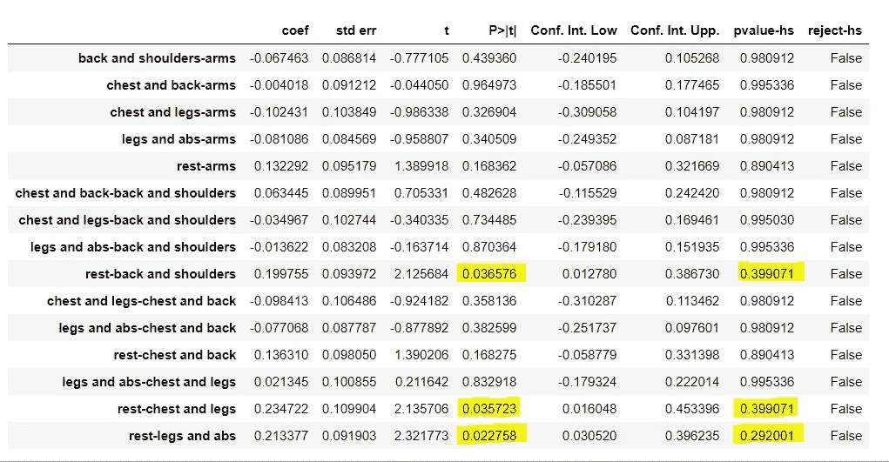

虽然结果显示，某些锻炼与休息日相比是不确定的。我相当有信心，随着数据收集变得越来越大，p 值将收敛到一个较低的值。

仍然有一些事情需要探索，但是我会在这里停下来，继续这个项目的主要目标。我将在我的 [Github](https://github.com/bobbymuls/weight-change-with-gym-and-nutrition) 中分享我的数据，你可以尽情探索。** 

# **预测我的体重变化**

## **系统模型化**

**在我的项目结束时，我已经将我的重点从减肥转移到增加体重，所以用我即将介绍的模型来预测我未来的体重是没有意义的。回想一下，我将把项目的最后 14 天作为测试集。这是我将用于建模的大约 16%的训练测试分割。**

**让我们从一个非常简单的多元线性回归开始，找出独立特征对体重变化的影响程度:**

**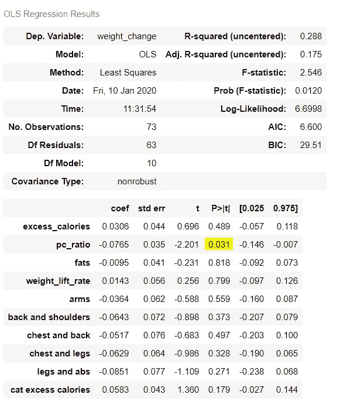**

**从 R 平方统计数据来看，它似乎不是一个很好的预测模型。在这个列表中的所有特征中，蛋白质和碳水化合物的比例似乎在体重变化中起着最重要的作用，并且是一个负系数。**

**说到特征的重要性，我将应用随机森林回归和 XGBoost 以及使用 GridSearchCV 调整的超参数，来对哪些特征提供了较高的减肥幅度进行排序:**

**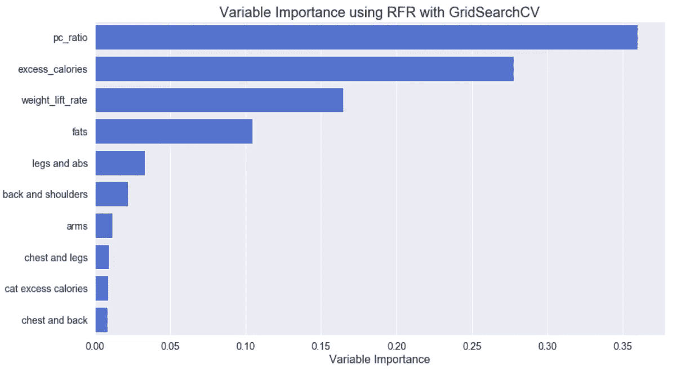**

**等一下…为什么过量卡路里变量的重要性排在第二位，而绝对过量卡路里变量(是/否)的重要性排在第二位？转念一想，似乎**所有的独热编码特征都放在了图表的下半部分**。环顾网络，这似乎是一个可行的解释，摘自一篇关于随机森林特征重要性的文章**

> ****缺点:****
> 
> ****有偏见的方法，因为它倾向于夸大连续特征或高基数分类变量的重要性****

****让我们看看 XGBoost 在随机森林回归中表现如何:****

****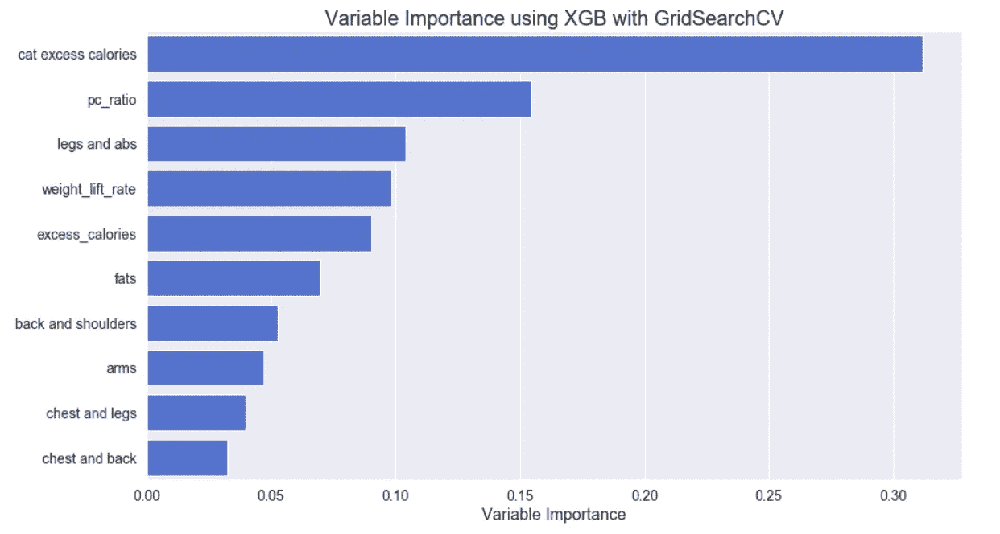****

****现在这更有意义了！这次我们看到了分类变量和连续变量的巨大混合。当我们将其与营养方面的连续散点图进行比较时，我们可以观察到蛋白质-碳水化合物比率比过多的卡路里和脂肪起着更重要的作用。****

****然而，我仍然很怀疑它的预测能力。在之前的算法中，我特意将我选择的所有特征用于预测。回头来看，似乎有某些变量可能会危及性能，如“胸部和背部”在这两种情况下。****

****那么有哪些冗余的特征可以被去除以提高预测呢？我们用另一个随机森林回归的升级算法来回答这个问题，它的递归特征消除。****

****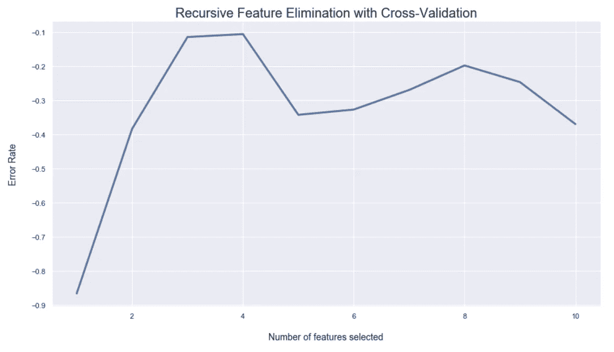********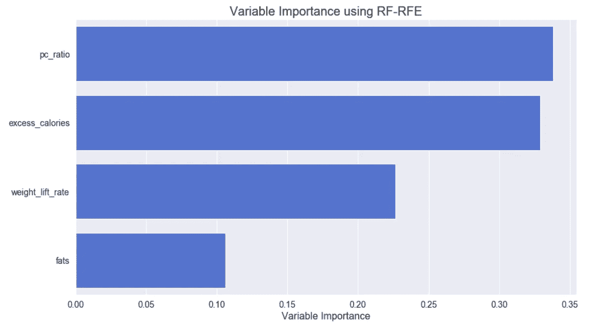****

****嗯嗯嗯…看起来所有的分类/二元特征都被消除了！虽然不得不删除这些特性让我很痛苦，但健壮的预测需要一点点牺牲。****

## ****预测和评估****

****老实说，这将是一个相当令人失望的部分，如果您希望看到 XGBoost 在 4 个版本中表现最好，请做好准备，因为它来了:****

****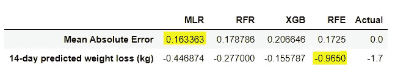****

****XGB 的 MAE 得分最高，预测最差。事实上，虽然我没有包括使用天数作为独立变量的线性回归，但是你可以很好地猜到，与这四个变量相比，它将做出最好的预测。****

****RFE 算法效果最好，因为某些与体重变化关系不大的特征被剔除了。****

****XGB 和 random forest regression 的表现不如我预期的那样好，因为它有太多的超参数需要优化，甚至连我的笔记本电脑都无法处理。****

****缺乏收集的数据可能是算法没有发挥应有作用的另一个因素。毕竟还不到 90 天！看看 RFE 算法的折线图上相当不稳定的模式，就能很好地概括这一点。****

****我可以继续使用一系列回归算法，甚至可能利用深度学习来使其更接近实际值。但我会在这里打住。如果你知道你能做出比我更好的预测，你可以再次访问我的 Jupyter 笔记本和我的 Github 中的体重数据。****

# ****最终想法和要点****

## ****一个全新的我****

****今天我的体重已经达到了健康的身体质量指数范围。我非常高兴在三个月内实现了我的目标。由于我的饮食选择和锻炼习惯，我在日常生活中不再感到昏昏欲睡。2020 年已经以积极的方式开始了！****

****虽然许多网站分享了类似的营养和减肥锻炼建议，但在这个个人项目中采用数据科学提供了关于每个特征与减肥相关的重要性的宝贵见解。****

## ****我是怎么做到的，你能做什么？****

****每个人都有不同的动力来塑造自己想要的身材。在大多数情况下，我们看着自己的反思，问自己我们能做些什么来实现它。****

****然后我们开始找借口。****

****然后我们停在那里。****

****保持一致性的最大障碍是我们许多人为了达到梦想中的身材而无法克服的。****

****对我来说，虽然听起来很奇怪，但数据科学将我推向了转折点。收集数据和监控我的活动是我成功减肥的主要驱动力。****

****每天我都注意我的食物摄入量，确保我尽最大努力吃得低于基础代谢率(包括作弊日)，并确保我去健身房平均 1 小时。这些都是可能的，因为方便的应用程序让我可以跟踪我的进展。****

****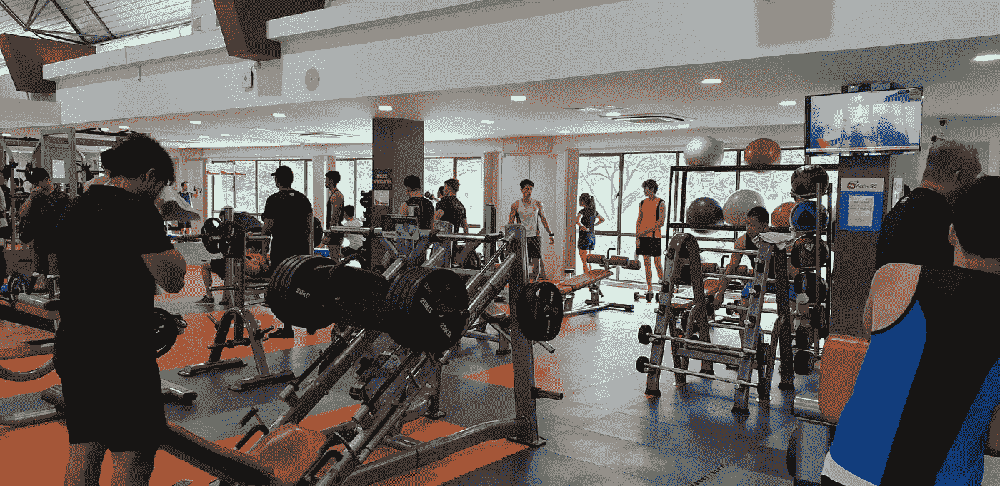****

****健身房里普通的一天****

****我总是告诉人们，如果他们真的想增加或减少体重，他们必须养成饮食和锻炼一致的习惯。当我告诉他们我几乎每天锻炼一个小时时，“我真的没有时间”是他们的头号借口。****

****让我们做一点数学计算。****

****24 小时中的 1 小时是你一天中用于锻炼的 **4.17%** 。 **4.17%** 。假设最好的情况，如果你一周锻炼 6 天，那你一生中只有不到 4%的时间用于锻炼。现在，除非你真的忙于工作，回到家继续埋头于你的脚本和电子表格，或者如果有某些健康状况阻止你进行艰苦的活动，那么没有理由不把你生命中的一小部分奉献给你渴望的转变。****

****走出去，从今天开始做出改变！****

****我希望这个小项目可以激励其他人将数据科学应用到他们自己的个人数据中。如果没有，我希望读者至少已经了解了他们的饮食选择和锻炼习惯对他们体重变化的影响，因为他们开始了自己的个人旅程，以改变自己的身体。****

****再一次，你可以在这里看到我的作品:****

**** [## bobbymuls/通过健身和营养改变体重

### 此时您不能执行该操作。您已使用另一个标签页或窗口登录。您已在另一个选项卡中注销，或者…

github.com](https://github.com/bobbymuls/weight-change-with-gym-and-nutrition) 

编码快乐！****