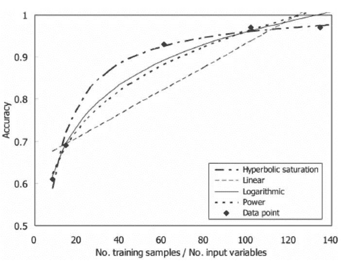
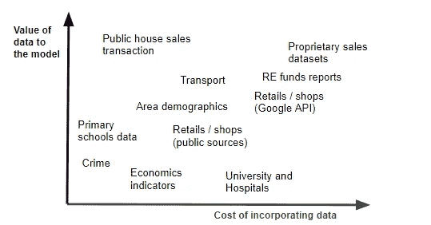

# 你有足够的数据吗？

> 原文：<https://towardsdatascience.com/do-you-have-enough-data-87e31191f932?source=collection_archive---------42----------------------->

## 深入、广泛还是提高质量:如何找到您的数据瓶颈

图片来自 [Pixabay](https://pixabay.com) 的[像素](https://pixabay.com/users/Pexels-2286921)

“如果我能够访问更多的训练数据，我的模型准确性将会大大提高”，“我们应该通过 API 获取更多的数据”，“源数据质量太差，我们无法使用它”

数据是每个机器学习或分析项目的基础，但尽管我们现在拥有比以往任何时候都多的数据，但与没有足够数据或正确类型的数据相关的借口并不短缺。

但是你怎么知道这些是真正的担忧还是借口呢？换句话说，你如何发现数据是否是一个项目的限制因素？

## 找到数据瓶颈

来自 [Pixabay](https://pixabay.com/?utm_source=link-attribution&utm_medium=referral&utm_campaign=image&utm_content=92418) 的[乌韦·鲍曼](https://pixabay.com/users/weinstock-25534/?utm_source=link-attribution&utm_medium=referral&utm_campaign=image&utm_content=92418)的图片

有三种不同的方法可以控制您的数据，通过:

*   **深入:**增加数据点数量
*   **扩大范围:**增加数据源的数量
*   **进行质量:**修复烂摊子！

# 深入

这种情况下，你不改变你的数据结构，但你只是增加你的数据点。

你并不总是能控制这一点(比如你不能轻易增加你的客户)，但通常你至少在某些方面能做到。

在一些不同的场景中，数据量会有所帮助。

## **A/B 测试或实验**

如果您正在运行一个实验，您需要有足够的数据点来实现结果的统计显著性。你需要多少点，还取决于其他因素，如误差幅度、置信区间和分布的方差。对于您尝试运行的每个实验，都有一个最小数据量阈值:如果您已经达到了这个阈值，您可以继续，因为额外的数据点不会有任何帮助。否则，这可能是你的瓶颈。这篇[文章](/how-do-you-know-you-have-enough-training-data-ad9b1fd679ee)也对此做了很好的概述。

## 机器学习中的预测精度

如果您运行的是预测模型，预测准确性会随着数据的增加而提高，但只达到某个“饱和点”。你如何发现你是否已经达到了这样一个点？您可以使用不同数量的训练点来重新训练您的模型，并绘制预测准确性与数据量的关系。如果你的曲线还没有变平，你可能会从额外的数据中进一步受益。

来源:Kim 和 Park 在 [researchgate](https://www.researchgate.net/publication/228784109_A_Survey_of_Applications_of_Artificial_Intelligence_Algorithms_in_Eco-environmental_Modelling) 上的文章

## **启用深度学习**

虽然传统的机器学习模型也可以用较小的数据量运行，但你的模型越复杂，它需要的数据就越多。最极端的是，如果没有非常大量的数据可用，深度学习模型就无法运行。对他们来说，大数据是一种需求，而不是拥有来提高性能的*好。*

## 分析和洞察

即使您没有将数据用于预测目的，但也许您想要丰富您的报告或进行一次性分析来支持您的决策，数据量仍然是一个瓶颈。如果您的数据具有很大的异构性，并且您需要在不同的粒度级别对其进行分析，那么这一点尤其正确。例如，如果您有一支庞大的销售队伍和广泛的产品范围，每个销售人员可能只销售了产品的一个子集。如果你想比较他们在销售特定产品方面有多好，你可能做不到。

# 走向广阔

各种各样的数据可能是关键，但根据我的经验，这方面也经常被高估。

在我之前的一份工作中，我为一家利用机器学习预测房价的初创公司工作。我们的战略优势是我们拥有各种各样的数据，因此要整合所有可能的数据源，以帮助对房地产进行预测。

一个关键点是决定获取哪些来源，以提高模型的预测能力。

如何评估获取新数据的成本与收益？

**评估新数据的好处**涉及两个主要问题:新数据与我们试图预测的目标变量的相关性是什么(希望尽可能高)，以及新数据与我们已经拥有的数据的相关性是什么(希望尽可能低)。不幸的是，这并不总是很容易定量分析，但一点定性判断可以帮助尝试筛选出最佳候选人。

**评估新数据的成本**可视为数据的总拥有成本。有时购买数据或支付 API 会有实际成本，但这只是故事的一部分。还需要考虑其他因素，通常是最大的因素:

*   一次性摄入与重复摄入
*   数据转换和存储的复杂性
*   需要数据质量和数据清理
*   数据处理和解析

# 持续质量

哈佛大学教授肖有一个非常激动人心的演讲，他说“数据质量远比数据数量重要”。这个演讲的美妙之处在于，他能够从数学上量化这个陈述，着眼于数据质量或数量的统计测量。

> 数据质量远比数据数量重要

我的商业经验也反映了这一点:公司往往希望开始获取或整合更多的数据，而没有首先考虑尝试处理现有数据是否足够。

数据质量往往是一个问题，一个大问题。这可能是由于手动输入错误、原始数据不准确、聚合或处理层中的问题、数据在一段时间内丢失等等。

这可能需要大量的工作，尤其是枯燥的工作，但也可能带来最有益的结果。

## 结论

尝试确定您的数据瓶颈在哪里，如果有的话。

数据量的问题通常可以通过对统计显著性或准确性曲线的简单检查来识别。如果这不是问题所在，请继续。

根据我的经验，数据的多样性经常被夸大，不是因为新的数据没有用，而是因为新的来源可能包含你已经以某种方式获取的信息，特别是如果你已经有了一个相对丰富的数据集。

数据质量是关键，关注一个更小但更干净的数据集比关注一个大而乱的数据集要好得多。