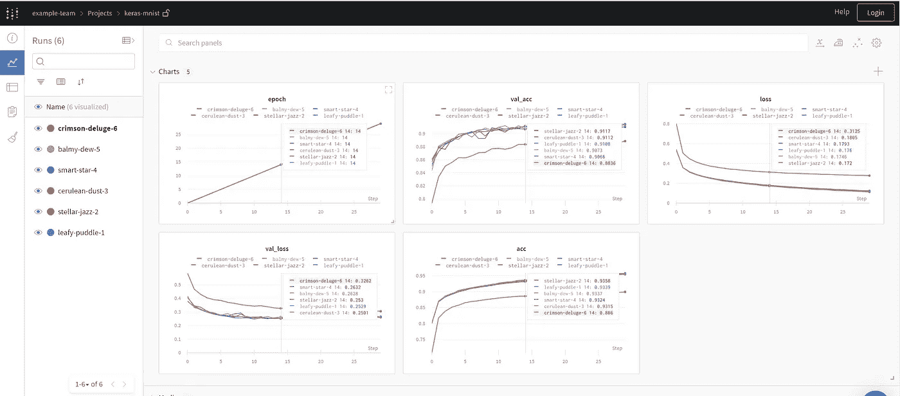
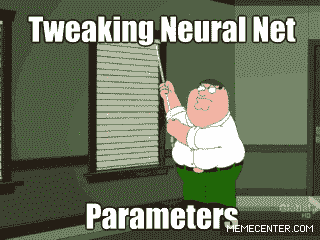
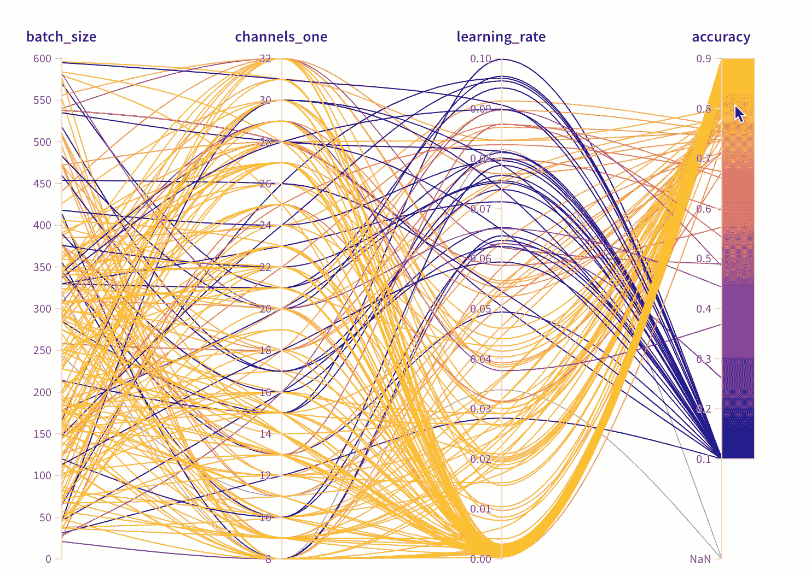
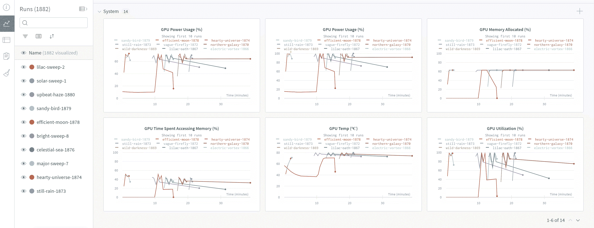

# 你知道权重和偏差吗？而不是用梯度下降法计算出来的。

> 原文：<https://towardsdatascience.com/do-you-know-about-the-weights-and-biases-not-the-ones-calculated-using-gradient-descent-b7469b91e61a?source=collection_archive---------51----------------------->

## 每个数据科学家都应该使用该工具的 6 个理由

克里斯·利维拉尼在 [Unsplash](https://unsplash.com?utm_source=medium&utm_medium=referral) 上的照片

你知道权重和偏差吗？而不是使用梯度下降计算的权重和偏差。我说的是用于机器学习的[权重和偏见](https://www.wandb.com/)开发者工具。

我最近偶然发现了这个非常酷的机器学习工具——权重和偏见，很快我就发现自己在玩它。因此，我决定与数据科学社区分享我对使用这一出色工具的看法。

如果你没有听说过它，那么让我告诉你它提供了什么，如果你是一个机器学习从业者，为什么你应该使用它。如果你已经知道了，请随意评论这篇文章。为了明确起见，我将在本文中把权重和偏差称为 W&B。

# 1.追踪机器学习实验变得简单多了

您如何跟踪您的模型、它们的超参数和它们的性能？当你继续实验的时候，你会用电子表格或记事本记录你建立的模型的所有细节吗？我经常这样做。有一次，在我的一个课程项目中，我在追求产生可重复的结果和更高的精确度方面更进一步，我发现自己复制了 Jupyter 笔记本，每个实验模型都有一个笔记本。这使我能够快速比较和巩固我的发现。现在，不再有这样的东西了。

现在，您可以专注于调整您的模型，而不必担心记下超参数或结果。让 W&B 为您处理所有这些。

通过向您的程序添加几行代码，W&B 将负责记录您的模型从输入(超参数)到输出(评估指标)的所有细节。稍后，这些记录的细节会以一些非常容易阅读的图形显示给你。您所需要做的就是啜饮您最喜欢的饮料，同时记录详细信息，并观察那些漂亮的度量图在您的模型构建时自动为您生成。

此外，您还将拥有关于您运行的模型或实验的所有必要的(A-Z)细节，所有这些都组织在一个地方，因此您可以随时回来查看。所有这些信息都可以在同一个平台上获得，那就是您的个人*仪表盘。*

典型的权重和偏差仪表板。现场演示来源:[https://app.wandb.ai/example-team/keras-mnist](https://app.wandb.ai/example-team/keras-mnist)

# 2.超参数调谐变得更加容易

来源:https://imgur.com/gallery/CAXMU

超参数调整是一件棘手的事情，我希望你们都同意我的观点。当您有几十个可以调整的超参数时，很难注意到调整超参数对优化指标的影响。现在，我们都听说过网格搜索、随机搜索和用于超参数调整的贝叶斯优化，但我们也知道所有这些技术的计算成本都很高。对于神经网络，这些技术都不是有效的。我过去常常根据自己的判断微调超参数，非常努力地注意优化指标的变化。

现在，W&B 的一个很好的功能——超参数扫描可以拯救我们。在这个所谓的超参数扫描中，W&B 创建平行坐标图，从而更容易发现优化指标和特定超参数之间的关系。如果您不熟悉平行坐标图，以下是它在 W&B 仪表板中的样子。你可以查一下[住在这里的](https://app.wandb.ai/example-team/sweep-demo/reports/Zoom-in-on-Parallel-Coordinates-Charts--Vmlldzo5MTQ4Nw)。

平行坐标图—权重和偏差中的超参数扫描，来源:【https://docs.wandb.com/app/panels/parallel-coordinates 

你可以看到，你的模型的不同运行的所有超参数都在一个简洁的图形中。此外，您甚至可以搜索最佳跑步记录。这个图也可以用几行代码添加到您的个人仪表板中！想象一下，在 Jupyter 笔记本上为这样的功能编写代码，而不是用 W&B 编写几行代码。

# 3.自定义可视化

除了通常的机器学习情节，W&B 还有许多东西可以提供。你基本上可以设计自己的可视化效果，从直方图，散点图，酷三维图，媒体可视化和许多其他先进的可视化。它提供了设计您喜欢的仪表板的灵活性。

在建立一个模型后，我经常做的一件事就是查看错误标注的例子。例如，在处理图像时，我想查看标签不正确的图像。每次实验时，您甚至可以设计自己的自定义可视化来显示来自验证集的那些错误标记的图像。同样，只需几行代码！

以下是训练示例图像和预测图像在您的仪表板上的自定义可视化效果。

添加自定义可视化的示例。现场演示来源:[https://app.wandb.ai/sweep/simpsons](https://app.wandb.ai/sweep/simpsons)

这只是你可能做的事情之一，当你把这些自定义的可视化添加到你的仪表板时，你可以变得更有创造性。

# 4.也要注意你的系统指标

如果你像我一样喜欢在你的模型运行时查看 CPU/GPU 内存的使用量，那么我希望你会喜欢这个很酷的功能。W&B 自动记录有用的系统指标，如 CPU/GPU 利用率、温度、分配的内存。并且，它为你创建了一个漂亮的图表，当你的模型被训练的时候，你可以追踪你的系统是如何应对的。在下图中，您可以看到这些指标是如何呈现在您的仪表板上的。也可以查一下[住在这里](https://app.wandb.ai/sweep/sweeps-tutorial/)。

权重和偏差中的系统度量，来源:【https://app.wandb.ai/sweep/sweeps-tutorial/ 

所以，所有这些都可以实现——你可以猜到我接下来要说什么，但是——如果你已经在项目中正确加载了 W&B，就不需要额外的代码。它每 2 秒自动记录一次系统指标，平均记录时间为 30 秒。很酷，不是吗？

# **5。与流行框架集成**

无论你来自 PyTorch 社区，还是 Tensorflow，你使用 Colab 或 Jupyter，他们都可以覆盖你。权重和偏差很容易与大多数流行的机器学习框架和工具集成。

您可以查看 Weights and Biases 文档，看看它是否集成了您最喜欢的[框架](https://docs.wandb.com/library/frameworks)和您最喜欢的[工具](https://docs.wandb.com/library/integrations)。

# 6.一个屋檐下的一切

关于 W&B 最好的一点是，每个记录的细节都组织在一个项目下，项目名称是您在项目中加载工具时指定的。它的作用是，为你的项目分配一个工作空间。*正如我们在前面的例子中看到的，仪表板*是工作区的一部分，当然工作区还提供了其他特性，这超出了本文的范围。但故事的寓意是，你创建的每一个可视化，你为那个项目记录的每一个细节，你所有的实验都可以在这个项目工作区下很好地组织起来——在一个屋檐下。不再疯狂地搜索机器学习实验笔记。

总之，这个工具旨在将所有机械 ML 实验跟踪与需要大脑汁的实际机器学习任务分开并自动化。因此，现在数据科学家可以继续利用他们的大脑汁液来建立有用的机器学习模型，而权重和偏见则完成所有不需要数据科学家关注的繁重工作。

他们的工具正在被包括 OpenAI 和丰田在内的尖端机器学习团队使用？为什么不是你？

> 另外，对于个人从业者是免费的！

我希望我已经引发了你对使用这个很酷的机器学习实验跟踪工具的足够兴趣。如果你碰巧学会使用这个工具，请在评论中告诉我你最喜欢的功能。请继续关注一篇关于如何开始研究重量和偏差的文章。当我写完这篇文章后，我会编辑它的链接。如果您非常感兴趣，那么您可以随时查看他们的文档(参见参考资料)并立即开始。感谢您的宝贵时间！:)

参考资料:

[1]权重和偏差，权重和偏差文档，[https://docs.wandb.com/](https://docs.wandb.com/)

[2] Lukas Biewald，机器学习实验跟踪(2020)，[https://towardsdatascience . com/Machine-Learning-Experiment-Tracking-93b 796 e 501 b 0](/machine-learning-experiment-tracking-93b796e501b0)