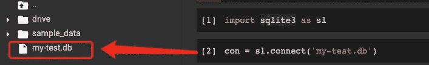
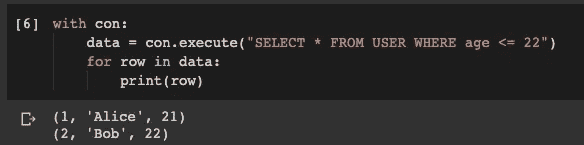
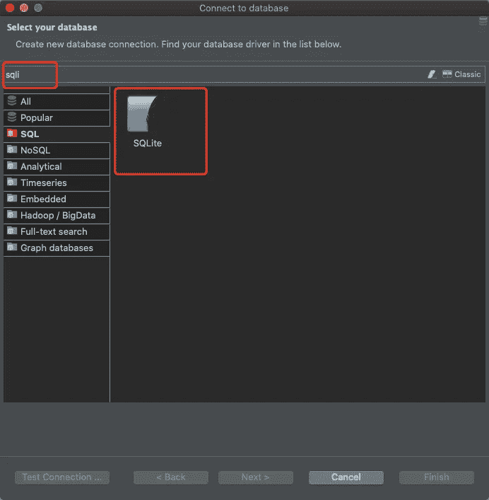
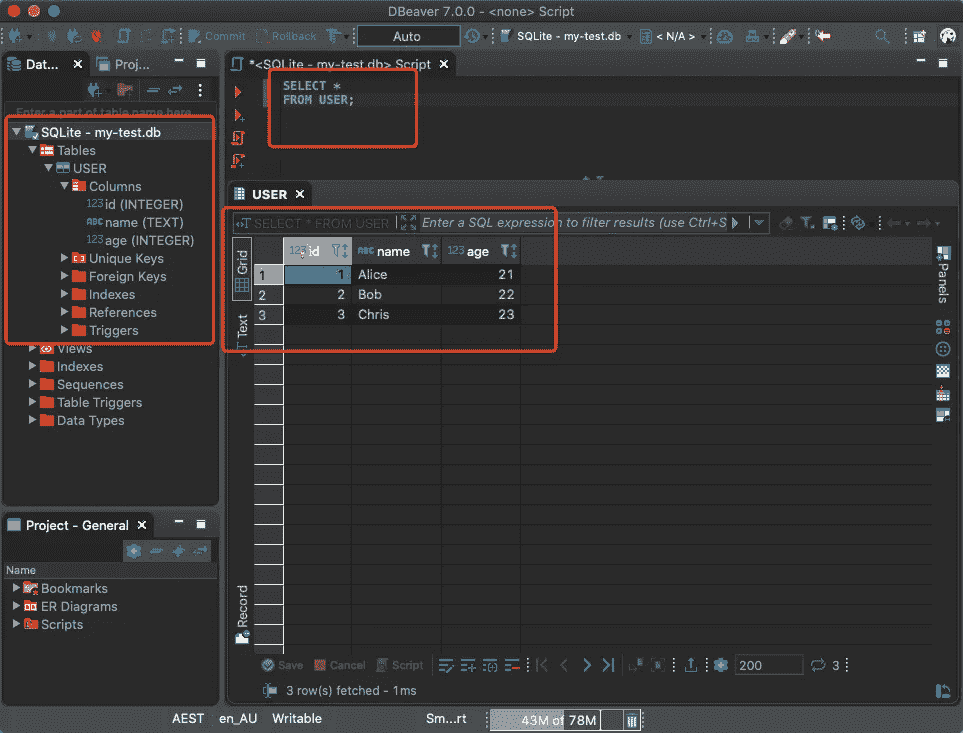
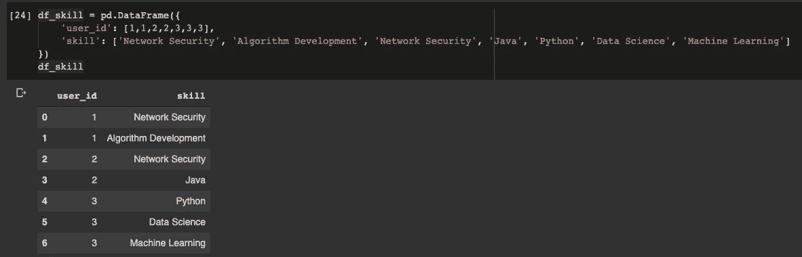
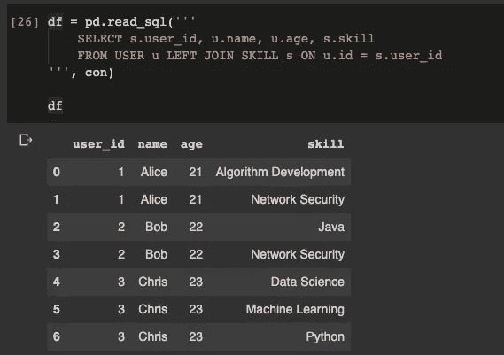
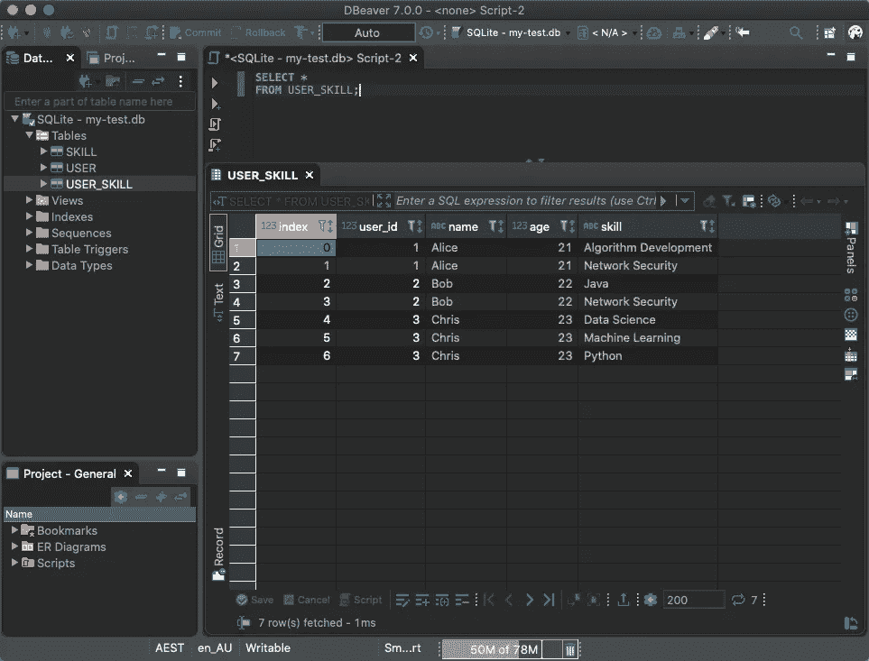

# 你知道 Python 有内置数据库吗？

> 原文：<https://towardsdatascience.com/do-you-know-python-has-a-built-in-database-d553989c87bd?source=collection_archive---------0----------------------->


照片由[麦克默里朱莉](https://pixabay.com/users/mcmurryjulie-2375405/)在 [Pixabay](https://pixabay.com/vectors/database-schema-data-tables-schema-1895779/) 拍摄

## Python 内置库 sqlite3 简介

如果你是一名软件开发人员，我相信你一定知道甚至使用过一个非常轻量级的数据库——SQLite。它几乎拥有关系数据库所需的所有功能，但所有内容都保存在一个文件中。在官方网站上，这里有一些您可以使用 SQLite 的场景。

*   嵌入式设备和物联网
*   数据分析
*   数据传输
*   文件存档和/或数据容器
*   内部或临时数据库
*   在演示或测试期间替代企业数据库
*   教育、培训和测试
*   实验性 SQL 语言扩展

你可能有更多的理由想使用 SQLite，请查阅文档。

[](https://www.sqlite.org/whentouse.html) [## SQLite 的适当用法

### SQLite 不能直接与客户机/服务器 SQL 数据库引擎相提并论，如 MySQL、Oracle、PostgreSQL 或 SQL…

www.sqlite.org](https://www.sqlite.org/whentouse.html) 

最重要的是，SQLite 内置于 Python 库中。换句话说，你不需要安装任何服务器端/客户端的软件，也不需要保持某个东西作为服务运行，只要你用 Python 导入了这个库并开始编码，那么你就拥有了一个关系数据库管理系统！

# 导入和使用


照片由[pix abay](https://pixabay.com/users/CopyrightFreePictures-203/)上的 copyright free pictures 拍摄

当我们说“内置”的时候，意思是你甚至不需要运行`pip install`来获取库。只需通过以下方式导入即可:

```
import sqlite3 as sl
```

## 创建到数据库的连接

不要为驱动程序、连接字符串等等而烦恼。您可以创建一个 SQLite 数据库并拥有一个简单的连接对象，如下所示:

```
con = sl.connect('my-test.db')
```

在我们运行这行代码之后，我们已经创建了数据库，并且已经将它连接到数据库。这是因为我们要求 Python 连接的数据库不存在，所以它自动创建了一个空数据库。否则，我们可以使用相同的代码连接到现有的数据库。



## 创建表格

然后，让我们创建一个表。

```
with con:
    con.execute("""
        CREATE TABLE USER (
            id INTEGER NOT NULL PRIMARY KEY AUTOINCREMENT,
            name TEXT,
            age INTEGER
        );
    """)
```

在这个`USER`表中，我们添加了三列。正如您所看到的，SQLite 确实是轻量级的，但是它支持常规 RDBMS 应该具有的所有基本特性，比如数据类型、可空性、主键和自动增量。

运行这段代码后，我们应该已经创建了一个表，尽管它没有输出任何内容。

## 插入记录

让我们在刚刚创建的`USER`表中插入一些记录，这也可以证明我们确实创建了它。

假设我们想一次插入多个条目。Python 中的 SQLite 可以轻松实现这一点。

```
sql = 'INSERT INTO USER (id, name, age) values(?, ?, ?)'
data = [
    (1, 'Alice', 21),
    (2, 'Bob', 22),
    (3, 'Chris', 23)
]
```

我们需要用问号`?`作为占位符来定义 SQL 语句。然后，让我们创建一些要插入的样本数据。使用连接对象，我们可以插入这些样本行。

```
with con:
    con.executemany(sql, data)
```

在我们运行代码后，它没有抱怨，所以它是成功的。

## 查询该表

现在，是时候验证我们所做的一切了。让我们查询该表以获取示例行。

```
with con:
    data = con.execute("SELECT * FROM USER WHERE age <= 22")
    for row in data:
        print(row)
```



你可以看到它是多么简单。

同样，尽管 SQLite 是轻量级的，但作为一个广泛使用的数据库，大多数 SQL 客户端软件都支持消费它。

我用的最多的是 DBeaver，大家看看是什么样子的。

## 从 SQL 客户端(DBeaver)连接到 SQLite DB

因为我用的是 Google Colab，所以我要把`my-test.db`文件下载到我的本地机器上。在您的情况下，如果您在本地机器上运行 Python，您可以使用您的 SQL 客户端直接连接到数据库文件。

在 DBeaver 中，创建一个新连接，并选择 SQLite 作为 DB 类型。



然后，浏览数据库文件。


现在，您可以在数据库上运行任何 SQL 查询。它与其他常规关系数据库没有什么不同。



# 与熊猫无缝集成


图片由 [Pixabay](https://pixabay.com/illustrations/panda-character-chinese-noodle-1892023/) 上的[图形妈妈团队](https://pixabay.com/users/GraphicMama-team-2641041/)拍摄

你以为就这些？不会，事实上，作为 Python 的内置特性，SQLite 可以与 Pandas Data Frame 无缝集成。

让我们定义一个数据框。

```
df_skill = pd.DataFrame({
    'user_id': [1,1,2,2,3,3,3],
    'skill': ['Network Security', 'Algorithm Development', 'Network Security', 'Java', 'Python', 'Data Science', 'Machine Learning']
})
```



然后，我们可以简单地调用`to_sql()`方法将数据帧保存到数据库中。

```
df_skill.to_sql('SKILL', con)
```

就是这样！我们甚至不需要预先创建表，列的数据类型和长度就会被推断出来。当然，如果你愿意，你仍然可以事先定义它。

然后，假设我们想要连接表`USER`和`SKILL`，并将结果读入熊猫数据框。也是天衣无缝。

```
df = pd.read_sql('''
    SELECT s.user_id, u.name, u.age, s.skill 
    FROM USER u LEFT JOIN SKILL s ON u.id = s.user_id
''', con)
```



超级爽！让我们将结果写入一个名为`USER_SKILL`的新表中。

```
df.to_sql('USER_SKILL', con)
```

然后，我们还可以使用我们的 SQL 客户机来检索该表。



# 摘要


照片由[monar _ CGI _ Artis](https://pixabay.com/users/Monoar_CGI_Artis-2240009/)在 [Pixabay](https://pixabay.com/photos/pencil-wood-pencil-education-1486278/) 上拍摄

的确，Python 中隐藏着很多惊喜。它们并不意味着被隐藏，只是因为 Python 中存在太多现成的特性，人们无法发现所有这些特性。

在本文中，我介绍了如何使用 Python 内置库`sqlite3`在 SQLite DB 中创建和操作表。当然，它也支持更新和删除，但我认为你会尝试自己在这之后。

最重要的是，我们可以很容易地将一个表从 SQLite 数据库读入 Pandas 数据框，反之亦然。这允许我们更容易地与轻量级关系数据库进行交互。

您可能会注意到 SQLite 没有身份验证，这是它的设计行为，因为所有东西都需要是轻量级的。去发现 Python 中更多令人惊讶的特性吧，尽情享受吧！

本文中的所有代码都可以在我的 Google Colab 笔记本中找到。

[](https://colab.research.google.com/drive/1Nq6VjezN4Djx5smI0esP8VJ8QCWr73DR?usp=sharing) [## SQLite 熊猫示例

### 创建数据库、创建表、检索和连接

colab.research.google.com](https://colab.research.google.com/drive/1Nq6VjezN4Djx5smI0esP8VJ8QCWr73DR?usp=sharing) [](https://medium.com/@qiuyujx/membership) [## 通过我的推荐链接加入 Medium 克里斯托弗·陶

### 作为一个媒体会员，你的会员费的一部分会给你阅读的作家，你可以完全接触到每一个故事…

medium.com](https://medium.com/@qiuyujx/membership) 

如果你觉得我的文章有帮助，请考虑加入 Medium 会员来支持我和其他成千上万的作者！(点击上面的链接)