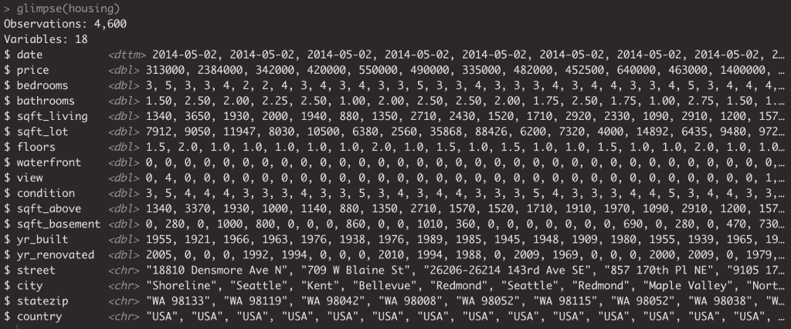
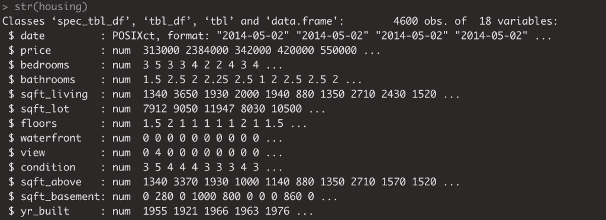
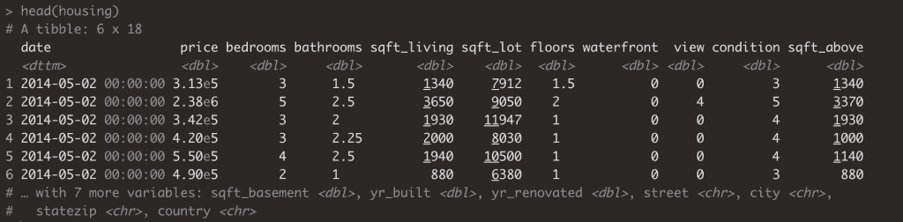
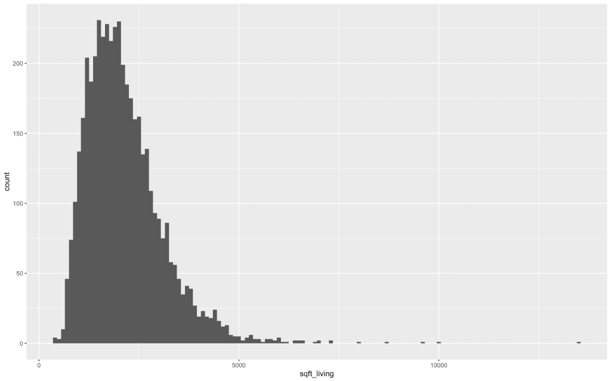
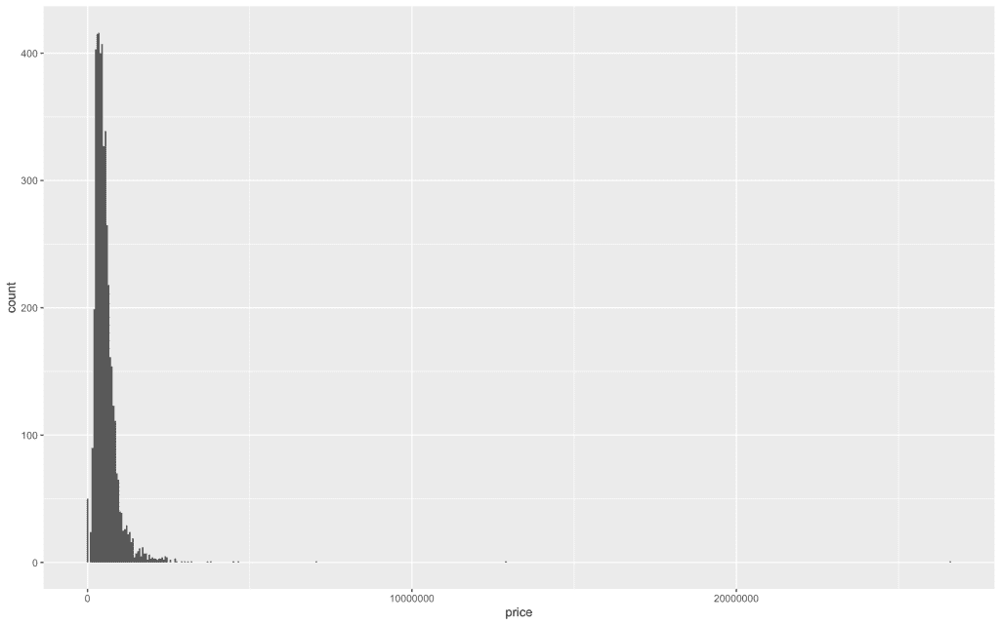
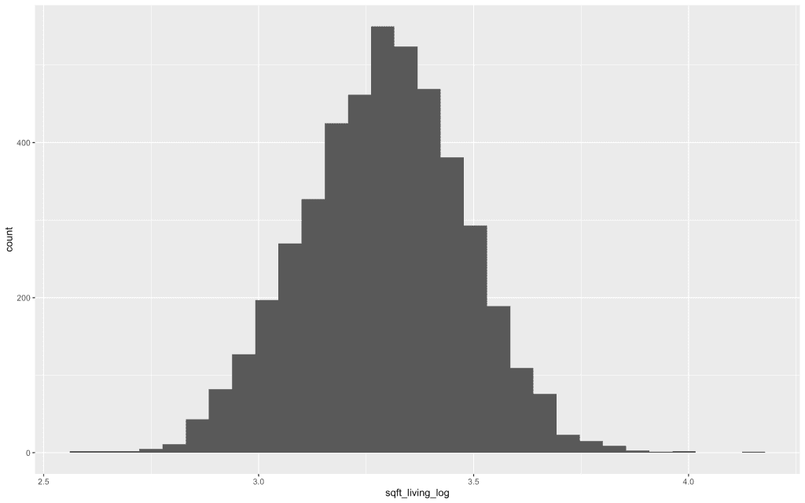
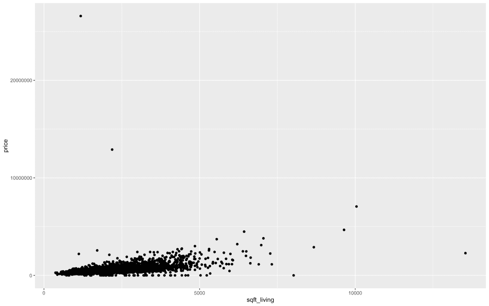
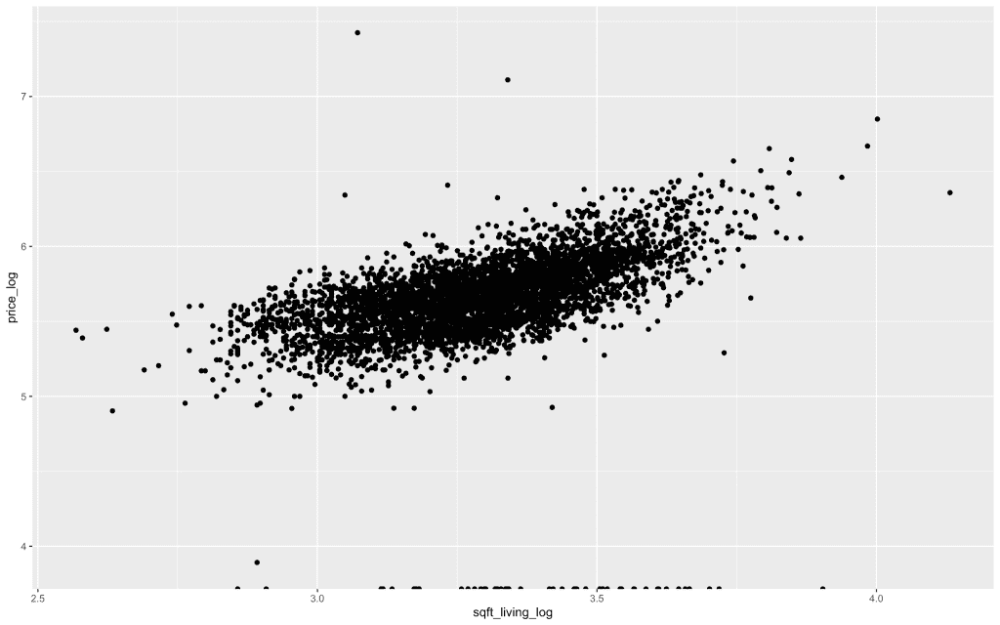

# 了解通用建模框架是所有数据科学家的必备技能

> 原文：<https://towardsdatascience.com/do-you-know-the-general-modeling-framework-c422f866a2dc?source=collection_archive---------89----------------------->


图片由 [Wokandapix](https://pixabay.com/users/Wokandapix-614097/?utm_source=link-attribution&utm_medium=referral&utm_campaign=image&utm_content=964630) 来自 [Pixabay](https://pixabay.com/?utm_source=link-attribution&utm_medium=referral&utm_campaign=image&utm_content=964630)

# 统计模型的基础

当涉及到建立统计模型时，我们这样做的目的是为了理解或近似我们世界的某个方面。

*通用模型的概念在* g *框架*中很好地分解了我们可能用来产生所述理解的目的和方法。

# 一般的建模框架是什么？

看看下面公式描述的一般建模框架:

y = f(x) + e

*   y:结果变量/我们试图更好理解的任何东西
*   x:自变量或任何我们用来解释 y 的东西
*   f():应用于 x 时近似于 y 值的函数
*   e:我们通过 X 的函数对 Y 的解释与实际 Y 之间的误差或距离。例如:我们不能通过 f(X)解释的一切

这里有几个要点。组成 y 的，是我们对 y 的理解，它是 x 的函数，上面有误差。我们努力确定这个功能就是建模的目的。如果你听说过*信号&噪声*，功能是信号、符号、指示器，噪声是误差、变化等。

# 这一框架的应用

让我们来看两个目的或方法，您可以结合这个框架来利用它们来指导您的建模过程。

至于建模机制，它的大部分将保持不变。这里的核心区别是指导你的过程的哲学。

# 解释或预测

# 为解释而建模

当谈到为解释而建模时，驱动力是我们试图理解**哪些变量可能导致一个结果或与之相关**。

以此为序，让我们进入一些探索性的数据分析，开始我们的解释建模过程。

# 预测建模

一旦我们对 F 有了理解，一旦你梳理出了对(X 的)函数的解释，你就可以把它应用到其他数据(另一个 X)来产生预测。

虽然我们从事的 EDA 在很大程度上是相同的，但目的/用途可能会有所不同。同样，使用 X 和 y 之间的历史关系生成预测的意图突出了这种差异。

在为预测建模时，我们仍然发现自己处于不知道函数或误差的困境中，这仍然需要分开来理解。

更重要的是，当为了解释而建模时，我们非常关心函数的*形式*，而当为了预测而建模时，我们就不那么关心了。在这种情况下，我们关心的是我们的预测是否准确，因此得名..预测建模。

# 探索性数据分析

无论是为了解释或预测而建模，我们仍然会经历探索性数据分析的过程。这个过程会给我们正确的信息，指引我们理解 X 的*功能的方向。*

让我们从探索性数据分析(或者我们在商业中称之为 EDA) ).EDA 的目的是让我们在建模过程之前进行一系列的活动，这些活动有助于更好地理解我们试图建模的每个自变量和因变量，并在较高层次上理解它们之间的关系。

我从 kaggle 下载了一份房价数据。你可以在这里找到:[https://www.kaggle.com/shree1992/housedata/data](https://www.kaggle.com/shree1992/housedata/data)

# 让我们来看看住房数据

我们通常会用一系列函数来启动这个过程，这些函数可以让我们快速了解数据。

# 一瞥或一串

glimpse 和 str 都将为您提供字段、它们的数据类型、维度和样本的视图。

```
glimpse(housing)
```



```
str(housing)
```



# 头

我们现在来看看 head，看看数据集的前几行。

```
head(housing)
```



# 让我们可视化变量分布

我们将加载`ggplot2`并制作一个直方图来查看其中的一些变量

```
library(ggplot2)ggplot(housing, aes(x = bathrooms)) +
  geom_histogram(binwidth = 1)
```


通过`geom_histogram`，我们可以看到属于每个数字类别的房屋数量。我们可以看到最多的家庭有 2.5 个浴室。

为了举例，让我们对更多的变量做同样的事情。

下面你会看到平方英尺的分布。



我们可以看到稍微偏右的分布。

让我们想象一下房价。



正如你所看到的，由于一些极端价格的房屋，这有点偏右。

# 可视化扭曲的数据

在可视化分布时需要记住的一件事是，可视化变量的 log10 分布。

记录日志的好处在于它保留了值的顺序。

让我们快速浏览一下！

我们看到平方英尺居住分布有些右偏，让我们来想象一下。

```
housing %>%
  mutate(sqft_living_log = log10(sqft_living))%>%
  ggplot(aes(x = sqft_living_log)) +
  geom_histogram()
```



正如我们在上面看到的，我们有一个平方英尺的正态分布的对数值。这使得比较这些较低的值和那些存在于右尾较大的极端值变得更容易。

# 让我们可视化变量组合

现在让我们来看一个涉及多个变量的类似过程。这将让我们了解这些变量之间的关系。

我们将首先从 sqft & price 开始。

```
housing %>%
  ggplot(aes(x = sqft_living, y = price)) +
  geom_point()
```



这两个变量具有线性关系，相关系数为 0.43

现在我们知道这两个变量都是右偏的，让我们在将它们转换成它们的 log10 自我后再一次可视化它们。

```
housing %>%
  mutate(sqft_living_log = log10(sqft_living),
         price_log = log10(price))%>%
  ggplot(aes(x = sqft_living_log, y = price_log)) +
  geom_point()
```



# 为解释和预测重新建模

现在，我们已经经历了一些 EDA，让我们重温一下建模的概念。目的是了解哪些因素解释了 y，或者当它与住房数据相关时，变量(平方英尺、浴室数量等)如何。)或许可以解释 y。

当谈到预测建模时，我们的目的是估算房价。我们不一定关心什么变量对我们的函数有贡献，也不关心函数实际上由什么组成……我们真正关心的是我们的模型有多接近现实。一个很好的例子是 Zillow &他们的 zestimate。他们绝对关心他们当前的模型所产生的结果的准确性。

建模时，要记住的一点是，我们不会了解误差是如何产生的……这里的目的是通过评估 X 和 y 之间的关系来推导函数。我们之前提到的函数是信号，因此建模是我们分离信号和噪声的过程。

# 结论

希望对通用建模框架的介绍能让你对如何思考建模有所了解。

祝数据科学快乐！