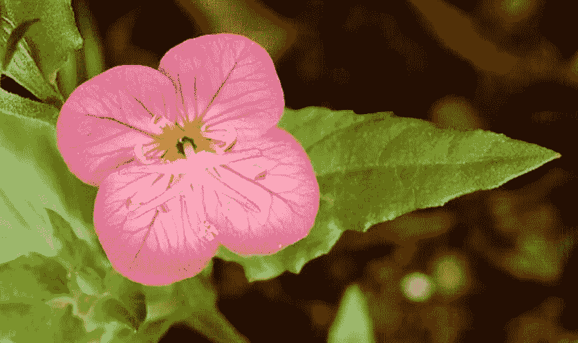
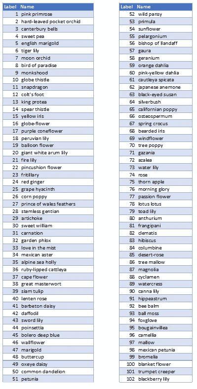
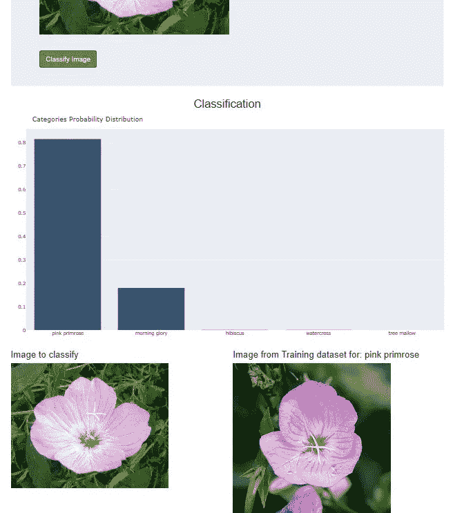

# 你认识这朵花吗？使用 PyTorch 的图像分类器

> 原文：<https://towardsdatascience.com/do-you-know-this-flower-image-classifier-using-pytorch-1d45c3a3df1c?source=collection_archive---------50----------------------->

## Udacity 数据科学家纳米学位计划项目

[https://en.wikipedia.org/wiki/Oenothera_speciosa](https://en.wikipedia.org/wiki/Oenothera_speciosa)

这个项目是数据科学家纳米学位项目 [**Udacity**](https://eu.udacity.com/) **的一部分:图像分类器项目**，目标是应用深度学习技术来训练图像分类器，以识别不同的花卉品种

让我们从使用 **CRISP-DM 流程**(数据挖掘的跨行业流程)开始:

1.  **业务理解**
2.  **数据理解**
3.  **准备数据**
4.  **数据建模**
5.  **评估结果**
6.  **部署**

**业务理解**

图像分类是当今非常常见的任务，它包括将图像和一些类别作为输入，并输出输入图像属于一个或多个给定类别的概率。关于这一点，我想推荐安妮·邦纳的这个令人敬畏的故事。总之，这个项目的目标是建立一个应用程序，可以对任何一组标记图像进行训练，以对给定的输入进行预测。由[**uda city**](https://eu.udacity.com/)**提供的具体数据集是关于花的**

****数据理解****

**该数据集包含属于 102 个不同类别的花的图像。这些图像是通过搜索网页和拍照获得的。这些图像具有很大的比例、姿态和光线变化。此外，有些类别在类别内有很大的差异，还有几个非常相似的类别。更多信息请参见 M. Nilsback、A. Zisserman 撰写的本文**

****准备数据和数据建模****

**Udacity 在 json 文件 **cat_to_name.json** 中提供了图像的标签以及类别名称和标签之间的映射**

****

**类别名称和标签之间的映射**

**Udacity 还在一个有组织的目录树中提供了所有数据集:**

****

**数据目录树**

**在每个文件夹中，都有一个以类别标签命名的文件夹，我们可以在其中找到图像。该类别的 jpeg 格式**

**该项目分为多个步骤:**

*   **加载并预处理图像数据集**
*   **在数据集上训练图像分类器**
*   **使用训练好的分类器来预测图像内容**

****评估结果****

**应用程序使用的默认网络是由牛津大学的 K. Simonyan 和 A. Zisserman 在论文“V[very Deep 卷积网络用于大规模图像识别](https://arxiv.org/pdf/1409.1556.pdf)中提出的卷积神经网络模型**

****

**[https://neurohive.io/en/popular-networks/vgg16/](https://neurohive.io/en/popular-networks/vgg16/)**

**为了使用该网络，我们将图像的大小调整为 224x224 像素，因为 cov1 层的输入是固定大小的 224 x 224 RGB 图像。Udacity 通过一个 Jupyter 笔记本为这个项目的开发提供了指导，所以很多步骤都非常简单。为了帮助网络泛化以获得更好的性能，我们将应用随机缩放、裁剪和翻转等变换**

**您将使用的预训练网络是在 ImageNet 数据集上训练的，其中每个颜色通道都是单独标准化的。对于所有三组图像，您需要将图像的平均值和标准偏差归一化到网络预期的值。平均值为`[0.485, 0.456, 0.406]`，标准偏差为`[0.229, 0.224, 0.225]`，从 [ImageNet](http://www.image-net.org/) 图像中计算得出。这些值将使每个颜色通道以 0 为中心移动，范围从-1 到 1**

**现在我们有了预训练网络，我们必须:**

*   **使用 [ReLU](https://en.wikipedia.org/wiki/Rectifier_(neural_networks)) 激活和退出，定义一个新的、未经训练的前馈网络作为分类器**
*   **使用预先训练的网络，使用反向传播来训练分类器层，以获得特征**
*   **跟踪验证集的损失和准确性，以确定最佳超参数**

****

**网络安装程序**

**默认情况下，如果通过勾选`torch.cuda.is_available()`GPU 可用，则使用 GPU 完成训练**

**`torch.cuda`增加了对 CUDA 张量类型的支持，实现了与 CPU 张量相同的功能，但是它们利用 GPU 进行计算。更多信息[点击此处](https://pytorch.org/docs/stable/cuda.html)**

**使用 10 个时期，我们在训练数据集上获得了 0.8944 的准确度**

****

**培训结果**

**在验证数据集上，我们获得了 0.8563 的准确度**

****展开****

**一个[破折号](https://dash.plot.ly/introduction)的应用程序已经开发出来作为用户界面:可以上传一张图片进行分类。当没有图像被上传时，应用程序显示关于训练数据集的一些信息的概述**

****

**Dash web 应用程序主页**

**当提供一幅图像并按下**分类**按钮时，应用程序显示该图像的分类概率分布，并与相应类别的训练数据集中的图像进行比较**

****

**图像分类**

**在所示的例子中，我在 Google image 上搜索了花朵**粉色樱草花**，并将其作为输入来检查我的分类器的输出**

**你可以在我的网站上的这个[页面](http://www.simonerigoni.net/projects/1)中尝试一下**

****有趣的事实****

**我尝试对我的个人资料图片进行分类，显然我是一个**剑百合****

****

**我的个人资料图片分类**

****

**[https://www . gardenia . net/storage/app/public/uploads/images/detail/216420% 20g ladiolus % 20 adrenaline optimized . jpg](https://www.gardenia.net/storage/app/public/uploads/images/detail/216420%20Gladiolus%20adrenalinOptimized.jpg)**

****注意:**代码可以在这个 github [仓库](https://github.com/simonerigoni/image_classifier_project)中找到**