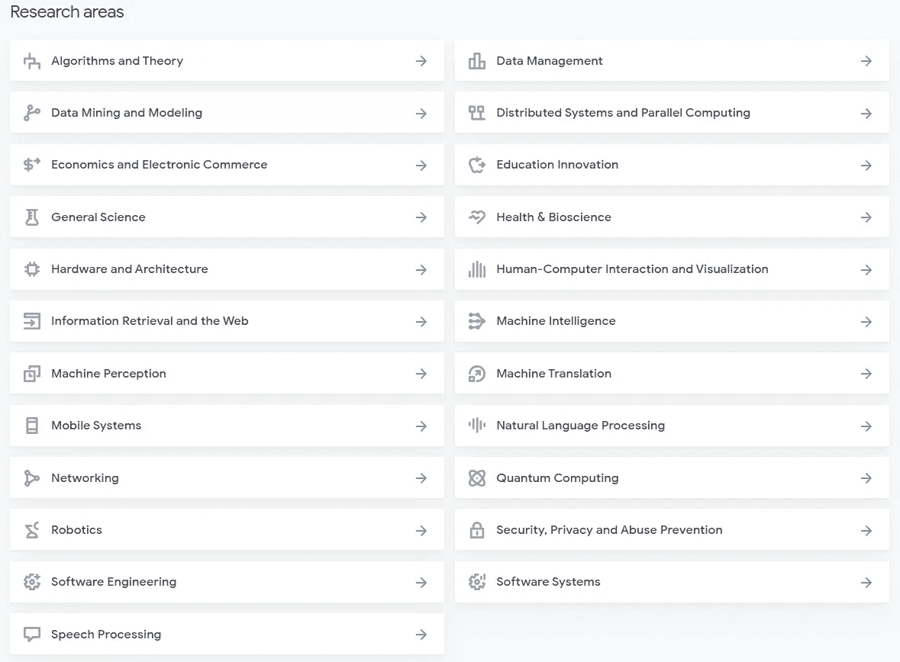

# 你现在可以从谷歌研究院获得 5779 份出版物。

> 原文：<https://towardsdatascience.com/do-you-know-you-can-have-access-to-5779-publications-from-google-research-right-now-b42b2313c325?source=collection_archive---------49----------------------->

照片由[晨酿](https://unsplash.com/@morningbrew?utm_source=medium&utm_medium=referral)在 [Unsplash](https://unsplash.com?utm_source=medium&utm_medium=referral) 拍摄

## 如果你正在为你的下一个研究或人工智能项目寻找灵感，这里你可以找到一个可以游泳的大湖:谷歌研究！

谷歌研究是谷歌的一个部门，专注于稍微远一点的项目或需要特定类型领域专业知识的项目，他们经常推出让世界变得更美好的产品。

我们可以将研究项目分为两类——短期的，如改进某些现有产品的性能；与长期相比，他们正在创建一个全新的产品/框架，如 TensorFlow 或自动驾驶汽车。

谷歌研究解决了定义今天和明天的技术的挑战，你可以在他们发表研究成果时获得。确切地说，您可以访问所有 5779 种可用出版物(2019 年只有 793 种)，从中获得灵感、获得信息和学习。

来源:[谷歌研究数据库](https://research.google/pubs/)

我正在使用这个令人印象深刻的研究数据库来支持我的新书的写作:[用人工智能解决最大的全球挑战](https://www.linkedin.com/posts/jairribeiro_ai-ai4good-globalchallenges-activity-6624083180297216000-8ABY)，我计划在明年 3 月推出。我正在写人工智能如何支持团队、公司和组织应对全球性挑战，如人工智能伦理、更准确的洪水预测、野生动物研究和儿童扫盲的工具等，并获得一些灵感和支持我对研究进展的理解。

我发现这个数据库是一个方便的温度计，特别是在量子算法和硬件的进步，新的机器学习算法和 AutoML 的改进等方面…

Google Research 的目标是创造一个充满产品影响机会的研究环境，建立一个积极受益于研究的生产环境，并为我们的员工提供自由，以解决与直接产品需求无关的重大研究问题。

# 研究领域

来源:[谷歌研究数据库](https://research.google/pubs/)

从进行基础研究到影响产品开发，谷歌研究团队每天都在影响着数十亿人使用的技术。

正如他们网站上所描述的，谷歌研究团队渴望做出影响每个人的发现，我们方法的核心是分享我们的研究和工具，以推动该领域的进步。我们的研究人员定期在学术期刊上发表文章，以开源方式发布项目，并将研究成果应用于谷歌产品。

如果你愿意，你可以从总共 5779 份出版物中获得谷歌研究自 1998 年以来的所有出版物。

链接:[谷歌研究数据库](https://research.google/pubs/)

# 还有一件事…

我刚刚在亚马逊上出版了我的新[电子书，并且我已经开始着手在今年出版一些其他的书……保持联系，关注我，让我们一起努力。](https://www.amazon.com/dp/B08RSJRNSN/)

 [## 2020 年的人工智能:写人工智能的一年

### 2020 年的人工智能:写人工智能的一年。下载一次，阅读…

www.amazon.com](https://www.amazon.com/dp/B08RSJRNSN/)