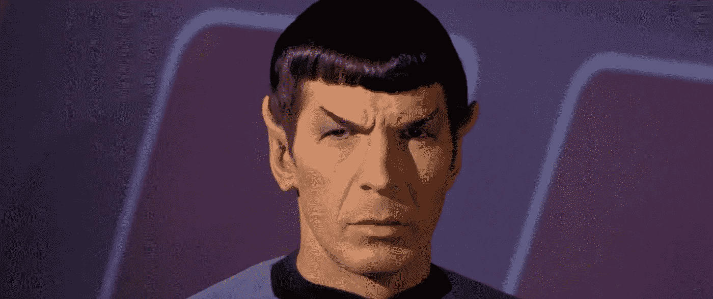
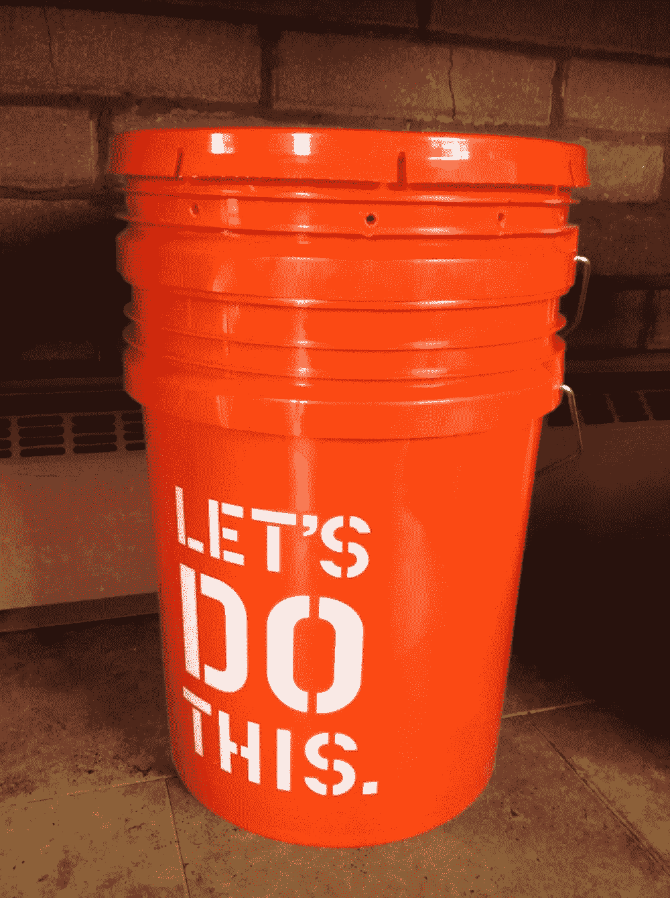
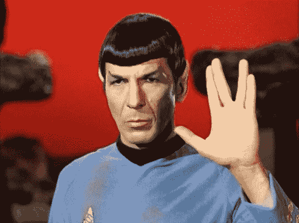

# 你理性地做决定吗？

> 原文：<https://towardsdatascience.com/do-you-make-decisions-rationally-d12a0eb9c89b?source=collection_archive---------12----------------------->

## 第 1 部分，共 3 部分——来自行为经济学的两个自我测试场景

好奇想知道你是否是一个理性的[决策者](http://bit.ly/quaesita_di)并且正在进行数据驱动的决策？想象下面的场景，回答选择题就知道了！

图片:[来源](https://www.destructoid.com//ul/518357-64f4eb1470b7b2cc897b616e39855f7b5c5f1c9b.jpg)。

# 小赌博游戏

让我们假设我的客厅里有一个装满 90 个高尔夫球的桶，我们要用它来玩一个赌博游戏。(*哇哦*，你在想，*那可是个大水桶。是的，我们正在练习运用我们的想象力。)*

你的工作是预先挑选两个潜在赌博游戏的条件。我将抛硬币来决定我们是玩游戏 1 还是游戏 2。

然后我会闭上眼睛，把球彻底打乱，拿出一个球给你看，我们会根据你在这个测验中的选择来看你是否赢了。(你将通过你的屏幕观看我的直播，这样我就不能作弊了)。

我们只玩一个游戏——这意味着你只有一次机会获得 100 美元的奖金，并且不能对冲任何赌注——但在我们开始之前，你不会知道是哪一个游戏，所以我要求你提前选择两种可能性的答案。明白了吗？好了，最重要的事情来了——你有关于水桶的什么信息？

图片:[来源](https://images.squarespace-cdn.com/content/v1/50ec5b52e4b0fa6edbb255b4/1416235456069-XHPXJ88FZB91S6AT9VBW/ke17ZwdGBToddI8pDm48kP9ixLvegiCiaphYrxDbh8B7gQa3H78H3Y0txjaiv_0fDoOvxcdMmMKkDsyUqMSsMWxHk725yiiHCCLfrh8O1z5QPOohDIaIeljMHgDF5CVlOqpeNLcJ80NK65_fV7S1UUsb6TDm6lwtyvufj6lXSkk9qP8EwNT_O62_qbM5aCAUa2TWYoExZvBjfEz7VOpF6Q/image-asset.jpeg)。

# 桶里的东西

桶里有 **30 个白色球**和 **60 个黄色或粉色的其他球**(你不知道每种有多少)。

现在轮到你选择了。

# 第一场

你可以选择*赌博 A* 或*赌博 B* :

赌博 A: 如果我抽到一个白色的球，你会得到 100 美元，否则就是 0 美元。

赌博 B: 如果我抽到一个黄色的球，你会得到 100 美元，否则就是 0 美元。

明智地选择，在向下滚动到游戏 2 之前，记下你的选择( **A 或 B** )。如果你是如此强烈的漠不关心，以至于你很乐意让硬币为你做决定，那就做吧。

图片:[来源](https://www.golfstorageguide.com/yellow-vs-white-colored-golf-balls/)。

**提醒:** *桶里还有 30 个白色的球和另外 60 个不是
粉色就是黄色的球。*

# 第二场

您可以在*赌博 C* 或*赌博 D* 之间进行选择:

赌博 C: 如果我画一个白色或粉色的球，你会得到 100 美元，如果球是黄色的，你会得到 0 美元。

赌博 D: 如果我画一个粉色或黄色的球，你会得到 100 美元，如果球是白色的，你会得到 0 美元。

记下你的选择( **C 或 D** )，这样我们就可以开始派对了。和以前一样，如果你真的没有偏好，抛硬币决定。

# 你理性选择了吗？

我们很快就会知道，但首先你为什么不点击这里[看看](https://twitter.com/quaesita/status/1240286740763619331)你的选择与其他人的选择相比如何。这些选项是:

*   ***甲&丙***
*   ***A & D***
*   ***B & C***
*   ***B & D***

继续，[看看其他人选了什么](https://twitter.com/quaesita/status/1240286740763619331)，然后向下滚动查看您的诊断和解释…

图片:[来源](https://www.somagnews.com/wp-content/uploads/2020/03/d3-2-e1583519162281.jpg)。

准备好找出为什么大多数人对这样的决定不理智了吗？在此继续第 2 部分[。](http://bit.ly/quaesita_ellsberg)

# 喜欢作者？与凯西·科兹尔科夫联系

让我们做朋友吧！你可以在 [Twitter](https://twitter.com/quaesita) 、 [YouTube](https://www.youtube.com/channel/UCbOX--VOebPe-MMRkatFRxw) 、 [Substack](http://decision.substack.com) 和 [LinkedIn](https://www.linkedin.com/in/kozyrkov/) 上找到我。有兴趣让我在你的活动上发言吗？使用[表格](http://bit.ly/makecassietalk)取得联系。