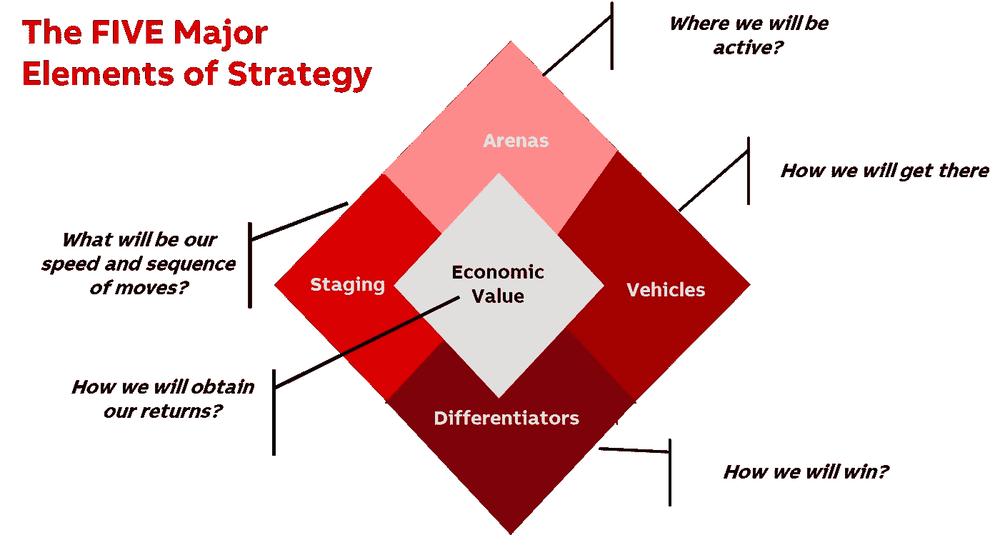

# 你真的有数据策略吗？

> 原文：<https://towardsdatascience.com/do-you-really-have-a-data-strategy-ff08795f10ce?source=collection_archive---------34----------------------->

## 许多公司声称拥有数据战略。让我们看看是什么让这成为现实。

[玛丽·莱扎瓦](https://unsplash.com/@marilezhava?utm_source=unsplash&utm_medium=referral&utm_content=creditCopyText)在 [Unsplash](https://unsplash.com/s/photos/question?utm_source=unsplash&utm_medium=referral&utm_content=creditCopyText) 上拍摄的照片

我读到了越来越多关于数字化转型和旨在实现业务转型或拥抱数字化之旅的企业的信息。

深入挖掘这些案例，有时你会感到失望。数据重复、角色重叠和代价高昂的数据湖仍然是一些公司面临的现实。

***我们如何确定拥有一个健壮的数据策略？***

我试着采用汉布里克教授(哥伦比亚大学)和弗雷德里克森教授(德克萨斯大学)提出的战略模型[来看看我们如何能容易地检查我们是否在朝着正确的方向前进。你可以在下面的图表中看到这个模型。](https://www.semanticscholar.org/paper/Are-you-sure-you-have-a-strategy-Hambrick-Fredrickson/dfcc2106149ae28918506f48c94d03a07dcfe1d8?p2df)

作者根据 Hambrick D .，fredrick son j .(2001)“*你确定你有策略吗？”*《管理行政人员学会》，第 15 卷第 4 期。

1.  **策略是一组选择。**

罗伯特·阿纳施在 [Unsplash](https://unsplash.com/s/photos/choice?utm_source=unsplash&utm_medium=referral&utm_content=creditCopyText) 上拍摄的照片

定义战略意味着**做出清晰可见的决策**。

如果我们谈论数据，它意味着**定义我们需要什么数据，我们有哪些数据以及如何使用它们**。在过去的几年里，每个公司的数据量都呈指数级增长。其中大部分存在于 20 多年前的系统中，甚至不是为数据管理而设计的。这显然是一个需要克服的挑战。

如果我们有一个可靠的数据战略，**我们就已经决定了我们想要用数据解决什么样的业务需求**。我们已经**确定了哪些数据我们可以使用，哪些数据我们不能使用**(即由于质量差或缺乏数据)。我们已经选择了想要参与竞争的领域，并根据它们对公司整体战略的贡献对它们进行了优先排序。

**2。战略需要指明实现目标的途径。**

艾米丽·莫特在 [Unsplash](https://unsplash.com/s/photos/journey?utm_source=unsplash&utm_medium=referral&utm_content=creditCopyText) 上的照片

颠覆性、数字化、敏捷都是美妙而廉价的口号。

要实现它们，还需要更多的努力。

如果你有一个真正的数据战略，在**如何实现数据的价值以促进业务需求**上已经做出了选择。您可能会决定在使用数据之前专注于提高数据质量，或者从外部购买相同的数据(即客户信息以获得信用评级风险)，从而一次性获得速度和准确性。

您可能已经决定**从主数据开始，明确数据的治理和所有权**。麦肯锡[的一篇文章](https://www.mckinsey.com/industries/financial-services/our-insights/designing-a-data-transformation-that-delivers-value-right-from-the-start)清楚地阐述了**稳健的治理如何成为确保数据质量的关键**。但根据我的经验，很明显，数据所有权不能只委托给 it 部门。

**它必须靠近那些关心这些数据的人**，也就是说职能或业务更受他们的影响。只有这样做，我们才能确保正确执行战略，关注有意义的事情。

**这里的挑战是将数据转化为信息**。在我看来，要做到这一点，需要三样东西:数据需要可用，质量不错，还需要加入一些情报。

而要做到这三点，你需要知道你的数据背后是什么。

**3。选择您的竞争优势。**

Joshua Coleman 在 [Unsplash](https://unsplash.com/s/photos/journey?utm_source=unsplash&utm_medium=referral&utm_content=creditCopyText) 拍摄的照片

这里要回答的问题是我们将如何取胜，**什么将使我们成功实施数据战略**。每一个**数据策略都必须根据业务需求量身定制**，并与业务策略紧密相连。

最有可能的是，我们赢得数据战略的方式将依赖于多种因素的组合。

举个例子，以我的经验来看，也许**通过在 ERP 之上创建层来收集和汇总数据，比在全球范围内改变所有 ERP 更容易、更便宜，从而克服 ERP 的复杂性。**

另一种方法是**合理化应用程序，并构建一个包含足够数据的数据湖，以便能够对其进行处理**。这可能意味着将预算从应用程序转移到这些层，减少对过时应用程序的投资，或者将它们的使用限制在核心功能上。也就是说，您可以决定使用 SAP 来管理您的财务和物流流程，而将建模、预测和深度数据分析的任务留给其他工具。

> “最大的价值来自能够从不同种类的系统中收集和关联信息”*—Anil Chakravarthy—Informatica 前首席执行官*

**4。罗马不是一天建成的**

塔内利·拉蒂宁在 [Unsplash](https://unsplash.com/s/photos/journey?utm_source=unsplash&utm_medium=referral&utm_content=creditCopyText) 上拍摄的照片

**速度和事件顺序是任何战略的两个组成部分。**你必须有一个清晰的事件/项目顺序，还要定义执行的速度。

根据组织的文化，你可以走得更快，并行或首先创造一种改变的紧迫感。也许**在一个业务中试验解决方案，然后在所有其他业务中展示**并引起兴趣。

**没有明确的顺序就开始执行一个数据项目，整体计划可能会让你付出更大的代价**。许多公司在开始数据湖之旅时，并没有明确的目标:这转化为要维护的额外成本&复杂性。

**战略的一部分必须是**，在我看来，**的人的成分**。一个强大的数据战略必须使与数据相关的工作专业化:包括数据管家和数据科学家。一个不能离开另一个而存在。你可以拥有公司里最好的数据科学家，但是如果数据管家丢失了，他们不知道他们的数据有什么用，质量仍然不够好，无法进行任何准确的分析。如果你有最好的数据管家，但缺乏数据科学家，你就白白坐在了一座金山上。

**5。我能从中得到什么？**

照片由 [Riccardo Annandale](https://unsplash.com/@pavement_special) 在 [Unsplash](https://unsplash.com/s/photos/journey?utm_source=unsplash&utm_medium=referral&utm_content=creditCopyText) 上拍摄

这是许多企业领导人在实施数据战略时会问你的典型问题。

虽然为执行数据策略所需的投资定价更容易，但量化其收益可能更困难。

然而，在我看来，这是至关重要的。您必须花时间**确定容量释放、资源减少、硬件节省、质量差成本降低、决策速度提高**。

只要有适当的知识，所有这些方面都可以而且必须量化。通过这种方式，每当你开始一个项目时，你就可以让你的管理层兴奋起来，**把你正在推动的节约或复杂性降低摆在桌面上**。

通过这样做，接受和认同的程度将会提高。

我见过为了把数字这个词放在网站上而采取数字策略的案例。但我也看到了成功的实施以及随之而来的强大的财务价值。

根据我的经验，这五项是验证您的数据策略并了解它是否足以全速前进的良好检查。

> *“没有数据，你只是另一个有观点的人”——w·爱德华·戴明*

Luca Condosta(博士)是一名金融专业人士，拥有跨国企业的全球经验。对数据、领导力、战略和人充满热情。两本书的作者([可持续发展报告](https://www.amazon.it/bilancio-sociale-dazienda-tecniche-redazione/dp/8821727076/ref=sr_1_14?__mk_it_IT=%C3%85M%C3%85%C5%BD%C3%95%C3%91&dchild=1&keywords=bilancio+sociale&qid=1585989807&s=books&sr=1-14)和[Natuzzi——意大利和谐制造者](https://www.amazon.com/Natuzzi-Italian-Harmony-Luca-Condosta-ebook/dp/B079Z653TX/ref=sr_1_3?dchild=1&keywords=natuzzi&qid=1585989896&sr=8-3))喜欢寻找和分享故事。